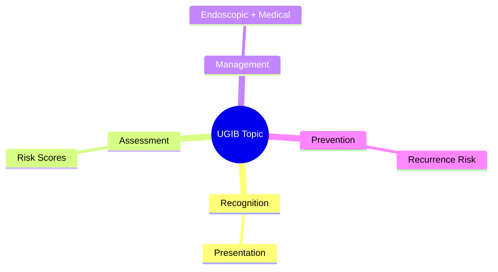
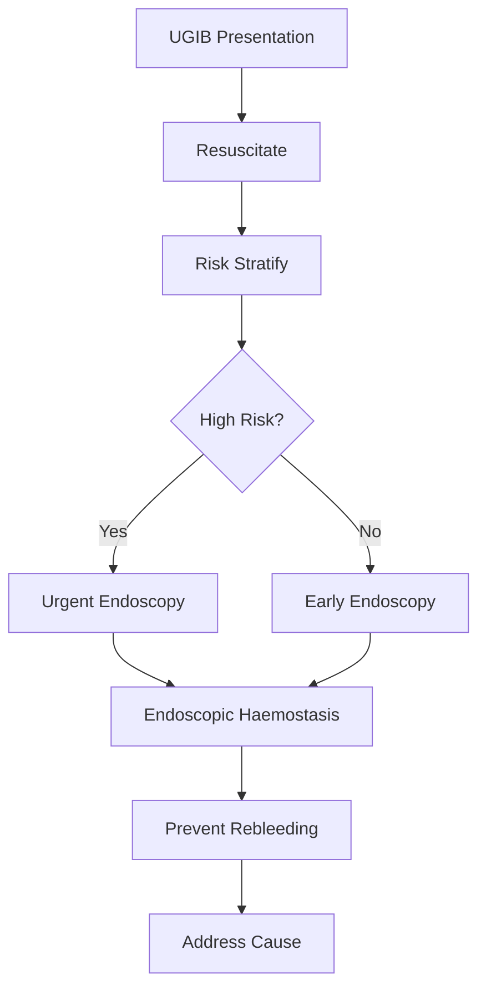

## 1. Learning Objectives
- Recognize the clinical presentation and urgency of this UGIB scenario
- Apply the appropriate risk stratification and investigation strategy
- Outline the endoscopic and medical management principles
- Identify when escalation or specialist referral is required
- Understand the prevention and long-term management# Aortoenteric fistula and rare catastrophic bleeding red flags

Related: [[../Gastroenterology MOC|Gastroenterology MOC]] · [[../Upper Gastrointestinal Bleeding|Upper Gastrointestinal Bleeding]] · [[Pattern recognition and special contexts|Pattern recognition and special contexts]]

## 2. Why this topic matters
Most upper GI bleeds are ulcers, erosions, tears, or varices. A small minority are rapidly fatal uncommon causes where bedside suspicion is lifesaving. The classic example is **aortoenteric fistula**.

## 3. Aortoenteric fistula: definition
An abnormal communication between the aorta (or aortic graft) and the gastrointestinal tract, usually duodenum, causing catastrophic haemorrhage.

## 4. Classic clues
- History of abdominal aortic aneurysm repair or aortic graft
- “Herald bleed” followed by massive haemorrhage
- Back/abdominal pain, sepsis, or unexplained recurrent GI bleeding
- Haemodynamic collapse out of proportion to common causes

## 5. Other rare catastrophic causes to remember
- Dieulafoy lesion with major arterial bleed
- Haemobilia
- Hemosuccus pancreaticus
- Aorto-oesophageal fistula in selected contexts
- Malignancy eroding into major vessels

## 6. Clinical red flags
- Recurrent unexplained bleed with prior major vascular surgery
- Large-volume bleeding without obvious ulcer history
- Shock recurring after a small apparent initial bleed
- Endoscopy failing to explain severity

## 7. Diagnostic approach
- Resuscitate immediately.
- In suspected aortoenteric fistula, involve vascular surgery early.
- CT angiography may help if the patient is stable enough.
- Endoscopy can miss the lesion and should not falsely reassure.

## 8. Management
This is not a “medical acid suppression” problem. Definitive management is urgent surgical or endovascular control with specialist input.

## 9. Exam pearls
- The phrase **“herald bleed”** is high yield.
- Prior aortic graft + GI bleed = think aortoenteric fistula until proven otherwise.
- A normal or nondiagnostic endoscopy does not exclude rare catastrophic vascular sources.

## 10. Differential diagnosis
- Peptic ulcer bleeding
- Variceal bleeding
- Mallory-Weiss tear
- Pancreatic or biliary haemorrhagic causes

## 11. One-page summary
Aortoenteric fistula is a rare but lethal cause of GI bleeding, especially after aortic graft surgery. Suspect it when there is a **herald bleed**, prior vascular history, unexplained recurrent or catastrophic haemorrhage, or endoscopy that does not fit the severity. This requires **urgent vascular-level escalation**.

## 12. MCQs (10)
1. Classic operative history? **Aortic graft/AAA repair**.
2. High-yield early clue? **Herald bleed**.
3. Common involved bowel segment? **Duodenum**.
4. Endoscopy can miss it? **Yes**.
5. Definitive management is mainly? **Surgical/endovascular**.
6. Acid suppression alone is adequate? **No**.
7. Rare pancreatic source of upper GI bleeding? **Hemosuccus pancreaticus**.
8. Vascular communication causing GI bleed is called? **Aortoenteric fistula**.
9. Recurrent small bleed before collapse should trigger? **High suspicion**.
10. Main exam danger? **False reassurance from nondiagnostic routine workup**.

## 13. SBA Questions (10)
1. Prior AAA repair, small melaena episode yesterday, now massive haematemesis and shock: likely diagnosis? **Aortoenteric fistula**.
2. Best phrase for small initial bleed before exsanguination? **Herald bleed**.
3. Endoscopy inconclusive in suspected graft-related bleed: next step? **Urgent vascular/surgical escalation**.
4. Stable enough for imaging: best modality? **CT angiography**.
5. Why is this often missed? **It is rare and may bleed intermittently**.
6. Prior vascular graft with GI bleed should prompt consultation with? **Vascular surgery**.
7. Which of the following is another rare arterial source? **Dieulafoy lesion**.
8. Routine PPI without escalation is dangerous because? **The lesion is vascular-catastrophic**.
9. Most likely bowel site in classic aortoenteric fistula? **Duodenum**.
10. Best exam-safe statement? **Consider aortoenteric fistula in catastrophic or unexplained UGIB after aortic surgery, even if endoscopy is nondiagnostic**.

## 14. Flashcards
- Q: Classic phrase before catastrophic aortoenteric bleed?  
  A: Herald bleed.
- Q: Major risk history?  
  A: Prior aortic graft/AAA repair.
- Q: Common bowel site?  
  A: Duodenum.
- Q: Can endoscopy exclude it?  
  A: No.
- Q: Required escalation?  
  A: Urgent vascular/surgical management.

## 15. Answer key with explanations
The board-style takeaway is recognition, not routine medical management. Rare catastrophic bleeds kill when they are mistaken for ordinary ulcer disease. Prior **aortic surgery plus GI bleed** is the classic trigger for suspicion.

## 16. Mind Map

## 17. Flowchart

## 18. Must Know / Should Know / Nice to Know
### Must Know
- Resuscitation before endoscopy
- Rockall/Glasgow-Blatchford scores for risk
- Endoscopic haemostasis for high-risk stigmata
- PPI for non-variceal; vasoactives for variceal
- Restrictive transfusion (Hb <70-80)

### Should Know
- Timing: <24h for high-risk
- Antithrombotic management
- Rebleeding prediction

### Nice to Know
- Novel haemostatic agents
- Early enteral nutrition
- Transfusion threshold debates

## 19. Self-Test Scorecard
- Can I state the resuscitation priorities? /10
- Can I apply Rockall/B modified? /10
- Can I list high-risk endoscopic stigmata? /10
- Can I outline the antithrombotic plan? /10

**Interpretation:**
- **<35/40** = weak topic
- **35-36/40** = acceptable but insecure
- **37+/40** = exam-ready

## 20. Revision Prompts
- What is the first priority in UGIB?
- Which risk score do you use and why?
- When is urgent endoscopy indicated?
- How do you manage antithrombotics?

## 21. Answer Key with Explanations

