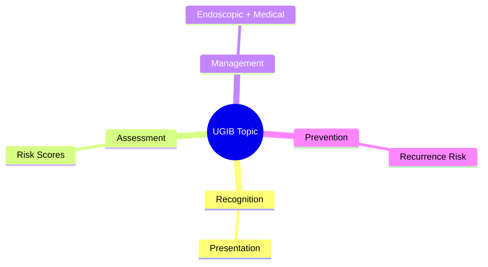
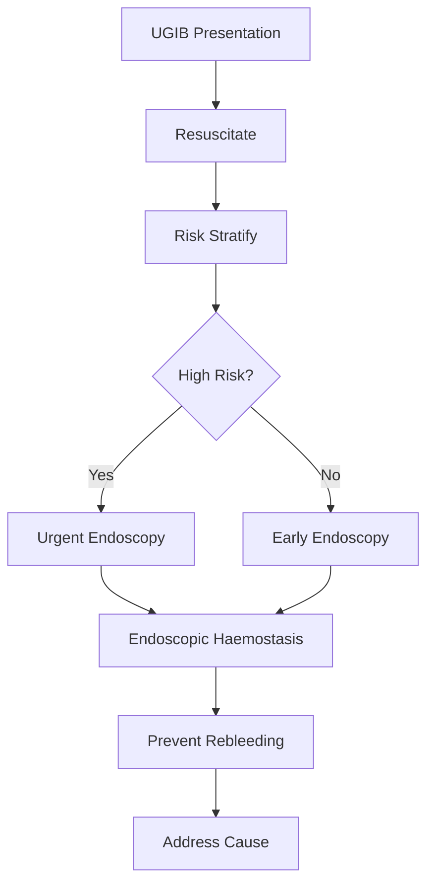

## 1. Learning Objectives
- Recognize the clinical presentation and urgency of this UGIB scenario
- Apply the appropriate risk stratification and investigation strategy
- Outline the endoscopic and medical management principles
- Identify when escalation or specialist referral is required
- Understand the prevention and long-term management# Erosive gastritis and duodenitis bleeding

Related: [[../Gastroenterology MOC|Gastroenterology MOC]] · [[../Upper Gastrointestinal Bleeding|Upper Gastrointestinal Bleeding]] · [[Non-variceal bleeding syndromes|Non-variceal bleeding syndromes]]

## 2. Definition
Bleeding from erosive gastritis or duodenitis refers to upper GI haemorrhage arising from superficial inflammatory/erosive mucosal injury rather than a deep peptic ulcer crater.

## 3. Causes
- NSAIDs and aspirin
- Alcohol excess
- Critical illness/stress-related mucosal disease
- Severe physiological stress, sepsis, burns, trauma
- *Helicobacter pylori* overlap in some patients
- Uraemia or systemic illness

## 4. Pathophysiology
Imbalance between mucosal defence and acid/pepsin exposure causes superficial erosions, friability, and oozing. Bleeding is often diffuse rather than from a single large artery.

## 5. Clinical clues
- Coffee-ground vomiting or melaena more common than catastrophic arterial haemorrhage
- Dyspepsia, epigastric pain, NSAID history, alcohol history
- ICU patient on ventilator/septic shock may develop stress-related mucosal bleeding

## 6. Diagnosis
Upper GI endoscopy shows erythematous friable mucosa, multiple erosions, or diffuse oozing. It helps distinguish this from peptic ulcer bleeding, varices, or malignant lesions.

## 7. Investigations
- FBC, urea/creatinine, coagulation profile
- Medication review
- Consider *H. pylori* testing later where clinically relevant

## 8. Management
1. Resuscitate according to severity.
2. Stop NSAIDs/aspirin where appropriate.
3. Start PPI therapy.
4. Endoscopic therapy only if there is focal active bleeding amenable to treatment.
5. Treat the precipitant: shock, sepsis, alcohol-related injury, ICU stress state.

## 9. Stress-related mucosal disease
High-risk ICU patients may require prophylaxis when major risk factors are present such as ventilation or coagulopathy. Overuse of stress-ulcer prophylaxis outside high-risk settings is a common error.

## 10. Differential diagnosis
- Peptic ulcer bleeding
- Mallory-Weiss tear
- Portal hypertensive gastropathy/varices
- Gastric malignancy

## 11. Red flags
- Ongoing haemodynamic instability
- Elderly patient on NSAID plus anticoagulant
- Diffuse bleeding in critically ill patient
- Failure of bleeding to settle on acid suppression/supportive care

## 12. Exam traps
- Assuming all gastritis-related bleeding is trivial.
- Confusing diffuse erosive bleeding with peptic ulcer spurting vessel.
- Forgetting drug review and ICU stress context.

## 13. One-page summary
Erosive gastritis/duodenitis bleeding is usually due to superficial mucosal injury from NSAIDs, alcohol, critical illness, or severe stress. Endoscopy distinguishes it from ulcer bleeding. Management centers on resuscitation, PPI, withdrawal of injurious drugs, and treating the underlying trigger.

## 14. MCQs (10)
1. Bleeding lesion depth is usually? **Superficial/erosive**.
2. Common drug cause? **NSAIDs**.
3. ICU-related mechanism? **Stress-related mucosal disease**.
4. Best diagnostic test? **Upper GI endoscopy**.
5. First pharmacologic treatment? **PPI**.
6. Typical bleeding pattern? **Diffuse oozing**.
7. Key differential? **Peptic ulcer bleeding**.
8. Alcohol is a recognized precipitant? **Yes**.
9. All patients need endoscopic haemostasis? **No**.
10. Management must include? **Removal/treatment of precipitant**.

## 15. SBA Questions (10)
1. Elderly patient on ibuprofen and aspirin with melaena, endoscopy shows diffuse antral erosions: diagnosis? **Erosive gastritis bleeding**.
2. Ventilated septic ICU patient with coffee-ground aspirate: likely mechanism? **Stress-related mucosal disease**.
3. First treatment step after stabilization? **PPI and precipitant control**.
4. Endoscopy shows no ulcer crater but diffuse friable oozing mucosa: best label? **Erosive gastroduodenitis bleed**.
5. Why stop NSAIDs? **They impair mucosal defence and worsen rebleeding**.
6. Commonly confused stronger focal lesion? **Peptic ulcer**.
7. Best long-term prevention in NSAID user? **Review need, lowest dose, gastroprotection**.
8. Outside ICU high-risk states, stress-ulcer prophylaxis is often? **Overused**.
9. Massive recurrent bleed despite supportive therapy should prompt? **Repeat endoscopic reassessment/escalation**.
10. Typical lesion is superficial rather than? **Deep arterial ulcer crater**.

## 16. Flashcards
- Q: Commonest drug trigger?  
  A: NSAIDs/aspirin.
- Q: Key ICU analogue?  
  A: Stress-related mucosal disease.
- Q: Best test?  
  A: Upper endoscopy.
- Q: Main acid-suppressive therapy?  
  A: PPI.
- Q: Important deep-lesion differential?  
  A: Peptic ulcer bleeding.

## 17. Answer key with explanations
This topic is about **superficial mucosal bleeding**, often diffuse and trigger-related. The exam distinction is from **deep peptic ulcer bleeding**, which is more likely to have a focal bleeding point requiring definitive endoscopic therapy.

## 18. Mind Map

## 19. Flowchart

## 20. Must Know / Should Know / Nice to Know
### Must Know
- Resuscitation before endoscopy
- Rockall/Glasgow-Blatchford scores for risk
- Endoscopic haemostasis for high-risk stigmata
- PPI for non-variceal; vasoactives for variceal
- Restrictive transfusion (Hb <70-80)

### Should Know
- Timing: <24h for high-risk
- Antithrombotic management
- Rebleeding prediction

### Nice to Know
- Novel haemostatic agents
- Early enteral nutrition
- Transfusion threshold debates

## 21. Self-Test Scorecard
- Can I state the resuscitation priorities? /10
- Can I apply Rockall/B modified? /10
- Can I list high-risk endoscopic stigmata? /10
- Can I outline the antithrombotic plan? /10

**Interpretation:**
- **<35/40** = weak topic
- **35-36/40** = acceptable but insecure
- **37+/40** = exam-ready

## 22. Revision Prompts
- What is the first priority in UGIB?
- Which risk score do you use and why?
- When is urgent endoscopy indicated?
- How do you manage antithrombotics?

## 23. Answer Key with Explanations

