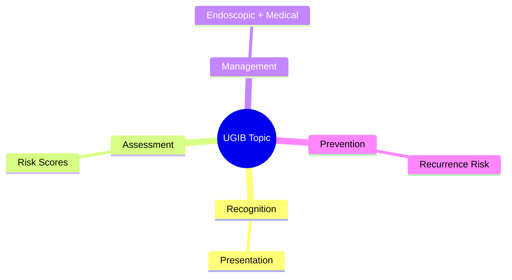
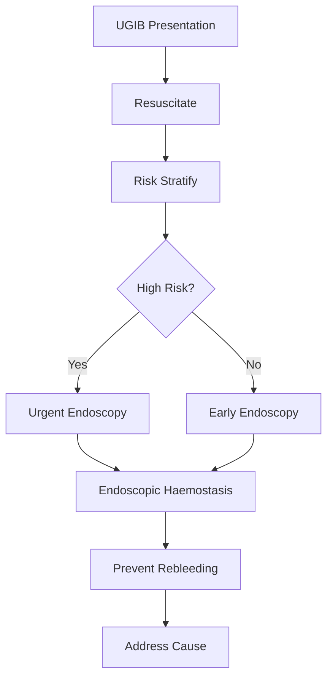

## 1. Learning Objectives
- Recognize the clinical presentation and urgency of this UGIB scenario
- Apply the appropriate risk stratification and investigation strategy
- Outline the endoscopic and medical management principles
- Identify when escalation or specialist referral is required
- Understand the prevention and long-term management# Restrictive transfusion and coagulopathy reversal

Related: [[../Gastroenterology MOC|Gastroenterology MOC]] · [[../Upper Gastrointestinal Bleeding|Upper Gastrointestinal Bleeding]] · [[Initial assessment and stabilization|Initial assessment and stabilization]]

## 2. Learning objectives
- Apply restrictive red-cell transfusion in most upper GI bleeds.
- Recognize when coagulopathy reversal is urgent.
- Avoid over-transfusion, especially in portal hypertensive bleeding.

## 3. Core concept
Restrictive transfusion means transfusing red cells only when the haemoglobin threshold or clinical context justifies it, rather than transfusing automatically after any bleed.

## 4. Why restrictive strategy works
Excess transfusion may increase portal pressure, worsen rebleeding, cause dilutional coagulopathy, volume overload, and expose patients to avoidable transfusion risks. In upper GI bleeding, a restrictive approach improves outcomes in many patients compared with liberal transfusion.

## 5. Practical haemoglobin logic
- In most stable patients: transfuse when **Hb <7 g/dL** and target around **7–9 g/dL**.
- In active ischaemic heart disease, major ongoing shock, or specific cardiovascular fragility: individualize; many clinicians accept a slightly higher threshold.
- Do not wait for Hb to fall in **exsanguinating haemorrhage**; clinical shock drives action.

## 6. Coagulopathy reversal approach
### Anticoagulants
- **Warfarin**: stop drug; give vitamin K plus **4-factor PCC** when rapid reversal is needed.
- **DOACs**: stop drug; consider specific reversal where available and bleeding is severe/life-threatening.
- Dabigatran: idarucizumab.
- Factor Xa inhibitors: andexanet where available, or PCC depending on protocol.

### Antiplatelets
- Manage with senior input; balance bleeding versus thrombotic risk.
- Routine platelet transfusion for all is not correct.
- If recent coronary stent or ACS history, coordinate with cardiology.

### Thrombocytopenia and clotting defects
- Severe thrombocytopenia may require platelet support, especially with active bleeding or before therapeutic endoscopy.
- Fresh frozen plasma is not a substitute for proper targeted reversal when PCC is available.
- Cryoprecipitate/fibrinogen replacement may matter in massive bleeding protocols.

## 7. Investigations
- FBC with serial Hb
- PT/INR, aPTT, fibrinogen if severe bleed
- Group and save/cross-match
- Urea/creatinine, LFT, lactate where relevant
- Medication review: warfarin, DOACs, aspirin, clopidogrel, NSAIDs

## 8. Stepwise management
1. Assess ABC and haemodynamic status.
2. Establish large-bore IV access.
3. Activate blood bank support if major bleed suspected.
4. Apply restrictive transfusion target in stable patients.
5. Reverse anticoagulation when bleeding is severe or endoscopy/procedure is urgent.
6. Coordinate timing of restart after haemostasis according to thrombosis risk.

## 9. Special situations
### Suspected variceal bleeding
Over-transfusion can worsen portal pressure; restrictive strategy is especially important.

### Coronary artery disease
Do not use a rigid number without considering ongoing ischaemia, chest pain, ECG change, and overall instability.

### Massive haemorrhage
Use major haemorrhage protocol; Hb value may lag behind real blood loss.

## 10. Exam pitfalls
- “All GI bleeds need transfusion.” False.
- “FFP is the main treatment for warfarin reversal.” In severe bleed, **PCC** is usually preferred.
- “Antiplatelets should always be stopped for long periods.” Oversimplified and dangerous.

## 11. Red flags
- Shock despite fluids
- Ongoing haematemesis or brisk melaena with collapse
- Severe coagulopathy or therapeutic anticoagulation
- Major cardiac disease complicating transfusion threshold choice

## 12. One-page summary
- Default upper GI bleed strategy: **restrictive transfusion**.
- Stable patient: think **Hb <7 g/dL** threshold, target **7–9 g/dL**.
- Reverse warfarin with **vitamin K + PCC** if severe.
- DOAC reversal is case-specific and protocol-driven.
- Massive bleeding follows physiology, not just laboratory thresholds.

## 13. MCQs (10)
1. Best default transfusion strategy in UGIB? **Restrictive**.
2. Common Hb trigger in stable UGIB? **<7 g/dL**.
3. Preferred rapid warfarin reversal in major bleed? **4-factor PCC**.
4. Why avoid over-transfusion in variceal bleeding? **Raises portal pressure**.
5. Massive haemorrhage management should be guided by? **Clinical instability**.
6. Dabigatran reversal agent? **Idarucizumab**.
7. Routine liberal platelet transfusion for all antiplatelet users? **No**.
8. FFP alone better than PCC for severe warfarin bleed? **No**.
9. Target Hb after restrictive transfusion is usually? **7–9 g/dL**.
10. Wrong exam statement? **Every GI bleed needs immediate transfusion**.

## 14. SBA Questions (10)
1. Stable melaena, Hb 6.6 g/dL: best next step? **Packed red cell transfusion**.
2. Shocked patient on warfarin with active haematemesis: best reversal? **Vitamin K plus PCC**.
3. Cirrhotic with suspected variceal bleed and Hb 8.9 g/dL: transfuse immediately? **Not automatically**.
4. Patient on dabigatran with life-threatening UGIB: best antidote? **Idarucizumab**.
5. Recent drug-eluting stent, aspirin/clopidogrel, bleed controlled: who should guide restart? **GI plus cardiology**.
6. Hb 7.8 g/dL, stable, no ischaemia: best plan? **Observe/resuscitate without automatic transfusion**.
7. Best reason for restrictive transfusion? **Reduces rebleeding/portal pressure issues**.
8. Persistent haemodynamic collapse despite “normal” Hb: interpretation? **Lab lag; treat as major bleed**.
9. Platelet count severely low before haemostatic endoscopy: likely need? **Platelet support**.
10. Key danger in reversal decisions? **Ignoring thrombosis risk**.

## 15. Flashcards
- Q: Standard Hb trigger in stable UGIB?  
  A: Around 7 g/dL.
- Q: Preferred urgent warfarin reversal?  
  A: PCC + vitamin K.
- Q: Why avoid liberal transfusion in varices?  
  A: It may increase portal pressure and rebleeding.
- Q: Which antidote reverses dabigatran?  
  A: Idarucizumab.
- Q: In massive bleed, what outranks Hb number?  
  A: Clinical shock and ongoing blood loss.

## 16. Answer key with explanations
Restrictive transfusion is safer in many UGIB cases. Warfarin reversal in severe bleeding is best achieved rapidly with **PCC**, not FFP alone. Thresholds must still be individualized when there is myocardial ischaemia or catastrophic bleeding.

## 17. Mind Map

## 18. Flowchart

## 19. Must Know / Should Know / Nice to Know
### Must Know
- Resuscitation before endoscopy
- Rockall/Glasgow-Blatchford scores for risk
- Endoscopic haemostasis for high-risk stigmata
- PPI for non-variceal; vasoactives for variceal
- Restrictive transfusion (Hb <70-80)

### Should Know
- Timing: <24h for high-risk
- Antithrombotic management
- Rebleeding prediction

### Nice to Know
- Novel haemostatic agents
- Early enteral nutrition
- Transfusion threshold debates

## 20. Self-Test Scorecard
- Can I state the resuscitation priorities? /10
- Can I apply Rockall/B modified? /10
- Can I list high-risk endoscopic stigmata? /10
- Can I outline the antithrombotic plan? /10

**Interpretation:**
- **<35/40** = weak topic
- **35-36/40** = acceptable but insecure
- **37+/40** = exam-ready

## 21. Revision Prompts
- What is the first priority in UGIB?
- Which risk score do you use and why?
- When is urgent endoscopy indicated?
- How do you manage antithrombotics?

## 22. Answer Key with Explanations

