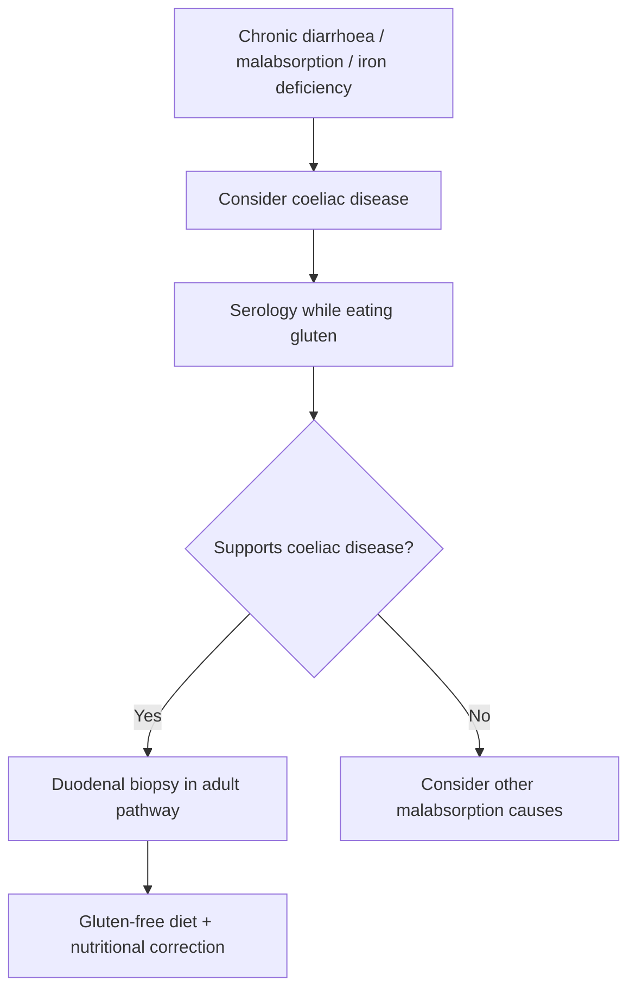

# Coeliac disease

Related: [[../Gastroenterology MOC|Gastroenterology MOC]] · [[../Small Bowel Malabsorption and Coeliac Disease|Small Bowel Malabsorption and Coeliac Disease]] · [[Diarrhoea and malabsorption interpretation]] · [[Micronutrient deficiency pattern recognition]] · [[Non-responsive and refractory coeliac disease]] · [[Dermatitis herpetiformis as a coeliac clue]]

## 1. Learning Objectives
- Define coeliac disease and explain its immune basis.
- Recognize classic and non-classic presentations.
- Use serology and biopsy logic correctly.
- Distinguish coeliac disease from other causes of chronic diarrhoea and malabsorption.
- Outline management and complications.

## 2. Definition
Coeliac disease is an **immune-mediated small-intestinal enteropathy triggered by gluten** in genetically susceptible individuals, causing malabsorption, nutritional deficiency, and extraintestinal manifestations.

## 3. Anatomy
- mainly affects proximal small bowel, especially duodenum/jejunum
- mucosal injury reduces absorptive surface area

## 4. Physiology
Normal small-bowel villi enable absorption of:
- iron
- folate
- calcium
- fat and fat-soluble vitamins
- other micronutrients

Villous injury leads to impaired absorption and systemic consequences.

## 5. Classification
- classical coeliac disease with diarrhoea/malabsorption
- non-classical disease with anaemia, osteoporosis, or subtle symptoms
- subclinical / screen-detected disease
- refractory disease

## 6. Etiology / Risk Factors
- genetic susceptibility (HLA association)
- family history
- associated autoimmune disease
- gluten exposure is the trigger

## 7. Pathophysiology
- gluten peptides trigger immune activation in susceptible hosts
- mucosal inflammation causes **villous atrophy** and **crypt hyperplasia**
- absorptive failure leads to steatorrhoea, weight loss, and deficiencies

## 8. Clinical Features
### Classical features
- chronic diarrhoea
- steatorrhoea
- weight loss
- abdominal bloating
- fatigue

### Non-classical features
- iron-deficiency anaemia
- folate deficiency
- osteoporosis/osteomalacia
- infertility/subfertility clues
- neuropathy or vague systemic symptoms
- dermatitis herpetiformis

## 9. Red Flags / Clues
- chronic diarrhoea with weight loss
- unexplained iron-deficiency anaemia
- persistent bloating with nutritional deficiency
- low BMI or bone disease
- strong family/autoimmune association

## 10. Investigations
### Serology
- **IgA anti-tissue transglutaminase (tTG-IgA)** is the usual first serologic test
- total IgA level should be considered to avoid missing IgA deficiency

### Histology
- duodenal biopsy confirms characteristic mucosal change in many adult pathways

### Additional assessment
- CBC
- iron studies, folate, B12 as needed
- calcium, vitamin D
- LFT pattern may be mildly abnormal in some patients

## 11. Interpretation Framework
### Coeliac diagnosis logic
1. Suspect coeliac disease from diarrhoea, malabsorption, anaemia, or systemic clues.
2. Test **while the patient is still eating gluten**.
3. Use serology first in many cases.
4. Confirm with duodenal biopsy in standard adult pathways.
5. After diagnosis, assess nutritional consequences and response to gluten-free diet.

### Exam trap
Do **not** start a gluten-free diet before proper diagnostic testing if avoidable, because this may reduce diagnostic yield.

## 12. Diagnosis
Diagnosis is based on:
- compatible clinical suspicion
- positive serology
- supportive duodenal histology in standard adult practice
- clinical improvement on gluten-free diet after diagnosis

## 13. Differential Diagnosis
- [[Small intestinal bacterial overgrowth]]
- [[Tropical sprue]]
- [[Lactose intolerance and carbohydrate malabsorption]]
- pancreatic exocrine insufficiency
- inflammatory bowel disease
- IBS with diarrhoea
- giardiasis / chronic infection

## 14. Management
### Core treatment
- **lifelong strict gluten-free diet**
- dietitian support is ideal

### Supportive treatment
- correct iron/folate/vitamin deficiencies
- calcium/vitamin D/bone health review where needed
- monitor weight and symptom resolution

### Follow-up principles
- assess adherence
- assess serologic and nutritional response where appropriate
- look for non-responsive disease if symptoms persist

## 15. Complications
- chronic nutritional deficiency
- osteoporosis / osteomalacia
- growth issues in younger patients
- refractory coeliac disease
- malignancy risk associations in long-standing uncontrolled disease

## 16. One-Page Summary
- Coeliac disease = immune-mediated **gluten-sensitive enteropathy**.
- Think of it in **chronic diarrhoea, steatorrhoea, weight loss, iron-deficiency anaemia**.
- First-line testing often starts with **tTG-IgA + total IgA**.
- In adults, diagnosis usually needs **duodenal biopsy** confirmation.
- Treatment = **lifelong gluten-free diet** + correction of deficiencies.

## 17. FCPS/MRCP High-Yield Points
- Proximal small-bowel disease gives iron/folate deficiency.
- Do testing before gluten withdrawal if possible.
- Dermatitis herpetiformis is a classic clue.
- Persistent symptoms after diagnosis raise adherence vs refractory disease questions.

## 18. Common Viva Traps
- Starting gluten-free diet before testing.
- Missing iron-deficiency anaemia as a presentation.
- Confusing coeliac disease with IBS without checking deficiency clues.

## 19. Mind Map
- Coeliac disease
  - trigger
    - gluten
  - pathology
    - villous atrophy
  - features
    - diarrhoea
    - steatorrhoea
    - iron deficiency
    - weight loss
  - tests
    - tTG-IgA
    - total IgA
    - duodenal biopsy
  - treatment
    - lifelong gluten-free diet

## 20. Flowchart

## 21. Revision Prompts
- Which deficiency most commonly suggests proximal small-bowel disease?
- What is the standard first serologic test?
- Why should testing occur before diet change?
- Name 3 complications.

## 22. MCQs (10)
1. Coeliac disease is best described as:
A. Immune-mediated gluten-sensitive enteropathy
B. Pure pancreatic disorder
C. Colon-only disease
D. Viral hepatitis

2. A classic presentation is:
A. Chronic diarrhoea and weight loss
B. Isolated hematuria
C. Productive cough
D. Ascites only

3. A common first serologic test is:
A. tTG-IgA
B. Troponin
C. PSA
D. D-dimer

4. Which clue strongly supports coeliac disease?
A. Iron-deficiency anaemia
B. Isolated hemoptysis
C. Neck swelling only
D. Renal colic

5. The main long-term treatment is:
A. Lifelong gluten-free diet
B. Lifelong NSAIDs
C. Immediate colectomy
D. Insulin only

6. Small-bowel mucosal damage causes:
A. Malabsorption
B. Hyperthyroidism only
C. Polycythaemia always
D. Portal hypertension

7. Which skin condition is classically associated?
A. Dermatitis herpetiformis
B. Psoriasis only
C. Cellulitis only
D. Urticaria pigmentosa

8. Which is a diagnostic trap?
A. Starting gluten-free diet before testing
B. Doing serology while eating gluten
C. Checking deficiency clues
D. Considering biopsy confirmation

9. Which part is often most affected?
A. Proximal small bowel
B. Rectum only
C. Sigmoid only
D. Anal canal only

10. Which complication may occur?
A. Osteoporosis
B. Appendicitis only
C. Nephrotic syndrome only
D. Pleural empyema

## 23. SBA Questions (10)
1. A 26-year-old woman has chronic diarrhoea, bloating, weight loss, and iron-deficiency anaemia. Best next test?
A. tTG-IgA with appropriate coeliac work-up
B. PSA
C. Echocardiography
D. Lumbar puncture

2. A patient self-starts a gluten-free diet before testing. Main problem?
A. It can reduce diagnostic yield
B. It confirms the diagnosis automatically
C. It causes variceal bleeding
D. It proves Crohn disease

3. Which feature most supports coeliac disease over IBS?
A. Iron-deficiency anaemia and weight loss
B. Stress alone
C. Normal growth always
D. Pure constipation only

4. Adult coeliac diagnosis commonly includes:
A. Duodenal biopsy confirmation
B. Colonoscopy only always
C. Brain MRI only
D. No investigations

5. A diagnosed coeliac patient remains symptomatic. Key next principle?
A. Assess adherence and consider non-responsive disease
B. Ignore symptoms
C. Start smoking
D. Stop all follow-up

6. Which deficiency is especially classic?
A. Iron deficiency
B. Copper excess only
C. Hypernatremia only
D. Polycythaemia only

7. The trigger antigen is mainly:
A. Gluten
B. Lactase
C. Insulin
D. Bilirubin

8. Which associated clue is classic?
A. Dermatitis herpetiformis
B. Haemorrhoids
C. Otitis externa
D. Cataract

9. Best general treatment statement?
A. Lifelong strict gluten-free diet is central
B. Short 1-week diet is enough
C. No dietary role exists
D. Surgery is first-line in all

10. Which statement is correct?
A. Coeliac disease can present without dramatic diarrhoea
B. All patients have massive bleeding
C. It is a liver-only disorder
D. Serology has no role

## 24. Flashcards
- Q: What is the core trigger in coeliac disease?  
  A: Gluten.
- Q: What is the common first serologic test?  
  A: tTG-IgA.
- Q: What histologic pattern is classic?  
  A: Villous atrophy with crypt hyperplasia.
- Q: Name 2 classic presentations.  
  A: Chronic diarrhoea and iron-deficiency anaemia.
- Q: What is the main treatment?  
  A: Lifelong strict gluten-free diet.

## 25. Answer Key with Explanations
### MCQs
1. **A** — this is the core definition.
2. **A** — classic malabsorptive presentation.
3. **A** — tTG-IgA is the usual first-line test.
4. **A** — iron deficiency is a key clue.
5. **A** — treatment is dietary and lifelong.
6. **A** — villous injury causes malabsorption.
7. **A** — dermatitis herpetiformis is classically linked.
8. **A** — early diet change can obscure diagnosis.
9. **A** — the proximal small bowel is often involved first.
10. **A** — bone disease is a recognized complication.

### SBAs
1. **A** — this is a classic work-up scenario.
2. **A** — premature diet change can reduce serology/biopsy yield.
3. **A** — deficiency and weight loss favor organic disease.
4. **A** — adult pathways commonly include biopsy confirmation.
5. **A** — persistent symptoms require reassessment.
6. **A** — iron deficiency is especially common.
7. **A** — gluten is the pathogenic trigger.
8. **A** — this is the classic skin clue.
9. **A** — lifelong strict gluten avoidance is fundamental.
10. **A** — presentation can be subtle or extraintestinal.

## 26. Must Know / Should Know / Nice to Know
### Must Know
- Coeliac = immune-mediated gluten-sensitive enteropathy; HLA-DQ2/DQ8; villous atrophy + crypt hyperplasia
- Presentation: diarrhoea, steatorrhoea, weight loss, iron/folate deficiency, dermatitis herpetiformis
- Diagnosis: tTG-IgA + total IgA while on gluten → duodenal biopsy (Marsh 3) → GFD response
- Management: lifelong strict gluten-free diet; dietitian; correct deficiencies; bone health; repeat serology
- Non-responsive: check adherence → SIBO/lactose/microscopic colitis → refractory coeliac (type I/II)

### Should Know
- Advanced management options
- Special populations (pregnancy, elderly)
- Emerging therapies

### Nice to Know
- Molecular pathogenesis
- Genetic risk scores
- Global epidemiology

## 27. Self-Test Scorecard
- Can I define the condition? /10
- Can I list 4 diagnostic criteria? /10
- Can I outline the management algorithm? /10
- Can I name 3 complications? /10

**Interpretation:**
- **<35/40** = weak topic
- **35-36/40** = acceptable but insecure
- **37+/40** = exam-ready

