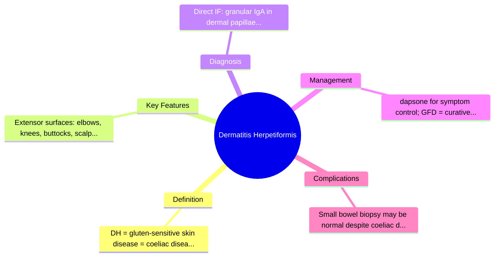
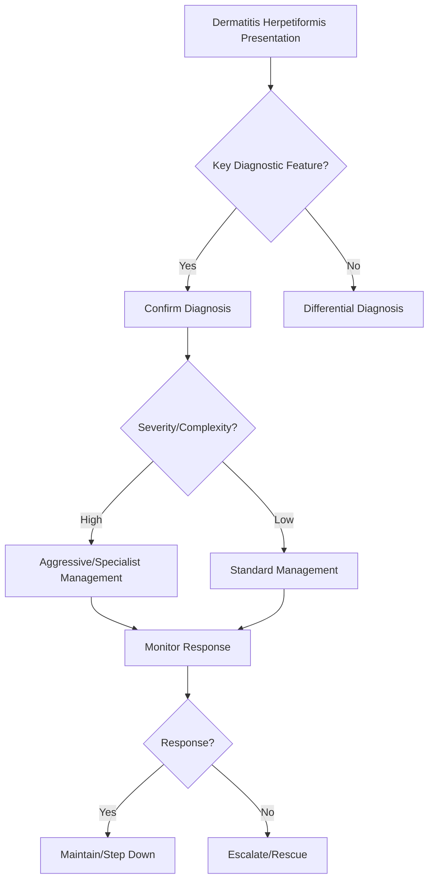

## 1. Learning Objectives
- Define dermatitis herpetiformis (DH) as the cutaneous manifestation of coeliac disease.
- Recognize the classic presentation: intensely pruritic vesicular rash on extensor surfaces.
- Understand the pathognomonic histology: granular IgA deposits in dermal papillae on direct immunofluorescence.
- Know the management: gluten-free diet + dapsone for symptom control.
- Apply the principle: DH = coeliac disease until proven otherwise; screen for coeliac disease.# Dermatitis herpetiformis as a coeliac clue

## 2. Definition
Dermatitis herpetiformis is an intensely pruritic blistering skin disorder linked to gluten-sensitive enteropathy. It is a major extraintestinal clue to coeliac disease.

## 3. Clinical pattern
- Symmetrical itchy papules/vesicles
- Extensor surfaces: elbows, knees, buttocks, scalp
- Excoriations common because blisters are scratched off
- GI symptoms may be mild or absent

## 4. Pathophysiology
Autoimmune response to gluten generates IgA deposition in dermal papillae and often coexists with small-bowel mucosal change typical of coeliac disease.

## 5. Investigations
- Coeliac serology, especially tissue transglutaminase/endomysial antibodies
- Skin biopsy with direct immunofluorescence: granular IgA deposition
- Assess for anaemia, folate/iron deficiency, calcium/vitamin D problems

## 6. Diagnosis clues
A patient with “eczema-like” intensely itchy extensor rash plus iron deficiency, bloating, or family history should trigger coeliac thinking.

## 7. Management
- Strict gluten-free diet
- Dapsone for rapid rash control if needed, after checking G6PD and monitoring blood toxicity
- Correct deficiencies and assess bone health

## 8. Complications / cautions
- Dapsone can cause haemolysis, methaemoglobinaemia, rash, neuropathy
- Coeliac-related nutritional deficiency may coexist even when GI symptoms are minimal

## 9. One-page summary
Dermatitis herpetiformis is a **cutaneous manifestation of gluten-sensitive disease**. Diagnose with skin biopsy and coeliac testing; treat with **gluten-free diet** and, if needed, **dapsone** for symptom relief.

## 10. MCQs (10)
1. Typical rash distribution? **Extensor surfaces**.
2. Key immunopathology? **IgA deposition**.
3. Disease association? **Coeliac disease**.
4. Rapid symptomatic drug? **Dapsone**.
5. Definitive long-term treatment? **Gluten-free diet**.
6. GI symptoms are always severe? **No**.
7. Common deficiency clue? **Iron deficiency**.
8. Important dapsone pre-check? **G6PD**.
9. Best skin diagnostic test? **Direct immunofluorescence**.
10. Rash is usually? **Intensely pruritic**.

## 11. SBA Questions (10)
1. Very itchy elbow/knee rash with positive tTG: likely diagnosis? **Dermatitis herpetiformis**.
2. Best confirmatory skin test? **Perilesional biopsy with immunofluorescence**.
3. Main long-term treatment? **Strict gluten-free diet**.
4. Fast symptomatic control while diet works? **Dapsone**.
5. Important monitoring on dapsone? **Haemolysis/methaemoglobinaemia**.
6. Patient has rash but no diarrhoea: coeliac excluded? **No**.
7. Main teaching point? **Skin disease may be the presenting clue to coeliac disease**.
8. Rash commonly mistaken for? **Eczema/scabies/other itchy eruptions**.
9. Nutritional issue to assess? **Iron, folate, bone-health deficits**.
10. Best exam-safe phrase? **Dermatitis herpetiformis is the skin manifestation of coeliac disease**.

## 12. Flashcards
- Q: Distribution of dermatitis herpetiformis?  
  A: Extensor surfaces.
- Q: Immunofluorescence finding?  
  A: Granular IgA deposition.
- Q: Long-term treatment?  
  A: Gluten-free diet.
- Q: Rapid symptom-control drug?  
  A: Dapsone.
- Q: GI symptoms always present?  
  A: No.

## 13. Mind Map

## 14. Flowchart

## 15. Must Know / Should Know / Nice to Know
### Must Know
- DH = gluten-sensitive skin disease = coeliac disease marker
- Extensor surfaces: elbows, knees, buttocks, scalp
- Direct IF: granular IgA in dermal papillae
- dapsone for symptom control; GFD = curative
- Small bowel biopsy may be normal despite coeliac disease

### Should Know
- IgA-tTG and EMA often positive in DH
- Dapsone dose: 50-100mg daily, monitor for haemolysis
- Sulfapyridine alternative

### Nice to Know
- Linear IgA disease differential
- HLA-DQ2/DQ8 association

## 16. Self-Test Scorecard
- Can I define Dermatitis Herpetiformis correctly? /10
- Can I list 4 key features? /10
- Can I explain the diagnostic approach? /10
- Can I outline the management? /10

**Interpretation:**
- **<35/40** = weak topic
- **35-36/40** = acceptable but insecure
- **37+/40** = exam-ready

## 17. Revision Prompts
- What is Dermatitis Herpetiformis?
- What are the key diagnostic features?
- What is the management approach?

## 18. Answer Key with Explanations

