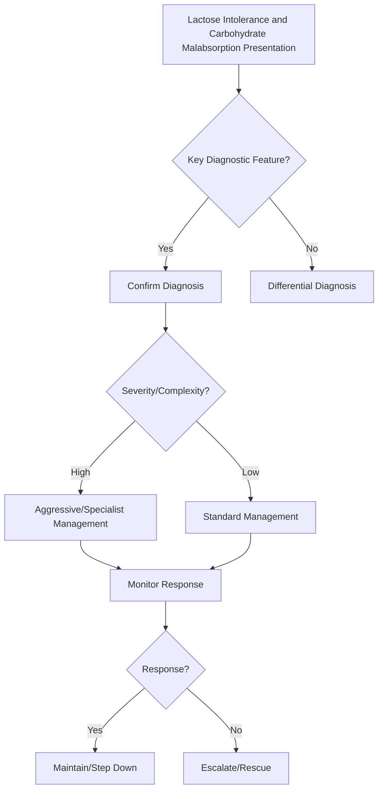

## 1. Learning Objectives
- Define lactose intolerance as lactase deficiency causing osmotic diarrhoea after dairy ingestion.
- Distinguish primary (genetic, adult-onset) from secondary (mucosal injury) lactase deficiency.
- Recognize symptoms: bloating, diarrhoea, flatulence within hours of lactose ingestion.
- Apply the hydrogen breath test and empirical lactose-free trial for diagnosis.
- Outline management: lactose restriction, lactase enzyme supplements, calcium/vitamin D if chronic restriction.# Lactose intolerance and carbohydrate malabsorption

## 2. Definition
Carbohydrate malabsorption results from failure to digest or absorb sugars, most commonly lactose due to lactase deficiency.

## 3. Clinical features
- Bloating, borborygmi, flatulence
- Osmotic diarrhoea after milk/sweet foods
- Crampy abdominal pain
- Symptoms improve with fasting or avoidance

## 4. Types
- Primary lactase non-persistence
- Secondary lactase deficiency after mucosal injury, e.g. gastroenteritis or coeliac disease
- Congenital rare forms

## 5. Pathophysiology
Undigested carbohydrates remain in the lumen, drawing water osmotically and undergoing bacterial fermentation producing gas and bloating.

## 6. Investigations
- Dietary symptom correlation
- Trial of lactose exclusion
- Hydrogen breath test where available
- Check for secondary cause if new-onset or severe

## 7. Differentials
- IBS
- Coeliac disease
- SIBO
- Fructose malabsorption

## 8. Management
- Reduce offending carbohydrate load
- Lactase enzyme supplements where helpful
- Treat secondary mucosal disease
- Maintain calcium/vitamin D intake if dairy restriction is used long term

## 9. Exam pearls
- Diarrhoea is typically **osmotic**.
- Secondary lactose intolerance may follow enteritis or active coeliac disease.
- Not all milk-related symptoms equal IgE allergy.

## 10. One-page summary
Lactose intolerance causes **post-dairy bloating and osmotic diarrhoea** due to carbohydrate fermentation. Diagnosis is mainly clinical plus breath testing when needed. Treat with dietary adjustment and correction of any secondary cause.

## 11. MCQs (10)
1. Commonest sugar involved? **Lactose**.
2. Diarrhoea mechanism? **Osmotic**.
3. Gas arises from? **Bacterial fermentation**.
4. Common test? **Hydrogen breath test**.
5. Secondary cause example? **Coeliac disease**.
6. Milk intolerance always means allergy? **No**.
7. Symptom improves with? **Avoidance/fasting**.
8. Important long-term dietary caution? **Calcium deficiency**.
9. Typical symptom cluster? **Bloating + diarrhoea + flatulence**.
10. Primary form reflects? **Lactase non-persistence**.

## 12. SBA Questions (10)
1. Diarrhoea and bloating after milk, better on avoidance: likely diagnosis? **Lactose intolerance**.
2. New lactose intolerance in adult with iron deficiency suggests checking for? **Coeliac disease**.
3. Best simple first diagnostic step? **Dietary exclusion trial**.
4. Mechanism of symptoms? **Osmotic effect plus fermentation**.
5. Breath test finding? **Hydrogen rise**.
6. Main danger of over-restricting dairy? **Low calcium/vitamin D intake**.
7. Which differential overlaps most clinically? **IBS**.
8. Symptoms after gastroenteritis may indicate? **Secondary lactase deficiency**.
9. Dairy-related urticaria/anaphylaxis would suggest? **Milk allergy, not simple lactose intolerance**.
10. Best exam-safe phrase? **Lactose intolerance is a maldigestion problem, not an inflammatory enteropathy**.

## 13. Flashcards
- Q: Main diarrhoea type in lactose intolerance?  
  A: Osmotic.
- Q: Classic post-meal symptoms?  
  A: Bloating, cramps, flatulence, diarrhoea.
- Q: Common confirmation test?  
  A: Hydrogen breath test.
- Q: Secondary cause to remember?  
  A: Coeliac disease.
- Q: Long-term diet caution?  
  A: Calcium/vitamin D adequacy.


## 14. Mind Map
```mermaid
mindmap
  root((Lactose Intolerance and Carbohydrate Malabsorption))
    Definition
      Lactase deficiency → osmotic diarrhoea + bloating ...
    Key Features
      Primary (genetic, common in Asian/African) vs seco...
    Diagnosis
      Hydrogen breath test: rise >20ppm after lactose...
    Management
      Management: reduce lactose, lactase supplements, c...
    Complications
      Hard cheese/yogurt often tolerated...
```

## 15. Flowchart


## 16. Must Know / Should Know / Nice to Know
### Must Know
- Lactase deficiency → osmotic diarrhoea + bloating + flatulence
- Primary (genetic, common in Asian/African) vs secondary (post-infectious, coeliac, Crohn)
- Hydrogen breath test: rise >20ppm after lactose
- Management: reduce lactose, lactase supplements, calcium/vit D
- Hard cheese/yogurt often tolerated

### Should Know
- Fructose/sorbitol malabsorption similar mechanism
- FODMAP diet for IBS overlap
- Congenital lactase deficiency (rare, severe)

### Nice to Know
- Genetic testing for LCT-13910 C>T polymorphism
- Lactose in medications

## 17. Self-Test Scorecard
- Can I define Lactose Intolerance and Carbohydrate Malabsorption correctly? /10
- Can I list 4 key features? /10
- Can I explain the diagnostic approach? /10
- Can I outline the management? /10

**Interpretation:**
- **<35/40** = weak topic
- **35-36/40** = acceptable but insecure
- **37+/40** = exam-ready

## 18. Revision Prompts
- What is Lactose Intolerance and Carbohydrate Malabsorption?
- What are the key diagnostic features?
- What is the management approach?

## 19. Answer Key with Explanations


