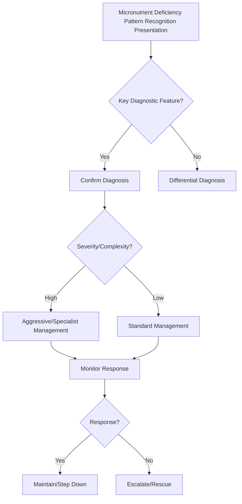

## 1. Learning Objectives
- Recognize the pattern of proximal small bowel disease: iron and folate deficiency.
- Distinguish from distal small bowel disease: vitamin B12 and bile acid malabsorption.
- Identify fat-soluble vitamin deficiencies (A, D, E, K) in pancreatic/ileal disease.
- Apply the clinical clues: glossitis (B12/folate), angular stomatitis (B2/B6), night blindness (A), coagulopathy (K), neuropathy (B12/E).
- Understand the role of serum levels (ferritin, folate, B12, vitamin D) and red cell indices.# Micronutrient deficiency pattern recognition

## 2. Why this matters
Micronutrient deficiency patterns often reveal the site and mechanism of gastrointestinal malabsorption before a final diagnosis is confirmed.

## 3. High-yield patterns
- **Iron deficiency** → proximal small bowel disease, often coeliac disease
- **Folate deficiency** → proximal small bowel or tropical sprue
- **B12 deficiency** → terminal ileal disease/resection or SIBO
- **Low calcium/vitamin D** → chronic malabsorption with bone risk
- **Vitamin K deficiency** → fat malabsorption with bleeding tendency

## 4. Clinical clues
- Glossitis, mouth ulcers
- Neuropathy
- Bone pain or fractures
- Easy bruising
- Oedema if protein malnutrition coexists

## 5. Interpretation framework
1. Identify which micronutrient is low.
2. Map to likely absorption site/mechanism.
3. Link with symptom pattern: diarrhoea, steatorrhoea, weight loss, bloating.
4. Search for the unifying disease.

## 6. Common exam associations
| Deficiency | Classic GI clue |
|---|---|
| Iron | Coeliac disease |
| B12 | Ileal disease / SIBO |
| Folate | Tropical sprue / proximal enteropathy |
| Vitamin D | Chronic fat malabsorption |

## 7. Management
- Replace the missing nutrient promptly.
- Treat the underlying disease.
- Reassess to ensure correction and response.

## 8. One-page summary
Deficiency patterns help localize malabsorption. In exams, **iron deficiency suggests coeliac**, **B12 suggests ileal disease or SIBO**, and **fat-soluble vitamin problems suggest fat malabsorption**.

## 9. MCQs (10)
1. Iron deficiency classically suggests? **Coeliac disease**.
2. B12 points to? **Ileal disease/SIBO**.
3. Vitamin D deficiency suggests? **Chronic malabsorption**.
4. Main value of deficiency pattern? **Localization**.
5. Folate deficiency with tropical exposure suggests? **Tropical sprue**.
6. Easy bruising may reflect deficiency of? **Vitamin K**.
7. Neuropathy may accompany? **B12 deficiency**.
8. Bone pain suggests deficiency of? **Vitamin D/calcium**.
9. Correction alone is enough? **No**.
10. Pattern recognition is useful because? **It narrows mechanism and site**.

## 10. SBA Questions (10)
1. Iron deficiency with diarrhoea and weight loss: likely GI diagnosis? **Coeliac disease**.
2. B12 deficiency after terminal ileal resection points to? **Ileal malabsorption**.
3. Easy bruising in steatorrhoea suggests deficiency of? **Vitamin K**.
4. Most useful purpose of deficiency review? **Infer likely absorption site**.
5. Folate deficiency after tropical exposure supports? **Tropical sprue**.
6. Bone disease in chronic malabsorption often relates to? **Vitamin D/calcium deficiency**.
7. Bloating plus B12 deficiency in dysmotility patient suggests? **SIBO**.
8. Replacement should be combined with? **Cause treatment**.
9. Best exam-safe phrase? **Micronutrient patterns are localization clues, not isolated diagnoses**.
10. Which deficiency most strongly points to proximal small bowel disease? **Iron**.

## 11. Flashcards
- Q: Iron deficiency points toward what GI disease?  
  A: Coeliac disease.
- Q: B12 deficiency suggests disease where?  
  A: Terminal ileum or SIBO context.
- Q: Fat-soluble vitamin deficiency means what mechanism?  
  A: Fat malabsorption.
- Q: Folate deficiency classic tropical association?  
  A: Tropical sprue.
- Q: Why study deficiency patterns?  
  A: They localize malabsorption.


## 12. Mind Map
```mermaid
mindmap
  root((Micronutrient Deficiency Pattern Recognition))
    Definition
      Proximal SB (duodenum/jejunum): iron, folate, calc...
    Key Features
      Distal SB (ileum): B12, bile acids...
    Diagnosis
      Fat-soluble vitamins A/D/E/K: pancreatic/ileal dis...
    Management
      Macrocytic anaemia = B12/folate; microcytic = iron...
    Complications
      Glossitis + neuro = B12; glossitis + diarrhoea = f...
```

## 13. Flowchart


## 14. Must Know / Should Know / Nice to Know
### Must Know
- Proximal SB (duodenum/jejunum): iron, folate, calcium
- Distal SB (ileum): B12, bile acids
- Fat-soluble vitamins A/D/E/K: pancreatic/ileal disease
- Macrocytic anaemia = B12/folate; microcytic = iron
- Glossitis + neuro = B12; glossitis + diarrhoea = folate

### Should Know
- Zinc deficiency: acrodermatitis, immune dysfunction
- Copper deficiency: myeloneuropathy (post-gastrectomy)
- Selenium: cardiomyopathy (Keshan)

### Nice to Know
- Manganese, chromium deficiencies
- Re-feeding syndrome micronutrial shifts

## 15. Self-Test Scorecard
- Can I define Micronutrient Deficiency Pattern Recognition correctly? /10
- Can I list 4 key features? /10
- Can I explain the diagnostic approach? /10
- Can I outline the management? /10

**Interpretation:**
- **<35/40** = weak topic
- **35-36/40** = acceptable but insecure
- **37+/40** = exam-ready

## 16. Revision Prompts
- What is Micronutrient Deficiency Pattern Recognition?
- What are the key diagnostic features?
- What is the management approach?

## 17. Answer Key with Explanations


