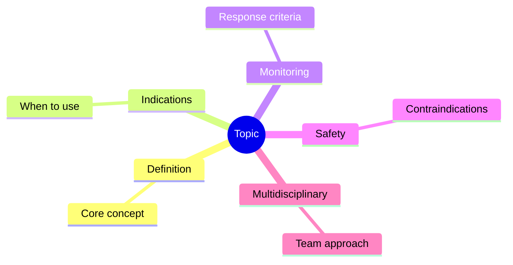
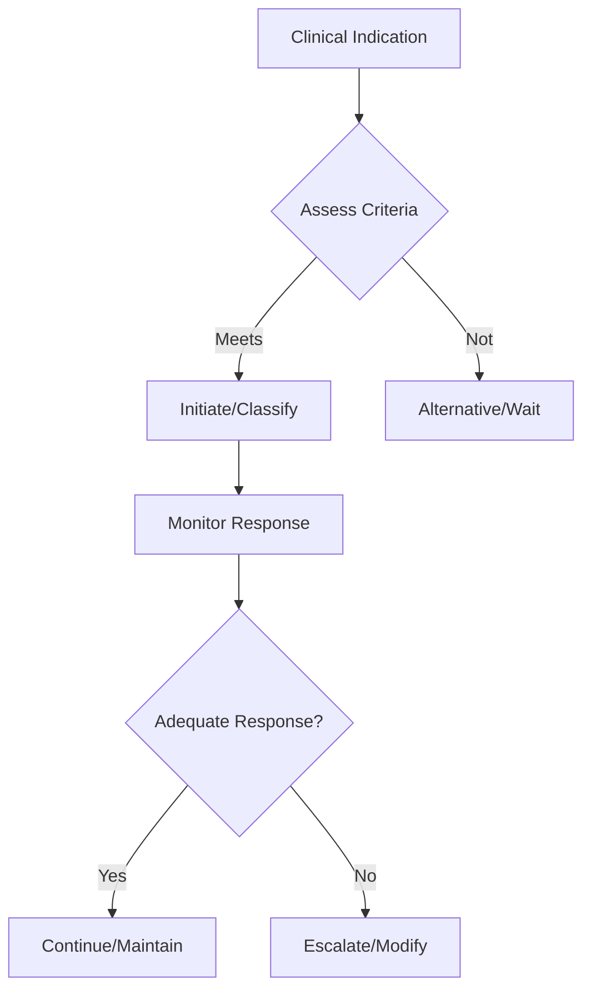

## 1. Learning Objectives
- Identify the indication and place in therapy for this intervention/classification
- Recognize the key monitoring parameters and treatment response criteria
- Apply the step-up/step-down logic for therapy adjustment
- Understand the safety profile and contraindications
- Outline the multidisciplinary coordination required# Cancer surveillance and vaccination issues in IBD

## 2. Why this matters
Longstanding colitis increases colorectal neoplasia risk, while immunosuppressive therapy increases infection-prevention complexity.

## 3. Cancer surveillance principles
- Risk rises with long disease duration, extent, inflammation burden, family history, PSC, and prior dysplasia.
- Surveillance colonoscopy is important in extensive or longstanding colitis.
- Aim: detect dysplasia early and guide endoscopic or surgical decisions.

## 4. Dysplasia logic
- Visible resectable dysplasia may be treated endoscopically in selected cases.
- Multifocal, invisible, or high-risk dysplasia may push toward colectomy decisions.

## 5. Vaccination principles
- Review vaccines early, ideally before major immunosuppression.
- Inactivated vaccines are generally safe.
- Live vaccines require timing caution around immunosuppression.
- Influenza, pneumococcal, hepatitis B, and other risk-based vaccines matter.

## 6. Drug-related caution
Thiopurines/biologics increase infection risk; prevention planning must be proactive.

## 7. One-page summary
IBD follow-up is not only symptom control: it also includes **colorectal cancer surveillance** and **structured vaccination review before and during immunosuppression**.

## 8. MCQs (10)
1. Colorectal cancer risk is higher with? **Longstanding extensive colitis**.
2. Important comorbidity increasing CRC risk? **PSC**.
3. Main surveillance test? **Colonoscopy**.
4. Live vaccines with heavy immunosuppression require? **Caution/timing review**.
5. Inactivated vaccines are generally? **Safe**.
6. Goal of surveillance? **Dysplasia detection**.
7. High inflammation burden increases? **Neoplasia risk**.
8. Vaccination planning is best done? **Early**.
9. Family history matters for? **Risk stratification**.
10. IBD follow-up includes both cancer and? **Infection prevention**.

## 9. SBA Questions (10)
1. Extensive longstanding UC in remission: extra routine priority? **Surveillance colonoscopy**.
2. Before biologic therapy, vaccine review is important because? **Immunosuppression increases infection risk**.
3. PSC plus colitis raises concern for? **Higher colorectal neoplasia risk**.
4. Main goal of surveillance colonoscopy? **Detect dysplasia early**.
5. Live vaccine consideration mainly matters because of? **Immunosuppression timing**.
6. Multifocal dysplasia may shift management toward? **Surgical discussion**.
7. Best exam-safe phrase? **IBD care includes prevention, not only flare treatment**.
8. Influenza vaccine is generally? **Recommended/inactivated**.
9. Poorly controlled chronic inflammation affects cancer risk how? **Increases it**.
10. Best time to review vaccines? **Before starting immunosuppression when possible**.

## 10. Flashcards
- Q: Longstanding extensive colitis increases risk of what?  
  A: Colorectal neoplasia.
- Q: Important surveillance modality?  
  A: Colonoscopy.
- Q: Vaccination review ideally happens when?  
  A: Before immunosuppression.
- Q: PSC changes CRC risk?  
  A: Yes, increases it.
- Q: IBD care includes which 2 preventive domains?  
  A: Cancer surveillance and vaccination planning.

## 11. Mind Map

## 12. Flowchart

## 13. Must Know / Should Know / Nice to Know
### Must Know
- Key indications and contraindications
- Dosing/monitoring parameters
- Step-up/step-down decision logic
- Safety monitoring requirements

### Should Know
- Special populations
- Drug interactions
- Refractory management
- Cost considerations

### Nice to Know
- Pharmacogenomics
- Emerging agents/techniques
- Long-term outcomes

## 14. Self-Test Scorecard
- Can I state the key indications? /10
- Can I list monitoring parameters? /10
- Can I explain the step-up logic? /10
- Can I identify contraindications? /10

**Interpretation:**
- **<35/40** = weak topic
- **35-36/40** = acceptable but insecure
- **37+/40** = exam-ready

## 15. Revision Prompts
- What are the key indications for this intervention?
- How is response monitored?
- What are the safety concerns?

## 16. Answer Key with Explanations
### MCQs
- 1. **A** — [explanation]
- 2. **B** — [explanation]
...

### SBAs
- 1. **A** — [explanation]
...

