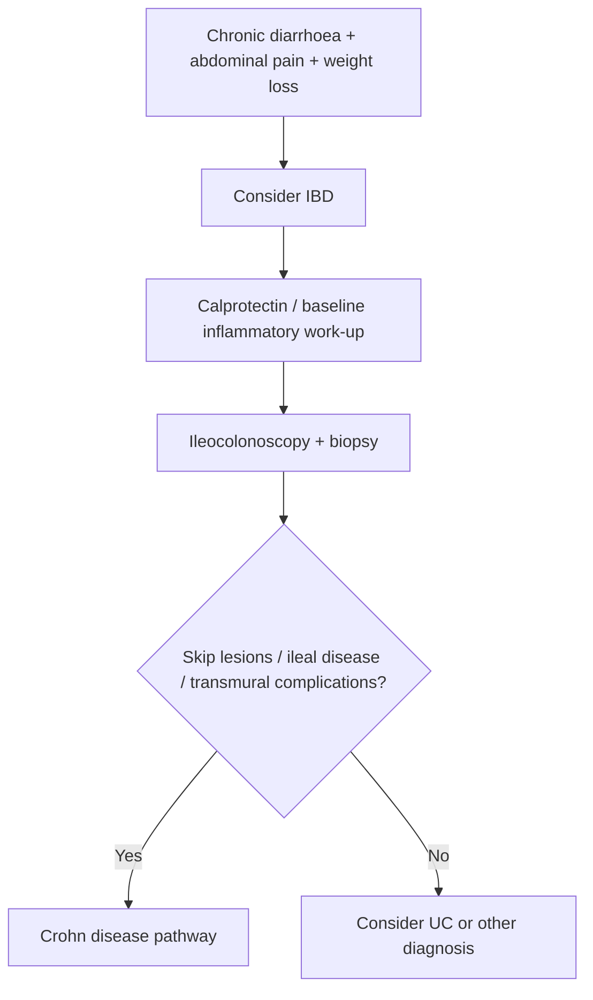

# Crohn disease

Related: [[../Gastroenterology MOC|Gastroenterology MOC]] · [[../Inflammatory and Functional Bowel Disorders|Inflammatory and Functional Bowel Disorders]] · [[Ulcerative colitis]] · [[Perianal Crohn disease]] · [[Acute severe ulcerative colitis]] · [[IBD treatment principles]]

## 1. Learning Objectives
- Define Crohn disease and separate it from ulcerative colitis.
- Recognize transmural and skip-lesion behavior.
- Understand complications including fistula and stricture.
- Apply investigation and management logic.

## 2. Definition
Crohn disease is a chronic inflammatory bowel disease characterized by **transmural, discontinuous (“skip”) inflammation that may affect any part of the gastrointestinal tract from mouth to anus**, most commonly the terminal ileum and colon.

## 3. Anatomy
- can involve mouth to anus
- terminal ileum and ileocolonic disease are common
- perianal disease may occur

## 4. Physiology / Pathology
- transmural inflammation leads to:
  - fissuring ulcers
  - stricture formation
  - fistula formation
  - abscess complications

## 5. Classification
### By site
- ileal
- colonic
- ileocolonic
- upper GI Crohn disease (less common)

### By behavior
- inflammatory
- stricturing
- penetrating/fistulizing

## 6. Etiology / Risk Factors
- immune dysregulation in genetically susceptible host
- family history
- environmental influences including smoking association

## 7. Pathophysiology
- chronic transmural intestinal inflammation
- skip lesions create patchy disease
- deep inflammation leads to fibrosis, narrowing, fistulae, and abscesses
- malabsorption and weight loss may occur, especially with small-bowel disease

## 8. Clinical Features
- chronic diarrhoea
- abdominal pain
- weight loss
- fever in active inflammatory disease
- perianal discharge/pain if perianal involvement
- fatigue

### Pattern clues
- right lower quadrant pain may reflect ileocecal disease
- fistula/abscess/stricture behavior strongly favors Crohn over UC

## 9. Investigations
### Baseline
- CBC
- CRP/ESR
- albumin
- U&E
- stool infection exclusion where needed

### GI-focused
- faecal calprotectin
- ileocolonoscopy with biopsy
- cross-sectional imaging when small-bowel or penetrating disease is suspected

### Investigative goals
- define site
- define severity/activity
- define complications: stricture, fistula, abscess

## 10. Interpretation Framework
### Crohn vs UC logic
**Crohn disease**
- mouth-to-anus potential
- skip lesions
- transmural inflammation
- fistula/stricture/perianal disease common

**Ulcerative colitis**
- colon only
- continuous disease from rectum
- mucosal disease

## 11. Diagnosis
Diagnosis depends on:
- clinical suspicion
- inflammatory biomarker support
- endoscopic and histologic evidence
- imaging when small-bowel or penetrating disease is suspected
- exclusion of infection and mimics

## 12. Differential Diagnosis
- [[Ulcerative colitis]]
- intestinal tuberculosis where epidemiologically relevant
- infective colitis
- IBS
- malignancy / chronic structural disease

## 13. Management
### Core principles
- treat according to location, severity, and behavior
- induction of remission with anti-inflammatory strategy
- maintenance and steroid-sparing approaches when needed
- nutrition support where relevant

### Practical disease-behavior logic
- inflammatory disease → medical therapy focus
- stricturing disease → assess obstruction severity; medical vs endoscopic/surgical approach
- penetrating disease → abscess/fistula control and specialist multidisciplinary care

### Special points
- perianal disease needs focused assessment
- smoking cessation is important
- surgery is not “curative” in the same way often misconceived; recurrence may occur

## 14. Complications
- stricture / obstruction
- fistula
- abscess
- perianal disease
- malnutrition
- anaemia

## 15. Red Flags / Emergencies
- severe abdominal pain with obstruction
- abscess/sepsis features
- peritonism
- high-output fistula or severe perianal sepsis
- marked weight loss / systemic toxicity

## 16. One-Page Summary
- Crohn disease = **transmural skip-lesion IBD** that can affect **mouth to anus**.
- Common symptoms: diarrhoea, abdominal pain, weight loss.
- Terminal ileum is commonly involved.
- Complications: **stricture, fistula, abscess, perianal disease**.
- Diagnose with endoscopy/biopsy plus imaging when small-bowel/penetrating disease is suspected.
- Distinguish from UC by **skip lesions**, **transmural disease**, and **fistula/stricture behavior**.

## 17. FCPS/MRCP High-Yield Points
- Crohn is patchy and transmural.
- Perianal disease strongly suggests Crohn.
- Small-bowel involvement and malabsorption are important clues.
- Surgery may be needed for complications but does not equal guaranteed cure.

## 18. Common Viva Traps
- Saying Crohn is limited to the colon.
- Forgetting fistula/stricture behavior.
- Saying surgery cures the disease permanently in all cases.

## 19. Mind Map
- Crohn disease
  - mouth to anus
  - skip lesions
  - transmural
  - ileal pain/diarrhoea/weight loss
  - complications
    - fistula
    - stricture
    - abscess
    - perianal disease

## 20. Flowchart

## 21. Revision Prompts
- Define Crohn disease.
- What 4 features distinguish it from UC?
- Name 4 major complications.
- Why is imaging important in Crohn disease?

## 22. MCQs (10)
1. Crohn disease is characterized by:
A. Transmural skip-lesion inflammation
B. Continuous rectal-only disease always
C. Liver-only inflammation
D. Purely functional bowel symptoms

2. Crohn disease may affect:
A. Any part of GI tract from mouth to anus
B. Only rectum
C. Only stomach
D. Only pancreas

3. Which complication strongly suggests Crohn?
A. Fistula formation
B. Hemorrhoids only
C. Dermatitis only
D. Cataract only

4. Which pattern distinguishes Crohn from UC?
A. Skip lesions
B. Continuous rectal involvement only
C. Pure mucosal disease always
D. Colon-only limitation always

5. Which site is commonly involved?
A. Terminal ileum
B. Trachea
C. Kidney pelvis
D. Pleura

6. A transmural disease complication is:
A. Stricture
B. Glaucoma
C. Otitis media
D. Hematuria only

7. Perianal disease most strongly suggests:
A. Crohn disease
B. Coeliac disease
C. GERD
D. Functional dyspepsia

8. Important investigation for luminal disease is:
A. Ileocolonoscopy with biopsy
B. EEG
C. Eye pressure measurement
D. Thyroid scan only

9. Which statement is correct?
A. Surgery may be needed for complications but is not a universal permanent cure
B. Crohn is always cured forever by one operation
C. Crohn never affects nutrition
D. Crohn cannot involve small bowel

10. Which symptom combination fits Crohn?
A. Chronic diarrhoea, abdominal pain, weight loss
B. Isolated jaundice only
C. Productive cough only
D. Polyuria only

## 23. SBA Questions (10)
1. A 29-year-old has chronic diarrhoea, RLQ pain, weight loss, and perianal discharge. Most likely diagnosis?
A. Crohn disease
B. Ulcerative colitis
C. Functional dyspepsia
D. Peptic ulcer disease

2. Which feature most strongly favors Crohn over UC?
A. Fistula and skip-lesion disease
B. Continuous rectal involvement
C. Disease limited to colon only
D. Pure mucosal inflammation

3. A patient with Crohn disease develops colicky pain, distension, and vomiting. Main complication?
A. Stricture/obstruction
B. Dermatitis herpetiformis
C. Achalasia
D. Barrett oesophagus

4. A patient with suspected Crohn needs assessment of possible penetrating disease. Helpful modality?
A. Cross-sectional imaging
B. Audiometry
C. Slit-lamp exam
D. Spirometry

5. Which statement about anatomy is correct?
A. Crohn may affect any GI segment from mouth to anus
B. It only affects rectum
C. It never affects ileum
D. It is a hepatology disorder

6. A key baseline biomarker test in suspected active IBD is:
A. CRP/ESR with CBC context
B. PSA only
C. HbA1c only
D. CK only

7. Which complication is especially transmural?
A. Abscess formation
B. Hemorrhoids only
C. Cataract only
D. Migraine only

8. The best general management principle is:
A. Match treatment to site, severity, and disease behavior
B. Use identical treatment in every patient regardless of phenotype
C. Ignore nutrition
D. Never assess for sepsis

9. Smoking in Crohn disease is:
A. Undesirable and associated with worse disease behavior
B. Protective therapy
C. Irrelevant always
D. A cure substitute

10. Which diagnosis must be considered in the differential depending on context?
A. Intestinal tuberculosis
B. Asthma
C. Glaucoma
D. Gout only

## 24. Flashcards
- Q: Is Crohn disease continuous or skip-lesion disease?  
  A: Skip-lesion disease.
- Q: Is Crohn mucosal or transmural?  
  A: Transmural.
- Q: Name 3 classic complications.  
  A: Stricture, fistula, abscess.
- Q: Which site is commonly involved?  
  A: Terminal ileum.
- Q: What feature strongly points to Crohn over UC?  
  A: Perianal disease/fistulae.

## 25. Answer Key with Explanations
### MCQs
1. **A** — this is the defining pattern.
2. **A** — Crohn can occur anywhere in the GI tract.
3. **A** — fistula formation is classic.
4. **A** — skip lesions are hallmark.
5. **A** — terminal ileum is commonly affected.
6. **A** — fibrosis/transmural inflammation cause strictures.
7. **A** — perianal disease strongly suggests Crohn.
8. **A** — ileocolonoscopy with biopsy is central.
9. **A** — surgery treats complications, not universal cure.
10. **A** — this is the classic symptom cluster.

### SBAs
1. **A** — this strongly fits Crohn.
2. **A** — fistula + skip lesions are defining clues.
3. **A** — obstructive symptoms suggest stricture.
4. **A** — imaging is important for penetrating disease.
5. **A** — Crohn may affect any GI segment.
6. **A** — inflammatory markers plus CBC support assessment.
7. **A** — abscess is a classic transmural complication.
8. **A** — phenotype-guided treatment is essential.
9. **A** — smoking worsens Crohn outcomes.
10. **A** — intestinal TB can mimic Crohn in some settings.

## 26. Must Know / Should Know / Nice to Know
### Must Know
- Crohn = transmural, segmental, granulomatous inflammation anywhere from mouth to anus
- Terminal ileum + right colon = most common; perianal disease in 30-40%
- Diagnosis: clinical + endoscopic (cobblestone, skip lesions) + histology (granulomas) + imaging (MRE/CTE)
- Management: induce remission (steroids → thiopurines/biologics), maintain remission, surgery for complications
- Monitor: CRP, faecal calprotectin, endoscopic healing; surgical recurrence common

### Should Know
- Advanced management options
- Special populations (pregnancy, elderly)
- Emerging therapies

### Nice to Know
- Molecular pathogenesis
- Genetic risk scores
- Global epidemiology

## 27. Self-Test Scorecard
- Can I define the condition? /10
- Can I list 4 diagnostic criteria? /10
- Can I outline the management algorithm? /10
- Can I name 3 complications? /10

**Interpretation:**
- **<35/40** = weak topic
- **35-36/40** = acceptable but insecure
- **37+/40** = exam-ready

