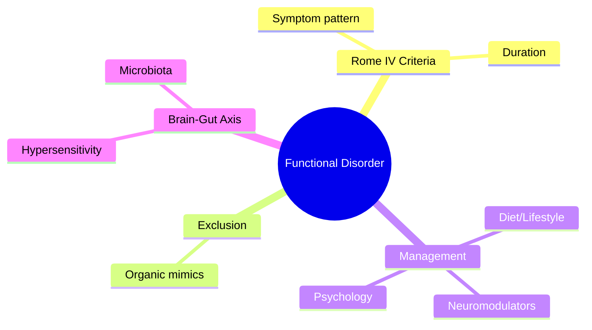
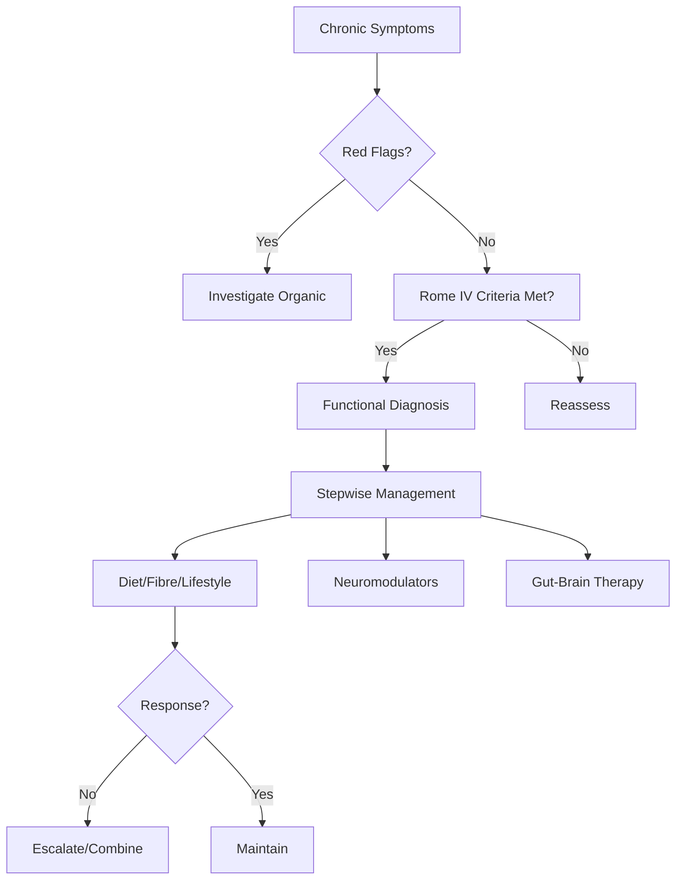

## 1. Learning Objectives
- Define the functional disorder using Rome IV criteria
- Distinguish from organic mimics using clinical clues and targeted testing
- Apply the brain-gut interaction model to patient explanation and management
- Implement stepwise management: lifestyle/diet → neuromodulators → psychological therapy
- Identify red flags requiring structural investigation# Functional constipation

## 2. Definition
Functional constipation is chronic difficult, infrequent, or incomplete defecation without structural, metabolic, or major inflammatory explanation.

## 3. Clinical features
- Infrequent stool
- Hard stool, straining
- Sense of incomplete evacuation
- Manual maneuvers in some patients
- Bloating or discomfort may coexist

## 4. Exclude secondary causes
- Drugs: opioids, iron, calcium channel blockers
- Hypothyroidism, hypercalcaemia
- Neurological disease
- Colorectal obstruction/alarm features

## 5. Alarm features
- Weight loss
- Anaemia or bleeding
- New onset in older age
- Family history of colorectal cancer

## 6. Management
1. Education, fiber/fluid if appropriate.
2. Toileting routine and activity.
3. Osmotic then stimulant laxative strategies as needed.
4. Pelvic floor dysfunction consideration if refractory.

## 7. Exam traps
- Assuming all constipation is IBS.
- Ignoring alarm features.
- Escalating laxatives without medication review.

## 8. One-page summary
Functional constipation is a **diagnosis after exclusion of secondary causes and red flags**. Manage with lifestyle advice, laxatives, and pelvic-floor evaluation when refractory.

## 9. MCQs (10)
1. Structural explanation required? **No**.
2. Common symptom? **Straining**.
3. First duty? **Exclude alarm/secondary causes**.
4. Drug cause example? **Opioids**.
5. Hard stool suggests? **Constipation**.
6. Pelvic floor issue may cause? **Outlet dysfunction**.
7. Weight loss with constipation is? **Alarm feature**.
8. Initial management includes? **Lifestyle and laxatives**.
9. Iron tablets may worsen? **Constipation**.
10. Functional constipation is always benign? **Only after red flags excluded**.

## 10. SBA Questions (10)
1. Chronic straining with no alarm features: likely diagnosis? **Functional constipation**.
2. New constipation and iron deficiency in older adult: next concern? **Colorectal malignancy**.
3. Refractory constipation with incomplete evacuation may suggest? **Pelvic floor dysfunction**.
4. Medication review should look for? **Opioids and constipating drugs**.
5. Best exam-safe phrase? **Functional constipation is a diagnosis of exclusion**.
6. First-line simple treatment? **Lifestyle plus osmotic laxative strategy**.
7. Rectal bleeding with constipation should trigger? **Further assessment, not assumption of simple functional disease**.
8. Hypothyroidism is relevant because it can? **Cause secondary constipation**.
9. Manual maneuvers may suggest? **Defecatory disorder**.
10. Main principle before labeling functional disease? **Exclude organic pathology**.

## 11. Flashcards
- Q: Core symptom cluster in functional constipation?  
  A: Infrequent hard stool, straining, incomplete evacuation.
- Q: First principle?  
  A: Exclude red flags and secondary causes.
- Q: Important drug cause?  
  A: Opioids.
- Q: Refractory outlet-type constipation suggests?  
  A: Pelvic floor dysfunction.
- Q: Basic treatment pillars?  
  A: Lifestyle, routine, laxatives.

## 12. Mind Map

## 13. Flowchart

## 14. Must Know / Should Know / Nice to Know
### Must Know
- Functional constipation = Rome IV: straining, lumpy/hard stools, incomplete evacuation, <3/week
- Diagnosis of exclusion: normal colonoscopy, no structural/metabolic cause
- Stepwise: fibre/PEG → osmotic (lactulose) → stimulant (senna) → prokinetics (prucalopride)
- Dyssynergic defecation: biofeedback = first-line; exclude Hirschsprung in young
- Opioid-induced: peripheral μ-antagonists (naloxegol, methylnaltrexone)

### Should Know
- Special populations (elderly, post-surgical, eating disorders)
- Microbiome modulation (pre/pro/synbiotics)
- Digital therapeutics (CBT apps)

### Nice to Know
- Visceral hypersensitivity mechanisms
- Mast cell involvement
- Genetic polymorphisms (SCN5A, GRM7)

## 15. Self-Test Scorecard
- Can I state the Rome IV criteria? /10
- Can I list 3 organic mimics to exclude? /10
- Can I outline the management algorithm? /10
- Can I explain the brain-gut axis model? /10

**Interpretation:**
- **<35/40** = weak topic
- **35-36/40** = acceptable but insecure
- **37+/40** = exam-ready

## 16. Revision Prompts
- What are the Rome IV criteria for this condition?
- How do you distinguish functional from organic causes?
- What is the stepwise management approach?

## 17. Answer Key with Explanations

