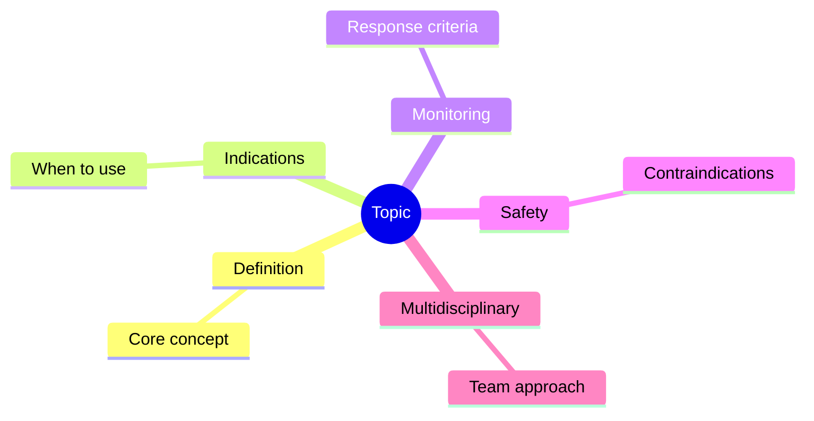
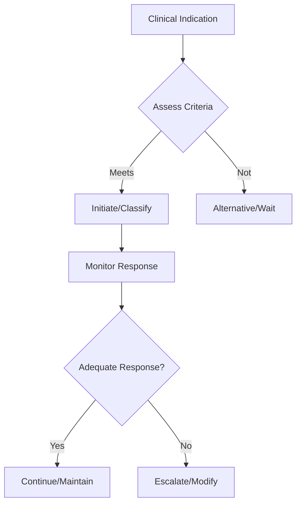

## 1. Learning Objectives
- Identify the indication and place in therapy for this intervention/classification
- Recognize the key monitoring parameters and treatment response criteria
- Apply the step-up/step-down logic for therapy adjustment
- Understand the safety profile and contraindications
- Outline the multidisciplinary coordination required# IBD severity assessment and extent classification

## 2. Why this matters
Severity and extent determine admission, imaging, steroid choice, biologic escalation, surveillance, and surgical discussion.

## 3. Ulcerative colitis extent
- Proctitis
- Left-sided colitis
- Extensive colitis / pancolitis

## 4. Ulcerative colitis severity clues
- Stool frequency
- Blood in stool
- Pulse, temperature
- Haemoglobin
- CRP/ESR
- Systemic toxicity

## 5. Crohn disease extent / behavior
- Ileal, colonic, ileocolonic, upper GI
- Inflammatory, stricturing, penetrating phenotype
- Perianal disease presence

## 6. High-yield severity logic
- Mild disease: outpatient management often possible
- Moderate disease: more active symptoms, objective inflammation
- Severe disease: frequent bloody stool, systemic upset, marked inflammation
- Fulminant/complicated disease: toxic megacolon, perforation, severe bleeding, sepsis

## 7. Investigations
- FBC, CRP, albumin
- Stool infection exclusion
- Endoscopy and biopsy
- Imaging for Crohn complications or severe colitis complications

## 8. Exam traps
- Confusing extent with severity.
- Forgetting perianal disease as a Crohn phenotype modifier.
- Treating all severe bloody diarrhoea as “just IBS flare.”

## 9. One-page summary
In IBD, always describe **site/extent**, **severity**, and **behavior/complication pattern**. UC is mapped by colonic extent; Crohn by site plus inflammatory/stricturing/penetrating behavior. This framing guides therapy.

## 10. MCQs (10)
1. UC extent category example? **Proctitis**.
2. Crohn phenotype example? **Stricturing**.
3. Severity and extent are identical? **No**.
4. Perianal disease suggests? **Crohn phenotype complexity**.
5. Severe bloody diarrhoea with tachycardia suggests? **Severe colitis**.
6. Albumin is useful because? **It reflects severity/systemic impact**.
7. Stool infection must be? **Excluded**.
8. Imaging is especially useful in? **Crohn complications / severe colitis concern**.
9. Fulminant disease includes? **Toxic megacolon**.
10. Main purpose of classification? **Guide treatment and risk**.

## 11. SBA Questions (10)
1. Bloody diarrhoea 10 times/day with fever and anaemia in known UC: severity? **Severe**.
2. Crohn with fistula and abscess belongs to which behavior? **Penetrating**.
3. Disease limited to rectum in UC is? **Proctitis**.
4. Why classify extent? **It influences treatment and surveillance**.
5. Main additional assessment before steroids? **Exclude infection**.
6. Weight loss and stricturing ileal symptoms imply Crohn phenotype? **Stricturing**.
7. Best exam-safe phrasing? **Always state extent, severity, and complications**.
8. Systemic toxicity changes classification toward? **Severe/fulminant disease**.
9. Colonoscopic biopsy is useful for? **Diagnosis and extent assessment**.
10. Perianal fistula in IBD most strongly suggests? **Crohn disease**.

## 12. Flashcards
- Q: UC extent categories?  
  A: Proctitis, left-sided colitis, extensive colitis.
- Q: Crohn behavior categories?  
  A: Inflammatory, stricturing, penetrating.
- Q: Are extent and severity the same?  
  A: No.
- Q: Complication indicating fulminant disease?  
  A: Toxic megacolon.
- Q: Infection must be excluded before what?  
  A: Assuming flare and escalating immunosuppression.

## 13. Mind Map

## 14. Flowchart

## 15. Must Know / Should Know / Nice to Know
### Must Know
- Key indications and contraindications
- Dosing/monitoring parameters
- Step-up/step-down decision logic
- Safety monitoring requirements

### Should Know
- Special populations
- Drug interactions
- Refractory management
- Cost considerations

### Nice to Know
- Pharmacogenomics
- Emerging agents/techniques
- Long-term outcomes

## 16. Self-Test Scorecard
- Can I state the key indications? /10
- Can I list monitoring parameters? /10
- Can I explain the step-up logic? /10
- Can I identify contraindications? /10

**Interpretation:**
- **<35/40** = weak topic
- **35-36/40** = acceptable but insecure
- **37+/40** = exam-ready

## 17. Revision Prompts
- What are the key indications for this intervention?
- How is response monitored?
- What are the safety concerns?

## 18. Answer Key with Explanations
### MCQs
- 1. **A** — [explanation]
- 2. **B** — [explanation]
...

### SBAs
- 1. **A** — [explanation]
...

