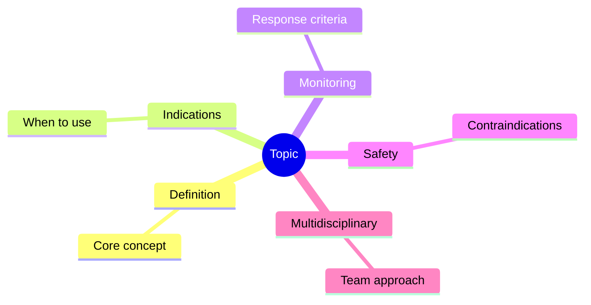
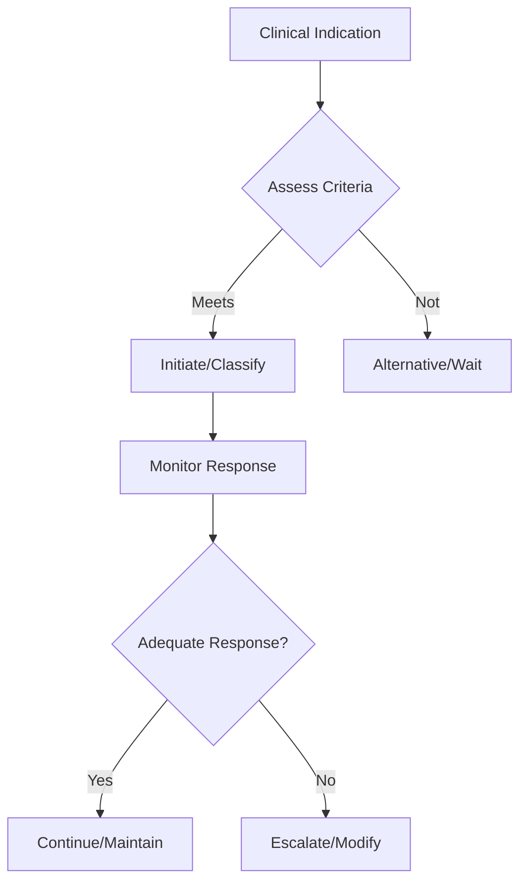

## 1. Learning Objectives
- Identify the indication and place in therapy for this intervention/classification
- Recognize the key monitoring parameters and treatment response criteria
- Apply the step-up/step-down logic for therapy adjustment
- Understand the safety profile and contraindications
- Outline the multidisciplinary coordination required# Irritable bowel syndrome

Related: [[../Gastroenterology MOC|Gastroenterology MOC]] · [[../Inflammatory and Functional Bowel Disorders|Inflammatory and Functional Bowel Disorders]] · [[Chronic diarrhoea framework]]

> [!important]
> IBS is a **disorder of gut-brain interaction**, not a diagnosis of laziness. In FCPS/MRCP answers, score comes from showing **positive diagnosis using symptom criteria**, checking **alarm features**, and separating IBS from **IBD, coeliac disease, colorectal cancer, and infection**.

## 2. Definition
Irritable bowel syndrome (IBS) is a chronic disorder of gut-brain interaction characterized by **recurrent abdominal pain associated with defecation and/or change in stool frequency or form**, without a structural explanation.

## 3. Relevant Anatomy
- Symptoms arise from the **large bowel**, enteric nervous system, visceral afferent pathways, and central processing of gut sensation.
- No destructive inflammatory or malignant lesion explains symptoms.

## 4. Physiology
Key physiological mechanisms include:
- altered gut motility
- **visceral hypersensitivity**
- altered gut-brain signaling
- psychosocial modulation of symptoms
- post-infective changes in some patients
- altered microbiota/fermentation in some cases

## 5. Classification
Common subtypes are based on stool pattern:
- **IBS-C**: constipation predominant
- **IBS-D**: diarrhoea predominant
- **IBS-M**: mixed bowel habit
- **IBS-U**: unclassified

## 6. Etiology / Risk Factors
- Female sex more common in many series
- Young adulthood onset is typical
- Psychosocial stress/anxiety/depression may amplify symptoms
- Post-infective IBS after gastroenteritis
- Food-related symptom triggers
- Family clustering may occur

## 7. Pathophysiology
- Abnormal bidirectional signaling between gut and brain increases pain perception.
- Motility disturbance causes diarrhoea, constipation, or alternating bowel habit.
- Luminal distension from fermentation may worsen bloating.
- Low-grade post-infective immune changes may contribute in some cases.

## 8. Clinical Features
- Recurrent abdominal pain or discomfort
- Pain related to defecation
- Altered stool frequency
- Altered stool form
- Bloating and abdominal distension
- Passage of mucus may occur
- Sense of incomplete evacuation
- Symptoms often fluctuate over time

## 9. Alarm Features / Red Flags
These suggest an alternative diagnosis and require urgent evaluation:
- unintentional weight loss
- rectal bleeding
- iron-deficiency anemia
- nocturnal symptoms waking the patient
- fever
- palpable abdominal or rectal mass
- family history of colorectal cancer/IBD/coeliac disease
- onset at older age without prior similar symptoms
- persistent progressive symptoms

## 10. Investigations
IBS is usually a **positive clinical diagnosis** with limited targeted tests.

### Baseline investigations often considered
- CBC
- CRP or ESR
- coeliac serology when diarrhoea/bloating prominent
- stool tests if infection suspected
- fecal calprotectin when IBD distinction matters

### Further tests only when indicated
- colonoscopy if alarm features, older age, bleeding, anemia, or change in bowel habit suggest organic disease
- thyroid tests or other targeted tests depending on presentation

## 11. Interpretation Framework
### IBS vs organic disease logic
Think IBS when there is:
- chronic fluctuating symptoms
- abdominal pain related to defecation
- altered stool form/frequency
- normal examination/basic tests
- absence of red flags

Think beyond IBS when there is:
- bleeding
- weight loss
- anemia
- raised inflammatory markers
- nocturnal diarrhoea
- marked family history
- persistent progression

### IBS-D differentiation
Important differentials:
- coeliac disease
- bile acid diarrhoea
- microscopic colitis
- IBD
- chronic infection
- lactose/FODMAP-related symptoms

## 12. Diagnosis
A positive diagnosis is made using symptom criteria such as **Rome-style principles** together with exclusion of alarm features and limited appropriate testing.

## 13. Differential Diagnosis
- IBD
- Coeliac disease
- Colorectal cancer
- Microscopic colitis
- Lactose intolerance / carbohydrate malabsorption
- Chronic infection
- Bile acid diarrhoea
- Endometriosis or gynecologic pain syndromes in selected patients

## 14. Management
## 15. General principles
- Explain the diagnosis positively
- Reassure that no cancer/inflammation is evident when appropriate
- Identify dominant symptom subtype
- Build a therapeutic relationship

## 16. Lifestyle and diet
- Regular meals, sleep, exercise
- Reduce trigger foods if clear relationship exists
- Some patients benefit from **low-FODMAP style** dietary guidance with dietetic support
- Avoid unnecessary highly restrictive diets without guidance

## 17. Symptom-based drug treatment
### IBS-D predominant
- loperamide for diarrhoea control in selected patients
- antispasmodics for pain

### IBS-C predominant
- soluble fiber may help
- osmotic laxatives if needed
- avoid overuse of constipating agents

### Pain / global symptoms
- antispasmodics
- low-dose neuromodulators in selected difficult cases
- psychological therapies where relevant

## 18. Important cautions
- Do not label significant rectal bleeding as IBS.
- New onset in older age requires careful exclusion of colorectal disease.
- Persistent nocturnal diarrhoea or inflammatory markers should push you away from IBS.

## 19. Complications
IBS does **not** cause toxic megacolon, perforation, or colorectal cancer directly, but it may cause:
- impaired quality of life
- anxiety about serious disease
- work/school absenteeism
- repeated healthcare attendance

## 20. Common Exam / Viva Traps
- Saying IBS is a diagnosis of exclusion only
- Forgetting to mention **alarm features**
- Missing coeliac disease/IBD/CRC differentials
- Over-investigating classic stable IBS with normal basics
- Under-investigating older patients with bleeding or anemia

## 21. One-Page Summary
- IBS = chronic gut-brain interaction disorder.
- Core symptom triad: **abdominal pain + relation to defecation + change in stool frequency/form**.
- Diagnose positively when pattern is typical and no red flags exist.
- Screen for **IBD, coeliac disease, colorectal cancer, and infection** when features suggest them.
- Manage with explanation, diet/lifestyle, and symptom-based therapy.
- Always state alarm features in exam answers.

## 22. Revision Prompts
- Define IBS in one sentence.
- Name the common IBS subtypes.
- List alarm features that argue against IBS.
- Differentiate IBS-D from IBD and coeliac disease.
- Outline stepwise management of IBS.

## 23. MCQs (10)
1. IBS is best described as:
   - A. A structural colonic ulcer disease
   - B. A disorder of gut-brain interaction
   - C. A malignant bowel disorder
   - D. A pancreatic insufficiency syndrome
   - **Answer: B**

2. A feature supporting IBS is:
   - A. Rectal mass
   - B. Pain related to defecation
   - C. Iron-deficiency anemia
   - D. Persistent fever
   - **Answer: B**

3. Which is an alarm feature against IBS?
   - A. Bloating
   - B. Mucus passage
   - C. Weight loss
   - D. Fluctuating symptoms
   - **Answer: C**

4. IBS-D should be differentiated from:
   - A. Coeliac disease
   - B. Cataract
   - C. Nephrotic syndrome
   - D. Tension headache
   - **Answer: A**

5. A patient with typical IBS and no red flags usually needs:
   - A. Immediate laparotomy
   - B. Positive diagnosis with limited targeted tests
   - C. ERCP
   - D. Chemotherapy
   - **Answer: B**

6. Which is a recognized subtype?
   - A. IBS-H
   - B. IBS-C
   - C. IBS-L
   - D. IBS-P
   - **Answer: B**

7. Visceral hypersensitivity in IBS mainly explains:
   - A. Jaundice
   - B. Abdominal pain perception
   - C. GI perforation
   - D. Portal hypertension
   - **Answer: B**

8. Which investigation may help distinguish IBS from IBD?
   - A. Fecal calprotectin
   - B. Troponin
   - C. Serum amylase only
   - D. PSA
   - **Answer: A**

9. Which management approach is correct?
   - A. Ignore symptoms because disease is functional
   - B. Explain diagnosis and tailor therapy to symptom subtype
   - C. Give antibiotics to all patients
   - D. Give steroids routinely
   - **Answer: B**

10. New onset altered bowel habit with anemia in an older patient should raise concern for:
   - A. Only IBS
   - B. Colorectal cancer
   - C. Functional bloating alone
   - D. Normal ageing only
   - **Answer: B**

## 24. SBA Questions (10)
1. A 26-year-old woman has 8 months of abdominal pain relieved after defecation, bloating, and looser stools during stress. CBC and CRP are normal. Best diagnosis?
   - A. IBS
   - B. Colon cancer
   - C. ASUC
   - D. Acute pancreatitis
   - **Answer: A**

2. A 42-year-old man with altered bowel habit also has weight loss and iron-deficiency anemia. Best next principle?
   - A. Treat as IBS without further workup
   - B. Evaluate urgently for organic disease
   - C. Start pancreatic enzymes
   - D. Diagnose functional diarrhoea immediately
   - **Answer: B**

3. Which feature most favors IBS over IBD?
   - A. Nocturnal diarrhoea
   - B. Raised CRP
   - C. Pain related to defecation with normal tests
   - D. Persistent rectal bleeding
   - **Answer: C**

4. A patient with suspected IBS-D should commonly be screened for:
   - A. Coeliac disease
   - B. Aortic stenosis
   - C. Glomerulonephritis
   - D. Myasthenia
   - **Answer: A**

5. Which symptom-based therapy may help IBS-D?
   - A. Loperamide in selected patients
   - B. IV steroids routinely
   - C. Broad-spectrum antibiotics for all
   - D. Immediate colectomy
   - **Answer: A**

6. Which statement about IBS is most accurate?
   - A. It always causes rectal bleeding
   - B. It is diagnosed only after exhaustive negative testing
   - C. It can be diagnosed positively in the right clinical context
   - D. It usually causes fever
   - **Answer: C**

7. Which test is useful when separating IBS from inflammatory bowel disease?
   - A. Fecal calprotectin
   - B. Lipase
   - C. AFP
   - D. CK
   - **Answer: A**

8. A patient asks if IBS turns into cancer. Best answer?
   - A. Yes, usually
   - B. IBS itself does not directly cause colorectal cancer
   - C. It always causes dysplasia
   - D. It always becomes ulcerative colitis
   - **Answer: B**

9. Which factor can contribute to IBS symptoms?
   - A. Visceral hypersensitivity
   - B. Portal vein thrombosis
   - C. Biliary obstruction only
   - D. Massive GI hemorrhage
   - **Answer: A**

10. In a stable young patient with classic IBS features and no red flags, best management principle is:
   - A. Over-investigate aggressively
   - B. Positive diagnosis, explanation, targeted care
   - C. Urgent surgery
   - D. Ignore symptoms completely
   - **Answer: B**

## 25. Flashcards
- Q: What type of disorder is IBS?  
  A: A disorder of gut-brain interaction.
- Q: Core symptom relation in IBS?  
  A: Abdominal pain related to defecation with change in stool frequency/form.
- Q: Three common IBS subtypes?  
  A: IBS-C, IBS-D, IBS-M.
- Q: Four alarm features against IBS?  
  A: Weight loss, bleeding, anemia, nocturnal symptoms.
- Q: Test useful to separate IBS from IBD?  
  A: Fecal calprotectin.
- Q: Important diarrhea differential in suspected IBS-D?  
  A: Coeliac disease.
- Q: First management step in IBS?  
  A: Explain and positively diagnose the condition.
- Q: Does IBS itself cause colorectal cancer?  
  A: No.

## 26. Mind Map

## 27. Flowchart

## 28. Must Know / Should Know / Nice to Know
### Must Know
- Key indications and contraindications
- Dosing/monitoring parameters
- Step-up/step-down decision logic
- Safety monitoring requirements

### Should Know
- Special populations
- Drug interactions
- Refractory management
- Cost considerations

### Nice to Know
- Pharmacogenomics
- Emerging agents/techniques
- Long-term outcomes

## 29. Self-Test Scorecard
- Can I state the key indications? /10
- Can I list monitoring parameters? /10
- Can I explain the step-up logic? /10
- Can I identify contraindications? /10

**Interpretation:**
- **<35/40** = weak topic
- **35-36/40** = acceptable but insecure
- **37+/40** = exam-ready

## 30. Revision Prompts
- What are the key indications for this intervention?
- How is response monitored?
- What are the safety concerns?

## 31. Answer Key with Explanations
### MCQs
- 1. **A** — [explanation]
- 2. **B** — [explanation]
...

### SBAs
- 1. **A** — [explanation]
...

## 32. Answer Key Pearls
- High-scoring IBS answers always include **alarm features** and **organic differentials**.
- The diagnosis should be framed as **positive and symptom-based**, not simply “all tests negative.”
