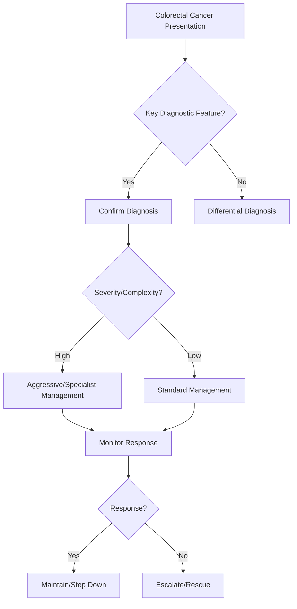

## 1. Learning Objectives
- Define colorectal cancer (CRC): malignant neoplasm arising from colonic/rectal mucosa, usually via adenoma-carcinoma sequence.
- Recognize the red-flag symptoms: change in bowel habit, rectal bleeding, iron-deficiency anaemia, weight loss, abdominal mass, obstruction.
- Apply the screening/surveillance logic: FIT/colonoscopy for average risk from 45-50; earlier/higher intensity for family history, IBD, polyposis syndromes.
- Understand staging (TNM) and treatment: surgery (TME for rectum), adjuvant chemo for stage III, neoadjuvant for locally advanced rectal.
- Outline follow-up: CEA, CT/colonoscopy surveillance for recurrence/metachronous lesions.# Colorectal cancer

Related: [[../Gastroenterology MOC|Gastroenterology MOC]] · [[../Lower GI Bleeding, Colorectal, and Anal Disorders|Lower GI Bleeding, Colorectal, and Anal Disorders]] · [[Chronic diarrhoea framework]]

> [!important]
> In FCPS/MRCP exams, colorectal cancer (CRC) is a **red-flag diagnosis**. Marks come from recognizing **alarm symptoms, iron-deficiency anaemia, change in bowel habit, lower-GI bleeding, obstruction, risk factors, investigation sequence, staging, and principles of surgery plus adjuvant therapy**.

## 2. Definition
Colorectal cancer is a malignant epithelial neoplasm of the colon or rectum, most commonly **adenocarcinoma**, usually developing through accumulation of genetic changes in adenomatous or serrated precursor lesions.

## 3. Relevant Anatomy
- Colon: caecum, ascending, transverse, descending, sigmoid colon.
- Rectum lies within the pelvis and has important surgical relations.
- Right-sided cancers often present with **occult bleeding and anaemia**.
- Left-sided cancers more often present with **altered bowel habit and obstruction**.
- Rectal cancers may present with **tenesmus, bleeding, urgency, and pelvic symptoms**.

## 4. Physiology
- Normal colorectal mucosa supports water absorption, stool storage, and controlled transit.
- Malignant transformation disrupts mucosal integrity, causing bleeding, anemia, obstruction, and systemic cancer effects such as weight loss and cachexia.

## 5. Classification
### By site
- Right colon
- Left colon
- Rectal cancer

### By pathology
- Adenocarcinoma is the commonest type
- Less common: mucinous/signet-ring variants and other rare neoplasms

### By stage
- Localized disease
- Node-positive regional disease
- Metastatic disease

## 6. Risk Factors
- Increasing age
- Personal or family history of adenomas/CRC
- Hereditary syndromes: FAP, Lynch syndrome
- Long-standing IBD, especially extensive colitis
- Diet/lifestyle factors: obesity, sedentary lifestyle, smoking, excess processed/red meat, alcohol
- Type 2 diabetes may be associated with increased risk

## 7. Pathophysiology
- Adenoma-carcinoma sequence: accumulation of mutations drives progression from dysplasia to invasive cancer.
- Serrated pathway contributes in some cases.
- Tumor growth causes:
  - occult or visible bleeding
  - luminal narrowing → obstruction
  - systemic inflammatory/catabolic effects → weight loss
  - metastatic spread, commonly to **liver**, lung, peritoneum

## 8. Clinical Features
### General clues
- Change in bowel habit
- Rectal bleeding or occult bleeding
- Iron-deficiency anaemia
- Weight loss
- Abdominal pain
- Fatigue

### Site-based patterns
#### Right-sided CRC
- Occult bleeding
- Iron-deficiency anaemia
- Weight loss
- Vague pain
- Palpable mass sometimes

#### Left-sided CRC
- Change in bowel habit
- Colicky pain
- Obstructive symptoms
- Visible bleeding more common

#### Rectal cancer
- Fresh rectal bleeding
- Tenesmus
- Urgency
- Feeling of incomplete evacuation
- Pelvic pain in advanced disease

## 9. Red Flags / Emergencies
- Iron-deficiency anaemia in adult, especially older patient
- Persistent altered bowel habit
- Rectal bleeding with weight loss or anemia
- Palpable abdominal/rectal mass
- Large-bowel obstruction
- Perforation

## 10. Investigations
## 11. Initial workup
- CBC: look for anemia
- U&E, LFTs
- Iron studies if anemia present
- CEA for baseline follow-up context, not for screening alone

## 12. Diagnostic evaluation
- **Colonoscopy with biopsy** is the key test in most patients
- If obstructed or colonoscopy incomplete: CT colonography/appropriate imaging depending on context
- Digital rectal examination and proctoscopy/sigmoidoscopy when rectal lesion suspected

## 13. Staging
- **CT chest/abdomen/pelvis** for staging
- Pelvic MRI for rectal cancer local staging
- Endorectal ultrasound in selected rectal cases

## 14. Interpretation Framework
### Lower-GI cancer clue logic
Think CRC when lower-GI symptoms are accompanied by:
- age/risk factors
- persistent change in bowel habit
- unexplained iron-deficiency anaemia
- rectal bleeding not fitting simple benign anorectal disease
- weight loss
- obstructive symptoms

### Right vs left vs rectal logic
- **Right**: anemia, occult bleed, constitutional features
- **Left**: change in stool caliber/habit, obstruction, colicky pain
- **Rectal**: bleeding, tenesmus, urgency, pelvic symptoms

## 15. Diagnosis
Diagnosis requires:
- clinical suspicion from symptoms and red flags
- endoscopic visualization
- **histological confirmation by biopsy**
- staging to guide treatment

## 16. Differential Diagnosis
- Benign anorectal bleeding (e.g. hemorrhoids)
- IBD
- Diverticular disease
- Infectious or ischemic colitis
- IBS with change in bowel habit but no red flags
- Colonic polyps without invasive disease

## 17. Management
## 18. Core principles
Management depends on site, stage, fitness, and MDT planning.

### Surgery
- Main curative treatment for localized colon cancer is **resection with lymphovascular clearance**.
- Rectal cancer surgery depends on level and local extent, often after neoadjuvant planning.

### Oncologic therapy
- Adjuvant chemotherapy for selected stage II and many stage III colon cancers
- Neoadjuvant chemoradiotherapy or total neoadjuvant approaches may be used in rectal cancer
- Palliative systemic therapy in metastatic disease

### Supportive / emergency care
- Treat obstruction, perforation, bleeding, anemia, malnutrition
- Stent may be considered in some obstructing left-sided lesions depending on setting/expertise

## 19. Surveillance and Prevention Principles
- Remove premalignant polyps when identified
- Screen high-risk families
- IBD surveillance colonoscopy in long-standing colitis
- Lifestyle modification reduces risk at population level

## 20. Complications
- Large-bowel obstruction
- Perforation
- Bleeding and iron-deficiency anemia
- Metastatic spread (especially liver)
- Cachexia, VTE, postoperative complications

## 21. Common Exam / Viva Traps
- Missing CRC in a patient with “just piles” plus anemia/weight loss
- Forgetting **biopsy** confirmation
- Using CEA as the sole diagnostic test
- Not distinguishing **right-sided anemia** from **left-sided obstruction** pattern
- Forgetting MRI staging for rectal cancer

## 22. One-Page Summary
- CRC usually arises through adenoma-carcinoma progression.
- Red flags: **rectal bleeding, iron-deficiency anaemia, altered bowel habit, weight loss, obstruction**.
- Right-sided tumors → **anemia/occult bleed**.
- Left-sided tumors → **obstruction/change in bowel habit**.
- Rectal tumors → **bleeding/tenesmus/urgency**.
- Diagnosis: **colonoscopy + biopsy**.
- Staging: **CT chest/abdomen/pelvis**, plus **pelvic MRI** for rectal cancer.
- Curative treatment is mainly **surgical**, with oncologic therapy based on stage/site.

## 23. Revision Prompts
- Why does right-sided CRC often present late?
- List five CRC red-flag features.
- Differentiate presentation of right, left, and rectal tumors.
- What is the diagnostic gold-standard sequence?
- What additional staging is important in rectal cancer?

## 24. MCQs (10)
1. The commonest histological type of colorectal cancer is:
   - A. Squamous carcinoma
   - B. Adenocarcinoma
   - C. Lymphoma
   - D. Sarcoma
   - **Answer: B**

2. Right-sided colorectal cancer commonly presents with:
   - A. Hematemesis
   - B. Iron-deficiency anemia
   - C. Jaundice as first feature in all cases
   - D. Dysphagia
   - **Answer: B**

3. Left-sided colorectal cancer more commonly causes:
   - A. Esophageal obstruction
   - B. Large-bowel obstruction
   - C. Pancreatitis
   - D. Malabsorption only
   - **Answer: B**

4. Key diagnostic investigation is:
   - A. Colonoscopy with biopsy
   - B. ERCP
   - C. Echocardiography
   - D. Spirometry
   - **Answer: A**

5. A rectal cancer patient requires which additional local staging test?
   - A. Pelvic MRI
   - B. EEG
   - C. MRCP
   - D. DEXA
   - **Answer: A**

6. Which is a major alarm feature for CRC?
   - A. Bloating only after beans
   - B. Iron-deficiency anaemia
   - C. Brief self-limited diarrhea only
   - D. Mouth ulcers alone
   - **Answer: B**

7. CEA is most useful as:
   - A. Sole screening tool
   - B. Follow-up adjunct, not sole diagnostic test
   - C. Test for coeliac disease
   - D. Pancreatitis marker
   - **Answer: B**

8. Which metastatic site is especially common in CRC?
   - A. Liver
   - B. Thyroid
   - C. Retina
   - D. Spleen only
   - **Answer: A**

9. A hereditary CRC syndrome is:
   - A. Marfan syndrome
   - B. Lynch syndrome
   - C. Down syndrome only
   - D. Sjögren syndrome
   - **Answer: B**

10. Curative-intent treatment for localized colon cancer is usually:
   - A. Antacids
   - B. Surgical resection
   - C. Steroids alone
   - D. Pancreatic enzyme replacement
   - **Answer: B**

## 25. SBA Questions (10)
1. A 68-year-old man has progressive fatigue and microcytic anemia without overt bleeding. Best GI diagnosis to exclude urgently?
   - A. IBS
   - B. Colorectal cancer
   - C. Gallstones
   - D. Acute pancreatitis
   - **Answer: B**

2. A 61-year-old woman has change in bowel habit, colicky abdominal pain, and distension. Most likely pattern?
   - A. Right-sided colon cancer
   - B. Left-sided colon cancer
   - C. Pure functional bloating
   - D. Peptic ulcer disease
   - **Answer: B**

3. Best investigation to confirm suspected CRC?
   - A. Colonoscopy with biopsy
   - B. Stool pH
   - C. Serum amylase
   - D. Barium swallow
   - **Answer: A**

4. A patient with rectal cancer has confirmed biopsy-proven disease. Best additional staging test for local pelvic extent?
   - A. Pelvic MRI
   - B. MR brain
   - C. Cystoscopy in all cases
   - D. OGD
   - **Answer: A**

5. Which symptom particularly suggests rectal rather than right-colonic cancer?
   - A. Tenesmus
   - B. Occult anemia only
   - C. Hematemesis
   - D. Steatorrhoea
   - **Answer: A**

6. Which blood test abnormality is a classic clue for CRC?
   - A. Hypercalcemia alone in all cases
   - B. Iron-deficiency anemia
   - C. Severe neutropenia only
   - D. Isolated high lipase
   - **Answer: B**

7. An older patient reports rectal bleeding but also weight loss and altered bowel habit. Best interpretation?
   - A. Probably hemorrhoids only
   - B. CRC must be excluded
   - C. Definitely IBS
   - D. No need for colon investigation
   - **Answer: B**

8. Which condition increases long-term CRC risk?
   - A. Chronic extensive ulcerative colitis
   - B. Simple seasonal rhinitis
   - C. Tension headache
   - D. Acute appendicitis history alone
   - **Answer: A**

9. Which is the main curative treatment for localized colon cancer?
   - A. Surgery
   - B. Antispasmodics
   - C. Oral rehydration only
   - D. PPIs
   - **Answer: A**

10. Commonest route/site of distant spread from CRC is to the:
   - A. Liver
   - B. Cornea
   - C. Testis
   - D. Thyroid cartilage
   - **Answer: A**

## 26. Flashcards
- Q: Commonest histology of CRC?  
  A: Adenocarcinoma.
- Q: Classic clue to right-sided CRC?  
  A: Iron-deficiency anemia.
- Q: Classic clue to left-sided CRC?  
  A: Change in bowel habit and obstruction.
- Q: Classic clue to rectal cancer?  
  A: Bleeding with tenesmus/urgency.
- Q: Diagnostic key test for CRC?  
  A: Colonoscopy with biopsy.
- Q: Staging test for rectal cancer local extent?  
  A: Pelvic MRI.
- Q: Two hereditary CRC syndromes?  
  A: Lynch syndrome and FAP.
- Q: Common metastatic site?  
  A: Liver.


## 27. Mind Map
```mermaid
mindmap
  root((Colorectal Cancer))
    Definition
      CRC = adenocarcinoma >95%, mostly left-sided/recta...
    Key Features
      Red flags: change in bowel habit, rectal bleeding,...
    Diagnosis
      Screening: FIT (annual) or colonoscopy (10-yearly)...
    Management
      Adenoma-carcinoma sequence: polyp → dysplasia → ca...
    Complications
      Staging TNM → treatment: surgery ± adjuvant/neoadj...
```

## 28. Flowchart


## 29. Must Know / Should Know / Nice to Know
### Must Know
- CRC = adenocarcinoma >95%, mostly left-sided/rectal
- Red flags: change in bowel habit, rectal bleeding, IDA, weight loss, mass
- Screening: FIT (annual) or colonoscopy (10-yearly) from 45-50
- Adenoma-carcinoma sequence: polyp → dysplasia → carcinoma
- Staging TNM → treatment: surgery ± adjuvant/neoadjuvant

### Should Know
- Right-sided = iron deficiency, exophytic; left-sided = obstruction, bleeding
- MSI-H/dMMR = immunotherapy candidate; KRAS/NRAS/BRAF = anti-EGFR eligibility
- TME (total mesorectal excision) for rectal
- CEA for surveillance (not screening)

### Nice to Know
- Watch-and-wait after complete clinical response in rectal
- Liquid biopsy ctDNA for MRD
- Prehabilitation for elderly

## 30. Self-Test Scorecard
- Can I define Colorectal Cancer correctly? /10
- Can I list 4 key features? /10
- Can I explain the diagnostic approach? /10
- Can I outline the management? /10

**Interpretation:**
- **<35/40** = weak topic
- **35-36/40** = acceptable but insecure
- **37+/40** = exam-ready

## 31. Revision Prompts
- What is Colorectal Cancer?
- What are the key diagnostic features?
- What is the management approach?

## 32. Answer Key with Explanations


## 33. Answer Key Pearls
- In exams, always mention **red flags** and **site-based presentation differences**.
- “Rectal bleeding = piles” is a classic trap; **anemia, change in bowel habit, weight loss, or age** should force CRC exclusion.
