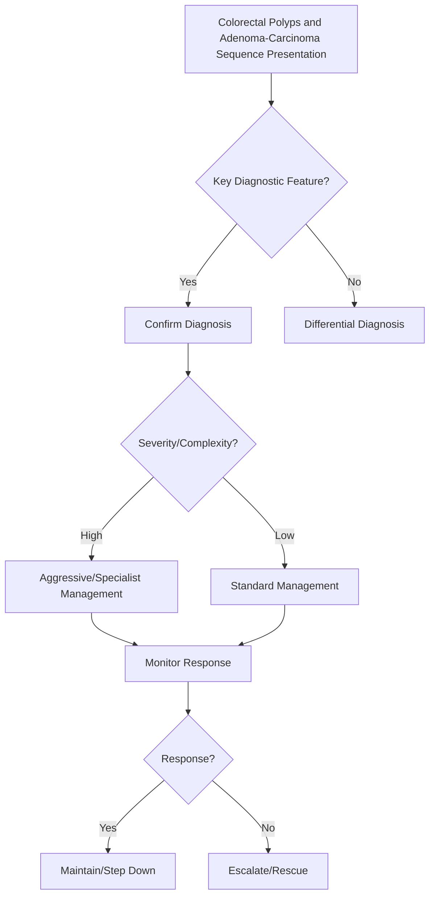

## 1. Learning Objectives
- Define the adenoma-carcinoma sequence: stepwise accumulation of mutations (APC → KRAS → TP53) transforming normal mucosa → adenoma → carcinoma.
- Classify polyps by histology: tubular (low risk), villous (high risk), tubulovillous, serrated (SSL/TSA - distinct pathway).
- Recognize risk features: size ≥1cm, villous histology, high-grade dysplasia, multiplicity, serrated morphology.
- Apply post-polypectomy surveillance: 1-3 years for high-risk adenomas, 5-10 years for low-risk, guided by guidelines (USMSTF/ESGE/BSG).
- Understand the significance of serrated pathway: SSL → TSA → carcinoma (BRAF mutation, CIMP, MSI).# Colorectal polyps and the adenoma-carcinoma sequence

## 2. Definition
Colorectal polyps are mucosal growths, some of which—especially adenomas and certain serrated lesions—carry malignant potential.

## 3. Key concept
The adenoma-carcinoma sequence describes progressive genetic and morphologic change from benign adenomatous lesion to invasive carcinoma over time.

## 4. Important categories
- Hyperplastic polyps: usually low malignant risk in typical distal small lesions
- Adenomatous polyps: tubular, tubulovillous, villous
- Serrated lesions: important alternative neoplastic pathway

## 5. High-risk features
- Large size
- Villous histology
- High-grade dysplasia
- Multiple polyps

## 6. Why removal matters
Polypectomy prevents cancer development and underpins colorectal screening benefit.

## 7. Investigation and management
- Colonoscopy for detection and removal
- Histology determines surveillance interval
- Multiple or early-onset lesions may raise hereditary syndrome concern

## 8. One-page summary
Polyps matter because some are **premalignant**. The core exam message is that **adenoma detection and removal interrupts progression to colorectal cancer**.

## 9. MCQs (10)
1. Classic premalignant polyp type? **Adenoma**.
2. Villous histology implies? **Higher malignant risk**.
3. Main preventive intervention? **Polypectomy**.
4. Size matters for risk? **Yes**.
5. Histology guides? **Surveillance**.
6. Serrated lesions can be relevant? **Yes**.
7. High-grade dysplasia increases? **Cancer risk**.
8. Hyperplastic polyps are always high risk? **No**.
9. Multiple polyps may suggest? **Hereditary syndrome**.
10. Core sequence name? **Adenoma-carcinoma sequence**.

## 10. SBA Questions (10)
1. Colonoscopy finds villous adenoma with dysplasia: significance? **High malignant potential**.
2. Why remove adenomas? **Prevent progression to carcinoma**.
3. Histology after polypectomy mainly guides? **Surveillance interval**.
4. Large multiple adenomas in young patient should prompt? **Hereditary syndrome evaluation**.
5. Best exam-safe phrase? **Not all polyps are benign in implication**.
6. Serrated pathway is important because? **Some serrated lesions are premalignant**.
7. Main cancer-prevention tool? **Colonoscopy with polypectomy**.
8. Tubular adenoma risk is zero? **No**.
9. High-grade dysplasia means? **Advanced neoplastic change**.
10. Core pathological progression taught in exams? **Adenoma to carcinoma over time**.

## 11. Flashcards
- Q: Classic premalignant colorectal polyp?  
  A: Adenoma.
- Q: Three high-risk features?  
  A: Size, villous histology, high-grade dysplasia.
- Q: Prevention mechanism of colonoscopy?  
  A: Detect and remove premalignant polyps.
- Q: Histology determines what after removal?  
  A: Surveillance interval.
- Q: Multiple polyps in young patient suggests?  
  A: Hereditary syndrome.


## 12. Mind Map
```mermaid
mindmap
  root((Colorectal Polyps and Adenoma-Carcinoma Sequence))
    Definition
      Adenoma-carcinoma sequence: APC → KRAS → TP53 muta...
    Key Features
      Risk factors: size ≥1cm, villous, high-grade dyspl...
    Diagnosis
      Serrated pathway: hyperplastic → SSL → TSA → carci...
    Management
      Surveillance: high-risk (1-3 yr), low-risk (5-10 y...
    Complications
      Complete excision essential; piecemeal → early rep...
```

## 13. Flowchart


## 14. Must Know / Should Know / Nice to Know
### Must Know
- Adenoma-carcinoma sequence: APC → KRAS → TP53 mutations
- Risk factors: size ≥1cm, villous, high-grade dysplasia, multiple
- Serrated pathway: hyperplastic → SSL → TSA → carcinoma (BRAF, CIMP)
- Surveillance: high-risk (1-3 yr), low-risk (5-10 yr), serrated specific
- Complete excision essential; piecemeal → early repeat

### Should Know
- NICE/USMSTF/ESGE guideline variations
- SSL ≤10mm no dysplasia = 5-10 yr; ≥10mm/dysplasia = 3 yr
- Family history modifies screening age

### Nice to Know
- AI-assisted polyp detection
- Molecular markers for risk stratification
- Endoscopic full-thickness resection (EFTR)

## 15. Self-Test Scorecard
- Can I define Colorectal Polyps and Adenoma-Carcinoma Sequence correctly? /10
- Can I list 4 key features? /10
- Can I explain the diagnostic approach? /10
- Can I outline the management? /10

**Interpretation:**
- **<35/40** = weak topic
- **35-36/40** = acceptable but insecure
- **37+/40** = exam-ready

## 16. Revision Prompts
- What is Colorectal Polyps and Adenoma-Carcinoma Sequence?
- What are the key diagnostic features?
- What is the management approach?

## 17. Answer Key with Explanations


