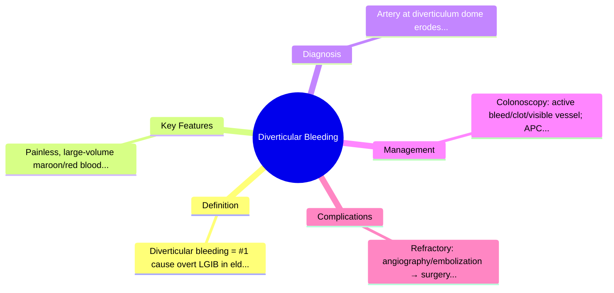
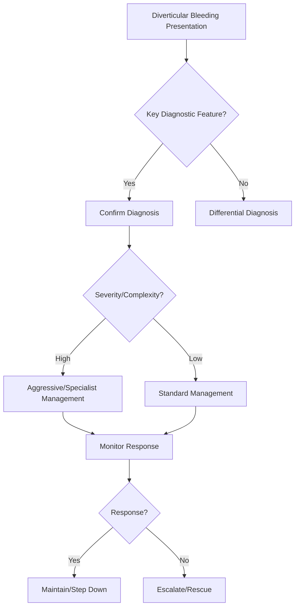

## 1. Learning Objectives
- Define diverticular bleeding: arterial hemorrhage from a diverticulum, most common cause of overt lower GI bleeding in elderly.
- Recognize the presentation: painless, large-volume maroon/bright red rectal bleeding in elderly, often on anticoagulation/NSAIDs; haemodynamically significant.
- Understand the anatomy: diverticula are false pouches at vasa recta penetration points; artery erodes at dome.
- Apply the diagnostic algorithm: CT angiography (if active), colonoscopy (after prep, identify stigmata), tagged RBC scan, angiography.
- Outline management: resuscitation, colonoscopic therapy (clips, bands, injection), angiography with embolization, surgery (segmental colectomy) for refractory.# Diverticular bleeding

## 2. Definition
Diverticular bleeding is acute hemorrhage from a colonic diverticulum, usually arterial, and is a common cause of painless lower GI bleeding in older adults.

## 3. Clinical pattern
- Sudden painless large-volume haematochezia
- Often elderly patient
- May stop spontaneously but can recur

## 4. Pathophysiology
Vasa recta overlying the diverticular neck become thinned/exposed and bleed.

## 5. Investigation
- Assess severity first
- Colonoscopy after stabilization
- CT angiography if active brisk bleed

## 6. Management
- Resuscitation
- Endoscopic therapy if source seen
- IR embolization if ongoing/localized active bleeding
- Surgery rarely if uncontrolled or recurrent severe bleeding

## 7. One-page summary
Diverticular bleeding is a classic **painless large-volume LGIB** in older adults. It may stop spontaneously, but severe active bleeding needs localization and endoscopic/IR control.

## 8. MCQs (10)
1. Pain usually present? **No**.
2. Typical age group? **Older adults**.
3. Common presentation? **Large-volume haematochezia**.
4. Main vessel basis? **Vasa recta**.
5. If active brisk bleeding? **CT angiography**.
6. Many episodes stop? **Spontaneously**.
7. Endoscopic therapy may be used? **Yes**.
8. Recurrent uncontrolled cases may need? **IR/surgery**.
9. Common differential? **Angiodysplasia**.
10. Classic descriptor? **Painless LGIB**.

## 9. SBA Questions (10)
1. Elderly patient with sudden painless maroon stool: likely cause? **Diverticular bleeding**.
2. Main early priority? **Stabilization**.
3. Useful next test in ongoing severe bleed? **CT angiography**.
4. Source visualized endoscopically: next principle? **Endoscopic haemostasis**.
5. Many bleeds stop because? **They self-terminate**.
6. Persistent severe bleeding after failed endoscopy may need? **IR embolization**.
7. Best exam-safe phrase? **Diverticular bleed is a common painless arterial lower GI bleed of older age**.
8. Painful bloody diarrhoea would suggest? **Colitis rather than diverticular bleeding**.
9. Main recurrence issue? **Can rebleed later**.
10. Arterial source explains what? **Large-volume bleeding potential**.

## 10. Flashcards
- Q: Classic symptom pattern?  
  A: Painless large-volume haematochezia.
- Q: Typical age group?  
  A: Older adults.
- Q: Key imaging in active major bleed?  
  A: CT angiography.
- Q: Definitive nonsurgical rescue option?  
  A: IR embolization.
- Q: Many cases do what?  
  A: Stop spontaneously.

## 11. Mind Map

## 12. Flowchart

## 13. Must Know / Should Know / Nice to Know
### Must Know
- Diverticular bleeding = #1 cause overt LGIB in elderly
- Painless, large-volume maroon/red blood
- Artery at diverticulum dome erodes
- Colonoscopy: active bleed/clot/visible vessel; APC/clips/bands
- Refractory: angiography/embolization → surgery

### Should Know
- Right-sided predominance (wider vasa recta)
- ASA/NSAIDs/anticoagulants increase risk
- Rebleeding rate ~20-25% after initial control

### Nice to Know
- CT angio before colonoscopy if active bleed
- Overtube-assisted colonoscopy

## 14. Self-Test Scorecard
- Can I define Diverticular Bleeding correctly? /10
- Can I list 4 key features? /10
- Can I explain the diagnostic approach? /10
- Can I outline the management? /10

**Interpretation:**
- **<35/40** = weak topic
- **35-36/40** = acceptable but insecure
- **37+/40** = exam-ready

## 15. Revision Prompts
- What is Diverticular Bleeding?
- What are the key diagnostic features?
- What is the management approach?

## 16. Answer Key with Explanations

