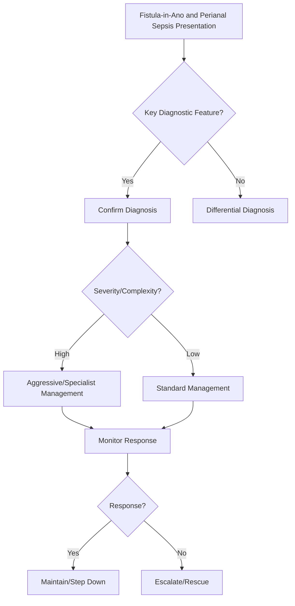

## 1. Learning Objectives
- Define fistula-in-ano: abnormal tract between anal canal/rectum and perianal skin, usually from infected anal gland (cryptoglandular hypothesis).
- Classify by Parks: intersphincteric, transsphincteric, suprasphincteric, extrasphincteric - determines sphincter involvement and surgical risk.
- Recognize perianal abscess: painful fluctuant swelling, fever; fistula forms after drainage (50%).
- Apply diagnosis: clinical exam, MRI pelvis (gold standard for tract mapping), EUA (examination under anaesthesia), endoanal ultrasound.
- Outline management: abscess = incision & drainage; fistula = fistulotomy (low intersphincteric), seton (draining/high), LIFT, advancement flap, fibrin glue, video-assisted (VAAFT).# Fistula-in-ano and perianal sepsis

## 2. Definition
Fistula-in-ano is an abnormal tract between the anal canal and perianal skin, often following cryptoglandular infection. Perianal sepsis refers to abscess and infected perianal disease requiring drainage.

## 3. Clinical clues
- Recurrent perianal pain/swelling
- Purulent discharge
- Fever in abscess
- External opening near anus

## 4. Key principles
- Abscess needs prompt drainage.
- Antibiotics alone are not definitive treatment for established abscess.
- Persistent/recurrent discharge suggests fistula.

## 5. Investigation
- Clinical exam
- MRI or EUA for complex/recurrent disease
- Consider Crohn disease if multiple, complex, or nonhealing tracts

## 6. Management
- Drain abscess urgently
- Fistulotomy/seton or specialist procedure depending tract anatomy
- Control sepsis before definitive repair decisions

## 7. One-page summary
Perianal sepsis is a **surgical drainage problem first**. Fistula-in-ano should be suspected after recurrent abscess or persistent discharge, and complex disease requires mapping.

## 8. MCQs (10)
1. Established abscess main treatment? **Drainage**.
2. Antibiotics alone cure abscess? **No**.
3. Persistent discharge suggests? **Fistula**.
4. Complex fistula imaging? **MRI**.
5. Recurrent complex disease should raise? **Crohn disease possibility**.
6. Main origin of common fistula-in-ano? **Cryptoglandular infection**.
7. Fever suggests? **Sepsis/abscess**.
8. EUA may help? **Yes**.
9. Seton is used in? **Fistula management**.
10. First priority? **Control sepsis**.

## 9. SBA Questions (10)
1. Fluctuant painful perianal mass with fever: next step? **Incision and drainage**.
2. Persistent discharge after abscess drainage: likely diagnosis? **Fistula-in-ano**.
3. MRI is useful mainly for? **Complex tract mapping**.
4. Best exam-safe phrase? **Drain sepsis before planning definitive fistula therapy**.
5. Recurrent multiple tracts should prompt suspicion of? **Crohn disease**.
6. Antibiotics without drainage are insufficient because? **Pus requires source control**.
7. External opening near anus suggests? **Fistulous tract**.
8. Seton purpose? **Maintain drainage/control complex fistula**.
9. Common mechanism? **Cryptoglandular infection**.
10. Specialist exam under anesthesia may help with? **Anatomy definition and treatment planning**.

## 10. Flashcards
- Q: First treatment for perianal abscess?  
  A: Drainage.
- Q: Persistent discharge after abscess suggests?  
  A: Fistula-in-ano.
- Q: Best imaging for complex tracts?  
  A: MRI pelvis.
- Q: Recurrent complex perianal disease suggests what systemic disorder?  
  A: Crohn disease.
- Q: Core principle?  
  A: Sepsis control first.


## 11. Mind Map
```mermaid
mindmap
  root((Fistula-in-Ano and Perianal Sepsis))
    Definition
      Fistula = tract from anal canal to skin (cryptogla...
    Key Features
      Parks classification = sphincter involvement: inte...
    Diagnosis
      Abscess = I&D; Fistula = sphincter-preserving surg...
    Management
      Seton = draining (long-term) or cutting (slow divi...
    Complications
      Complex/Crohn fistula = seton + biologics, not fis...
```

## 12. Flowchart


## 13. Must Know / Should Know / Nice to Know
### Must Know
- Fistula = tract from anal canal to skin (cryptoglandular)
- Parks classification = sphincter involvement: intersphincteric, transsphincteric, suprasphincteric, extrasphincteric
- Abscess = I&D; Fistula = sphincter-preserving surgery
- Seton = draining (long-term) or cutting (slow division)
- Complex/Crohn fistula = seton + biologics, not fistulotomy

### Should Know
- Goodsall's rule: anterior <3cm radial, posterior curved to posterior midline
- MRI = gold standard for tract mapping
- LIFT = ligation intersphincteric fistula tract
- Advancement flap for high transsphincteric

### Nice to Know
- VAAFT (video-assisted anal fistula treatment)
- Stem cell therapy for Crohn fistula
- FiLaC (fistula laser closure)

## 14. Self-Test Scorecard
- Can I define Fistula-in-Ano and Perianal Sepsis correctly? /10
- Can I list 4 key features? /10
- Can I explain the diagnostic approach? /10
- Can I outline the management? /10

**Interpretation:**
- **<35/40** = weak topic
- **35-36/40** = acceptable but insecure
- **37+/40** = exam-ready

## 15. Revision Prompts
- What is Fistula-in-Ano and Perianal Sepsis?
- What are the key diagnostic features?
- What is the management approach?

## 16. Answer Key with Explanations


