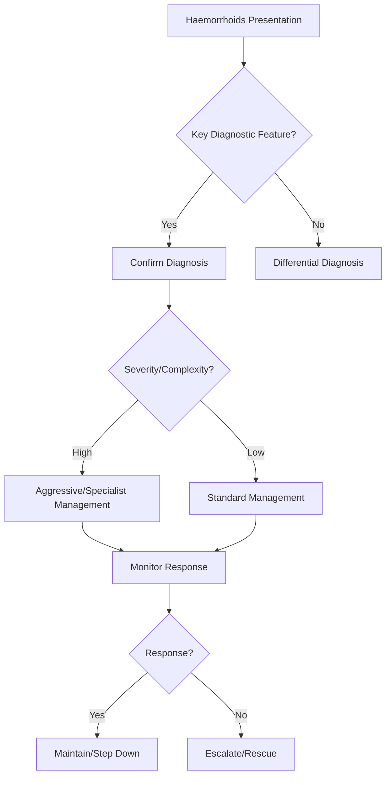

## 1. Learning Objectives
- Define haemorrhoids: pathological enlargement of anal cushions (vascular, connective tissue, smooth muscle) causing bleeding, prolapse, discomfort.
- Classify by Goligher: I (bleed only), II (prolapse reduce spontaneously), III (prolapse require manual reduction), IV (irreducible, strangulated risk).
- Recognize presentation: bright red blood per rectum (BRBPR), prolapse, mucus, pruritus, pain (if thrombosed/strangulated).
- Apply stepwise management: fibre/sitz baths → office procedures (rubber band ligation for I-III) → surgery (Stapled/Excisional haemorrhoidectomy) for III/IV/refractory.
- Distinguish from anal fissure, perianal haematoma, rectal prolapse, malignancy.# Haemorrhoids

## 2. Definition
Haemorrhoids are symptomatic enlargement/displacement of normal anal vascular cushions causing bleeding, prolapse, discomfort, or pruritus.

## 3. Types
- Internal haemorrhoids: above dentate line
- External haemorrhoids: below dentate line

## 4. Clinical clues
- Bright red blood on paper or stool surface
- Prolapse after defecation
- Itching, mucus, discomfort
- Severe pain suggests thrombosis or another diagnosis

## 5. Grading of internal haemorrhoids
- Grade I: bleed without prolapse
- Grade II: prolapse but reduce spontaneously
- Grade III: require manual reduction
- Grade IV: irreducible

## 6. Management
- Fiber, fluids, bowel habit optimization
- Topical symptom relief in selected cases
- Rubber band ligation for suitable internal haemorrhoids
- Surgery for refractory/high-grade disease

## 7. Exam traps
- Attributing all rectal bleeding to haemorrhoids without excluding more serious disease.
- Forgetting severe pain is atypical for uncomplicated internal haemorrhoids.

## 8. One-page summary
Haemorrhoids cause **bright red rectal bleeding and/or prolapse**. The high-yield exam point is to classify internal haemorrhoids by prolapse grade and avoid missing colorectal pathology.

## 9. MCQs (10)
1. Internal haemorrhoids lie? **Above dentate line**.
2. Grade II means? **Prolapse then spontaneous reduction**.
3. Typical blood color? **Bright red**.
4. Severe pain is typical of uncomplicated internal haemorrhoids? **No**.
5. Band ligation is used for? **Internal haemorrhoids**.
6. Grade IV are? **Irreducible**.
7. First-line conservative therapy? **Fiber and bowel habit measures**.
8. Main common symptom? **Bleeding**.
9. Must exclude other causes of rectal bleeding? **Yes**.
10. External haemorrhoids are below? **Dentate line**.

## 10. SBA Questions (10)
1. Bright red blood on paper with prolapsing tissue that reduces spontaneously: grade? **II**.
2. Persistent irreducible prolapse: grade? **IV**.
3. Major exam caution in rectal bleeding? **Do not assume haemorrhoids without assessment**.
4. Initial simple treatment? **Fiber and defecatory habit optimization**.
5. Severe anal pain with swelling suggests? **Thrombosed external haemorrhoid or another painful lesion**.
6. Rubber band ligation is most suited to? **Internal haemorrhoids**.
7. Best exam-safe phrase? **Bleeding haemorrhoids are common, but malignancy must not be missed**.
8. Grade III means? **Manual reduction required**.
9. Mucus and pruritus can occur? **Yes**.
10. Internal haemorrhoids are usually painless because? **Above the somatic pain-sensitive dentate line**.

## 11. Flashcards
- Q: Internal vs external landmark?  
  A: Dentate line.
- Q: Grade III haemorrhoids?  
  A: Need manual reduction.
- Q: Typical blood color?  
  A: Bright red.
- Q: Common office procedure?  
  A: Rubber band ligation.
- Q: Main diagnostic caution?  
  A: Exclude other rectal bleeding causes.


## 12. Mind Map
```mermaid
mindmap
  root((Haemorrhoids))
    Definition
      Haemorrhoids = engorged anal cushions; BRBPR = hal...
    Key Features
      Goligher I (bleed), II (prolapse reducible), III (...
    Diagnosis
      Rubber band ligation = gold standard for I-III...
    Management
      Surgery: Milligan-Morgan (excisional) vs Stapled (...
    Complications
      Thrombosed external = excise if <72h, else conserv...
```

## 13. Flowchart


## 14. Must Know / Should Know / Nice to Know
### Must Know
- Haemorrhoids = engorged anal cushions; BRBPR = hallmark
- Goligher I (bleed), II (prolapse reducible), III (require manual), IV (irreducible)
- Rubber band ligation = gold standard for I-III
- Surgery: Milligan-Morgan (excisional) vs Stapled (PPH) for III/IV
- Thrombosed external = excise if <72h, else conservative

### Should Know
- Doppler-guided haemorrhoidal artery ligation (DG-HAL)
- Strangulated IV = emergency
- Portal hypertension → secondary haemorrhoids

### Nice to Know
- Laser haemorrhoidoplasty
- Radiofrequency ablation
- Sclerotherapy for I

## 15. Self-Test Scorecard
- Can I define Haemorrhoids correctly? /10
- Can I list 4 key features? /10
- Can I explain the diagnostic approach? /10
- Can I outline the management? /10

**Interpretation:**
- **<35/40** = weak topic
- **35-36/40** = acceptable but insecure
- **37+/40** = exam-ready

## 16. Revision Prompts
- What is Haemorrhoids?
- What are the key diagnostic features?
- What is the management approach?

## 17. Answer Key with Explanations


