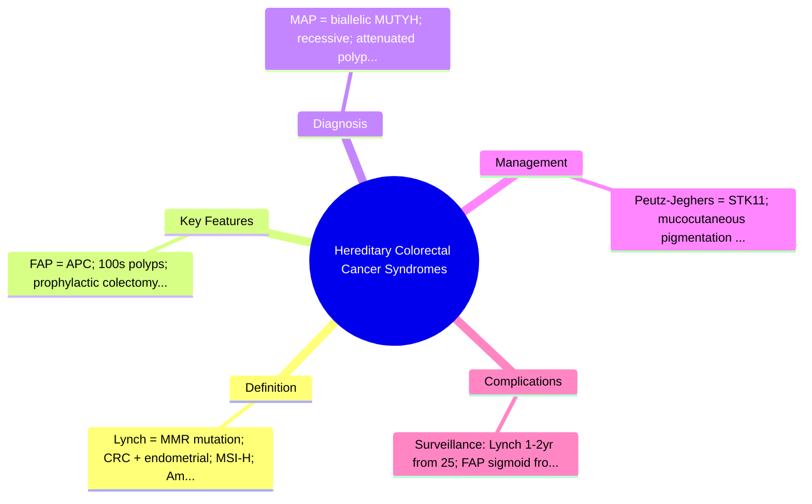
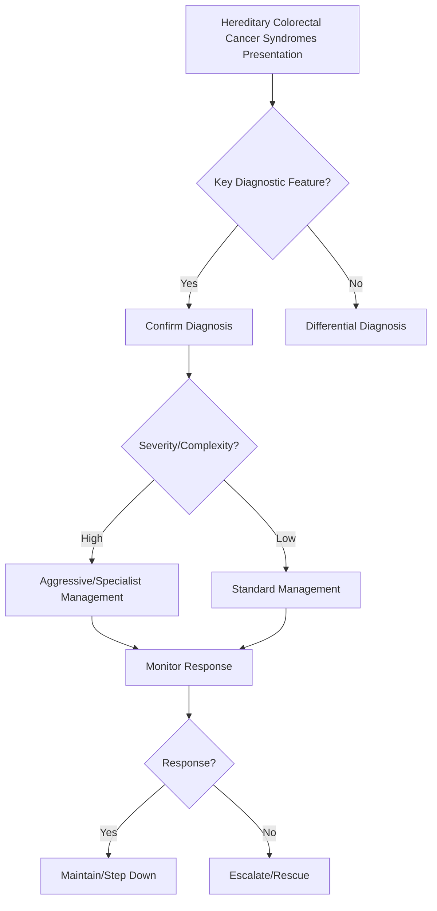

## 1. Learning Objectives
- Distinguish the major hereditary CRC syndromes: Lynch (HNPCC), FAP, MAP, Peutz-Jeghers, Juvenile Polyposis, Cowden.
- Lynch syndrome: MMR gene mutation (MLH1, MSH2, MSH6, PMS2), CRC + endometrial/ovarian/stomach, Amsterdam/Bethesda criteria, MSI-H, IHC loss.
- FAP: APC mutation, 100s-1000s adenomas, colectomy prophylactic, extracolonic (desmoids, duodenal polyps, CHRPE).
- Apply surveillance: Lynch = colonoscopy 1-2 yearly from 25; FAP = sigmoidoscopy from teens, colectomy when polyps >20-30.
- Understand extracolonic surveillance: endometrial, gastric, duodenal, urinary tract, brain (Turcot).# Hereditary colorectal cancer syndromes

## 2. Core syndromes
- Lynch syndrome
- Familial adenomatous polyposis (FAP)
- MUTYH-associated polyposis and other rarer polyposis states

## 3. Clinical clues
- Young-onset colorectal cancer
- Strong family history
- Multiple adenomas/polyps
- Associated extracolonic tumors

## 4. Lynch syndrome
- Mismatch repair defect syndrome
- High risk of colorectal and endometrial cancer
- Often fewer polyps than FAP but earlier cancer tendency

## 5. FAP
- Numerous adenomatous polyps
- Near-certain colorectal cancer risk if untreated
- Colectomy consideration is central

## 6. Management principles
- Detailed family history
- Genetic counseling/testing
- Earlier and intensified surveillance
- Syndrome-specific prophylactic or surgical planning

## 7. One-page summary
Hereditary colorectal cancer syndromes should be suspected with **early age, strong family history, or multiple polyps**. Lynch and FAP are the high-yield exam syndromes.

## 8. MCQs (10)
1. Mismatch repair syndrome? **Lynch syndrome**.
2. Numerous adenomas suggest? **FAP**.
3. Young age of CRC should raise? **Hereditary syndrome concern**.
4. Endometrial cancer association? **Lynch syndrome**.
5. Colectomy discussion is central in? **FAP**.
6. Family history matters? **Yes**.
7. Main non-gastro step? **Genetic counseling**.
8. Polyposis absent in Lynch always? **No, but less dramatic than FAP**.
9. Surveillance starts earlier? **Yes**.
10. Main clue phrase? **Early cancer / multiple polyps / family history**.

## 9. SBA Questions (10)
1. Hundreds of adenomas in teenager: likely syndrome? **FAP**.
2. Early colon cancer with family history of endometrial cancer: likely syndrome? **Lynch**.
3. Important next management step besides treatment of current lesion? **Genetic counseling/testing**.
4. Why is FAP dangerous? **Very high lifetime CRC risk**.
5. Lynch cancers arise despite fewer polyps because? **Accelerated carcinogenesis from MMR defect**.
6. Best exam-safe phrase? **Hereditary syndromes change screening age and intensity**.
7. Family members may need? **Cascade screening**.
8. Multiple adenomas in young patient should not be dismissed as? **Sporadic only**.
9. Extraintestinal tumors are especially important in? **Lynch syndrome**.
10. Prophylactic surgery discussion commonly occurs in? **FAP**.

## 10. Flashcards
- Q: Two classic hereditary CRC syndromes?  
  A: Lynch syndrome and FAP.
- Q: Syndrome with mismatch repair defect?  
  A: Lynch syndrome.
- Q: Syndrome with numerous adenomas?  
  A: FAP.
- Q: Important associated extracolonic cancer in Lynch?  
  A: Endometrial cancer.
- Q: Key management pillar?  
  A: Genetic counseling and intensified surveillance.

## 11. Mind Map

## 12. Flowchart

## 13. Must Know / Should Know / Nice to Know
### Must Know
- Lynch = MMR mutation; CRC + endometrial; MSI-H; Amsterdam criteria
- FAP = APC; 100s polyps; prophylactic colectomy
- MAP = biallelic MUTYH; recessive; attenuated polyposis
- Peutz-Jeghers = STK11; mucocutaneous pigmentation + hamartomas
- Surveillance: Lynch 1-2yr from 25; FAP sigmoid from teens

### Should Know
- Constitutional mismatch repair deficiency (CMMRD) = childhood cancers
- Brain tumours in Lynch (Turcot type 1) vs FAP (Turcot type 2)
- Endometrial surveillance in Lynch women

### Nice to Know
- POLE/POLD1 polymerase proofreading variants
- EPCAM deletion causing Lynch
- Risk-reducing hysterectomy/BSO in Lynch

## 14. Self-Test Scorecard
- Can I define Hereditary Colorectal Cancer Syndromes correctly? /10
- Can I list 4 key features? /10
- Can I explain the diagnostic approach? /10
- Can I outline the management? /10

**Interpretation:**
- **<35/40** = weak topic
- **35-36/40** = acceptable but insecure
- **37+/40** = exam-ready

## 15. Revision Prompts
- What is Hereditary Colorectal Cancer Syndromes?
- What are the key diagnostic features?
- What is the management approach?

## 16. Answer Key with Explanations

