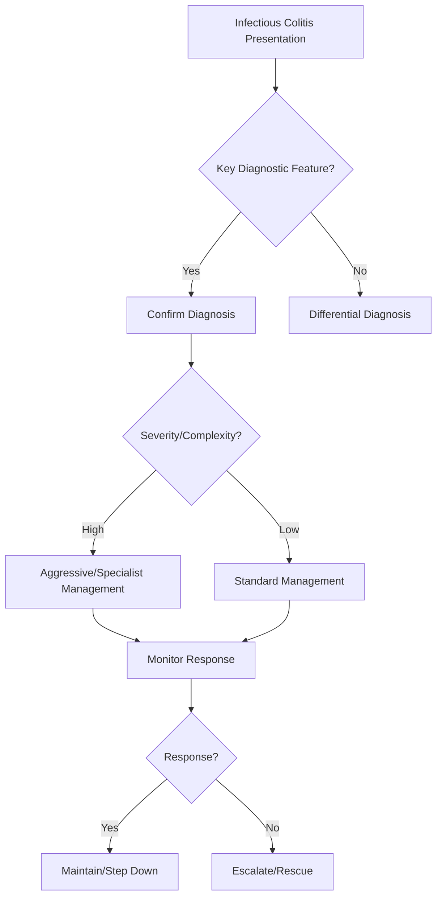

## 1. Learning Objectives
- Classify infectious colitis by pathogen: bacterial (Salmonella, Campylobacter, Shigella, EHEC, C. difficile), viral (Norovirus, Rotavirus), parasitic (Giardia, Entamoeba, Cryptosporidium).
- Recognize clinical patterns: invasive (blood/mucus, fever, tenesmus - Shigella, Campylobacter, EHEC) vs toxin-mediated (watery, no fever - V. cholerae, ETEC, C. diff) vs parasitic (subacute, travellers).
- Apply diagnostic logic: stool culture (bacterial), PCR panel (multiplex), O&P for parasites, C. diff toxin/NAAT, sigmoidoscopy (pseudomembranes).
- Outline management: supportive (fluids), antibiotics for invasive/severe (azithromycin/ciprofloxacin for Campylobacter/Salmonella/Shigella; avoid in EHEC!); metronidazole/vanc for C. diff; metronidazole/tinidazole for Giardia/Entamoeba.
- Identify red flags: HUS (EHEC), toxic megacolon (C. diff), reactive arthritis (Salmonella/Shigella/Campylobacter).# Infectious colitis

## 2. Definition
Infectious colitis is inflammation of the colon due to enteric pathogens causing diarrhoea, abdominal pain, fever, and sometimes bleeding.

## 3. Clinical clues
- Acute onset
- Fever and cramps
- Bloody diarrhoea in invasive infections
- Travel, food exposure, antibiotics, immunocompromise history

## 4. Key differentials
- IBD flare
- Ischaemic colitis
- Microscopic colitis (usually non-bloody)

## 5. Investigations
- Stool culture/PCR
- *C. difficile* testing if antibiotic/hospital exposure
- CBC/CRP and hydration assessment

## 6. Management
- Fluid/electrolyte support
- Pathogen-directed antibiotics only when appropriate
- Avoid reflex steroids before infection exclusion

## 7. One-page summary
Infectious colitis presents with **acute diarrhoea plus inflammatory features**. The exam priority is to distinguish it from **IBD flare** and remember **C. difficile** in antibiotic-associated disease.

## 8. MCQs (10)
1. Onset is often? **Acute**.
2. Antibiotic-associated colitis suggests? ***C. difficile***.
3. Bloody diarrhoea can occur? **Yes**.
4. First diagnostic test group? **Stool microbiology**.
5. Steroids before exclusion of infection are? **Unsafe**.
6. Microscopic colitis is usually? **Non-bloody**.
7. Main treatment base? **Supportive hydration**.
8. Travel history matters? **Yes**.
9. Common mimic? **IBD flare**.
10. Fever supports? **Inflammatory/infective cause**.

## 9. SBA Questions (10)
1. Bloody diarrhoea after recent antibiotics: likely diagnosis? **Infectious colitis/C. difficile concern**.
2. Main investigation? **Stool testing**.
3. Why is infection important to rule out in IBD patient? **Steroid therapy may worsen untreated infection**.
4. Acute fever and cramps help distinguish from? **Functional disease**.
5. Best first management principle? **Rehydration**.
6. Best exam-safe phrase? **Not all bloody diarrhoea in known IBD is an autoimmune flare**.
7. Recent travel raises suspicion for? **Infective enterocolitis**.
8. Stool blood plus systemic upset suggests? **Invasive colitis**.
9. If severe sepsis develops, need? **Urgent escalation**.
10. Colonoscopy is first-line before stool tests in straightforward acute infectious suspicion? **No**.

## 10. Flashcards
- Q: Acute bloody diarrhoea after antibiotics should raise concern for?  
  A: *C. difficile*.
- Q: First key investigation?  
  A: Stool testing.
- Q: Main supportive treatment?  
  A: Fluids/electrolytes.
- Q: Important autoimmune mimic?  
  A: IBD flare.
- Q: Fever and cramps support what broad category?  
  A: Infectious/inflammatory colitis.


## 11. Mind Map
```mermaid
mindmap
  root((Infectious Colitis))
    Definition
      Invasive = blood/mucus/fever: Shigella, Campylobac...
    Key Features
      C. diff = antibiotic-associated, toxin A/B, pseudo...
    Diagnosis
      EHEC O157 = NO antibiotics (↑ HUS risk); HUS = tri...
    Management
      Giardia = travellers, watery, cysts/trophozoites O...
    Complications
      Entamoeba = dysentery, liver abscess...
```

## 12. Flowchart


## 13. Must Know / Should Know / Nice to Know
### Must Know
- Invasive = blood/mucus/fever: Shigella, Campylobacter, EHEC, Salmonella
- C. diff = antibiotic-associated, toxin A/B, pseudomembranes
- EHEC O157 = NO antibiotics (↑ HUS risk); HUS = triad
- Giardia = travellers, watery, cysts/trophozoites O&P
- Entamoeba = dysentery, liver abscess

### Should Know
- C. diff: metronidazole (mild) vs vancomycin/fidaxomicin (severe/recurrent)
- IDSA guidelines for C. diff
- Post-infectious IBS

### Nice to Know
- FMT for recurrent C. diff
- Multiplex PCR panels changing diagnostics
- Cholera: rice-water stool, cholera gravis

## 14. Self-Test Scorecard
- Can I define Infectious Colitis correctly? /10
- Can I list 4 key features? /10
- Can I explain the diagnostic approach? /10
- Can I outline the management? /10

**Interpretation:**
- **<35/40** = weak topic
- **35-36/40** = acceptable but insecure
- **37+/40** = exam-ready

## 15. Revision Prompts
- What is Infectious Colitis?
- What are the key diagnostic features?
- What is the management approach?

## 16. Answer Key with Explanations


