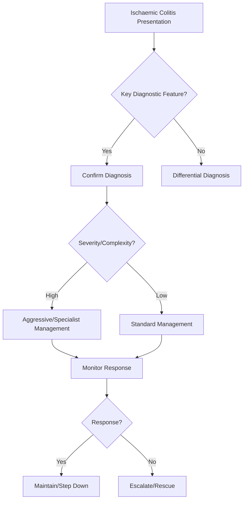

## 1. Learning Objectives
- Define ischaemic colitis: colonic mucosal injury from inadequate perfusion, usually transient, watershed areas (splenic flexure, rectosigmoid).
- Recognize the classic presentation: sudden abdominal pain (often left-sided), followed by rectal bleeding in elderly with vascular risk factors.
- Identify risk factors: age >60, atrial fibrillation, heart failure, hypotension, atherosclerosis, medications (vasoconstrictors, digitalis), surgery (aortic).
- Apply diagnostic imaging: CT abdomen (thumbprinting, wall thickening, target sign); colonoscopy (segmental ulceration, pale mucosa) if stable.
- Outline management: supportive (IV fluids, NBM, correct hypotension), antibiotics (cover enteric flora), surgery for perforation/peritonitis/stricture.# Ischaemic colitis

## 2. Definition
Ischaemic colitis is colonic injury due to reduced perfusion, commonly presenting with abdominal pain followed by rectal bleeding in older or vasculopathic patients.

## 3. Clinical pattern
- Sudden crampy abdominal pain
- Urgency then bloody stool
- Older patient with vascular risk factors or hypotensive trigger

## 4. Investigation
- CBC, CRP, lactate where severe
- CT/CT angiographic context-based assessment
- Endoscopy may help after stabilization

## 5. Severity clues
- Peritonism
- Persistent shock
- Rising lactate
- Extensive disease or gangrene

## 6. Management
- Supportive care and fluids
- Treat precipitating hypoperfusion cause
- Antibiotics in selected moderate-severe cases
- Surgery if perforation, necrosis, or ongoing deterioration

## 7. One-page summary
Ischaemic colitis classically causes **pain before bleeding**, unlike painless diverticular bleeding. Severity ranges from transient mucosal injury to gangrene needing surgery.

## 8. MCQs (10)
1. Classic symptom sequence? **Pain then bleeding**.
2. Typical population? **Older vasculopathic patient**.
3. Severe clue? **Peritonism**.
4. Main management base? **Supportive and cause correction**.
5. Potential end result? **Gangrene/perforation**.
6. Common differential with painless bleed? **Diverticular bleeding**.
7. Hypotension can precipitate? **Yes**.
8. Surgery may be needed if? **Necrosis/perforation**.
9. CT may help? **Yes**.
10. Painless bright bleed is less typical? **Yes**.

## 9. SBA Questions (10)
1. Elderly patient with sudden left-sided pain then blood per rectum: likely diagnosis? **Ischaemic colitis**.
2. Best differentiating clue from diverticular bleed? **Pain precedes bleeding**.
3. Peritonism indicates? **Possible transmural injury/need for surgical review**.
4. Main initial therapy? **Fluids and supportive care**.
5. Major risk factor type? **Vascular disease/hypoperfusion**.
6. Best exam-safe phrase? **Ischaemic colitis is a pain-first bleeding colitis**.
7. Shock and lactate rise imply? **Severe ischemia**.
8. Endoscopy may be useful when? **After stabilization**.
9. Mild cases always need surgery? **No**.
10. Main dangerous complication? **Gangrene/perforation**.

## 10. Flashcards
- Q: Typical sequence in ischaemic colitis?  
  A: Abdominal pain then rectal bleeding.
- Q: Typical patient?  
  A: Older with vascular risk factors.
- Q: Severe red flag?  
  A: Peritonism.
- Q: Key painless bleed differential?  
  A: Diverticular bleed.
- Q: Surgical trigger?  
  A: Necrosis/perforation/deterioration.


## 11. Mind Map
```mermaid
mindmap
  root((Ischaemic Colitis))
    Definition
      Ischaemic colitis = colonic hypoperfusion → mucosa...
    Key Features
      Elderly + vascular risks + sudden L-sided pain → b...
    Diagnosis
      Watershed: splenic flexure (Griffiths point), rect...
    Management
      CT: thumbprinting, wall thickening, target sign...
    Complications
      Mostly transient: supportive care; surgery for gan...
```

## 12. Flowchart


## 13. Must Know / Should Know / Nice to Know
### Must Know
- Ischaemic colitis = colonic hypoperfusion → mucosal injury
- Elderly + vascular risks + sudden L-sided pain → bleeding
- Watershed: splenic flexure (Griffiths point), rectosigmoid (Sudeck point)
- CT: thumbprinting, wall thickening, target sign
- Mostly transient: supportive care; surgery for gangrene/perforation/stricture

### Should Know
- Non-occlusive vs occlusive mesenteric ischaemia
- Right-sided = rare but implies SMA occlusion
- Stricture at 2-4 weeks = possible complication
- Digitalis/vasoconstrictors as precipitants

### Nice to Know
- CT angiography for SMA/SMV occlusion
- Hyperbaric oxygen experimental

## 14. Self-Test Scorecard
- Can I define Ischaemic Colitis correctly? /10
- Can I list 4 key features? /10
- Can I explain the diagnostic approach? /10
- Can I outline the management? /10

**Interpretation:**
- **<35/40** = weak topic
- **35-36/40** = acceptable but insecure
- **37+/40** = exam-ready

## 15. Revision Prompts
- What is Ischaemic Colitis?
- What are the key diagnostic features?
- What is the management approach?

## 16. Answer Key with Explanations


