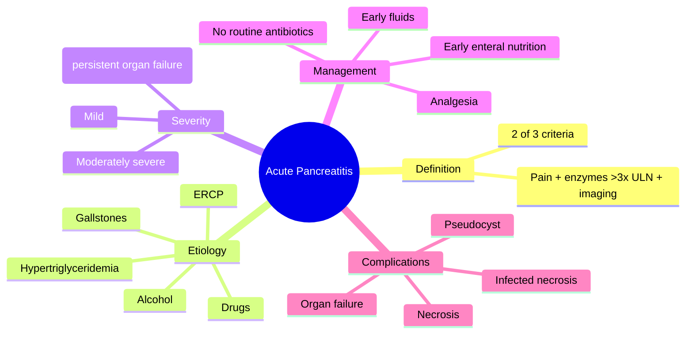
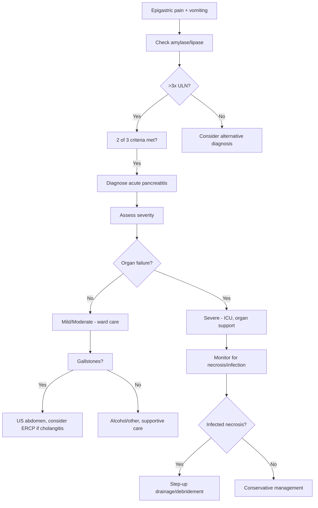

# Acute pancreatitis

## 1. Learning Objectives
- Define acute pancreatitis and apply the 2-of-3 diagnostic criteria.
- Recognize the two commonest etiologies (gallstones, alcohol) and other causes.
- Assess severity using organ failure and local complication markers.
- Outline the principles of early aggressive supportive management.
- Identify indications for urgent ERCP and when antibiotics are appropriate.
- Understand the step-up approach for infected necrosis.

Related: [[../Gastroenterology MOC|Gastroenterology MOC]] · [[../Pancreatic Disorders|Pancreatic Disorders]] · [[Upper GI bleeding resuscitation priorities]]

> [!important]
> Acute pancreatitis is an **acute inflammatory pancreatic emergency**. High-yield exam logic: **diagnostic criteria, gallstones/alcohol causes, severity prediction, aggressive early supportive care, organ failure recognition, and local complications**.

## 2. Definition
Acute pancreatitis is acute inflammation of the pancreas with variable involvement of surrounding tissues and distant organs. It ranges from mild self-limited interstitial disease to **necrotizing severe pancreatitis with multiorgan failure**.

## 3. Relevant Anatomy
- Pancreas is retroperitoneal and divided into head, neck, body, tail.
- Close relation to duodenum and biliary tree explains gallstone-associated disease.
- Peripancreatic tissues can develop fluid collections, necrosis, and infection.

## 4. Physiology
- Exocrine pancreas secretes digestive enzymes in inactive form.
- Acute pancreatitis occurs when enzyme activation and inflammatory injury happen within the gland, leading to autodigestion, edema, necrosis, and systemic inflammatory response.

## 5. Classification
### By morphology
- Interstitial edematous pancreatitis
- Necrotizing pancreatitis

### By severity
- Mild: no organ failure, no local/systemic complications
- Moderately severe: transient organ failure (<48 h) and/or local complications
- Severe: persistent organ failure (>48 h)

## 6. Etiology / Risk Factors
Common causes:
- **Gallstones**
- **Alcohol**

Other causes:
- Hypertriglyceridaemia
- Post-ERCP
- Drugs
- Hypercalcaemia
- Trauma
- Infection (selected cases)
- Autoimmune pancreatitis mimics/overlap in differential context
- Idiopathic

## 7. Pathophysiology
- Premature intrapancreatic enzyme activation triggers acinar injury.
- Local inflammatory cascade causes edema and vascular leak.
- Severe disease causes systemic inflammatory response syndrome (SIRS), capillary leak, hypovolaemia, and **organ failure**.
- Necrosis may become infected later.

## 8. Clinical Features
- Acute severe **epigastric pain**, often radiating to the back
- Nausea and vomiting
- Abdominal tenderness/guarding
- Fever, tachycardia
- Abdominal distension/ileus
- In severe disease: hypotension, hypoxia, oliguria, confusion

## 9. Red Flags / Emergencies
- Shock or persistent hypotension
- Hypoxia/respiratory failure
- Oliguria/AKI
- Confusion
- Rising lactate
- Severe SIRS
- Suspected cholangitis or persistent biliary obstruction
- Signs of infected necrosis or sepsis later in the course

## 10. Investigations
## 11. Diagnostic tests
Diagnosis generally requires **2 of 3**:
1. Typical abdominal pain
2. Amylase or lipase **>3 times upper limit of normal**
3. Imaging consistent with pancreatitis

## 12. Initial workup
- CBC, hematocrit
- U&E, creatinine
- Calcium
- Glucose
- LFTs (ALT elevation may suggest gallstone etiology)
- CRP
- ABG/VBG if severe
- Triglycerides if cause unclear

## 13. Imaging
- Ultrasound to look for **gallstones/biliary dilatation**
- CT abdomen if diagnosis uncertain, deterioration, or complications suspected
- Early CT is not always needed in straightforward mild cases

## 14. Interpretation Framework
### Acute pancreatitis diagnostic logic
- Severe epigastric pain + high amylase/lipase = likely pancreatitis.
- Then ask:
  1. **How severe is it?**
  2. **What caused it?**
  3. **Any organ failure or local complication?**

### Severity logic
Markers suggesting severe disease:
- hypotension
- hypoxia
- rising creatinine/oliguria
- high hematocrit/hemoconcentration
- high CRP
- persistent SIRS
- necrosis on imaging

### Gallstone clue logic
Think gallstone pancreatitis when there is:
- biliary colic history
- abnormal LFTs, especially ALT rise
- ultrasound evidence of stones
- jaundice/cholangitis or CBD obstruction features

## 15. Diagnosis
Diagnosis is made when at least 2 of the classic 3 criteria are met.

## 16. Differential Diagnosis
- Perforated peptic ulcer
- Biliary colic/cholecystitis/cholangitis
- Mesenteric ischemia
- Intestinal obstruction
- Inferior MI
- Aortic pathology

## 17. Management
## 18. Early priorities
- Admit and assess severity repeatedly
- Aggressive IV fluid resuscitation early
- Oxygen if needed
- Adequate analgesia
- Monitor urine output, vitals, and labs
- Correct electrolytes and glucose abnormalities

## 19. Cause-specific issues
- Gallstone pancreatitis: evaluate for cholangitis/ongoing obstruction
- **Urgent ERCP is indicated for cholangitis or persistent biliary obstruction**, not for every case
- Cholecystectomy planning is needed after gallstone pancreatitis once stabilized (timing depends on severity)

## 20. Nutrition
- Early enteral feeding is preferred when feasible
- Avoid prolonged unnecessary starvation in stable patients

## 21. Antibiotics
- **Not routine** in uncomplicated sterile pancreatitis
- Use if there is cholangitis, extrapancreatic infection, or infected necrosis suspicion/confirmation

## 22. Critical care / escalation
- ICU/HDU if organ failure or severe systemic illness
- Multidisciplinary care for necrosis/collections/infection

## 23. Local complication management principles
- Fluid collections may require observation or drainage depending on type, symptoms, infection, and maturity
- Infected necrosis often requires a step-up approach with drainage/debridement decisions

## 24. Complications
### Systemic
- Shock
- ARDS/respiratory failure
- AKI
- Hypocalcaemia and metabolic disturbance
- Sepsis

### Local
- Pancreatic necrosis
- Pseudocyst/fluid collections
- Infected necrosis
- Hemorrhage
- Splenic/portal vein thrombosis in some cases

## 25. Common Exam / Viva Traps
- Diagnosing pancreatitis without the 2-of-3 rule
- Ordering urgent CT in every mild obvious case
- Giving antibiotics routinely without infection
- Forgetting to look for **gallstones and cholangitis**
- Saying ERCP is required for all gallstone pancreatitis
- Ignoring severity assessment and organ failure

## 26. One-Page Summary
- Acute pancreatitis presents with severe epigastric pain radiating to the back.
- Diagnosis needs **2 of 3**: pain, enzymes >3× ULN, imaging.
- Common causes: **gallstones and alcohol**.
- Severe disease causes **SIRS, shock, respiratory failure, AKI, necrosis**.
- Treatment is mainly **early fluids, analgesia, oxygen, monitoring, and enteral nutrition**.
- Antibiotics are **not routine**.
- ERCP is for **cholangitis or persistent biliary obstruction**, not all cases.

## 27. Revision Prompts
- State the 2-of-3 diagnostic rule.
- Name the two commonest causes.
- List markers of severe pancreatitis.
- When is urgent ERCP indicated?
- Why are antibiotics not given routinely?

## 28. MCQs (10)
1. The two commonest causes of acute pancreatitis are:
   - A. Coeliac disease and IBS
   - B. Gallstones and alcohol
   - C. Hemorrhoids and fissure
   - D. Asthma and COPD
   - **Answer: B**

2. Diagnosis of acute pancreatitis usually requires:
   - A. All three classical criteria always
   - B. Two of three classical criteria
   - C. Lipase alone in every patient
   - D. CT in every patient on day 1
   - **Answer: B**

3. A classic pain description is:
   - A. Retrosternal burning after meals only
   - B. Epigastric pain radiating to the back
   - C. Right iliac fossa pain only
   - D. Painless jaundice only
   - **Answer: B**

4. Serum enzymes support diagnosis when they are typically:
   - A. Slightly low
   - B. >3 times upper limit of normal
   - C. Always normal
   - D. Replaced by HbA1c
   - **Answer: B**

5. Which is an indication for urgent ERCP in gallstone pancreatitis?
   - A. Every mild case
   - B. Cholangitis
   - C. Any back pain
   - D. Mild nausea only
   - **Answer: B**

6. Antibiotics in acute pancreatitis are:
   - A. Routine for all patients
   - B. Not routine unless infection/cholangitis/infected necrosis suspected
   - C. Used only for pain relief
   - D. Mandatory before enzymes return
   - **Answer: B**

7. Persistent organ failure defines:
   - A. Mild pancreatitis
   - B. Severe pancreatitis
   - C. IBS
   - D. Chronic pancreatitis only
   - **Answer: B**

8. An initial imaging test to look for gallstones is:
   - A. Abdominal ultrasound
   - B. Colonoscopy
   - C. CT brain
   - D. Echo
   - **Answer: A**

9. A local complication of acute pancreatitis is:
   - A. Pseudocyst
   - B. Achalasia
   - C. Mallory-Weiss tear
   - D. Esophageal varix
   - **Answer: A**

10. Early management should include:
   - A. IV fluids and analgesia
   - B. Immediate colectomy
   - C. Routine laxatives
   - D. Steroids for all
   - **Answer: A**

## 29. SBA Questions (10)
1. A 47-year-old man presents with sudden severe epigastric pain radiating to the back and vomiting. Lipase is markedly elevated. Most likely diagnosis?
   - A. Acute pancreatitis
   - B. IBS
   - C. Hemorrhoids
   - D. Ulcerative colitis
   - **Answer: A**

2. Which patient with pancreatitis most needs ICU-level concern?
   - A. Mild pain with normal vitals
   - B. Persistent hypotension and hypoxia
   - C. Bloating only
   - D. Isolated constipation
   - **Answer: B**

3. A patient has acute pancreatitis and jaundice with fever. Best next principle?
   - A. Ignore biliary tree
   - B. Consider cholangitis and urgent biliary decompression pathway
   - C. Diagnose IBS-D
   - D. Start chemotherapy
   - **Answer: B**

4. Which is the preferred nutritional principle in many cases once feasible?
   - A. Prolonged starvation for everyone
   - B. Early enteral nutrition
   - C. No feeding for 4 weeks
   - D. IV glucose only forever
   - **Answer: B**

5. Which lab clue may suggest gallstone pancreatitis?
   - A. Elevated ALT
   - B. Low MCV only
   - C. High TSH
   - D. Low troponin
   - **Answer: A**

6. Which statement about CT is most accurate?
   - A. It is mandatory immediately in every obvious mild case
   - B. It is useful when diagnosis is uncertain or complications are suspected
   - C. It replaces lipase in all cases
   - D. It should never be used
   - **Answer: B**

7. Which local complication may become infected later?
   - A. Pancreatic necrosis
   - B. IBS-C
   - C. Functional dyspepsia
   - D. GERD
   - **Answer: A**

8. A patient with pancreatitis improves clinically and has no cholangitis. Which statement about antibiotics is correct?
   - A. Routine antibiotics are still required
   - B. Antibiotics are not routinely indicated
   - C. Antibiotics cure pain directly
   - D. Antibiotics replace fluids
   - **Answer: B**

9. The diagnostic framework for pancreatitis requires how many of the classic 3 criteria?
   - A. 1
   - B. 2
   - C. 3 mandatory
   - D. 4
   - **Answer: B**

10. A patient with severe pancreatitis becomes oliguric and confused. This indicates:
   - A. Mild disease
   - B. Organ failure and severe disease
   - C. Functional bowel disease
   - D. Pure biliary colic
   - **Answer: B**

## 30. Flashcards
- Q: Two commonest causes of acute pancreatitis?  
  A: Gallstones and alcohol.
- Q: Diagnostic rule for pancreatitis?  
  A: 2 of 3—typical pain, enzymes >3× ULN, compatible imaging.
- Q: Classic pain radiation?  
  A: To the back.
- Q: Initial imaging to look for gallstones?  
  A: Abdominal ultrasound.
- Q: When is urgent ERCP indicated?  
  A: Cholangitis or persistent biliary obstruction.
- Q: Are antibiotics routine?  
  A: No.
- Q: What defines severe pancreatitis?  
  A: Persistent organ failure >48 hours.
- Q: Two local complications?  
  A: Necrosis and pseudocyst/fluid collections.

## 31. Answer Key Pearls
- The common exam structure is: **confirm diagnosis → grade severity → identify cause → support the patient → treat complications**.
- Do not miss the distinction between **gallstone pancreatitis** and **cholangitis with obstruction**, because that determines ERCP urgency.

## 32. Mind Map

## 33. Flowchart

## 34. Must Know / Should Know / Nice to Know
### Must Know
- 2-of-3 diagnostic criteria
- Gallstones and alcohol as top causes
- Early aggressive fluid resuscitation
- Severity = organ failure
- ERCP only for cholangitis/obstruction
- No routine antibiotics

### Should Know
- Atlanta classification (mild/moderate/severe)
- Step-up approach for infected necrosis
- Early enteral vs parenteral nutrition
- Ranson/APACHE-II/BISAP scoring
- Gallstone pancreatitis: cholecystectomy timing

### Nice to Know
- Specific fluid types (RL vs NS) debates
- Novel biomarkers
- Endoscopic necrosectomy techniques
- Genetic pancreatitis variants

## 35. Self-Test Scorecard
- Can I state the 2-of-3 diagnostic rule from memory? /10
- Can I list 5 causes of acute pancreatitis? /10
- Can I name 4 markers of severe disease? /10
- Can I explain when ERCP is indicated? /10
- Can I describe the step-up approach for necrosis? /10

**Interpretation:**
- **<35/50** = weak topic
- **35-44/50** = acceptable but insecure
- **45+/50** = exam-ready
