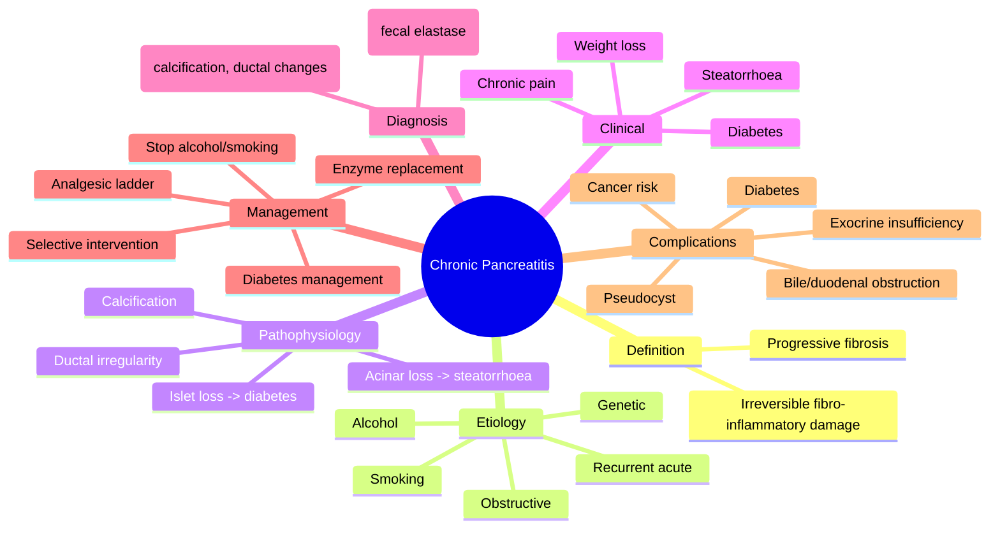
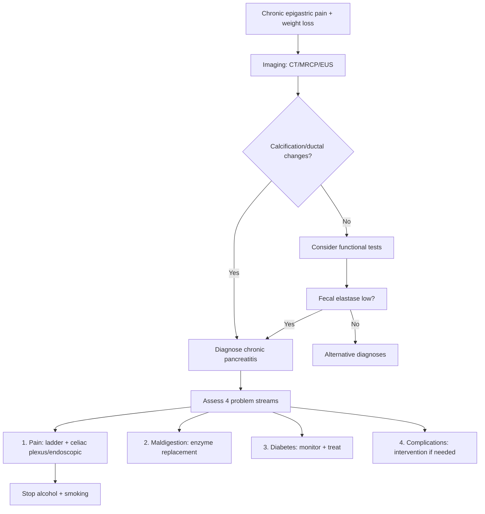

# Chronic pancreatitis

## 1. Learning Objectives
- Define chronic pancreatitis as irreversible progressive fibro-inflammatory pancreatic damage.
- Recognize the characteristic clinical triad: chronic pain, exocrine insufficiency, and diabetes.
- Identify key etiologies (alcohol, smoking, genetic, obstructive) and their prevention.
- Interpret imaging findings (calcification, ductal changes) and functional tests.
- Outline the multi-stream management: pain, maldigestion, diabetes, and selective intervention.

Related: [[../Gastroenterology MOC|Gastroenterology MOC]] · [[../Pancreatic Disorders|Pancreatic Disorders]] · [[Pancreatic exocrine insufficiency]]

> [!important]
> Chronic pancreatitis is a progressive fibro-inflammatory pancreatic disorder. High-yield exam logic: **chronic pain, calcification/ductal changes, exocrine insufficiency, diabetes, complications, alcohol/smoking risk, and long-term supportive plus interventional management**.

## 2. Definition
Chronic pancreatitis is chronic inflammatory destruction and fibrosis of the pancreas leading to irreversible structural damage and loss of exocrine and endocrine function.

## 3. Anatomy and Physiology
- Progressive fibrosis distorts pancreatic ducts and parenchyma.
- Exocrine failure causes maldigestion.
- Endocrine failure leads to diabetes.

## 4. Etiology / Risk Factors
- Alcohol
- Smoking
- Recurrent acute pancreatitis
- Genetic causes in selected patients
- Obstructive ductal disease
- Autoimmune pancreatitis in differential/overlap settings
- Idiopathic cases

## 5. Pathophysiology
- Repeated injury and fibrosis produce ductal irregularity, calcification, and chronic pain.
- Progressive loss of acinar tissue causes steatorrhoea and weight loss.
- Islet loss causes diabetes.

## 6. Clinical Features
- Recurrent or persistent epigastric pain radiating to the back
- Weight loss
- Steatorrhoea
- Bloating, maldigestion
- Diabetes in advanced disease
- Opioid dependence risk in chronic painful disease

## 7. Red Flags / Complications
- Jaundice from biliary compression
- Pancreatic pseudocyst
- GI obstruction
- Severe malnutrition
- Pancreatic cancer concern in selected patients

## 8. Investigations
- Bloods: glucose, nutritional markers
- Fecal elastase or other exocrine assessment if available
- CT/MRCP/EUS for calcification, ductal dilation, structural changes
- Consider vitamin deficiency assessment

## 9. Interpretation Framework
### Diagnostic clue logic
Think chronic pancreatitis when there is:
- chronic pancreatic-type pain
- steatorrhoea/weight loss
- imaging showing calcification or ductal changes
- diabetes with pancreatic structural disease

### Major consequence logic
- **Pain** problem
- **Maldigestion** problem
- **Diabetes** problem
- **Mechanical complication** problem

## 10. Diagnosis
Diagnosis is based on compatible symptoms plus structural pancreatic changes and/or evidence of functional loss.

## 11. Differential Diagnosis
- Pancreatic adenocarcinoma
- Peptic ulcer disease
- Functional dyspepsia
- Biliary pain
- Chronic mesenteric ischemia

## 12. Management
## 13. General principles
- Stop alcohol
- Stop smoking
- Nutritional optimization
- Analgesic ladder

## 14. Exocrine failure
- Pancreatic enzyme replacement
- Fat-soluble vitamin support when needed

## 15. Diabetes/endocrine failure
- Monitor and treat pancreatogenic diabetes appropriately

## 16. Interventional options
- Endoscopic or surgical therapy for ductal obstruction, stones, strictures, or complications in selected cases

## 17. Complications
- Pancreatic exocrine insufficiency
- Diabetes mellitus
- Pseudocyst
- Bile duct or duodenal obstruction
- Chronic pain syndrome

## 18. Common Exam / Viva Traps
- Missing pancreatic cancer as a differential
- Treating steatorrhoea without enzyme replacement
- Forgetting smoking cessation
- Ignoring diabetes risk

## 19. One-Page Summary
- Chronic pancreatitis = irreversible fibro-inflammatory pancreatic damage.
- Main consequences: **pain, steatorrhoea, diabetes, local complications**.
- Investigate with imaging and functional assessment.
- Management: **alcohol/smoking cessation, analgesia, nutrition, enzyme replacement, selective intervention**.

## 20. Revision Prompts
- List classic features of chronic pancreatitis.
- Why does steatorrhoea occur?
- What are the major long-term complications?

## 21. MCQs (10)
1. Chronic pancreatitis causes irreversible loss of:
   - A. Pancreatic structure and function
   - B. Colonic villi
   - C. Liver lobules only
   - D. Esophageal peristalsis only
   - **Answer: A**
2. A classic symptom is:
   - A. Steatorrhoea
   - B. Hemoptysis
   - C. Dysuria
   - D. Diplopia
   - **Answer: A**
3. A common risk factor is:
   - A. Alcohol
   - B. Seasonal rhinitis
   - C. Migraine
   - D. Appendectomy history only
   - **Answer: A**
4. Exocrine failure leads to:
   - A. Maldigestion
   - B. Hyperthyroidism
   - C. Stroke
   - D. Achalasia
   - **Answer: A**
5. A common imaging clue is:
   - A. Calcification/ductal changes
   - B. Pleural plaque
   - C. Aortic aneurysm only
   - D. Esophageal web
   - **Answer: A**
6. Long-term endocrine complication is:
   - A. Diabetes
   - B. Asthma
   - C. Epilepsy
   - D. Psoriasis
   - **Answer: A**
7. Key management includes:
   - A. Alcohol and smoking cessation
   - B. Routine ERCP for all
   - C. Ignore nutrition
   - D. Never use enzymes
   - **Answer: A**
8. A major differential is:
   - A. Pancreatic adenocarcinoma
   - B. Hemorrhoids
   - C. Anal fissure
   - D. Urticaria
   - **Answer: A**
9. Pancreatic enzyme replacement helps:
   - A. Exocrine insufficiency
   - B. Hypertension only
   - C. Acute appendicitis
   - D. Achalasia
   - **Answer: A**
10. Chronic pancreatitis belongs to which group here?
   - A. Chronic pancreatic disease
   - B. Lower GI bleeding
   - C. Oesophageal disorders
   - D. Hepatology
   - **Answer: A**

## 22. SBA Questions (10)
1. A 49-year-old man with long alcohol history has chronic epigastric pain radiating to the back, weight loss, and oily stools. Most likely diagnosis?
   - A. Chronic pancreatitis
   - B. IBS
   - C. GERD
   - D. UC
   - **Answer: A**
2. Which feature most strongly supports chronic pancreatitis over functional disease?
   - A. Pancreatic calcification on imaging
   - B. Stress-related pain only
   - C. Normal intake only
   - D. Normal stools only
   - **Answer: A**
3. Best treatment principle for steatorrhoea in chronic pancreatitis?
   - A. Pancreatic enzyme replacement
   - B. Stop all food
   - C. Routine antibiotics
   - D. Colonoscopy
   - **Answer: A**
4. Which endocrine complication may develop?
   - A. Diabetes mellitus
   - B. Graves disease
   - C. Addison disease
   - D. Acromegaly
   - **Answer: A**
5. Which lifestyle factor independently worsens chronic pancreatitis progression?
   - A. Smoking
   - B. Reading books
   - C. Short sleep only
   - D. Tea drinking alone
   - **Answer: A**
6. Which important differential must not be missed?
   - A. Pancreatic adenocarcinoma
   - B. Tension headache
   - C. Otitis externa
   - D. Asthma
   - **Answer: A**
7. Which imaging modality may help define ductal anatomy?
   - A. MRCP
   - B. EEG
   - C. DXA
   - D. Spirometry
   - **Answer: A**
8. Which problem cluster best summarizes chronic pancreatitis?
   - A. Pain, maldigestion, diabetes, complications
   - B. Rash, cough, dysuria, hemoptysis
   - C. Syncope, murmur, edema, cyanosis
   - D. Tremor, rigidity, bradykinesia, falls
   - **Answer: A**
9. Endoscopic or surgical therapy is mainly considered for:
   - A. Obstructive/complicated structural disease
   - B. Every asymptomatic patient
   - C. IBS only
   - D. Coeliac disease only
   - **Answer: A**
10. A patient with chronic pancreatitis and jaundice should raise concern for:
   - A. Biliary compression or malignancy
   - B. Simple IBS
   - C. Pure reflux
   - D. Hemorrhoids
   - **Answer: A**

## 23. Flashcards
- Q: Core pathology of chronic pancreatitis?  
  A: Progressive irreversible fibro-inflammatory damage.
- Q: Three major outcomes?  
  A: Pain, exocrine insufficiency, diabetes.
- Q: Common imaging clue?  
  A: Calcification/ductal abnormalities.
- Q: Main treatment for steatorrhoea?  
  A: Pancreatic enzyme replacement.
- Q: Two crucial lifestyle measures?  
  A: Stop alcohol and stop smoking.

## 24. Answer Key Pearls
- Chronic pancreatitis answers score well when you separate **pain**, **malabsorption**, and **diabetes** into different management streams.

## 25. Mind Map

## 26. Flowchart

## 27. Must Know / Should Know / Nice to Know
### Must Know
- Irreversible fibrosis = chronic pancreatitis
- Triad: pain, steatorrhoea, diabetes
- Alcohol + smoking = main risk factors
- Enzyme replacement for steatorrhoea
- Pancreatic cancer as differential
- Imaging: calcification/ductal changes

### Should Know
- Genetic causes (PRSS1, SPINK1, CFTR)
- Analgesic ladder + celiac plexus block
- MRCP/EUS for ductal anatomy
- Pseudocyst drainage criteria
- Pancreatogenic diabetes management

### Nice to Know
- Total pancreatectomy with islet autotransplant
- Advanced endoscopic therapies
- Long-term cancer surveillance
- Nutritional management details

## 28. Self-Test Scorecard
- Can I state the 3 major consequences from memory? /10
- Can I list 4 etiologies of chronic pancreatitis? /10
- Can I explain when to use MRCP vs CT? /10
- Can I describe the 4-stream management approach? /10
- Can I name 3 complications? /10

**Interpretation:**
- **<35/50** = weak topic
- **35-44/50** = acceptable but insecure
- **45+/50** = exam-ready
