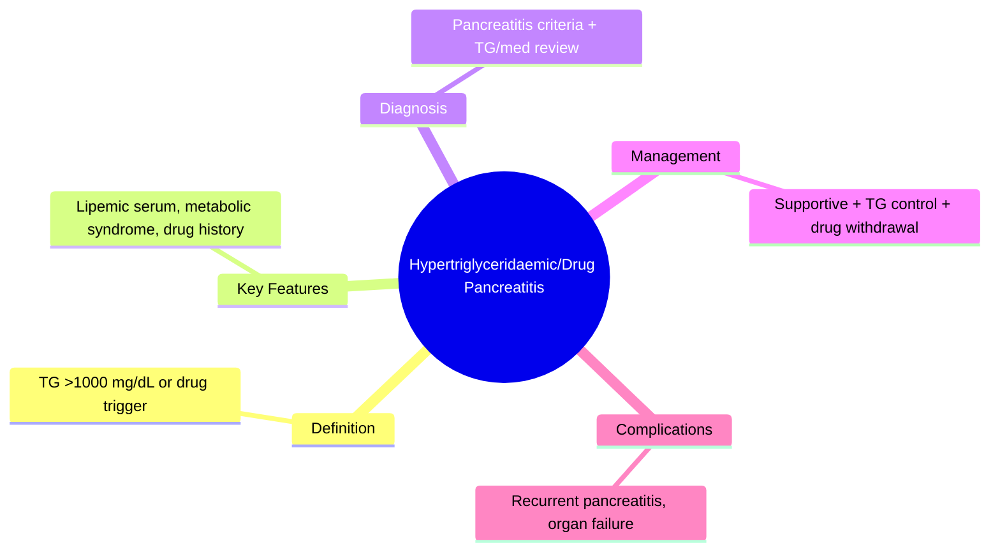
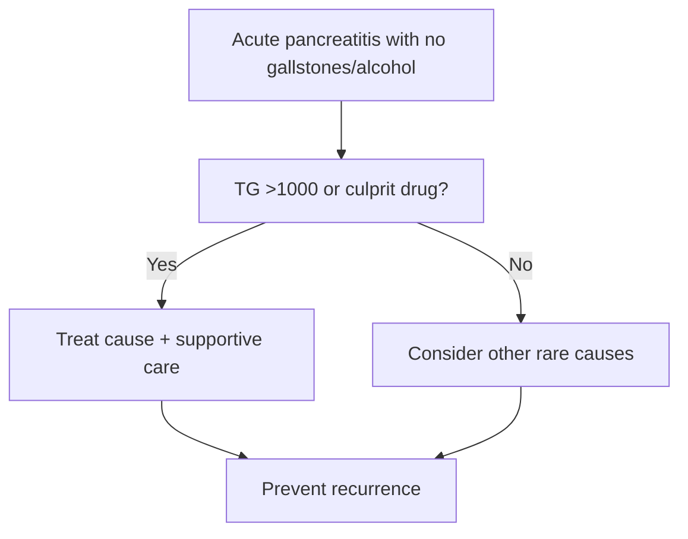

## 1. Learning Objectives
- Recognize hypertriglyceridaemia and medications as pancreatitis causes when gallstones/alcohol are absent.
- Apply the triglyceride threshold (>1000 mg/dL) for causation attribution.
- Identify common drug culprits (azathioprine, valproate, thiazides, estrogens, corticosteroids).
- Manage severe hypertriglyceridaemic pancreatitis supportively and address the underlying dyslipidaemia.
- Review and withdraw offending medications promptly to prevent recurrence.# Hypertriglyceridaemic and drug-induced pancreatitis

Related: [[../Gastroenterology MOC|Gastroenterology MOC]] · [[../Pancreatic Disorders|Pancreatic Disorders]] · [[Acute pancreatitis]]

> [!important]
> In a patient with pancreatitis and no gallstones or alcohol history, always think of **hypertriglyceridaemia and drugs**. The exam focus is: **recognize non-biliary etiology, confirm pancreatitis, check triglycerides/medication history, manage severe disease supportively, and treat the underlying cause to prevent recurrence**.

## 2. Definition
This refers to acute pancreatitis caused by marked hypertriglyceridaemia or by a medication trigger.

## 3. Anatomy and Physiology
- Pathology still affects the pancreas through premature enzyme activation and inflammatory injury.
- In hypertriglyceridaemia, excess triglyceride-rich lipoproteins contribute to toxic free fatty acid generation and microcirculatory injury.
- Drug-induced disease may result from direct toxicity, hypersensitivity, metabolic effects, or secondary triglyceride elevation.

## 4. Etiology / Risk Factors
### Hypertriglyceridaemia
- Very high triglycerides, often **>1000 mg/dL** (about **>11.3 mmol/L**) strongly suggest causation
- Diabetes mellitus
- Obesity/metabolic syndrome
- Alcohol excess
- Pregnancy
- Familial dyslipidaemias

### Drug causes
Important examples often cited in exams:
- azathioprine
- valproate
- thiazides
- some antiretrovirals
- estrogens
- corticosteroids in selected contexts
- other culprit drugs depending on case history

## 5. Pathophysiology
- Hypertriglyceridaemia causes pancreatic ischemic/toxic injury via free fatty acids and increased blood viscosity.
- Drug-induced pancreatitis may involve direct toxicity or immune-mediated injury.

## 6. Clinical Features
- Similar to other acute pancreatitis: severe epigastric pain, vomiting, tenderness
- Lipemic serum may be a clue in hypertriglyceridaemia
- Features of diabetes or metabolic syndrome may coexist
- Drug history may reveal recent initiation or dose change

## 7. Red Flags
- Organ failure
- Shock, hypoxia, AKI
- Recurrent pancreatitis in known dyslipidaemia
- Severe hyperglycaemia/diabetic ketoacidosis overlap

## 8. Investigations
- Standard pancreatitis tests: amylase/lipase, CBC, U&E, creatinine, calcium, CRP
- **Serum triglycerides early**
- Glucose/HbA1c as appropriate
- LFTs and ultrasound to exclude gallstones
- Careful medication review

## 9. Interpretation Framework
### Hypertriglyceridaemic clue logic
Suspect it when:
- no obvious gallstones/alcohol trigger
- triglycerides are markedly elevated
- recurrent attacks or metabolic syndrome present

### Drug-induced clue logic
Think drug-induced disease when:
- temporal relationship to culprit medication exists
- other common causes are excluded
- recurrence follows re-exposure historically

## 10. Diagnosis
Diagnosis requires standard acute pancreatitis criteria plus evidence supporting hypertriglyceridaemia or a culprit drug as the likely trigger.

## 11. Differential Diagnosis
- Gallstone pancreatitis
- Alcohol-related pancreatitis
- Autoimmune pancreatitis
- Hypercalcaemia-related pancreatitis
- Peptic ulcer perforation or biliary disease

## 12. Management
## 13. Acute pancreatitis care
- IV fluids
- Analgesia
- Monitoring and escalation if severe
- Nutritional support when appropriate

## 14. Cause-specific treatment
### Hypertriglyceridaemia
- Glycaemic control if diabetic
- Low-fat strategy after stabilization
- Lipid-lowering long-term prevention
- In selected severe cases, insulin-based metabolic control may be used in appropriate settings

### Drug-induced pancreatitis
- **Stop the suspected culprit drug**
- Avoid re-challenge unless clearly justified and safe
- Choose alternative therapy when possible

## 15. Complications
- Same as other acute pancreatitis: necrosis, organ failure, infection, pseudocyst
- Recurrence if metabolic/drug cause not addressed

## 16. Common Exam / Viva Traps
- Forgetting triglyceride measurement
- Missing drug history
- Labeling as idiopathic too early
- Not excluding gallstones with LFTs/ultrasound

## 17. One-Page Summary
- Consider hypertriglyceridaemia/drugs when pancreatitis cause is not obvious.
- Hypertriglyceridaemia usually requires **markedly high TG** levels.
- A detailed medication history is essential.
- Management = standard pancreatitis support + remove/treat underlying trigger.

## 18. Revision Prompts
- When should triglycerides be checked in pancreatitis?
- Name 4 drug causes.
- How do you distinguish this from gallstone pancreatitis?
- What prevents recurrence?

## 19. MCQs (10)
1. A major metabolic cause of pancreatitis is:
   - A. Hypertriglyceridaemia
   - B. Hypokalemia
   - C. Coeliac disease
   - D. Hemorrhoids
   - **Answer: A**
2. A key investigation in unexplained pancreatitis is:
   - A. Serum triglycerides
   - B. PSA
   - C. EEG
   - D. Spirometry
   - **Answer: A**
3. Which may cause drug-induced pancreatitis?
   - A. Azathioprine
   - B. Saline only
   - C. Iron tablets always
   - D. Antacids only
   - **Answer: A**
4. Hypertriglyceridaemia-related pancreatitis should prompt assessment for:
   - A. Diabetes/metabolic syndrome
   - B. Asthma severity
   - C. Stroke scale
   - D. Cataract
   - **Answer: A**
5. First step in suspected drug-induced pancreatitis is:
   - A. Continue the culprit drug
   - B. Stop the suspected offending drug
   - C. Ignore drug history
   - D. Start laxatives
   - **Answer: B**
6. Which cause must still be excluded before labeling as non-biliary?
   - A. Gallstones
   - B. Migraine
   - C. Hemorrhoids
   - D. GERD
   - **Answer: A**
7. Main acute management remains:
   - A. Supportive pancreatitis care
   - B. Appendectomy
   - C. Immediate colectomy
   - D. Routine antibiotics for all
   - **Answer: A**
8. Which clue may suggest hypertriglyceridaemia?
   - A. Lipemic serum
   - B. Dysphagia
   - C. Melena only
   - D. Finger clubbing
   - **Answer: A**
9. Recurrence prevention depends on:
   - A. Treating the underlying lipid/drug trigger
   - B. PPI alone
   - C. Aspirin only
   - D. Ignoring etiology
   - **Answer: A**
10. Pancreatitis with normal ultrasound and high triglycerides suggests:
   - A. Hypertriglyceridaemic pancreatitis
   - B. UC flare
   - C. Anal fissure
   - D. IBS-C
   - **Answer: A**

## 20. SBA Questions (10)
1. A 34-year-old man with diabetes presents with pancreatitis and triglycerides 19 mmol/L. Most likely etiology?
   - A. Hypertriglyceridaemic pancreatitis
   - B. Coeliac disease
   - C. GERD
   - D. Crohn disease
   - **Answer: A**
2. A woman develops pancreatitis shortly after starting azathioprine. Best next step?
   - A. Continue same drug
   - B. Stop the suspected offending drug
   - C. Ignore the timing
   - D. Start warfarin
   - **Answer: B**
3. Which investigation helps exclude gallstone cause in unexplained pancreatitis?
   - A. LFTs and ultrasound
   - B. EEG
   - C. Colonoscopy only
   - D. DXA scan
   - **Answer: A**
4. Hypertriglyceridaemic pancreatitis is strongly suggested when triglycerides are:
   - A. Markedly elevated
   - B. Very low
   - C. Always normal
   - D. Not measurable
   - **Answer: A**
5. A patient with pancreatitis has milky serum and uncontrolled diabetes. Most likely issue?
   - A. Hypertriglyceridaemia
   - B. Portal hypertension
   - C. GERD
   - D. Hemorrhoids
   - **Answer: A**
6. Which management principle prevents recurrence in drug-induced pancreatitis?
   - A. Re-exposure to culprit drug
   - B. Avoid culprit and use an alternative
   - C. Daily NSAIDs
   - D. Ignore medications
   - **Answer: B**
7. Which is true?
   - A. These causes do not need etiology workup
   - B. Triglycerides and medication history are important
   - C. Ultrasound is never useful
   - D. Organ failure never occurs
   - **Answer: B**
8. Severe disease is managed primarily by:
   - A. Supportive care and monitoring
   - B. Routine ERCP
   - C. Immediate liver biopsy
   - D. Steroids for all
   - **Answer: A**
9. Which is a recognized culprit class in selected cases?
   - A. Thiazides
   - B. Topical saline
   - C. Fiber supplements only
   - D. Vitamin D only
   - **Answer: A**
10. A patient with recurrent pancreatitis and no stones should have what specifically reviewed?
   - A. Triglycerides and drug exposure
   - B. Only chest X-ray
   - C. Only ECG
   - D. Only colonoscopy
   - **Answer: A**

## 21. Flashcards
- Q: Key metabolic cause of pancreatitis?  
  A: Hypertriglyceridaemia.
- Q: Key history item in unexplained pancreatitis?  
  A: Medication review.
- Q: Major first step in suspected drug-induced pancreatitis?  
  A: Stop the suspected culprit drug.
- Q: Important alternative cause to exclude first?  
  A: Gallstones.
- Q: Recurrence prevention in hypertriglyceridaemia?  
  A: Lipid control and metabolic risk treatment.

## 22. Mind Map

## 23. Flowchart

## 24. Must Know / Should Know / Nice to Know
### Must Know
- TG >1000 = strong causation
- Azathioprine/valproate/thiazides = common drugs
- Lipemic serum clue
- Stop offending drug

### Should Know
- Insulin for severe hyperTG
- Fibrates post-acute
- Differential when both TG and drugs present

### Nice to Know
- Plasmapheresis in extreme TG
- Genetic TG disorders

## 25. Self-Test Scorecard
- Can I define Hypertriglyceridaemic/Drug Pancreatitis correctly? /10
- Can I list 4 key features/clinical clues? /10
- Can I explain the diagnostic approach? /10
- Can I outline the management principles? /10

**Interpretation:**
- **<35/40** = weak topic
- **35-36/40** = acceptable but insecure
- **37+/40** = exam-ready

## 26. Answer Key Pearls
- In viva, say: **unexplained pancreatitis = check triglycerides, calcium, drugs, and exclude gallstones**.
