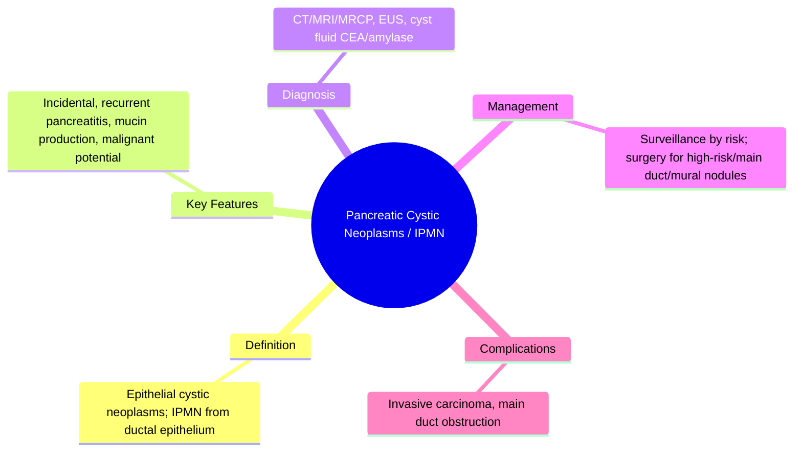
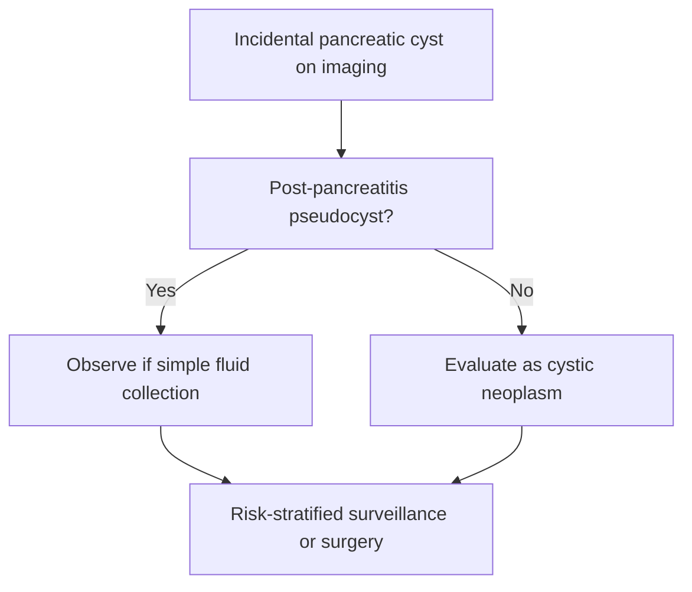

## 1. Learning Objectives
- Distinguish pancreatic cystic neoplasms from post-pancreatitis pseudocysts.
- Classify IPMN by duct involvement: main duct, branch duct, mixed type.
- Recognize high-risk features for malignant transformation: main duct dilatation, mural nodules, obstructive jaundice, concerning growth.
- Apply surveillance vs surgical referral criteria based on size, morphology, and risk features.
- Understand the Sendai/Fukuoka guidelines for IPMN management.# Pancreatic cystic neoplasms and IPMN

Related: [[../Gastroenterology MOC|Gastroenterology MOC]] · [[../Pancreatic Disorders|Pancreatic Disorders]] · [[Pancreatic adenocarcinoma]]

> [!important]
> Not all pancreatic cysts are pseudocysts. The exam challenge is to distinguish **post-pancreatitis collections** from **true cystic neoplasms**, especially **IPMN**, because some carry malignant potential and require surveillance or surgery.

## 2. Definition
Pancreatic cystic neoplasms are epithelial cyst-forming pancreatic tumors. IPMN (intraductal papillary mucinous neoplasm) arises from the pancreatic duct system and produces mucin with variable malignant risk.

## 3. Anatomy and Physiology
- Lesions may arise in the main pancreatic duct or branch ducts.
- Mucin-producing lesions can dilate ducts and predispose to malignancy.

## 4. Classification
Important practical groups:
- **IPMN**
  - Main duct IPMN
  - Branch duct IPMN
  - Mixed type
- Other cystic neoplasms such as mucinous cystic neoplasm/serous cystic lesions in broader differential framing

## 5. Etiology / Clinical Significance
- Increasingly detected incidentally on imaging
- Some are benign/low-risk
- Others are premalignant or malignant

## 6. Pathophysiology
- Neoplastic epithelium forms cystic lesions.
- Main duct or high-risk mucinous lesions may progress to invasive carcinoma.

## 7. Clinical Features
- Often incidental
- Recurrent pancreatitis in some IPMN cases
- Abdominal discomfort
- Weight loss or jaundice if advanced/malignant transformation

## 8. Red Flags
- Main pancreatic duct involvement/dilatation
- Mural nodules/solid components
- Obstructive jaundice
- Concerning growth or malignant imaging features

## 9. Investigations
- Pancreatic protocol CT or MRI/MRCP
- EUS for cyst characterization and risk assessment
- Selected cyst fluid analysis depending on case and protocol

## 10. Interpretation Framework
### Pseudocyst vs cystic neoplasm logic
Think pseudocyst when:
- recent pancreatitis history
- fluid collection pattern after inflammation

Think cystic neoplasm when:
- no pancreatitis history
- duct communication/mucinous features
- mural nodules or suspicious neoplastic imaging clues

### IPMN risk logic
Higher concern with:
- main duct involvement
- jaundice
- mural nodules/solid components
- suspicious cytology or clear malignant imaging pattern

## 11. Diagnosis
Diagnosis depends on imaging pattern, duct involvement, EUS findings, and risk stratification for malignant potential.

## 12. Differential Diagnosis
- Pancreatic pseudocyst
- Walled-off necrosis
- Pancreatic adenocarcinoma with cystic change
- Other benign cystic lesions

## 13. Management
## 14. General principles
- Distinguish inflammatory collection from neoplasm
- Assess malignant risk
- MDT decision-making is important

## 15. Observation / surveillance
- Appropriate for selected lower-risk cystic lesions
- Imaging follow-up depends on cyst type/size/risk features

## 16. Surgical consideration
- Higher-risk IPMN or suspicious lesions may need resection

## 17. Complications
- Malignant transformation
- Pancreatitis episodes
- Obstruction/jaundice
- Anxiety and surveillance burden

## 18. Common Exam / Viva Traps
- Calling every pancreatic cyst a pseudocyst
- Forgetting malignant potential of IPMN
- Ignoring main duct involvement as a high-risk clue

## 19. One-Page Summary
- Pancreatic cystic lesions are not always inflammatory collections.
- IPMN is a ductal mucinous neoplasm with malignant potential.
- Main duct disease and suspicious features increase concern.
- Imaging + EUS help determine surveillance vs surgery.

## 20. Revision Prompts
- How do you distinguish pseudocyst from cystic neoplasm?
- Why is main duct IPMN important?
- What features suggest higher malignant risk?

## 21. MCQs (10)
1. IPMN stands for:
   - A. Intraductal papillary mucinous neoplasm
   - B. Inflammatory pancreatic mucosal necrosis
   - C. Intestinal perforation mucin node
   - D. Idiopathic pancreatic motor neuropathy
   - **Answer: A**
2. A major exam principle is that not all pancreatic cysts are:
   - A. Pseudocysts
   - B. Neoplasms
   - C. Duct lesions
   - D. Fluid structures
   - **Answer: A**
3. A high-risk clue in IPMN is:
   - A. Main duct involvement
   - B. Normal duct caliber
   - C. No symptoms ever
   - D. Normal pancreas after appendicitis
   - **Answer: A**
4. Best imaging modality to show ductal communication is often:
   - A. MRI/MRCP
   - B. EEG
   - C. Echo
   - D. Spirometry
   - **Answer: A**
5. Which tool helps detailed cyst characterization?
   - A. EUS
   - B. ECG
   - C. DXA
   - D. Audiogram
   - **Answer: A**
6. IPMN may present with:
   - A. Recurrent pancreatitis
   - B. Hemorrhoids only
   - C. Migraine only
   - D. Dysuria only
   - **Answer: A**
7. A major complication is:
   - A. Malignant transformation
   - B. Achalasia
   - C. UC flare
   - D. Anal fissure
   - **Answer: A**
8. Which feature suggests neoplasm rather than pseudocyst?
   - A. No pancreatitis history with suspicious ductal features
   - B. Recent severe pancreatitis with fluid-only collection
   - C. Resolving inflammatory collection pattern
   - D. Known pancreatic necrosis only
   - **Answer: A**
9. Low-risk lesions may be managed by:
   - A. Surveillance
   - B. Immediate colectomy
   - C. Routine ERCP for all
   - D. No imaging follow-up ever
   - **Answer: A**
10. Pancreatic cystic neoplasms belong to which group here?
   - A. Pancreatic neoplasia
   - B. Lower GI bleeding
   - C. Hepatology
   - D. Oesophageal disorders
   - **Answer: A**

## 22. SBA Questions (10)
1. A 70-year-old woman has an incidental pancreatic cyst on MRI with main duct dilatation and mural nodularity. Most important concern?
   - A. High-risk IPMN with malignant potential
   - B. Simple IBS
   - C. Hemorrhoids
   - D. GERD
   - **Answer: A**
2. A patient has a pancreatic cyst 2 months after severe pancreatitis. First major differential distinction?
   - A. Pseudocyst versus cystic neoplasm
   - B. Asthma versus COPD
   - C. UC versus IBS
   - D. Stroke versus seizure
   - **Answer: A**
3. Which investigation best evaluates ductal communication and cyst morphology?
   - A. MRI/MRCP
   - B. EEG
   - C. DXA
   - D. Spirometry
   - **Answer: A**
4. Which feature increases concern for malignancy?
   - A. Mural nodules
   - B. Completely benign stable simple inflammatory pattern only
   - C. Recent pancreatitis fluid collection alone
   - D. Normal pancreas
   - **Answer: A**
5. Which test may further characterize a suspicious cyst?
   - A. EUS
   - B. ECG only
   - C. ABG only
   - D. Plain knee X-ray
   - **Answer: A**
6. Which statement is correct?
   - A. IPMN can have malignant potential
   - B. IPMN is always harmless
   - C. All cysts are pseudocysts
   - D. MRI has no role
   - **Answer: A**
7. Which clinical event may occur with IPMN?
   - A. Recurrent pancreatitis
   - B. Hemoptysis
   - C. Hematuria
   - D. Diplopia
   - **Answer: A**
8. Lower-risk lesions may often need:
   - A. Surveillance rather than immediate surgery
   - B. Immediate colectomy
   - C. No follow-up ever
   - D. Automatic ERCP
   - **Answer: A**
9. Which major alternative diagnosis must be considered in a post-pancreatitis cystic lesion?
   - A. Pseudocyst
   - B. Migraine
   - C. Rhinitis
   - D. Eczema
   - **Answer: A**
10. Why is main duct IPMN more important in exams?
   - A. It generally carries higher malignant concern
   - B. It always resolves spontaneously
   - C. It is unrelated to ducts
   - D. It is always benign
   - **Answer: A**

## 23. Flashcards
- Q: What does IPMN stand for?  
  A: Intraductal papillary mucinous neoplasm.
- Q: Major conceptual distinction for pancreatic cysts?  
  A: Pseudocyst vs cystic neoplasm.
- Q: High-risk clue in IPMN?  
  A: Main duct involvement or mural nodules.
- Q: Good imaging for ductal anatomy?  
  A: MRI/MRCP.
- Q: Further characterization tool?  
  A: EUS.

## 24. Mind Map

## 25. Flowchart

## 26. Must Know / Should Know / Nice to Know
### Must Know
- IPMN = ductal origin, mucin-producing
- Main duct = higher malignant risk
- Mural nodules/solid component = worry
- Surveillance by Sendai/Fukuoka criteria

### Should Know
- Branch duct IPMN size thresholds
- Cyst fluid CEA/amylase interpretation
- MCN vs SCN differentiation

### Nice to Know
- GNAS/KRAS mutations
- Surgery for main duct/high-risk

## 27. Self-Test Scorecard
- Can I define Pancreatic Cystic Neoplasms / IPMN correctly? /10
- Can I list 4 key features/clinical clues? /10
- Can I explain the diagnostic approach? /10
- Can I outline the management principles? /10

**Interpretation:**
- **<35/40** = weak topic
- **35-36/40** = acceptable but insecure
- **37+/40** = exam-ready

## 28. Answer Key Pearls
- High marks come from saying: **“not all pancreatic cysts are pseudocysts; IPMN may be premalignant, so risk-stratified surveillance or surgery is needed.”**
