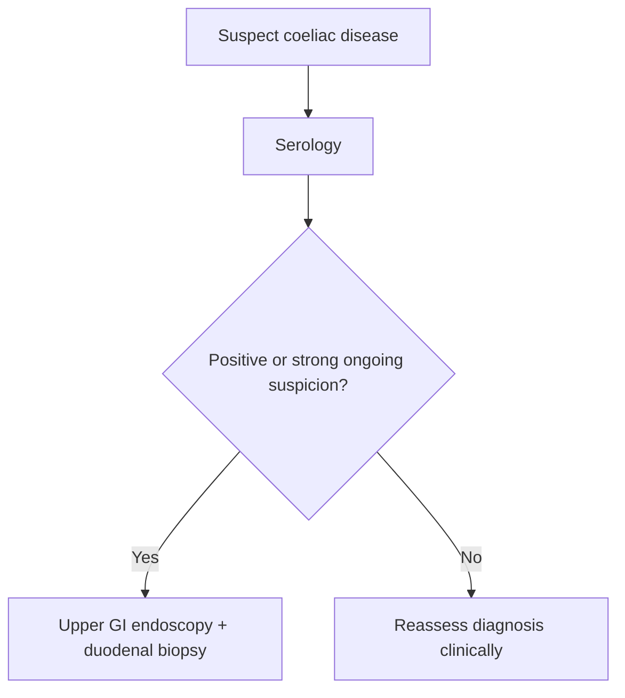

# Coeliac serology and duodenal biopsy

Related: [[../Gastroenterology MOC|Gastroenterology MOC]] · [[../Endoscopy and Gastroenterology Investigations|Endoscopy and Gastroenterology Investigations]] · [[../Small Bowel Malabsorption and Coeliac Disease/Coeliac disease|Coeliac disease]]

> [!important]
> Coeliac diagnosis is a **combined serology-and-histology pathway** in many adults. The exam point is knowing that neither suspicion nor one test result alone should be handled casually.

## Learning Objectives
- Explain the roles of coeliac serology and duodenal biopsy.
- Recognize when coeliac disease should be suspected.
- Understand why biopsy often remains important.
- Avoid common testing pitfalls.

## Why Suspect Coeliac Disease?
Clues include:
- chronic diarrhoea
- weight loss
- malabsorption/steatorrhoea
- iron-deficiency anaemia
- bloating
- associated autoimmune context in some patients

## Coeliac Serology
Serology is a valuable screening/triage tool in suspected coeliac disease.

### Strengths
- non-invasive
- useful early test in malabsorption/IDA/chronic diarrhoea pathways

### Limitations
- should be interpreted with the clinical picture
- does not always replace tissue diagnosis in adults when suspicion is significant

## Duodenal Biopsy
Duodenal biopsy provides histologic confirmation and remains a key step when adult coeliac disease is strongly suspected or serology is positive and definitive confirmation is needed.

## Interpretation Framework
1. Suspect coeliac clinically.
2. Use serology as an early diagnostic tool.
3. If the pathway remains suspicious/positive, proceed to upper GI endoscopy with duodenal biopsy as appropriate.
4. Interpret histology and serology together.

## Red Flags / High-Yield Contexts
- unexplained IDA
- chronic diarrhoea with weight loss
- nutrient deficiency / malabsorptive clues
- persistent symptoms despite alternative treatment

## Cautions
- do not diagnose or exclude coeliac on vague symptoms alone
- do not forget coeliac in IDA/chronic diarrhoea workups
- biopsy sampling and clinical context matter if the diagnosis remains important

## FCPS/MRCP High-Yield Points
- Coeliac disease is a classic cause of iron-deficiency anaemia and chronic diarrhoea.
- Serology is important, but biopsy is often central to confirmation in adults.
- Think of coeliac in malabsorption even without dramatic diarrhea.

## Common Viva Traps
- Forgetting coeliac screening in IDA.
- Assuming one test result in isolation ends the diagnostic process.
- Treating malabsorption symptoms without seeking cause.

## One-Page Summary
- Coeliac disease should be considered in **IDA, chronic diarrhoea, weight loss, and malabsorption**.
- Serology is a key early test.
- Duodenal biopsy often provides confirmation in adult pathways.

## Mind Map
- Coeliac testing
  - clinical suspicion
  - serology
  - endoscopy
  - duodenal biopsy
  - interpret together

## Flowchart

## Revision Prompts
- Why does coeliac matter in IDA?
- What is the role of serology?
- Why is duodenal biopsy often important?

## MCQs (10)
1. A classic cause of iron-deficiency anaemia in Gastroenterology is:
   - A. Coeliac disease
   - B. Otitis media
   - C. Migraine
   - D. Asthma
   - **Answer: A**
2. Coeliac serology is:
   - A. A useful non-invasive test
   - B. A colonoscopy
   - C. A pancreatic enzyme
   - D. A liver biopsy
   - **Answer: A**
3. Duodenal biopsy is important because it:
   - A. Can provide histologic confirmation
   - B. Diagnoses hemorrhoids
   - C. Measures CRP
   - D. Replaces history
   - **Answer: A**
4. Coeliac should be suspected in:
   - A. Chronic diarrhoea and weight loss
   - B. One headache only
   - C. Pure tinnitus
   - D. Cataract
   - **Answer: A**
5. Which statement is correct?
   - A. Serology and biopsy are interpreted together in important adult pathways
   - B. Symptoms alone are always enough
   - C. IDA excludes coeliac disease
   - D. Biopsy never matters
   - **Answer: A**
6. A common trap is:
   - A. Forgetting coeliac in iron-deficiency anaemia
   - B. Asking about stool pattern
   - C. Considering malabsorption
   - D. Using serology
   - **Answer: A**
7. Which symptom cluster is high yield?
   - A. Steatorrhoea, weight loss, IDA
   - B. Ear pain, cough, rash
   - C. Myopia, tinnitus, rhinitis
   - D. Wrist pain only
   - **Answer: A**
8. Main role of duodenal biopsy?
   - A. Tissue confirmation
   - B. Treat GERD
   - C. Diagnose CRC
   - D. Measure stool blood
   - **Answer: A**
9. Which is a key principle?
   - A. Do not isolate one test result from the clinical context
   - B. Symptoms never matter
   - C. Histology is irrelevant
   - D. Serology is useless
   - **Answer: A**
10. Best summary?
   - A. Coeliac diagnosis is a clinic-serology-histology pathway
   - B. Only biopsy matters and symptoms never matter
   - C. Only symptoms matter
   - D. Coeliac never causes diarrhea
   - **Answer: A**

## SBA Questions (10)
1. A 34-year-old woman has chronic diarrhoea, bloating, and iron-deficiency anaemia. Best next diagnostic principle?
   - A. Coeliac serology should be considered early
   - B. Treat with laxatives only
   - C. Ignore anemia
   - D. Diagnose IBS immediately
   - **Answer: A**
2. Serology is positive and coeliac remains the likely diagnosis in an adult. Best next principle?
   - A. Duodenal biopsy pathway for confirmation where appropriate
   - B. Ear swab
   - C. No further evaluation ever
   - D. Colonoscopy only always
   - **Answer: A**
3. Which is a dangerous error?
   - A. Missing coeliac disease in an IDA workup
   - B. Considering malabsorption
   - C. Asking about weight loss
   - D. Linking symptoms and labs
   - **Answer: A**
4. Which statement is true?
   - A. Coeliac disease may present with malabsorption or unexplained IDA
   - B. Coeliac disease never causes anemia
   - C. Coeliac always has obvious steatorrhoea
   - D. Biopsy cannot help
   - **Answer: A**
5. Why is biopsy useful?
   - A. It adds histologic confirmation
   - B. It replaces all need for serology
   - C. It only tests pancreatic disease
   - D. It treats the disorder directly
   - **Answer: A**
6. Which symptom pattern should raise suspicion?
   - A. Chronic loose stool with weight loss
   - B. Acute earache
   - C. Isolated knee pain
   - D. Dry scalp
   - **Answer: A**
7. Best exam phrase?
   - A. Coeliac diagnosis in adults often integrates serology with duodenal biopsy
   - B. Biopsy is never needed
   - C. IDA rules coeliac out
   - D. Chronic diarrhea is irrelevant
   - **Answer: A**
8. Which is a high-yield non-GI lab clue?
   - A. Iron-deficiency anaemia
   - B. Raised troponin
   - C. Low platelets only
   - D. Hyperuricemia
   - **Answer: A**
9. What is the first principle?
   - A. Think of coeliac when the clinical clues fit
   - B. Never consider it without overt bleeding
   - C. Diagnose by guesswork only
   - D. Ignore malabsorption clues
   - **Answer: A**
10. Best summary?
   - A. Coeliac testing is high yield in the right clinical setting and should not be forgotten
   - B. Coeliac is too rare to test for
   - C. Anemia excludes it
   - D. Diarrhea means infection only
   - **Answer: A**

## Flashcards
- Q: Name 3 common clues to coeliac disease.
  A: Chronic diarrhoea, iron-deficiency anaemia, weight loss/malabsorption.
- Q: What is the role of coeliac serology?
  A: Non-invasive diagnostic screening/triage.
- Q: Why is duodenal biopsy important?
  A: It can confirm the diagnosis histologically.
- Q: What common trap must be avoided?
  A: Forgetting coeliac in IDA workups.
- Q: Is coeliac diagnosis based on symptoms alone?
  A: No.

## Must Know / Should Know / Nice to Know
### Must Know
- tTG-IgA + total IgA = first-line serology; deamidated gliadin peptides if IgA deficient
- Duodenal biopsy (Marsh classification) required for adult diagnosis despite positive serology
- Biopsy: ≥4 from D2 + 1-2 from bulb; orient specimens for pathologist
- Serology + biopsy + clinical response to GFD = diagnostic triad; do NOT start GFD before testing

### Should Know
- Appropriate use criteria
- Patient preparation requirements
- Alternative investigations

### Nice to Know
- Emerging technologies
- Cost-effectiveness data
- AI-assisted interpretation

## Self-Test Scorecard
- Can I state the key indication for this investigation? /10
- Can I name 3 quality metrics? /10
- Can I explain the interpretation framework? /10
- Can I outline the limitations? /10

**Interpretation:**
- **<35/40** = weak topic
- **35-36/40** = acceptable but insecure
- **37+/40** = exam-ready

## Answer Key with Explanations

