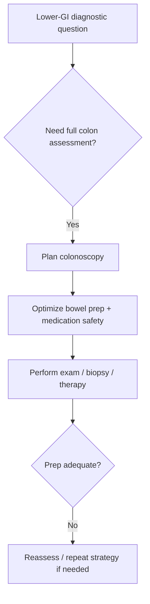

# Colonoscopy indications and bowel preparation

Related: [[../Gastroenterology MOC|Gastroenterology MOC]] · [[../Endoscopy and Gastroenterology Investigations|Endoscopy and Gastroenterology Investigations]] · [[Flexible sigmoidoscopy vs colonoscopy selection]] · [[../Symptom Patterns and Diagnostic Approach/Change in bowel habit with colorectal cancer red flags|Change in bowel habit with colorectal cancer red flags]] · [[../Lower GI Bleeding, Colorectal, and Anal Disorders/Colorectal cancer|Colorectal cancer]]

> [!important]
> Colonoscopy is indicated when full colonic assessment is needed for **bleeding, change in bowel habit, colorectal cancer suspicion, inflammatory bowel disease assessment, or post-polyp surveillance**. Good bowel preparation is essential because a poorly prepared colonoscopy can miss important pathology.

## Learning Objectives
- List major indications for colonoscopy.
- Explain why bowel preparation matters.
- Distinguish diagnostic and surveillance uses.
- Recognize safety and preparation principles.

## Definition
Colonoscopy is endoscopic examination of the colon, usually allowing full mucosal assessment, biopsy, and selected therapeutic interventions.

## Major Indications
### Diagnostic indications
- rectal bleeding or occult blood-loss evaluation
- persistent change in bowel habit
- iron-deficiency anaemia with lower-GI concern
- suspicion of colorectal cancer
- chronic diarrhea / colitis / IBD assessment
- abnormal imaging requiring direct colonic evaluation

### Surveillance / follow-up indications
- post-polypectomy surveillance
- selected IBD or other established-risk follow-up pathways

### Therapeutic / procedural indications
- biopsy
- selected polypectomy or endoscopic treatment depending on lesion and context

## Why Bowel Preparation Matters
Adequate bowel cleansing:
- improves mucosal visibility
- increases lesion detection
- reduces missed polyps/cancer
- lowers the chance of incomplete or repeated procedures

Poor preparation can make a technically performed colonoscopy diagnostically weak.

## Preparation Principles
- clear instructions before the procedure
- bowel-cleansing regimen adherence
- dietary restriction guidance as appropriate
- medication review, especially anticoagulants/antiplatelets and diabetes medications
- hydration attention, especially in frail or renal-risk patients

## Red Flags / High-Urgency Contexts
- significant lower-GI bleeding
- suspected colorectal cancer
- iron-deficiency anaemia with bowel symptoms
- persistent change in bowel habit in older adults
- severe colitis / alarming diarrhea depending on stability and setting

## Contraindication / Caution Logic
- unstable patients may need resuscitation and tailored timing
- perforation/peritonitis concern changes the pathway
- bowel-prep burden and sedation risk matter in frail patients

## Interpretation Framework
### Practical algorithm
1. Define the diagnostic question.
2. Decide whether a full-colon examination is needed.
3. Optimize bowel preparation and medication safety.
4. Perform colonoscopy for diagnosis, biopsy, or therapy as indicated.
5. If prep is poor or symptoms persist, do not over-trust a limited examination.

## Differential / Clinical Use-Cases
- colorectal cancer
- polyps / adenomas
- IBD / colitis
- microscopic disease requiring biopsy in appropriate contexts
- bleeding source identification

## Management Link
Colonoscopy often sits inside pathways for:
- colorectal cancer suspicion
- occult/lower GI bleeding
- chronic diarrhea / colitis workup
- surveillance after prior lesion removal

## FCPS/MRCP High-Yield Points
- Colonoscopy is central to colorectal cancer evaluation.
- Poor prep = poor exam.
- Change in bowel habit plus IDA/weight loss is a classic colonoscopy trigger.
- Medication review and hydration matter in preparation.

## Common Viva Traps
- Forgetting that poor prep may invalidate reassurance.
- Sending high-risk lower-GI cases for incomplete evaluation.
- Ignoring anticoagulants and comorbidity when planning prep/procedure.

## One-Page Summary
- Major uses: **bleeding, bowel change, cancer suspicion, IBD, surveillance**.
- Good bowel prep is essential for safe and meaningful colonoscopy.
- Poor prep can miss cancer or important lesions.
- Colonoscopy is both diagnostic and often therapeutic.

## Mind Map
- Colonoscopy
  - indications
    - bleeding
    - bowel change
    - CRC suspicion
    - IBD
    - surveillance
  - prep
    - cleansing
    - diet instructions
    - medication review
    - hydration
  - cautions
    - frailty
    - anticoagulants
    - poor prep

## Flowchart

## Revision Prompts
- Name 5 indications for colonoscopy.
- Why is bowel preparation so important?
- What medication issues must be reviewed?
- Why can poor prep create false reassurance?

## MCQs (10)
1. Colonoscopy is commonly indicated for:
   - A. Persistent change in bowel habit
   - B. Pure otitis media
   - C. Cataract
   - D. Migraine only
   - **Answer: A**
2. Good bowel preparation is important because it:
   - A. Improves lesion detection and reduces missed pathology
   - B. Has no effect on exam quality
   - C. Only makes the patient thirsty
   - D. Replaces biopsy
   - **Answer: A**
3. A major red-flag indication is:
   - A. Iron-deficiency anaemia with bowel symptoms
   - B. Sneezing only
   - C. Hair loss only
   - D. Wrist pain only
   - **Answer: A**
4. Which statement is correct?
   - A. Poor prep can make colonoscopy falsely reassuring
   - B. Poor prep never matters
   - C. Colonoscopy is never therapeutic
   - D. Hydration review is irrelevant
   - **Answer: A**
5. A classic surveillance indication is:
   - A. Post-polypectomy follow-up
   - B. Acute otitis externa
   - C. Dry skin
   - D. Glaucoma screening
   - **Answer: A**
6. Medication review matters especially for:
   - A. Anticoagulants/antiplatelets and diabetes medicines
   - B. Shampoo only
   - C. Toothpaste only
   - D. Ear drops only
   - **Answer: A**
7. Colonoscopy helps evaluate:
   - A. Colorectal cancer and IBD
   - B. Cataract and asthma only
   - C. Otitis and rhinitis only
   - D. Pure neuropathy only
   - **Answer: A**
8. A dangerous mistake is:
   - A. Over-trusting a poorly prepared negative exam
   - B. Reviewing bowel symptoms
   - C. Checking anemia
   - D. Planning bowel prep
   - **Answer: A**
9. Which context is high yield for colonoscopy?
   - A. Occult blood loss / lower-GI bleed pathway
   - B. Tinnitus only
   - C. Knee sprain only
   - D. Myopia only
   - **Answer: A**
10. Best summary?
   - A. Colonoscopy answers major lower-GI diagnostic questions, but only well if preparation is adequate
   - B. Prep quality does not matter
   - C. Colonoscopy is never indicated for cancer suspicion
   - D. Colonoscopy replaces all other judgment
   - **Answer: A**

## SBA Questions (10)
1. A 63-year-old woman has new altered bowel habit, weight loss, and iron-deficiency anaemia. Best investigation principle?
   - A. Colonoscopy is strongly indicated
   - B. Reassure and discharge only
   - C. Ear examination only
   - D. No bowel evaluation is needed
   - **Answer: A**
2. A patient’s colonoscopy is technically completed but bowel prep is very poor. Best interpretation?
   - A. Important lesions may still have been missed
   - B. The result is fully reliable regardless
   - C. No follow-up is ever needed
   - D. Preparation quality is irrelevant
   - **Answer: A**
3. Which medication class is particularly important in pre-colonoscopy planning?
   - A. Anticoagulants
   - B. Shampoo
   - C. Saline eye drops
   - D. Ear wax softeners
   - **Answer: A**
4. Which is a surveillance use of colonoscopy?
   - A. Post-polypectomy surveillance
   - B. Acute migraine review
   - C. Asthma staging
   - D. Cataract follow-up
   - **Answer: A**
5. Why must bowel prep instructions be followed carefully?
   - A. To maximize mucosal visualization and lesion detection
   - B. Only to shorten consent forms
   - C. Only to improve hearing
   - D. To avoid biopsies entirely
   - **Answer: A**
6. What is a dangerous error?
   - A. Reassuring a high-risk patient after a poor-prep exam without re-evaluation
   - B. Assessing hydration
   - C. Reviewing anticoagulants
   - D. Asking about bowel change
   - **Answer: A**
7. Which condition often requires colonoscopy for evaluation?
   - A. Suspected IBD
   - B. Rhinitis
   - C. Tinnitus
   - D. Psoriasis only
   - **Answer: A**
8. Which statement is true?
   - A. Colonoscopy may be diagnostic and therapeutic
   - B. It can never remove lesions
   - C. It is unrelated to bleeding workup
   - D. It never requires prep
   - **Answer: A**
9. Frail patients require extra attention to:
   - A. Hydration and preparation burden
   - B. Hair color only
   - C. Shoe size only
   - D. Voice pitch only
   - **Answer: A**
10. Best exam phrase?
   - A. Colonoscopy quality depends heavily on indication clarity and bowel preparation adequacy
   - B. Preparation is optional and unimportant
   - C. Colonoscopy is only for bleeding
   - D. Poor prep improves sensitivity
   - **Answer: A**

## Flashcards
- Q: Name 4 indications for colonoscopy.
  A: Change in bowel habit, bleeding/occult blood loss, colorectal cancer suspicion, IBD/colitis evaluation.
- Q: Why is bowel preparation essential?
  A: Because poor prep reduces mucosal visualization and may miss lesions.
- Q: Name 2 important medication issues before colonoscopy.
  A: Anticoagulants/antiplatelets and diabetes medications.
- Q: What is a classic surveillance indication?
  A: Post-polypectomy surveillance.
- Q: Why can a poor-prep colonoscopy be dangerous?
  A: Because it may falsely reassure while missing cancer or other pathology.

## Must Know / Should Know / Nice to Know
### Must Know
- Indications: screening (age 45-50), surveillance, LGIB, IDA, change in bowel habit, IBD, polyposis
- Split-dose PEG = gold standard prep; same-day for afternoon procedures
- Adequate prep = Boston Bowel Prep Score ≥2 all segments; inadequate = repeat or early repeat
- Quality metrics: ADR ≥25%, cecal intubation ≥95%, withdrawal time ≥6 min

### Should Know
- Appropriate use criteria
- Patient preparation requirements
- Alternative investigations

### Nice to Know
- Emerging technologies
- Cost-effectiveness data
- AI-assisted interpretation

## Self-Test Scorecard
- Can I state the key indication for this investigation? /10
- Can I name 3 quality metrics? /10
- Can I explain the interpretation framework? /10
- Can I outline the limitations? /10

**Interpretation:**
- **<35/40** = weak topic
- **35-36/40** = acceptable but insecure
- **37+/40** = exam-ready

## Answer Key with Explanations

