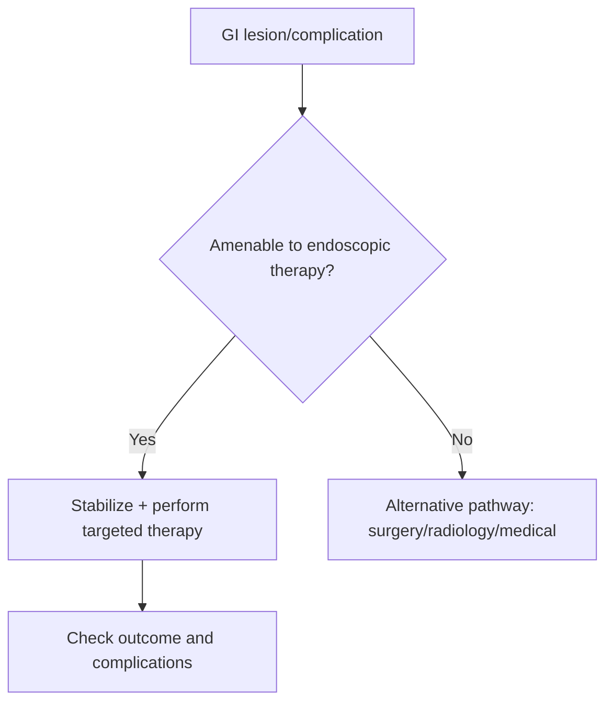

# Endoscopic therapy basics in GI disease

Related: [[../Gastroenterology MOC|Gastroenterology MOC]] · [[../Endoscopy and Gastroenterology Investigations|Endoscopy and Gastroenterology Investigations]] · [[Indications for upper GI endoscopy]] · [[../Upper Gastrointestinal Bleeding/Upper GI bleeding resuscitation priorities|Upper GI bleeding resuscitation priorities]] · [[../Symptom Patterns and Diagnostic Approach/Food bolus obstruction and acute impaction|Food bolus obstruction and acute impaction]]

> [!important]
> Endoscopy is not only diagnostic; in GI disease it can also **stop bleeding, relieve obstruction, remove impacted material, treat some lesions, and reduce the need for surgery**.

## Learning Objectives
- Describe the main therapeutic roles of endoscopy in GI disease.
- Recognize common emergency indications for therapeutic endoscopy.
- Understand basic pre-procedure and safety principles.
- Link therapeutic endoscopy to bleeding and obstruction pathways.

## Definition
Therapeutic endoscopy refers to endoscopic procedures performed primarily to treat a lesion or complication rather than only to inspect or biopsy it.

## Major Therapeutic Roles
### Hemostasis
- upper GI bleeding control
- treatment of bleeding lesions using appropriate endoscopic methods

### Relief of obstruction / impaction
- food bolus removal
- selected dilation or stent pathways for narrowing/obstruction

### Lesion therapy
- polypectomy or endoscopic removal in selected contexts
- treatment of selected mucosal lesions depending on expertise and lesion type

### Access / decompression / adjunctive procedures
- procedure choice depends on the exact pathology and local capability

## Common High-Yield Indications
- non-variceal upper GI bleeding
- impacted food bolus
- symptomatic strictures in selected settings
- selected premalignant or bleeding mucosal lesions

## Procedure Principles
- identify the exact target lesion
- ensure hemodynamic stabilization first when needed
- prepare for aspiration/sedation risk
- coordinate anticoagulant and bleeding-risk considerations
- know when endoscopic therapy is appropriate and when surgery/radiology is needed instead

## Contraindication / Escalation Logic
Therapeutic endoscopy may be limited or deferred when:
- the patient is profoundly unstable without initial resuscitation
- perforation or generalized peritonitis suggests another urgent pathway
- lesion anatomy or severity exceeds safe endoscopic management

## Complications
- bleeding
- perforation
- aspiration/sedation complications
- incomplete therapy or rebleeding/recurrence

## Interpretation Framework
### Practical algorithm
1. Is there a lesion/complication amenable to endoscopic treatment?
2. Is the patient stable enough, or do they need resuscitation first?
3. What is the therapeutic goal: hemostasis, removal, dilation, resection, or decompression?
4. Perform therapy if appropriate, then monitor for success and complications.
5. Escalate to surgery/interventional radiology if endoscopic control is not feasible or fails.

## Management Link
Therapeutic endoscopy usually sits inside a broader pathway:
- GI bleed → resuscitation → endoscopic hemostasis → post-procedure risk management
- food impaction → airway/safety assessment → endoscopic relief → evaluation of underlying cause
- obstruction/stricture → define cause → endoscopic versus surgical plan

## FCPS/MRCP High-Yield Points
- Endoscopic therapy is central in upper GI bleeding and food impaction.
- Resuscitation and airway safety still come first in unstable patients.
- Endoscopy has limits; failed control may require surgery or radiology.

## Common Viva Traps
- Thinking all endoscopy is diagnostic only.
- Ignoring rebleeding risk after apparent hemostasis.
- Delaying escalation when endoscopic control is inadequate.

## One-Page Summary
- Therapeutic endoscopy can **stop bleeding, remove obstructions, treat lesions, and avoid surgery in selected cases**.
- Classic emergency uses: **upper GI bleeding** and **food bolus impaction**.
- Always define the target lesion and stabilize the patient first when needed.
- Know the limits of endoscopic therapy and when to escalate.

## Mind Map
- Therapeutic endoscopy
  - hemostasis
  - impaction removal
  - dilation/stent
  - lesion therapy
  - risks
    - bleeding
    - perforation
    - aspiration
  - escalate if fails

## Flowchart

## Revision Prompts
- Name 4 therapeutic roles of endoscopy.
- Which GI emergencies commonly need therapeutic endoscopy?
- Why may escalation beyond endoscopy be needed?
- What complications must be remembered?

## MCQs (10)
1. Therapeutic endoscopy is used to:
   - A. Treat GI lesions or complications directly
   - B. Measure blood pressure only
   - C. Diagnose asthma
   - D. Treat cataract
   - **Answer: A**
2. A classic emergency indication is:
   - A. Upper GI bleeding
   - B. Mild eczema
   - C. Otitis externa
   - D. Migraine aura
   - **Answer: A**
3. Food bolus impaction may be treated by:
   - A. Therapeutic endoscopy
   - B. Spirometry
   - C. Colon transit study only
   - D. Audiology review
   - **Answer: A**
4. A major principle before therapy in unstable patients is:
   - A. Resuscitation
   - B. Ignore hemodynamics
   - C. Avoid IV access
   - D. Delay all assessment
   - **Answer: A**
5. A complication of endoscopic therapy is:
   - A. Perforation
   - B. Myopia
   - C. Alopecia only
   - D. Tendon rupture only
   - **Answer: A**
6. Which statement is correct?
   - A. Endoscopy may reduce need for surgery in selected cases
   - B. It is never therapeutic
   - C. It works for every lesion without limit
   - D. Escalation is never needed
   - **Answer: A**
7. Which pathway may follow failed endoscopic control?
   - A. Surgery or interventional radiology
   - B. No further action ever
   - C. Dermatology only
   - D. Ophthalmology only
   - **Answer: A**
8. The therapeutic goal in bleeding is:
   - A. Hemostasis
   - B. Hearing improvement
   - C. Airway removal only
   - D. Colon cleansing only
   - **Answer: A**
9. Which is a common trap?
   - A. Forgetting endoscopy can be therapeutic
   - B. Assessing aspiration risk
   - C. Reviewing anticoagulants
   - D. Monitoring post-procedure outcome
   - **Answer: A**
10. Best summary?
   - A. Therapeutic endoscopy is target-driven and embedded in broader emergency or disease pathways
   - B. It replaces all surgery in all cases
   - C. It has no complications
   - D. It is unrelated to GI bleeding
   - **Answer: A**

## SBA Questions (10)
1. A patient with non-variceal upper GI bleeding continues to bleed after resuscitation. Best next principle?
   - A. Therapeutic upper GI endoscopy for hemostasis
   - B. Routine stool culture only
   - C. Audiology referral
   - D. Ignore the bleed
   - **Answer: A**
2. A patient with complete food bolus obstruction is drooling and unable to swallow saliva. Best endoscopic principle?
   - A. Urgent therapeutic endoscopy
   - B. High-fibre diet trial
   - C. Colonoscopy first
   - D. Reassurance only
   - **Answer: A**
3. Which complication must be remembered after therapeutic endoscopy?
   - A. Rebleeding
   - B. Cataract
   - C. Psoriasis
   - D. Otitis
   - **Answer: A**
4. Which statement is true?
   - A. Endoscopic therapy has limits and may fail
   - B. It always succeeds completely
   - C. It never needs planning
   - D. It eliminates all need for monitoring
   - **Answer: A**
5. What is a dangerous error?
   - A. Delaying escalation when endoscopic control fails
   - B. Stabilizing first
   - C. Checking anticoagulants
   - D. Monitoring outcome
   - **Answer: A**
6. Endoscopic therapy may be inappropriate when:
   - A. Generalized peritonitis suggests another urgent pathway
   - B. There is a treatable bleed lesion
   - C. There is a food impaction
   - D. There is a polyp amenable to removal
   - **Answer: A**
7. Which therapeutic goal matches food impaction?
   - A. Removal / relief of obstruction
   - B. Glucose control only
   - C. Skin testing only
   - D. Urine alkalinization only
   - **Answer: A**
8. Which preparation issue is high yield?
   - A. Airway/sedation risk assessment
   - B. Shoe size
   - C. Eye color
   - D. Handwriting style
   - **Answer: A**
9. Which phrase best describes therapeutic endoscopy?
   - A. A direct treatment modality for selected GI complications
   - B. A purely descriptive procedure only
   - C. A replacement for all imaging
   - D. A non-clinical research tool only
   - **Answer: A**
10. In bleeding pathways, endoscopy is usually integrated with:
   - A. Resuscitation and post-procedure risk management
   - B. No supportive care at all
   - C. Dermatology review
   - D. Hearing tests
   - **Answer: A**

## Flashcards
- Q: Name 3 therapeutic uses of GI endoscopy.
  A: Hemostasis, food bolus removal, dilation/lesion therapy.
- Q: What is a classic emergency therapeutic indication?
  A: Upper GI bleeding.
- Q: Why may surgery or radiology still be needed?
  A: Because endoscopic therapy may be impossible or fail.
- Q: Name 2 complications of therapeutic endoscopy.
  A: Bleeding and perforation.
- Q: What should come first in unstable patients?
  A: Resuscitation.

## Must Know / Should Know / Nice to Know
### Must Know
- Injection (adrenaline): adjunct for bleeding, not monotherapy
- Thermal (APC, heater probe, bipolar): haemostasis, ablation, polyp resection
- Mechanical (clips, bands, loops): haemostasis, closure, EMR/ESD, stent placement
- Combination therapy (injection + thermal/clip) > monotherapy for high-risk bleeding

### Should Know
- Appropriate use criteria
- Patient preparation requirements
- Alternative investigations

### Nice to Know
- Emerging technologies
- Cost-effectiveness data
- AI-assisted interpretation

## Self-Test Scorecard
- Can I state the key indication for this investigation? /10
- Can I name 3 quality metrics? /10
- Can I explain the interpretation framework? /10
- Can I outline the limitations? /10

**Interpretation:**
- **<35/40** = weak topic
- **35-36/40** = acceptable but insecure
- **37+/40** = exam-ready

## Answer Key with Explanations

