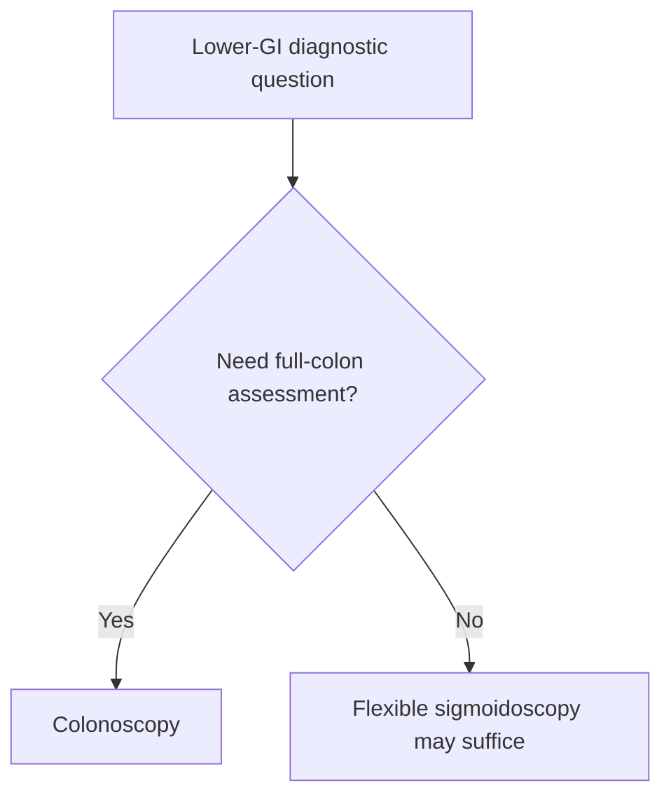

# Flexible sigmoidoscopy vs colonoscopy selection

Related: [[../Gastroenterology MOC|Gastroenterology MOC]] · [[../Endoscopy and Gastroenterology Investigations|Endoscopy and Gastroenterology Investigations]] · [[Colonoscopy indications and bowel preparation]] · [[../Symptom Patterns and Diagnostic Approach/Change in bowel habit with colorectal cancer red flags|Change in bowel habit with colorectal cancer red flags]]

> [!important]
> The key exam question is not which test is "better" in general, but **which test best answers the clinical question**: distal-limited assessment versus full-colon evaluation.

## Learning Objectives
- Distinguish flexible sigmoidoscopy from colonoscopy.
- Recognize when full-colon assessment is needed.
- Understand practical advantages and limitations of each.
- Build a selection algorithm.

## Definition
- **Flexible sigmoidoscopy** examines the rectum, sigmoid colon, and sometimes descending colon.
- **Colonoscopy** aims to examine the entire colon and often terminal ileum when indicated.

## Core Comparison
| Feature | Flexible sigmoidoscopy | Colonoscopy |
|---|---|---|
| Extent | Distal colon only | Whole colon |
| Prep burden | Less | More |
| Sedation need | Often less | Often more |
| Lesion reach | Distal disease | Proximal + distal disease |
| Best use | Distal symptoms / selected triage | Cancer exclusion, full evaluation |

## Clinical Indications
### Flexible sigmoidoscopy may suit
- suspected distal proctitis/left-sided disease
- rectal bleeding with strong distal symptom pattern in selected pathways
- frailer patients when a limited but useful assessment is acceptable

### Colonoscopy is preferred when
- colorectal cancer needs exclusion
- persistent change in bowel habit
- iron-deficiency anaemia with lower-GI concern
- full assessment after FIT/high-risk symptoms
- proximal pathology must not be missed

## Red Flags Favouring Colonoscopy
- weight loss
- iron-deficiency anaemia
- persistent/new bowel habit change
- family history of colorectal cancer
- unexplained occult bleeding

## Advantages and Limitations
### Flexible sigmoidoscopy
**Advantages**
- simpler prep
- faster
- useful for distal disease

**Limitations**
- misses proximal lesions
- not enough when cancer exclusion requires full-colon visualization

### Colonoscopy
**Advantages**
- comprehensive
- biopsy/therapy across the colon
- strongest test for whole-colon evaluation

**Limitations**
- greater prep burden
- more procedural complexity

## Interpretation Framework
1. Is the likely pathology distal only, or could it be proximal/whole-colon?
2. Are there cancer red flags or occult blood-loss clues?
3. If yes, prefer colonoscopy.
4. If the question is specifically distal-limited and low risk, sigmoidoscopy may suffice.

## Management Link
- distal inflammation suspected → sigmoidoscopy may be enough initially
- cancer/anaemia/bowel-change pathway → colonoscopy usually preferred

## FCPS/MRCP High-Yield Points
- Colonoscopy is the safer answer when full colorectal exclusion is required.
- Sigmoidoscopy is useful but limited.
- Do not choose sigmoidoscopy if proximal disease would change management.

## Common Viva Traps
- Using sigmoidoscopy to reassure a high-risk cancer-clue patient.
- Forgetting proximal lesions may be missed.

## One-Page Summary
- **Sigmoidoscopy = distal test**.
- **Colonoscopy = full-colon test**.
- Cancer clues, IDA, and persistent bowel change usually push you toward colonoscopy.

## Mind Map
- Lower GI scope choice
  - distal only? → sigmoidoscopy
  - full colon needed? → colonoscopy
  - cancer clues
  - IDA
  - bowel change

## Flowchart

## Revision Prompts
- When is sigmoidoscopy enough?
- Why does IDA favor colonoscopy?
- What is the major limitation of sigmoidoscopy?

## MCQs (10)
1. Flexible sigmoidoscopy primarily assesses:
   - A. Distal colon
   - B. Entire small bowel
   - C. Stomach only
   - D. Pancreas
   - **Answer: A**
2. Colonoscopy is preferred when:
   - A. Full colorectal evaluation is needed
   - B. Only ear pain is present
   - C. Cataract is suspected
   - D. Asthma worsens
   - **Answer: A**
3. A key limitation of sigmoidoscopy is:
   - A. Missing proximal lesions
   - B. Always needing surgery
   - C. Inability to see rectum
   - D. No clinical role
   - **Answer: A**
4. IDA with bowel symptoms generally favors:
   - A. Colonoscopy
   - B. Sigmoidoscopy only always
   - C. No endoscopy
   - D. Bronchoscopy
   - **Answer: A**
5. Which is more comprehensive?
   - A. Colonoscopy
   - B. Sigmoidoscopy
   - C. Plain X-ray
   - D. FIT alone
   - **Answer: A**
6. Sigmoidoscopy may suit:
   - A. Suspected distal disease
   - B. Mandatory full cancer exclusion
   - C. Small-bowel bleed only
   - D. Liver failure
   - **Answer: A**
7. A common trap is:
   - A. Over-reassuring after limited distal exam in a high-risk patient
   - B. Asking about weight loss
   - C. Checking for anemia
   - D. Reviewing bowel change
   - **Answer: A**
8. Colonoscopy can:
   - A. Evaluate proximal and distal colon
   - B. Only inspect rectum
   - C. Never biopsy
   - D. Replace all clinical judgment
   - **Answer: A**
9. Which red flag most pushes toward colonoscopy?
   - A. Persistent altered bowel habit with weight loss
   - B. One day of mild bloating
   - C. Dry skin
   - D. Sneezing
   - **Answer: A**
10. Best summary?
   - A. Scope choice depends on whether the question is distal-limited or full-colon
   - B. Sigmoidoscopy and colonoscopy are identical
   - C. Colonoscopy is never needed
   - D. Sigmoidoscopy excludes all CRC
   - **Answer: A**

## SBA Questions (10)
1. A 66-year-old with new bowel change and IDA needs which test principle?
   - A. Colonoscopy for full-colon evaluation
   - B. Sigmoidoscopy only for reassurance
   - C. No lower-GI exam
   - D. Ear examination
   - **Answer: A**
2. A young patient with likely distal proctitic symptoms and no red flags may initially have:
   - A. Flexible sigmoidoscopy
   - B. Mandatory laparotomy
   - C. ERCP
   - D. Bronchoscopy
   - **Answer: A**
3. Why can sigmoidoscopy be insufficient?
   - A. Proximal lesions may be missed
   - B. It cannot inspect rectum
   - C. It always causes perforation
   - D. It never reaches sigmoid
   - **Answer: A**
4. Which statement is true?
   - A. Colonoscopy is preferred when cancer must be excluded confidently
   - B. Sigmoidoscopy excludes proximal cancer
   - C. Neither test has biopsy value
   - D. Scope choice is random
   - **Answer: A**
5. A dangerous error is:
   - A. Using a limited test when a full-colon answer is needed
   - B. Defining the diagnostic question first
   - C. Checking risk level
   - D. Reviewing anemia
   - **Answer: A**
6. Which factor favors limited distal evaluation?
   - A. Clearly distal low-risk symptom pattern
   - B. IDA and weight loss
   - C. Positive FIT with high-risk features
   - D. Family history of CRC with persistent symptoms
   - **Answer: A**
7. Which test has higher prep burden?
   - A. Colonoscopy
   - B. Sigmoidoscopy
   - C. FIT
   - D. CBC
   - **Answer: A**
8. Best exam phrase?
   - A. Colonoscopy answers full-colon questions; sigmoidoscopy answers selected distal questions
   - B. The tests are interchangeable in all contexts
   - C. Sigmoidoscopy is always superior
   - D. Colonoscopy is obsolete
   - **Answer: A**
9. Which patient most fits sigmoidoscopy first?
   - A. Distal-symptom patient without cancer clues
   - B. Weight-loss + IDA patient
   - C. Persistent occult blood-loss patient
   - D. High-risk family-history patient with bowel change
   - **Answer: A**
10. Main principle?
   - A. Match test extent to pathology risk and diagnostic goal
   - B. Use the shorter test for everyone
   - C. Never choose colonoscopy
   - D. Ignore proximal disease risk
   - **Answer: A**

## Flashcards
- Q: What is the main limitation of flexible sigmoidoscopy?
  A: It may miss proximal colonic lesions.
- Q: What is the key advantage of colonoscopy?
  A: Full-colon assessment.
- Q: Which findings usually push toward colonoscopy?
  A: IDA, weight loss, persistent bowel change, cancer suspicion.
- Q: When may sigmoidoscopy be acceptable first?
  A: Selected low-risk distal symptom patterns.
- Q: What determines scope choice?
  A: Whether the clinical question is distal-limited or whole-colon.

## Must Know / Should Know / Nice to Know
### Must Know
- Flexi-sig: left-sided symptoms, surveillance of distal colitis, limited prep, no sedation
- Colonoscopy: full colonic evaluation, screening, right-sided symptoms, polypectomy capability
- Flexi-sig + FIT = colonoscopy alternative for screening in some guidelines
- Flexi-sig inadequate for right-sided lesions, Lynch surveillance, CRC staging

### Should Know
- Appropriate use criteria
- Patient preparation requirements
- Alternative investigations

### Nice to Know
- Emerging technologies
- Cost-effectiveness data
- AI-assisted interpretation

## Self-Test Scorecard
- Can I state the key indication for this investigation? /10
- Can I name 3 quality metrics? /10
- Can I explain the interpretation framework? /10
- Can I outline the limitations? /10

**Interpretation:**
- **<35/40** = weak topic
- **35-36/40** = acceptable but insecure
- **37+/40** = exam-ready

## Answer Key with Explanations

