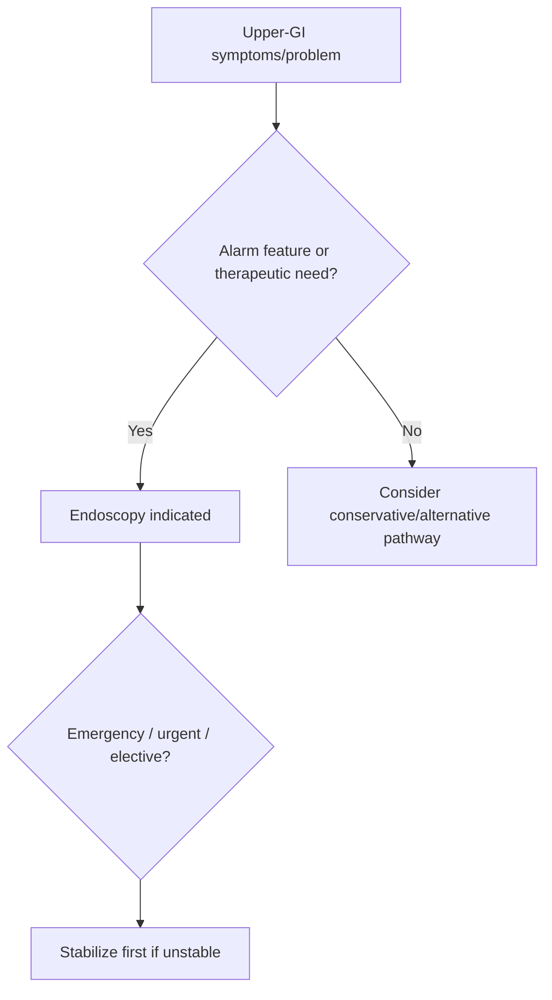

# Indications for upper GI endoscopy

Related: [[../Gastroenterology MOC|Gastroenterology MOC]] · [[../Endoscopy and Gastroenterology Investigations|Endoscopy and Gastroenterology Investigations]] · [[Biopsy strategy at upper GI endoscopy]] · [[../Symptom Patterns and Diagnostic Approach/Dysphagia alarm features and urgent endoscopy|Dysphagia alarm features and urgent endoscopy]]

> [!important]
> Upper GI endoscopy is indicated when symptoms or red flags suggest **mucosal disease, structural obstruction, bleeding, malignancy, or the need for direct visualization/therapy**. The exam focus is knowing **who needs it urgently** versus electively.

## Learning Objectives
- List major indications for upper GI endoscopy.
- Distinguish urgent from elective indications.
- Recognize alarm symptoms that mandate endoscopic evaluation.
- Understand when endoscopy offers diagnosis and therapy together.

## Definition
Upper GI endoscopy visualizes the oesophagus, stomach, and proximal duodenum, allowing direct inspection, biopsy, and therapeutic intervention.

## Major Clinical Indications
### Alarm-symptom indications
- dysphagia
- odynophagia
- GI bleeding / melaena / haematemesis
- persistent vomiting
- iron-deficiency anaemia with upper-GI concern
- unintentional weight loss with upper-GI symptoms

### Disease-evaluation indications
- suspected peptic ulcer disease complications
- refractory or complicated dyspepsia
- suspicion of upper-GI malignancy
- suspected coeliac-related duodenal assessment in selected pathways
- follow-up/assessment of certain known lesions depending on context

### Therapeutic indications
- control of upper GI bleeding
- relief of food bolus obstruction
- dilation / stent / selected intervention pathways

## Urgent vs Elective Logic
### Urgent / early
- acute upper GI bleeding
- significant dysphagia with alarm features
- food bolus impaction
- persistent vomiting with obstruction concern
- suspected perforation/instability is a resuscitation problem first, with endoscopy only when appropriate and safe

### Elective / semi-elective
- persistent dyspepsia with alarm features or failure of conservative pathway
- surveillance/follow-up in selected established conditions

## Contraindication / Caution Logic
Absolute use is shaped by stability and safety.
- unstable patients require resuscitation first
- suspected perforation may alter the route and urgency of imaging/surgical assessment
- aspiration risk and sedation issues matter in selected patients

## Preparation / Practical Points
- fasting where possible
- risk assessment for sedation
- clear indication and expected diagnostic question
- anticoagulant/bleeding-risk planning when intervention or biopsy is likely

## Interpretation Framework
### Practical algorithm
1. Decide whether the clinical problem is upper-GI in origin.
2. Look for alarm features or therapeutic need.
3. Classify urgency: emergency, urgent, or elective.
4. Stabilize first if bleeding, obstruction, or major comorbidity exists.
5. Use endoscopy when the result will change diagnosis or management.

## Differential / When Not to Use Reflexively
- uncomplicated low-risk dyspepsia may not need immediate endoscopy
- non-GI chest pain or functional symptoms may need other assessment first

## Management Link
Upper GI endoscopy is both:
- a **diagnostic tool** for mucosal/structural disease
- a **therapeutic tool** in bleeding, impaction, and selected obstructive lesions

## FCPS/MRCP High-Yield Points
- Dysphagia and upper GI bleeding are classic high-yield indications.
- Endoscopy urgency depends on instability, bleeding, obstruction, and cancer concern.
- Resuscitation comes before the scope in unstable patients.

## Common Viva Traps
- Sending every dyspepsia patient straight to endoscopy.
- Forgetting that food impaction is a therapeutic endoscopy emergency.
- Missing the distinction between needing endoscopy and needing stabilization first.

## One-Page Summary
- Upper GI endoscopy assesses the **oesophagus, stomach, and duodenum**.
- Indications: **bleeding, dysphagia, vomiting/obstruction, alarm dyspepsia, suspected malignancy, therapeutic intervention**.
- Emergency endoscopy is common in GI bleeding and food impaction.
- Unstable patients need resuscitation before or alongside urgent endoscopic planning.

## Mind Map
- UGI endoscopy indications
  - bleeding
  - dysphagia
  - vomiting / obstruction
  - alarm dyspepsia
  - suspected cancer
  - therapy
    - hemostasis
    - bolus removal

## Flowchart

## Revision Prompts
- Name 5 major indications for upper GI endoscopy.
- Which situations need urgent rather than elective endoscopy?
- Why does resuscitation sometimes come first?
- Give 2 therapeutic uses.

## MCQs (10)
1. Upper GI endoscopy visualizes the:
   - A. Oesophagus, stomach, and proximal duodenum
   - B. Colon only
   - C. Bronchial tree
   - D. Urinary bladder
   - **Answer: A**
2. A classic urgent indication is:
   - A. Acute upper GI bleeding
   - B. Stable eczema
   - C. Otitis externa
   - D. Knee pain
   - **Answer: A**
3. Dysphagia is:
   - A. An important endoscopic indication
   - B. Irrelevant
   - C. Always neurological only
   - D. Never urgent
   - **Answer: A**
4. Food bolus impaction usually requires:
   - A. Therapeutic upper GI endoscopy
   - B. Colonoscopy
   - C. Spirometry
   - D. Audiogram
   - **Answer: A**
5. In unstable bleeding patients, the first principle is:
   - A. Resuscitation before/with urgent endoscopic planning
   - B. Ignore vitals
   - C. Delay all fluids
   - D. Give laxatives
   - **Answer: A**
6. Which is a common elective-type indication?
   - A. Alarm-feature dyspepsia
   - B. Hair loss only
   - C. Sneezing only
   - D. Wrist pain only
   - **Answer: A**
7. Endoscopy may be both diagnostic and:
   - A. Therapeutic
   - B. Orthopedic
   - C. Ophthalmic
   - D. Psychiatric only
   - **Answer: A**
8. Which symptom strongly supports an upper-GI structural indication?
   - A. Persistent vomiting with obstruction concern
   - B. Isolated ankle sprain
   - C. Skin dryness
   - D. Mild headache alone
   - **Answer: A**
9. A common trap is:
   - A. Scoping low-risk dyspepsia reflexively without risk stratification
   - B. Checking for alarm features
   - C. Reviewing stability
   - D. Asking about bleeding
   - **Answer: A**
10. Best summary?
   - A. Indications are driven by alarm symptoms, therapeutic need, and risk stratification
   - B. Every upper abdominal symptom needs immediate endoscopy
   - C. Endoscopy is never therapeutic
   - D. Bleeding is not an indication
   - **Answer: A**

## SBA Questions (10)
1. A patient presents with haematemesis and melaena. Best endoscopic principle?
   - A. Urgent upper GI endoscopy after stabilization
   - B. Routine outpatient audiology
   - C. Colonoscopy first
   - D. Reassurance only
   - **Answer: A**
2. A 55-year-old woman has progressive dysphagia and weight loss. Best investigation principle?
   - A. Upper GI endoscopy is indicated promptly
   - B. Treat indefinitely with antacids only
   - C. Ignore the symptoms
   - D. Only stool culture is needed
   - **Answer: A**
3. Which clinical situation is most clearly therapeutic rather than purely diagnostic?
   - A. Food bolus obstruction
   - B. Mild bloating only
   - C. Stable constipation only
   - D. Dry cough only
   - **Answer: A**
4. Which statement is correct?
   - A. Endoscopy urgency depends on bleeding, obstruction, and alarm features
   - B. Urgency never matters
   - C. Resuscitation is irrelevant
   - D. Endoscopy is only for research
   - **Answer: A**
5. Which symptom may justify elective endoscopy if persistent with risk clues?
   - A. Dyspepsia with alarm features
   - B. Isolated dandruff
   - C. Tinnitus only
   - D. Myopia only
   - **Answer: A**
6. What is a dangerous error?
   - A. Forgetting to stabilize an unstable GI bleed patient before the scope process
   - B. Assessing airway and hemodynamics
   - C. Asking about vomiting
   - D. Reviewing dysphagia history
   - **Answer: A**
7. Which is a valid indication?
   - A. Persistent vomiting with suspected upper-GI obstruction
   - B. Mild wrist stiffness only
   - C. Ear wax only
   - D. Alopecia only
   - **Answer: A**
8. Upper GI endoscopy does not primarily assess the:
   - A. Colon
   - B. Oesophagus
   - C. Stomach
   - D. Duodenum
   - **Answer: A**
9. Why is anticoagulant planning relevant?
   - A. Because biopsy or intervention may increase bleeding risk
   - B. Because it changes hearing thresholds
   - C. Because it improves spirometry
   - D. Because it treats dyspepsia directly
   - **Answer: A**
10. Best exam phrase?
   - A. Upper GI endoscopy is indicated when direct visualization or therapy will materially change diagnosis or management
   - B. It is indicated for all abdominal symptoms equally
   - C. It never changes management
   - D. It replaces clinical triage
   - **Answer: A**

## Flashcards
- Q: Name 3 urgent indications for upper GI endoscopy.
  A: Upper GI bleeding, food bolus impaction, dysphagia with alarm features/persistent vomiting obstruction concern.
- Q: Which structures are examined by upper GI endoscopy?
  A: Oesophagus, stomach, proximal duodenum.
- Q: Why may resuscitation come before endoscopy?
  A: Because unstable patients must be stabilized before/alongside definitive procedures.
- Q: Give 2 therapeutic uses of upper GI endoscopy.
  A: Hemostasis and food bolus removal.
- Q: Does uncomplicated low-risk dyspepsia always need immediate endoscopy?
  A: No.

## Must Know / Should Know / Nice to Know
### Must Know
- Alarm features: dysphagia, weight loss, bleeding, anaemia, persistent vomiting, age >55 with new symptoms
- Also: refractory GERD, dyspepsia >60yo, Barrett surveillance, varices screening, H. pylori test-and-treat fail
- Not indicated for: uncomplicated GERD in young, functional dyspepsia without alarms
- Therapeutic: bleeding, dilation, stent, EMR/ESD, PEG, foreign body

### Should Know
- Appropriate use criteria
- Patient preparation requirements
- Alternative investigations

### Nice to Know
- Emerging technologies
- Cost-effectiveness data
- AI-assisted interpretation

## Self-Test Scorecard
- Can I state the key indication for this investigation? /10
- Can I name 3 quality metrics? /10
- Can I explain the interpretation framework? /10
- Can I outline the limitations? /10

**Interpretation:**
- **<35/40** = weak topic
- **35-36/40** = acceptable but insecure
- **37+/40** = exam-ready

## Answer Key with Explanations

