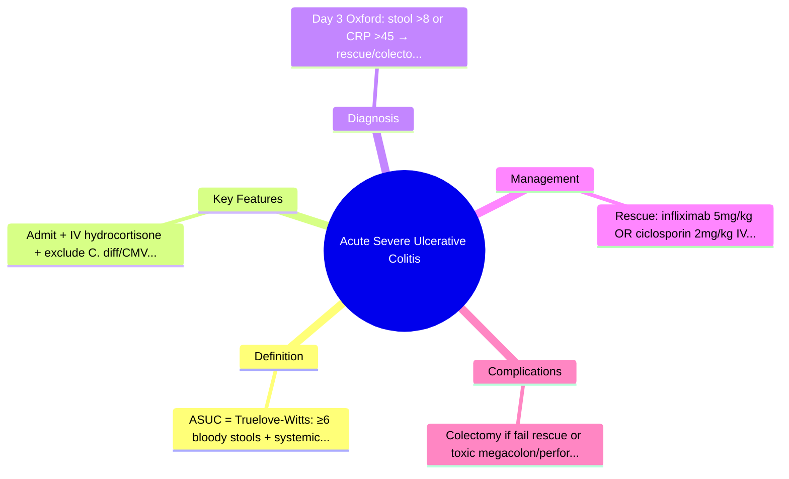
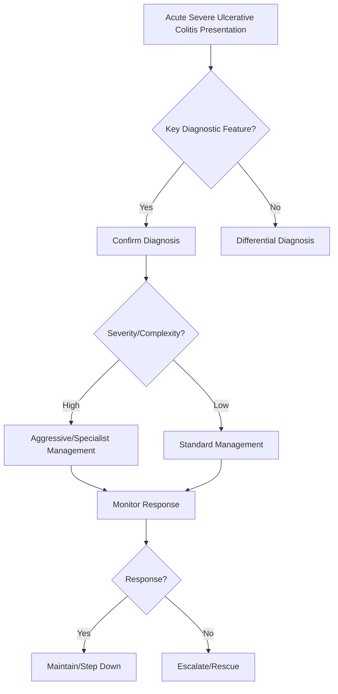

## Learning Objectives
- Define acute severe ulcerative colitis (ASUC): Truelove-Witts criteria (≥6 bloody stools/day + systemic toxicity: pulse >90, temp >37.8, Hb <10.5, ESR >30).
- Recognize the emergency: hospital admission, IV steroids, exclude infection (C. diff, CMV), assess for toxic megacolon.
- Apply the Oxford criteria (day 3) or Travis criteria (day 7) to predict steroid failure and need for rescue therapy or colectomy.
- Outline rescue therapy: infliximab (5mg/kg) or ciclosporin (2mg/kg IV) for steroid-refractory; colectomy if fail rescue or develop complications.
- Understand the surgical indications: failure of medical therapy, toxic megacolon, perforation, uncontrolled bleeding, cancer.# Acute severe ulcerative colitis

Related: [[../Gastroenterology MOC|Gastroenterology MOC]] · [[../Inflammatory and Functional Bowel Disorders|Inflammatory and Functional Bowel Disorders]] · [[Ulcerative colitis]] · [[Crohn disease]]

> [!important]
> **Acute severe ulcerative colitis (ASUC)** is a **medical emergency**. Exam answers must emphasize **admission, stool/inflammatory severity assessment, exclusion of infection, IV steroids, VTE prophylaxis, early surgical involvement, and rescue therapy/colectomy planning**.

## Definition
ASUC is a fulminant flare of ulcerative colitis with systemic toxicity and a high risk of **toxic megacolon, perforation, sepsis, hemorrhage, and colectomy**.

## Anatomy
- Ulcerative colitis involves the **colonic mucosa**, beginning in the **rectum** and extending proximally in a continuous pattern.
- In ASUC, inflammation is intense enough to threaten the integrity of the colonic wall.
- Key emergency anatomical concern: **transverse colon dilation** and loss of neuromuscular tone in toxic megacolon.

## Physiology
- Normal colon physiology includes water absorption, electrolyte handling, motility, and barrier function.
- Severe mucosal inflammation causes:
  - increased secretion and reduced absorption → **profuse bloody diarrhoea**
  - cytokine-driven systemic illness → **fever, tachycardia, raised CRP/ESR**
  - muscular and neural dysfunction of the colon → **colonic dilatation**
  - protein loss and anemia → **hypoalbuminaemia, fatigue**

## Classification
### Truelove and Witts criteria
ASUC is classically defined as:
- **≥ 6 bloody stools/day**
**plus at least one** of the following:
- pulse **> 90/min**
- temperature **> 37.8°C**
- hemoglobin **< 10.5 g/dL**
- ESR **> 30 mm/h**

Modern practice also strongly considers:
- **CRP elevation**
- hypoalbuminaemia
- abdominal tenderness/distension
- radiologic colonic dilatation

## Etiology / Triggers
- Severe flare of known ulcerative colitis
- First presentation of ulcerative colitis
- Infection superimposed on IBD, especially:
  - **Clostridioides difficile**
  - CMV in immunosuppressed patients
- Non-adherence to maintenance therapy
- NSAID exposure may aggravate colitis
- Rapid steroid withdrawal in susceptible patients

## Pathophysiology
- Exaggerated mucosal immune activation causes diffuse colonic inflammation.
- Ulceration leads to **bloody diarrhoea** and protein loss.
- Inflammatory mediators impair smooth-muscle function and may precipitate **toxic megacolon**.
- Severe disease may progress to **perforation, bacteremia, and shock**.

## Clinical Features
- Frequent **bloody diarrhoea**
- Urgency and tenesmus
- Colicky abdominal pain
- Fever
- Tachycardia
- Malaise, dehydration, weight loss
- Abdominal tenderness or distension
- Reduced oral intake

## Red Flags / Emergencies
- Marked abdominal distension
- Severe continuous abdominal pain
- Peritonism
- Systemic toxicity, sepsis, hypotension
- Reduced stool frequency with increasing distension in a toxic patient → think **toxic megacolon**
- Massive hemorrhage
- Rising lactate or acute kidney injury

## Investigations
### Initial bedside and blood tests
- CBC: anemia, leukocytosis
- CRP/ESR
- Urea, creatinine, electrolytes
- LFTs, albumin
- Blood group and crossmatch if bleeding significant
- ABG/VBG and lactate if toxic

### Stool tests
- Stool culture if appropriate
- **C. difficile toxin/PCR**
- Consider CMV evaluation in refractory/immunosuppressed cases

### Imaging
- **Plain abdominal X-ray** for colonic dilatation, perforation suspicion
- CT abdomen if complications suspected and patient stable enough

### Endoscopy
- **Flexible sigmoidoscopy with minimal insufflation** to confirm active colitis and obtain biopsies when needed
- Avoid full colonoscopy in the unstable severe flare because of perforation risk

## Interpretation Framework
### ASUC emergency interpretation logic
1. Confirm this is **severe colitis** clinically.
2. Exclude **infection**, especially C. difficile.
3. Assess for **systemic toxicity**.
4. Screen for **megacolon / perforation** with abdominal imaging.
5. Reassess response after **3 days of IV steroids**.
6. If steroid failure, escalate to **rescue therapy** or **surgery**.

### Steroid-response checkpoints
Poor prognostic clues include:
- persistent high stool frequency
- ongoing bleeding
- high CRP
- hypoalbuminaemia
- colonic dilatation

## Diagnosis
Diagnosis is based on:
- known or suspected ulcerative colitis
- severe bloody diarrhoea with systemic features
- supportive inflammatory markers/imaging/endoscopy
- exclusion of key infective mimics

## Differential Diagnosis
- Infectious colitis
- Crohn colitis
- Ischaemic colitis
- CMV colitis
- Severe radiation/drug-related colitis
- Lower GI bleeding from another source with diarrhoea mimic

## Management
## Immediate priorities
- **Admit urgently**
- GI and colorectal surgical involvement early
- IV access and fluid/electrolyte correction
- Strict stool chart, vitals, abdominal exam, input-output chart
- Nutritional assessment
- Thromboprophylaxis unless contraindicated

## Specific treatment
### First-line
- **IV corticosteroids** are first-line therapy
  - e.g. IV hydrocortisone or equivalent methylprednisolone regimen
- Continue supportive care and daily reassessment

### Supportive measures
- Correct potassium, magnesium, dehydration
- Avoid opioids and antidiarrhoeals if possible
- Avoid NSAIDs
- Transfuse blood if clinically indicated
- Treat proven infection appropriately

### Rescue therapy for steroid failure
If no adequate response after ~3 days:
- **Infliximab** or
- **Cyclosporine**
Choice depends on prior therapy, contraindications, expertise, and surgical planning.

### Surgery
Urgent/subtotal colectomy is indicated if there is:
- perforation
- uncontrolled hemorrhage
- toxic megacolon
- worsening sepsis or peritonitis
- failure of medical rescue therapy

## Complications
- Toxic megacolon
- Colonic perforation
- Severe hemorrhage
- Sepsis
- Venous thromboembolism
- Malnutrition
- AKI and electrolyte disturbance
- Need for colectomy

## Common Exam / Viva Traps
- Calling this “just a flare” without stating **medical emergency**
- Forgetting **C. difficile** testing
- Requesting full colonoscopy instead of limited sigmoidoscopy
- Omitting **VTE prophylaxis**
- Delaying surgical review until after collapse
- Not reassessing objectively after **3 days of IV steroids**

## One-Page Summary
- ASUC = severe UC flare with systemic toxicity.
- Think **≥ 6 bloody stools/day + toxicity markers**.
- Emergency risks: **toxic megacolon, perforation, hemorrhage, sepsis**.
- Initial workup: CBC, CRP, U&E, albumin, stool C. difficile, abdominal X-ray, limited sigmoidoscopy.
- First-line treatment: **admission + IV fluids + IV steroids + thromboprophylaxis + monitoring**.
- If not improving by day 3: **infliximab/cyclosporine or surgery**.
- Early colorectal surgical input is essential.

## Revision Prompts
- Define ASUC using classical criteria.
- Why is abdominal X-ray important in ASUC?
- Why should full colonoscopy usually be avoided?
- What are the day-3 decisions in ASUC?
- List indications for urgent colectomy.

## MCQs (10)
1. A patient with ulcerative colitis has 8 bloody stools/day and pulse 104/min. This is most consistent with:
   - A. IBS
   - B. Acute severe ulcerative colitis
   - C. Microscopic colitis
   - D. Functional diarrhoea
   - **Answer: B**

2. The most classical stool threshold in ASUC is:
   - A. ≥2/day
   - B. ≥4/day
   - C. ≥6 bloody stools/day
   - D. ≥10/day only
   - **Answer: C**

3. A key infective mimic that must be excluded is:
   - A. H. pylori
   - B. C. difficile
   - C. HBV
   - D. Giardia only in all cases
   - **Answer: B**

4. First-line specific treatment for ASUC is:
   - A. Oral mesalazine alone
   - B. IV corticosteroids
   - C. Immediate colectomy in all patients
   - D. Loperamide
   - **Answer: B**

5. A dangerous complication of ASUC is:
   - A. Achalasia
   - B. Toxic megacolon
   - C. Boerhaave syndrome
   - D. Mallory-Weiss tear
   - **Answer: B**

6. Preferred endoscopic test in an unstable severe flare is:
   - A. Full colonoscopy with extensive prep
   - B. ERCP
   - C. Flexible sigmoidoscopy
   - D. Capsule endoscopy
   - **Answer: C**

7. Which is an indication for surgery in ASUC?
   - A. Mild CRP rise only
   - B. Perforation
   - C. Any history of UC
   - D. Tenesmus alone
   - **Answer: B**

8. Which supportive measure is especially important in hospitalized ASUC?
   - A. Routine antidiarrhoeal therapy
   - B. VTE prophylaxis
   - C. High-dose NSAIDs
   - D. Discharge after 12 hours
   - **Answer: B**

9. Failure to improve after IV steroids should prompt consideration of:
   - A. Reassurance only
   - B. Rescue therapy or colectomy
   - C. PEG prep and colonoscopy for all
   - D. Stopping monitoring
   - **Answer: B**

10. Reduced stool frequency with increasing abdominal distension in ASUC suggests:
   - A. Recovery
   - B. Toxic megacolon
   - C. IBS overlap
   - D. Coeliac disease
   - **Answer: B**

## SBA Questions (10)
1. A 29-year-old man with known ulcerative colitis is admitted with 10 bloody stools/day, fever, tachycardia, and Hb 9.8 g/dL. Best initial specific therapy?
   - A. Oral antibiotics only
   - B. IV corticosteroids
   - C. Elective colectomy after outpatient review
   - D. Loperamide
   - **Answer: B**

2. A patient with ASUC becomes distended and tender. Best immediate investigation?
   - A. Barium enema
   - B. Plain abdominal X-ray
   - C. Capsule endoscopy
   - D. MRCP
   - **Answer: B**

3. A patient with severe colitis is being assessed on day 3 of IV steroids. The main reason is to decide:
   - A. Whether to stop all therapy
   - B. Whether rescue therapy or surgery is needed
   - C. Whether IBS is present
   - D. Whether gallstones caused it
   - **Answer: B**

4. In ASUC, which infection must be specifically sought?
   - A. Dengue
   - B. C. difficile
   - C. Rabies
   - D. Tetanus
   - **Answer: B**

5. Which medicine is generally avoided because it may worsen colonic dilatation risk assessment and symptoms?
   - A. Opioid antidiarrhoeals
   - B. IV steroids
   - C. LMWH prophylaxis
   - D. IV crystalloids
   - **Answer: A**

6. Which finding most strongly suggests toxic megacolon?
   - A. Mild urgency
   - B. Colonic dilatation with systemic toxicity
   - C. Oral ulcers alone
   - D. Constipation without inflammation
   - **Answer: B**

7. Best endoscopic approach in severe active colitis?
   - A. Full colonoscopy with aggressive insufflation
   - B. Flexible sigmoidoscopy with caution
   - C. Double-balloon enteroscopy
   - D. No endoscopy ever
   - **Answer: B**

8. Which specialty should be involved early even before perforation occurs?
   - A. Ophthalmology
   - B. Colorectal surgery
   - C. Dermatology
   - D. ENT
   - **Answer: B**

9. A hospitalized ASUC patient is immobile and bleeding mildly. Which preventive measure remains important unless contraindicated?
   - A. Stop all prophylaxis
   - B. VTE prophylaxis
   - C. Daily NSAIDs
   - D. Routine laxatives
   - **Answer: B**

10. A patient fails IV steroids and deteriorates. Most appropriate next step?
   - A. Delay escalation for a week
   - B. Rescue therapy and surgical decision-making
   - C. Discharge on antacids
   - D. Treat as functional bowel disease
   - **Answer: B**

## Flashcards
- Q: Classical stool threshold in ASUC?  
  A: ≥6 bloody stools/day plus systemic toxicity criteria.
- Q: First-line specific treatment of ASUC?  
  A: IV corticosteroids.
- Q: Two emergency complications of ASUC?  
  A: Toxic megacolon and perforation.
- Q: Key infection to exclude in ASUC?  
  A: C. difficile.
- Q: Day-3 failure leads to what decision?  
  A: Rescue therapy versus colectomy.
- Q: Preferred limited endoscopic test?  
  A: Flexible sigmoidoscopy.
- Q: Important inpatient prophylaxis?  
  A: VTE prophylaxis.
- Q: Imaging for suspected megacolon?  
  A: Plain abdominal X-ray.

## Mind Map

## Flowchart

## Must Know / Should Know / Nice to Know
### Must Know
- ASUC = Truelove-Witts: ≥6 bloody stools + systemic signs
- Admit + IV hydrocortisone + exclude C. diff/CMV
- Day 3 Oxford: stool >8 or CRP >45 → rescue/colectomy
- Rescue: infliximab 5mg/kg OR ciclosporin 2mg/kg IV
- Colectomy if fail rescue or toxic megacolon/perforation/bleed

### Should Know
- Ciclosporin: monitor levels, renal, seizures; initiate azathioprine simultaneously
- Infliximab: avoid if sepsis, CHF; screen TB/HBV
- Surgery: subtotal colectomy + end ileostomy (Hartmann later)

### Nice to Know
- Vasculopressin for bleeding
- Granulocyte apheresis (Japan)
- JAK inhibitors (tofacitinib) rescue data

## Self-Test Scorecard
- Can I define Acute Severe Ulcerative Colitis correctly? /10
- Can I list 4 key features? /10
- Can I explain the diagnostic approach? /10
- Can I outline the management? /10

**Interpretation:**
- **<35/40** = weak topic
- **35-36/40** = acceptable but insecure
- **37+/40** = exam-ready

## Revision Prompts
- What is Acute Severe Ulcerative Colitis?
- What are the key diagnostic features?
- What is the management approach?

## Answer Key with Explanations

## Answer Key Pearls
- Severe UC must be framed as an **admit-and-monitor emergency**, not as a routine outpatient flare.
- Marking schemes often reward: **severity criteria, infection exclusion, IV steroids, DVT prophylaxis, surgical involvement, and escalation plan**.
