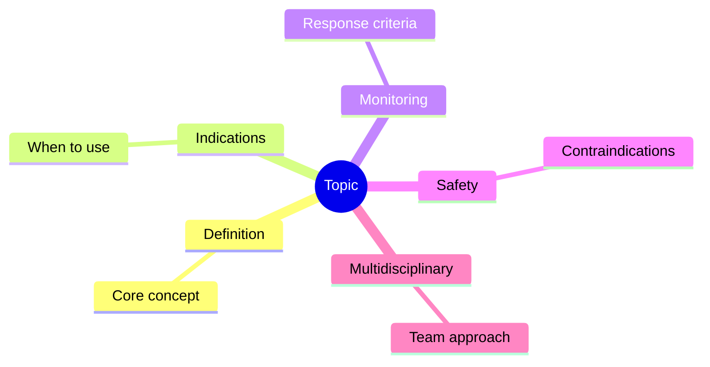
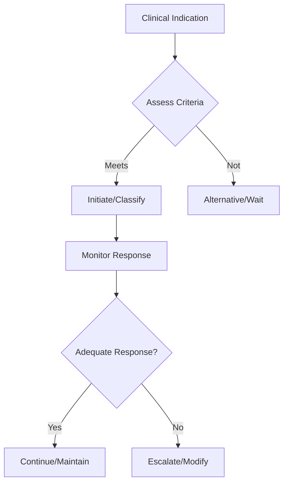

## Learning Objectives
- Identify the indication and place in therapy for this intervention/classification
- Recognize the key monitoring parameters and treatment response criteria
- Apply the step-up/step-down logic for therapy adjustment
- Understand the safety profile and contraindications
- Outline the multidisciplinary coordination required# Aminosalicylates, steroids, and induction therapy in IBD

## Why this matters
Induction therapy aims to settle active inflammation quickly and safely. Choice depends on whether the disease is **UC or Crohn**, the **site**, and the **severity**.

## Aminosalicylates (5-ASA)
- Important in **ulcerative colitis**, especially mild-to-moderate disease
- Oral and/or rectal preparations depending on extent
- Much less central in Crohn disease than in UC

## Steroids
- Used to induce remission, not maintain it
- Topical/rectal steroids for distal disease in selected cases
- Oral steroids for moderate disease
- IV steroids for severe/acute hospitalized colitis

## Induction framework
| Situation | Typical induction logic |
|---|---|
| Mild distal UC | Topical ± oral 5-ASA |
| Moderate UC | Escalate 5-ASA and/or oral steroids |
| Severe UC / ASUC | Admit, IV steroids |
| Mild ileocaecal Crohn | Budesonide in selected cases |
| Moderate/severe Crohn | Systemic steroids and/or early advanced therapy depending context |

## Key cautions
- Exclude infection before calling it a flare.
- Steroid dependence is a warning sign.
- Do not keep repeating steroids instead of steroid-sparing strategy.
- 5-ASA is not the main answer for most significant Crohn disease.

## Monitoring
- Symptoms, stool frequency, bleeding
- CRP, albumin, Hb
- Adverse effects: steroid hyperglycaemia, infection, mood change, bone effects

## One-page summary
IBD induction therapy is about **settling an active flare**. In UC, **5-ASA** is important for mild-moderate disease; **steroids** are used when activity is greater. In Crohn, **5-ASA has a limited role**, while steroids or advanced therapy are more important depending on severity.

## MCQs (10)
1. 5-ASA is most useful in? **Ulcerative colitis**.
2. Steroids are for? **Induction, not maintenance**.
3. Severe colitis needs? **Admission and IV steroids**.
4. 5-ASA is central in severe Crohn? **No**.
5. Distal UC may benefit from? **Rectal therapy**.
6. Repeated steroid courses suggest need for? **Steroid-sparing escalation**.
7. Before treating flare, always exclude? **Infection**.
8. Budesonide may be useful in? **Selected mild ileocaecal Crohn**.
9. Steroid dependence is a warning sign? **Yes**.
10. Main purpose of induction therapy? **Achieve remission**.

## SBA Questions (10)
1. Mild proctitis in UC: best first treatment principle? **Topical 5-ASA**.
2. Severe UC admitted with frequent bloody stool: immediate induction? **IV steroids**.
3. Crohn patient receiving multiple steroid courses: next concern? **Steroid dependence and need for escalation**.
4. Before escalating IBD flare treatment, check for? **Infective colitis including C. difficile**.
5. Which statement is most accurate? **5-ASA is more important in UC than Crohn**.
6. Main role of steroids? **Induce remission**.
7. Long-term maintenance with repeated steroids is? **Poor practice**.
8. Distal UC can be treated effectively with? **Rectal plus/or oral therapy based on extent**.
9. Mild ileocaecal Crohn may use? **Budesonide in selected settings**.
10. Best exam-safe phrase? **Therapy is disease-specific and severity-specific**.

## Flashcards
- Q: Disease where 5-ASA is most useful?  
  A: Ulcerative colitis.
- Q: Steroids maintain remission long term?  
  A: No.
- Q: Severe UC induction route?  
  A: IV steroids.
- Q: Key warning after repeated steroid courses?  
  A: Steroid dependence.
- Q: Must exclude before calling it a flare?  
  A: Infection.

## Mind Map

## Flowchart

## Must Know / Should Know / Nice to Know
### Must Know
- Key indications and contraindications
- Dosing/monitoring parameters
- Step-up/step-down decision logic
- Safety monitoring requirements

### Should Know
- Special populations
- Drug interactions
- Refractory management
- Cost considerations

### Nice to Know
- Pharmacogenomics
- Emerging agents/techniques
- Long-term outcomes

## Self-Test Scorecard
- Can I state the key indications? /10
- Can I list monitoring parameters? /10
- Can I explain the step-up logic? /10
- Can I identify contraindications? /10

**Interpretation:**
- **<35/40** = weak topic
- **35-36/40** = acceptable but insecure
- **37+/40** = exam-ready

## Revision Prompts
- What are the key indications for this intervention?
- How is response monitored?
- What are the safety concerns?

## Answer Key with Explanations
### MCQs
- 1. **A** — [explanation]
- 2. **B** — [explanation]
...

### SBAs
- 1. **A** — [explanation]
...

