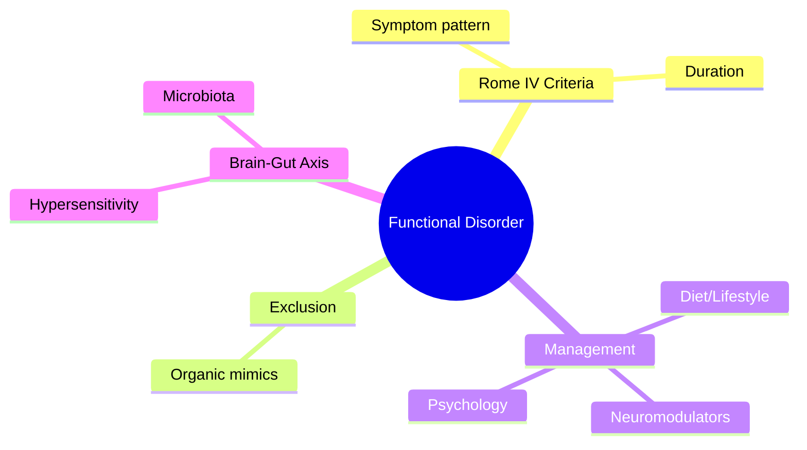
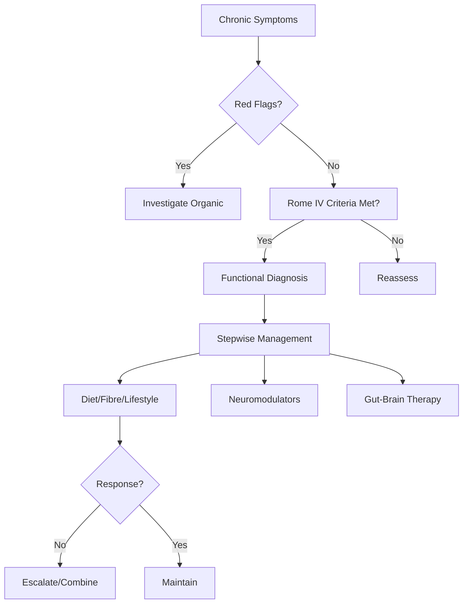

## Learning Objectives
- Define the functional disorder using Rome IV criteria
- Distinguish from organic mimics using clinical clues and targeted testing
- Apply the brain-gut interaction model to patient explanation and management
- Implement stepwise management: lifestyle/diet → neuromodulators → psychological therapy
- Identify red flags requiring structural investigation# Functional bloating and gut-brain interaction disorders

## Definition
Functional bloating is recurrent abdominal fullness/distension without structural explanation, often within the broader spectrum of gut-brain interaction disorders.

## Clinical clues
- Distension worsening through the day
- Bloating with normal basic tests
- Overlap with IBS, anxiety, food sensitivity, constipation
- Symptoms fluctuate with meals and stress

## Pathophysiology themes
- Visceral hypersensitivity
- Altered motility and gas handling
- Brain-gut signaling disturbance
- Pelvic floor or abdominal wall dysfunction in selected patients

## Exclude organic disease when indicated
- Weight loss
- Anaemia
- Nocturnal symptoms
- Persistent vomiting
- Significant abnormal inflammatory markers

## Management
- Reassurance after appropriate evaluation
- Identify trigger foods and constipation overlap
- IBS-style measures where appropriate
- Treat stress/anxiety contributors
- Consider pelvic floor therapy if needed

## Exam pearls
- Bloating can be severe despite normal investigations.
- Do not over-investigate endlessly once alarms are excluded.
- Distension is not synonymous with ascites or obstruction.

## One-page summary
Functional bloating is a **gut-brain interaction disorder** characterized by troublesome fullness/distension after exclusion of alarm pathology. Management is symptom-directed and overlap-aware.

## MCQs (10)
1. Functional bloating is a form of? **Gut-brain interaction disorder**.
2. Common overlap? **IBS**.
3. Daily worsening pattern is common? **Yes**.
4. Major first step? **Exclude alarm features**.
5. Main mechanism theme? **Visceral hypersensitivity**.
6. Normal investigations exclude severe symptoms? **No**.
7. Constipation overlap should be treated? **Yes**.
8. Weight loss is? **Alarm feature**.
9. Distension always means obstruction? **No**.
10. Management is mainly? **Symptom-directed**.

## SBA Questions (10)
1. Chronic bloating, normal tests, worse later in day: likely diagnosis? **Functional bloating**.
2. Most common overlapping disorder? **IBS**.
3. Best initial management after appropriate exclusion? **Explanation and overlap-directed treatment**.
4. Stress worsens symptoms because of? **Brain-gut interaction effects**.
5. Alarm feature prompting further workup? **Anaemia/weight loss**.
6. Distension and constipation together should prompt treatment of? **Constipation overlap**.
7. Best exam-safe phrase? **Functional bloating belongs to disorders of gut-brain interaction**.
8. Endless repeated normal tests usually help? **No**.
9. Important nonorganic contributor? **Anxiety/stress**.
10. Pelvic floor dysfunction may contribute in? **Selected patients**.

## Flashcards
- Q: Functional bloating belongs to what category?  
  A: Gut-brain interaction disorders.
- Q: Common overlap?  
  A: IBS or constipation.
- Q: Key alarm feature?  
  A: Weight loss/anaemia.
- Q: Mechanism theme?  
  A: Visceral hypersensitivity.
- Q: Management style?  
  A: Reassurance plus overlap-directed therapy.

## Mind Map

## Flowchart

## Must Know / Should Know / Nice to Know
### Must Know
- Functional bloating = recurrent bloating/distension without meeting IBS criteria
- Gut-brain interaction disorders: visceral hypersensitivity, altered gut-brain axis
- Exclude organic causes: SIBO, carbohydrate malabsorption, coeliac, pancreatic insufficiency
- Low-FODMAP diet, probiotics, hypnotherapy, neuromodulators (TCAs/SSRIs)
- Rome IV: ≥1 day/week for 3 months, onset >6 months ago

### Should Know
- Special populations (elderly, post-surgical, eating disorders)
- Microbiome modulation (pre/pro/synbiotics)
- Digital therapeutics (CBT apps)

### Nice to Know
- Visceral hypersensitivity mechanisms
- Mast cell involvement
- Genetic polymorphisms (SCN5A, GRM7)

## Self-Test Scorecard
- Can I state the Rome IV criteria? /10
- Can I list 3 organic mimics to exclude? /10
- Can I outline the management algorithm? /10
- Can I explain the brain-gut axis model? /10

**Interpretation:**
- **<35/40** = weak topic
- **35-36/40** = acceptable but insecure
- **37+/40** = exam-ready

## Revision Prompts
- What are the Rome IV criteria for this condition?
- How do you distinguish functional from organic causes?
- What is the stepwise management approach?

## Answer Key with Explanations

