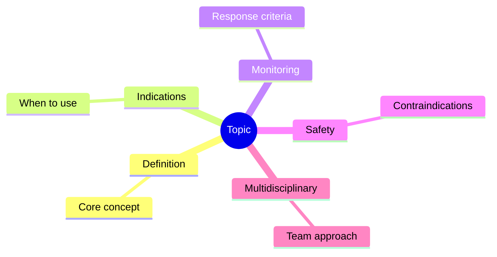
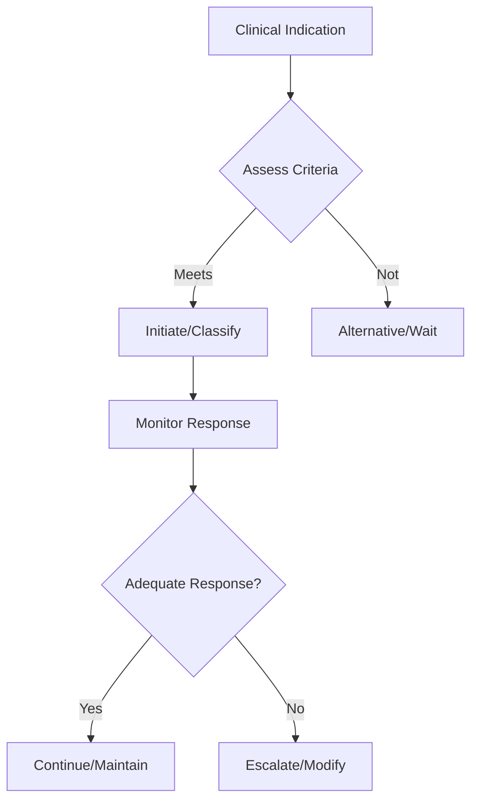

## Learning Objectives
- Identify the indication and place in therapy for this intervention/classification
- Recognize the key monitoring parameters and treatment response criteria
- Apply the step-up/step-down logic for therapy adjustment
- Understand the safety profile and contraindications
- Outline the multidisciplinary coordination required# Immunomodulators and biologics in IBD

## Core role
These agents maintain remission, reduce steroid dependence, and treat moderate-severe or fistulizing IBD when simple induction therapy is insufficient.

## Immunomodulators
- Azathioprine / mercaptopurine
- Methotrexate in selected Crohn settings
- Slow onset: not ideal as sole rapid induction in a very sick flare

## Biologics / advanced therapy classes
- Anti-TNF agents
- Anti-integrin therapy
- Anti-IL-12/23 or IL-23 pathway therapy
- Small-molecule targeted therapies in selected settings

## When to think escalation
- Steroid dependence
- Frequent relapse
- Perianal or fistulizing Crohn disease
- Severe endoscopic/radiologic burden
- Failure of 5-ASA/steroids alone

## Pre-treatment checks
- TB and hepatitis screening
- Vaccination review
- CBC/LFT baseline
- Infection/sepsis exclusion

## Key cautions
- Infection risk
- Bone marrow/hepatic toxicity with thiopurines
- Pancreatitis with azathioprine in some patients
- Biologics should not be started blindly in uncontrolled sepsis/abscess

## One-page summary
Immunomodulators and biologics are **steroid-sparing, remission-maintaining, and complication-directed** therapies in IBD. Always screen for infection and latent infection before treatment.

## MCQs (10)
1. Thiopurine example? **Azathioprine**.
2. Fastest role of thiopurines in acute severe flare? **Limited**.
3. Major reason to escalate? **Steroid dependence**.
4. Pre-biologic check? **TB screening**.
5. Abscess before biologic? **Treat sepsis first**.
6. Anti-TNF drugs are used in? **Moderate-severe IBD**.
7. One thiopurine toxicity? **Bone marrow suppression**.
8. Perianal fistulizing Crohn often needs? **Advanced therapy**.
9. Vaccination review is important because? **Immunosuppression increases infection risk**.
10. Main long-term benefit? **Steroid-sparing remission maintenance**.

## SBA Questions (10)
1. Repeated steroid-requiring UC flares: next principle? **Steroid-sparing escalation**.
2. Crohn with fistula and abscess: before biologic, do what? **Control sepsis**.
3. Baseline screen before anti-TNF? **TB/hepatitis**.
4. Thiopurine onset is? **Slow**.
5. Main indication for biologic in perianal disease? **Complex/fistulizing Crohn**.
6. New fever after immunosuppression should raise? **Infection concern**.
7. Best exam-safe phrase? **Advanced therapy follows risk-stratified, infection-aware assessment**.
8. Azathioprine can cause? **Pancreatitis**.
9. Persistent steroid use is undesirable because? **Toxicity and dependency**.
10. These drugs replace need for monitoring? **No**.

## Flashcards
- Q: Classic thiopurine?  
  A: Azathioprine.
- Q: Key pre-biologic infection screen?  
  A: TB and hepatitis.
- Q: Major escalation trigger?  
  A: Steroid dependence or refractory disease.
- Q: Abscess before biologic?  
  A: Drain/control sepsis first.
- Q: Long-term goal?  
  A: Steroid-free remission.

## Mind Map

## Flowchart

## Must Know / Should Know / Nice to Know
### Must Know
- Key indications and contraindications
- Dosing/monitoring parameters
- Step-up/step-down decision logic
- Safety monitoring requirements

### Should Know
- Special populations
- Drug interactions
- Refractory management
- Cost considerations

### Nice to Know
- Pharmacogenomics
- Emerging agents/techniques
- Long-term outcomes

## Self-Test Scorecard
- Can I state the key indications? /10
- Can I list monitoring parameters? /10
- Can I explain the step-up logic? /10
- Can I identify contraindications? /10

**Interpretation:**
- **<35/40** = weak topic
- **35-36/40** = acceptable but insecure
- **37+/40** = exam-ready

## Revision Prompts
- What are the key indications for this intervention?
- How is response monitored?
- What are the safety concerns?

## Answer Key with Explanations
### MCQs
- 1. **A** — [explanation]
- 2. **B** — [explanation]
...

### SBAs
- 1. **A** — [explanation]
...

