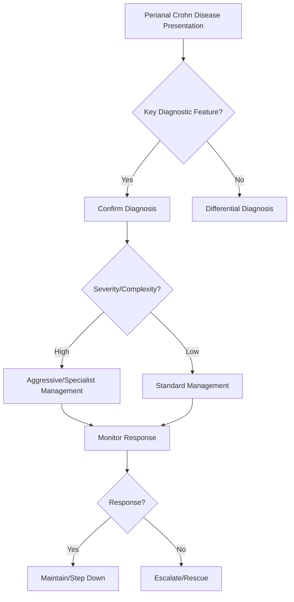

## Learning Objectives
- Define perianal Crohn disease: fistulas, abscesses, fissures, tags, stenosis in anal/perianal region, occurring in up to 40% of Crohn patients.
- Classify by complexity: simple (low intersphincteric, superficial) vs complex (high transsphincteric, suprasphincteric, multiple, horseshoe, with abscess/rectovaginal fistula).
- Apply the stepwise management: antibiotics (metronidazole/ciprofloxacin) + seton drainage for abscess/fistula → immunomodulator/biologic (anti-TNF) for fistula healing → surgery (fistulotomy/LIFT/flap) for selected simple fistulas → advancement flap/stem cells for complex refractory.
- Understand the multidisciplinary approach: gastroenterology + colorectal surgery + radiology (MRI pelvis = gold standard for mapping).
- Recognize the risk factors: rectal involvement, penetrating phenotype, smoking, long disease duration.# Perianal Crohn disease

## Definition
Perianal Crohn disease includes fissures, fistulae, abscesses, tags, and complex perianal sepsis related to Crohn inflammation.

## Clinical clues
- Recurrent perianal pain or discharge
- Fistula openings
- Non-healing fissures in unusual positions
- Abscess, fever, local tenderness
- Associated diarrhoea/weight loss or known Crohn disease

## Why it matters
Perianal disease marks more complex Crohn phenotype and often requires combined medical-surgical management.

## Investigation
- Examination including drainage points and abscess suspicion
- Pelvic MRI is highly useful
- EUA with colorectal surgeon when needed
- Assess luminal activity and nutrition

## Management
- Drain abscess urgently when present
- Antibiotics as adjunct in selected cases
- Seton placement for fistulizing disease where indicated
- Biologics are often important for complex disease
- Optimize nutrition and smoking cessation

## Exam traps
- Treating abscess with immunosuppression before drainage.
- Forgetting MRI/EUA mapping for complex fistulae.
- Assuming every fissure is simple idiopathic fissure.

## One-page summary
Perianal Crohn disease is a **marker of complex penetrating phenotype**. Key priorities are **exclude/drain abscess, map fistula anatomy, and coordinate medical plus surgical treatment**.

## MCQs (10)
1. Key imaging test? **Pelvic MRI**.
2. First step if abscess present? **Drainage**.
3. Perianal disease suggests what Crohn behavior? **Penetrating/complex disease**.
4. Fistula control may involve? **Seton**.
5. Biologics often used in? **Complex fistulizing disease**.
6. Antibiotics alone cure all complex disease? **No**.
7. Non-healing atypical fissure should raise? **Crohn suspicion**.
8. Important exam under anaesthesia abbreviation? **EUA**.
9. Smoking cessation matters? **Yes**.
10. Main management style? **Combined medico-surgical**.

## SBA Questions (10)
1. Painful fluctuant perianal swelling in Crohn patient: next step? **Urgent abscess drainage**.
2. Recurrent fistulae in known Crohn disease: best imaging? **Pelvic MRI**.
3. Main reason perianal disease matters? **It indicates complex phenotype and affects treatment**.
4. Seton is used mainly for? **Fistula management**.
5. Giving steroids/biologics before draining abscess is dangerous because? **Sepsis may worsen**.
6. Non-midline chronic fissure suggests? **Secondary cause such as Crohn**.
7. Best overall approach? **GI and colorectal joint care**.
8. Important lifestyle issue? **Smoking worsens Crohn outcomes**.
9. Persistent discharge usually implies? **Fistulizing disease**.
10. Best exam-safe phrase? **Perianal Crohn disease requires anatomical mapping and sepsis control before definitive escalation**.

## Flashcards
- Q: Best imaging for fistulizing perianal Crohn disease?  
  A: Pelvic MRI.
- Q: First treatment for abscess?  
  A: Drain it.
- Q: Device often used in fistula management?  
  A: Seton.
- Q: Disease phenotype implication?  
  A: Complex penetrating disease.
- Q: Main team approach?  
  A: Combined GI and colorectal care.


## Mind Map
```mermaid
mindmap
  root((Perianal Crohn Disease))
    Definition
      Perianal Crohn = fistulas/abscesses in 40% Crohn...
    Key Features
      MRI pelvis = gold standard mapping...
    Diagnosis
      Abscess = I&D + seton; Fistula = draining seton → ...
    Management
      Anti-TNF (infliximab/adalimumab) = fistula healing...
    Complications
      Surgery only for simple fistulas; complex = biolog...
```

## Flowchart


## Must Know / Should Know / Nice to Know
### Must Know
- Perianal Crohn = fistulas/abscesses in 40% Crohn
- MRI pelvis = gold standard mapping
- Abscess = I&D + seton; Fistula = draining seton → anti-TNF
- Anti-TNF (infliximab/adalimumab) = fistula healing cornerstone
- Surgery only for simple fistulas; complex = biologics + seton

### Should Know
- VAAFT/LIFT/advancement flap for selected
- Topical tacrolimus/metronidazole adjunct
- Stem cell therapy (darvadstrocel) for refractory complex

### Nice to Know
- Perianal disease activity index (PDAI)
- Proctectomy for end-stage rectal disease

## Self-Test Scorecard
- Can I define Perianal Crohn Disease correctly? /10
- Can I list 4 key features? /10
- Can I explain the diagnostic approach? /10
- Can I outline the management? /10

**Interpretation:**
- **<35/40** = weak topic
- **35-36/40** = acceptable but insecure
- **37+/40** = exam-ready

## Revision Prompts
- What is Perianal Crohn Disease?
- What are the key diagnostic features?
- What is the management approach?

## Answer Key with Explanations


