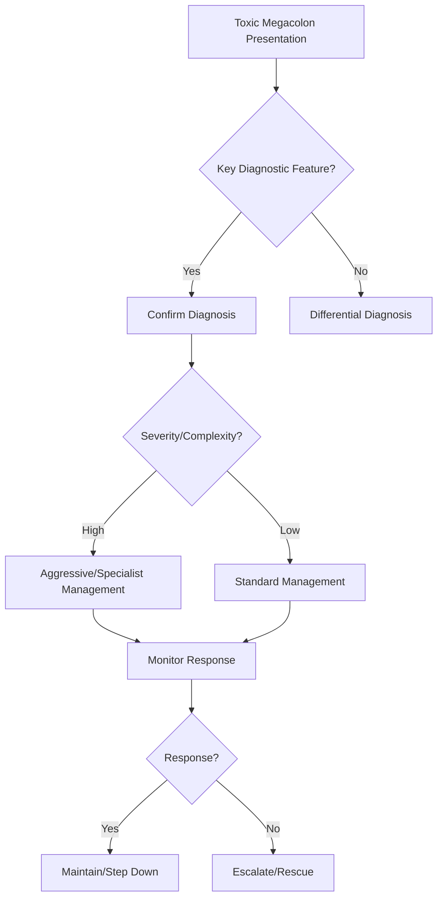

## Learning Objectives
- Define toxic megacolon: acute colonic dilatation (>6cm transverse colon on AXR) with systemic toxicity in context of severe colitis (UC, C. diff, ischaemic, infectious).
- Recognize the diagnostic criteria: abdominal distension/pain, fever, tachycardia, leukocytosis, DXR showing colonic dilatation >6cm + thumbprinting/haustral loss.
- Understand the pathogenesis: transmural inflammation → smooth muscle paralysis → atony → dilatation → risk of perforation.
- Apply the emergency management: NBM, NG decompression, IV fluids, IV steroids (if UC), IV antibiotics (broad-spectrum), correct electrolytes, serial AXR, avoid opioids/anticholinergics.
- Understand the surgical threshold: failure of medical therapy (24-72h), perforation, peritonitis, uncontrolled bleeding → subtotal colectomy + end ileostomy.# Toxic megacolon

## Definition
Toxic megacolon is acute severe colitis with systemic toxicity and pathological colonic dilatation, creating a high risk of perforation and death.

## Causes
- Ulcerative colitis
- Crohn colitis
- Infective colitis including *C. difficile*
- Ischaemic or other severe colitis less commonly

## Clinical features
- Severe bloody diarrhoea
- Abdominal pain and distension
- Fever, tachycardia, dehydration
- Reduced bowel sounds, tenderness
- Toxic look / sepsis physiology

## Investigations
- FBC, CRP, electrolytes, albumin
- Stool infection testing
- Abdominal X-ray/CT showing colonic dilatation
- Avoid full colonoscopy in unstable dilated colon

## Management
1. Admit urgently under senior GI/surgical care.
2. IV fluids, electrolyte correction, VTE prophylaxis.
3. High-dose IV steroids if IBD flare likely after infection workup.
4. Treat infection if present.
5. Daily abdominal exam and imaging review.
6. Early colorectal surgical involvement.

## Red flags for surgery
- Perforation
- Worsening sepsis
- Rising dilatation or tenderness
- Failure of medical rescue

## Exam pearls
- This is a **medical and surgical emergency**.
- Do not give antidiarrhoeals/opiates casually.
- Colon dilatation plus systemic toxicity is the key pattern.

## One-page summary
Toxic megacolon is a life-threatening colitis complication marked by **toxic systemic upset + dilated colon**. Management requires **urgent admission, intensive monitoring, IV therapy, infection exclusion, steroids when appropriate, and early surgery input**.

## MCQs (10)
1. Core radiologic feature? **Colonic dilatation**.
2. Common underlying disease? **Ulcerative colitis**.
3. Major risk? **Perforation**.
4. Colonoscopy in unstable dilated colon? **Avoid full colonoscopy**.
5. Key management team? **GI plus colorectal surgery**.
6. Important infection mimic? ***C. difficile***.
7. Initial steroid route in IBD flare context? **IV**.
8. Antidiarrhoeals can be dangerous? **Yes**.
9. Systemic toxicity is required? **Yes, by definition/pattern**.
10. Emergency level? **High**.

## SBA Questions (10)
1. UC patient with distension, fever, tachycardia, and dilated transverse colon: diagnosis? **Toxic megacolon**.
2. Best immediate disposition? **Urgent inpatient multidisciplinary care**.
3. Main fatal complication? **Perforation/sepsis**.
4. Why avoid routine full colonoscopy? **Risk in dilated fragile colon**.
5. Important stool test? ***C. difficile***.
6. Medical rescue in likely IBD flare begins with? **IV steroids after exclusion workup**.
7. Persistent worsening despite therapy should trigger? **Surgical escalation**.
8. Which drug class should be used cautiously/avoided? **Antimotility agents/opiates**.
9. Best exam-safe phrase? **Toxic megacolon is an emergency defined by severe colitis plus systemic toxicity and colonic dilatation**.
10. Daily monitoring should include? **Clinical exam and abdominal imaging/labs**.

## Flashcards
- Q: Hallmark imaging finding in toxic megacolon?  
  A: Colonic dilatation.
- Q: Two hallmark bedside features?  
  A: Distension and systemic toxicity.
- Q: Major feared complication?  
  A: Perforation.
- Q: Core treatment setting?  
  A: Urgent GI + surgical care.
- Q: Common trigger disease?  
  A: Ulcerative colitis.


## Mind Map
```mermaid
mindmap
  root((Toxic Megacolon))
    Definition
      Toxic megacolon = colonic dilatation >6cm + system...
    Key Features
      Context: severe UC, C. diff, ischaemic, infectious...
    Diagnosis
      DXR: >6cm transverse colon + thumbprinting...
    Management
      Medical: NBM, NG, IV fluids, steroids (UC), antibi...
    Complications
      Surgery if fail 24-72h or perforation/peritonitis/...
```

## Flowchart


## Must Know / Should Know / Nice to Know
### Must Know
- Toxic megacolon = colonic dilatation >6cm + systemic toxicity
- Context: severe UC, C. diff, ischaemic, infectious colitis
- DXR: >6cm transverse colon + thumbprinting
- Medical: NBM, NG, IV fluids, steroids (UC), antibiotics, no opioids!
- Surgery if fail 24-72h or perforation/peritonitis/bleed: subtotal colectomy

### Should Know
- CXR for free air if perforation suspected
- C. diff: vancomycin + metronidazole, consider IVIG
- Avoid colonoscopy (perforation risk); limited sigmoidoscopy if needed

### Nice to Know
- Neostigmine for acute colonic pseudo-obstruction (Ogilvie) differential
- Early surgical consultation

## Self-Test Scorecard
- Can I define Toxic Megacolon correctly? /10
- Can I list 4 key features? /10
- Can I explain the diagnostic approach? /10
- Can I outline the management? /10

**Interpretation:**
- **<35/40** = weak topic
- **35-36/40** = acceptable but insecure
- **37+/40** = exam-ready

## Revision Prompts
- What is Toxic Megacolon?
- What are the key diagnostic features?
- What is the management approach?

## Answer Key with Explanations


