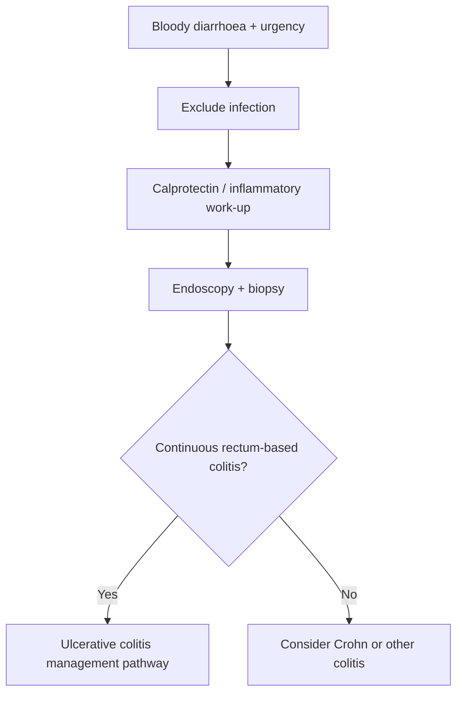

# Ulcerative colitis

Related: [[../Gastroenterology MOC|Gastroenterology MOC]] · [[../Inflammatory and Functional Bowel Disorders|Inflammatory and Functional Bowel Disorders]] · [[Crohn disease]] · [[Acute severe ulcerative colitis]] · [[IBD severity assessment and extent classification]] · [[Cancer surveillance and vaccination issues in IBD]]

## Learning Objectives
- Define ulcerative colitis and distinguish it from Crohn disease.
- Recognize severity, extent, and complications.
- Use investigation and management logic for FCPS/MRCP.
- Understand emergency red flags including acute severe ulcerative colitis.

## Definition
Ulcerative colitis (UC) is a chronic inflammatory bowel disease characterized by **continuous mucosal inflammation of the colon starting in the rectum and extending proximally for a variable distance**.

## Anatomy
- disease begins in the **rectum**
- extends proximally in a continuous fashion
- limited to the colon

## Physiology / Pathology
- inflammation is predominantly mucosal
- inflamed mucosa bleeds easily and produces urgency, tenesmus, and bloody diarrhoea

## Classification
### By extent
- ulcerative proctitis
- left-sided colitis
- extensive colitis / pancolitis

### By severity
- mild
- moderate
- severe
- acute severe ulcerative colitis (separate emergency entity)

## Etiology / Risk Factors
- immune dysregulation in genetically susceptible host
- environmental influences
- family history may contribute

## Pathophysiology
- chronic immune-mediated colonic mucosal inflammation
- mucosal ulceration causes bleeding and diarrhoea
- chronic disease can lead to anaemia, malnutrition, and dysplasia risk over time

## Clinical Features
- bloody diarrhoea
- urgency
- tenesmus
- lower abdominal cramping
- nocturnal stool may occur
- weight loss in more extensive/severe disease

### Extraintestinal clues
- arthralgia
- skin/eye manifestations in IBD context

## Investigations
### Baseline
- CBC
- CRP/ESR
- albumin
- U&E
- stool tests to exclude infection where appropriate

### GI-focused
- faecal calprotectin
- flexible sigmoidoscopy or colonoscopy with biopsy

### Endoscopic clues
- continuous inflammation
- rectal involvement
- friable mucosa
- superficial ulceration

## Interpretation Framework
### UC vs Crohn exam logic
**Ulcerative colitis**
- colon only
- rectum usually involved
- continuous disease
- mucosal inflammation

**Crohn disease**
- mouth to anus possible
- skip lesions
- transmural disease
- fistula/stricture more typical

## Diagnosis
Diagnosis is based on:
- compatible clinical picture
- inflammatory markers / calprotectin support
- endoscopy with biopsy
- exclusion of infective colitis

## Differential Diagnosis
- [[Crohn disease]]
- infective colitis
- ischemic colitis
- microscopic colitis (non-bloody chronic diarrhoea pattern)
- colorectal neoplasia in selected older patients

## Management
### Mild to moderate distal disease
- aminosalicylate-based therapy is central
- topical therapy may be important in rectal/distal disease

### More extensive / active disease
- systemic steroids for induction when required
- escalate according to severity and response
- immunomodulator/biologic strategy in selected chronic relapsing disease

### Supportive principles
- nutritional and anaemia assessment
- thromboembolism awareness in active IBD
- surveillance planning in long-standing extensive disease

## Complications
- anaemia
- severe flare / acute severe ulcerative colitis
- toxic megacolon
- colorectal dysplasia/cancer risk with long-standing extensive disease

## Red Flags / Emergencies
- frequent bloody stool with systemic toxicity
- tachycardia, fever, abdominal distension
- severe pain / toxic megacolon concern
- dehydration / significant anaemia

## One-Page Summary
- UC = **continuous colitis starting at the rectum**.
- Symptoms: **bloody diarrhoea, urgency, tenesmus**.
- Colon only; mucosal disease.
- Diagnose with endoscopy + biopsy after excluding infection.
- Distinguish from Crohn: **continuous vs skip**, **colon only vs anywhere**, **mucosal vs transmural**.
- Watch for **acute severe UC** and **toxic megacolon**.

## FCPS/MRCP High-Yield Points
- Rectal involvement is classic.
- Continuous disease pattern is classic.
- Bloody diarrhoea + urgency + tenesmus strongly suggest UC.
- Long-standing extensive disease raises surveillance issues.

## Common Viva Traps
- Confusing UC with Crohn disease.
- Forgetting infection exclusion.
- Missing acute severe UC as an emergency.

## Mind Map
- Ulcerative colitis
  - rectum first
  - continuous colitis
  - mucosal inflammation
  - bloody diarrhoea
  - urgency / tenesmus
  - complications
    - acute severe UC
    - toxic megacolon
    - cancer risk

## Flowchart

## Revision Prompts
- Define UC in one sentence.
- What features distinguish UC from Crohn?
- Name 3 complications.
- What symptoms suggest severe flare?

## MCQs (10)
1. Ulcerative colitis typically:
A. Starts in rectum and extends continuously proximally
B. Has skip lesions throughout small bowel only
C. Causes fistulae in every case
D. Spares the colon

2. A classic symptom is:
A. Bloody diarrhoea with urgency
B. Isolated jaundice
C. Hematuria
D. Dry cough

3. In UC, inflammation is mainly:
A. Mucosal
B. Always transmural
C. Retroperitoneal
D. Hepatic only

4. Which pattern favors UC over Crohn?
A. Continuous rectal involvement
B. Skip lesions
C. Perianal fistula
D. Small bowel strictures

5. An important investigation is:
A. Endoscopy with biopsy
B. EEG
C. Echocardiography
D. Spirometry

6. A major emergency complication is:
A. Toxic megacolon
B. Renal stone only
C. Otitis media
D. Cataract

7. Which is a key step before firm diagnosis?
A. Exclude infective colitis
B. Ignore stool history
C. Start dialysis
D. Avoid all tests

8. UC is limited anatomically to the:
A. Colon
B. Lung
C. Kidney
D. Pancreas only

9. Long-standing extensive UC increases risk of:
A. Colorectal dysplasia/cancer
B. Appendicitis only
C. Gallstones only
D. Asthma

10. Which statement is correct?
A. UC commonly causes urgency and tenesmus
B. UC never bleeds
C. UC always affects the ileum first
D. UC is a pancreatic disease

## SBA Questions (10)
1. A 24-year-old has bloody diarrhoea, urgency, and tenesmus. Endoscopy shows continuous inflammation from the rectum. Best diagnosis?
A. Ulcerative colitis
B. Crohn disease
C. IBS
D. Acute pancreatitis

2. A patient with chronic bloody diarrhoea needs an important exclusion before IBD confirmation:
A. Infective colitis
B. Migraine
C. Nephrolithiasis
D. Asthma

3. Which feature best distinguishes UC from Crohn?
A. Continuous rectum-based disease
B. Mouth ulcers
C. Perianal fistula
D. Skip lesions

4. A patient with UC becomes tachycardic, febrile, and more distended. Main concern?
A. Severe flare / toxic megacolon risk
B. Stable remission
C. Pure IBS
D. Lactose intolerance only

5. Mild distal UC is often managed with:
A. Aminosalicylate-based approach
B. Thrombolysis
C. Hemodialysis
D. Cataract extraction

6. Which symptom is especially rectal in flavor?
A. Tenesmus
B. Hemoptysis
C. Polyuria
D. Tinnitus

7. Which complication is long-term?
A. Colorectal dysplasia risk
B. Pneumothorax
C. Renal infarction only
D. Hepatic coma only

8. A colon-only chronic inflammatory disease starting at the rectum is most likely:
A. Ulcerative colitis
B. Coeliac disease
C. Pancreatic cancer
D. Achalasia

9. Which test helps support intestinal inflammation before endoscopy?
A. Faecal calprotectin
B. PSA
C. Troponin
D. INR only

10. Best principle in UC flare management?
A. Match therapy to extent and severity
B. Use one identical treatment forever regardless of severity
C. Ignore anaemia and nutrition
D. Never monitor response

## Flashcards
- Q: Where does UC classically start?  
  A: The rectum.
- Q: Is UC continuous or skip-lesion disease?  
  A: Continuous disease.
- Q: Is UC mucosal or transmural?  
  A: Mainly mucosal.
- Q: Name 3 classic symptoms.  
  A: Bloody diarrhoea, urgency, tenesmus.
- Q: Name a major acute complication.  
  A: Toxic megacolon / acute severe UC.

## Answer Key with Explanations
### MCQs
1. **A** — this is the defining anatomic pattern.
2. **A** — bloody diarrhoea with urgency is classic.
3. **A** — UC is predominantly mucosal.
4. **A** — continuous rectal disease supports UC.
5. **A** — endoscopy with biopsy is central.
6. **A** — toxic megacolon is a major emergency complication.
7. **A** — infection must be excluded.
8. **A** — UC is confined to the colon.
9. **A** — long-standing extensive colitis raises dysplasia risk.
10. **A** — urgency and tenesmus are classic rectal symptoms.

### SBAs
1. **A** — classic UC pattern.
2. **A** — infection exclusion is essential.
3. **A** — this is the hallmark distinction.
4. **A** — systemic toxicity suggests severe flare.
5. **A** — aminosalicylates are central in mild-moderate distal disease.
6. **A** — tenesmus reflects rectal involvement.
7. **A** — surveillance becomes important over time.
8. **A** — this is the classic anatomy.
9. **A** — calprotectin supports inflammatory disease.
10. **A** — severity/extent should guide therapy.

## Must Know / Should Know / Nice to Know
### Must Know
- UC = continuous mucosal inflammation from rectum proximally; never involves small bowel (except backwash ileitis)
- Extent: proctitis, left-sided, extensive; severity: mild/moderate/severe (Truelove-Witts)
- Diagnosis: endoscopic (continuous, friable, ulcers) + histology (crypt abscesses, goblet cell depletion)
- Management: 5-ASA (mild-moderate), steroids (flare), thiopurines/biologics (steroid-dependent), colectomy (refractory/cancer)
- Surveillance: colonoscopy 8-10yr after onset, then 1-3yr; dysplasia = colectomy

### Should Know
- Advanced management options
- Special populations (pregnancy, elderly)
- Emerging therapies

### Nice to Know
- Molecular pathogenesis
- Genetic risk scores
- Global epidemiology

## Self-Test Scorecard
- Can I define the condition? /10
- Can I list 4 diagnostic criteria? /10
- Can I outline the management algorithm? /10
- Can I name 3 complications? /10

**Interpretation:**
- **<35/40** = weak topic
- **35-36/40** = acceptable but insecure
- **37+/40** = exam-ready

