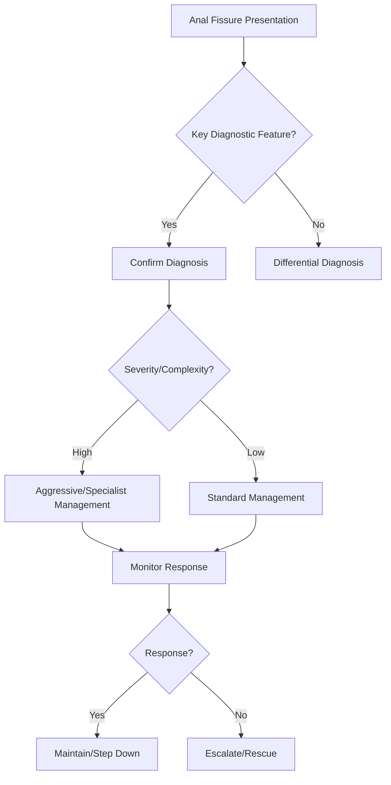

## Learning Objectives
- Define anal fissure: longitudinal tear in anal mucosa distal to dentate line, usually posterior midline.
- Recognize the classic presentation: sharp tearing pain during/after defecation, bright red blood on toilet paper, sphincter spasm.
- Distinguish acute (superficial) from chronic (sentinel pile, hypertrophied papilla, indurated edges, >6 weeks).
- Apply conservative management: high-fibre, stool softeners, sitz baths, topical calcium channel blockers/nitrates (relax internal sphincter).
- Outline surgical options: lateral internal sphincterotomy (gold standard, >90% healing), Botox injection (temporary).# Anal fissure

## Definition
Anal fissure is a linear tear in the anoderm causing severe pain on defecation and small-volume bright rectal bleeding.

## Clinical pattern
- Sharp pain during and after stool passage
- Fear of defecation and constipation cycle
- Small streaks of bright blood
- Posterior midline common in simple fissure

## Secondary fissure clues
- Lateral or multiple fissures
- Crohn disease, TB, malignancy, STI or trauma suspicion

## Management
- Stool softening and fiber strategy
- Warm sitz baths and analgesia
- Topical vasodilator therapy or similar local therapy
- Surgery if chronic refractory fissure

## Exam pearls
- Fissure bleeding is usually small-volume.
- Pain is much more prominent than in haemorrhoids.
- Lateral fissure is a red flag for secondary cause.

## One-page summary
Anal fissure causes **painful defecation with small bright bleeding**. The key exam distinction from haemorrhoids is **pain prominence**, and lateral fissures require search for a secondary cause.

## MCQs (10)
1. Main symptom? **Pain on defecation**.
2. Bleeding volume? **Small**.
3. Typical site? **Posterior midline**.
4. Lateral fissure suggests? **Secondary cause**.
5. Common vicious cycle? **Pain → stool withholding → constipation**.
6. Similar painless bright bleeding disorder? **Haemorrhoids**.
7. First management aim? **Soften stool**.
8. Sitz baths may help? **Yes**.
9. Chronic refractory case may need? **Surgery**.
10. Pain more than haemorrhoids? **Yes**.

## SBA Questions (10)
1. Severe tearing pain with stool and small bright blood: likely diagnosis? **Anal fissure**.
2. Key feature distinguishing from haemorrhoids? **Pain prominence**.
3. Lateral fissure should prompt search for? **Secondary pathology**.
4. First-line management principle? **Stool softening and local conservative care**.
5. Why do fissures become chronic? **Pain causes withholding and recurrent trauma**.
6. Best exam-safe phrase? **Posterior midline fissure is common; lateral fissure is suspicious**.
7. Small-volume bleeding is typical? **Yes**.
8. Crohn disease can present with? **Secondary fissure**.
9. Refractory chronic fissure may need? **Surgical treatment**.
10. Bright blood alone without pain is less typical of? **Anal fissure**.

## Flashcards
- Q: Core symptom of anal fissure?  
  A: Painful defecation.
- Q: Typical site?  
  A: Posterior midline.
- Q: Lateral fissure means what?  
  A: Consider secondary cause.
- Q: Typical bleeding amount?  
  A: Small-volume bright blood.
- Q: Main first treatment principle?  
  A: Soften stool and reduce sphincter spasm/trauma.


## Mind Map
```mermaid
mindmap
  root((Anal Fissure))
    Definition
      Fissure = tear in anoderm, usually posterior midli...
    Key Features
      Pain = sharp, tearing, during/after defecation; sp...
    Diagnosis
      Chronic = sentinel pile + hypertrophied papilla + ...
    Management
      Topical GTN/CCB = first-line medical (relax sphinc...
    Complications
      LIS (lateral internal sphincterotomy) = curative; ...
```

## Flowchart


## Must Know / Should Know / Nice to Know
### Must Know
- Fissure = tear in anoderm, usually posterior midline (6 o'clock)
- Pain = sharp, tearing, during/after defecation; spasm perpetuates
- Chronic = sentinel pile + hypertrophied papilla + indurated edges
- Topical GTN/CCB = first-line medical (relax sphincter)
- LIS (lateral internal sphincterotomy) = curative; Botox = temporary

### Should Know
- Anterior fissure in women (childbirth)
- Lateral fissure = think Crohn/TB/malignancy
- Fissure + Crohn = medical not surgical

### Nice to Know
- Fissurectomy + advancement flap
- Calcium channel blockers vs nitrates side-effect profile

## Self-Test Scorecard
- Can I define Anal Fissure correctly? /10
- Can I list 4 key features? /10
- Can I explain the diagnostic approach? /10
- Can I outline the management? /10

**Interpretation:**
- **<35/40** = weak topic
- **35-36/40** = acceptable but insecure
- **37+/40** = exam-ready

## Revision Prompts
- What is Anal Fissure?
- What are the key diagnostic features?
- What is the management approach?

## Answer Key with Explanations


