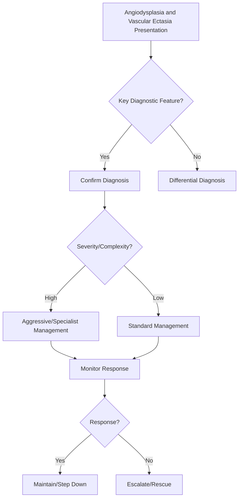

## Learning Objectives
- Define angiodysplasia: acquired degenerative vascular ectasia of colonic mucosa, most common in caecum/ascending colon.
- Recognize the typical patient: elderly, often on anticoagulation, presenting with iron-deficiency anaemia or overt lower GI bleeding.
- Understand the pathogenesis: intermittent colonic wall tension → venous dilatation → mucosal telangiectasia.
- Apply diagnosis: colonoscopy (cherry-red lesions, pulsatile), angiography (if active bleeding), capsule endoscopy (small bowel).
- Outline management: endoscopic ablation (APC, heater probe), argon plasma coagulation, hormonal therapy (oestrogen/progesterone) for recurrent, surgical resection for refractory right-sided.# Angiodysplasia and vascular ectasia

## Definition
Angiodysplasia is a degenerative vascular malformation of the bowel, often in the colon, causing occult or overt bleeding.

## Clinical clues
- Recurrent intermittent bleeding
- Iron deficiency or occult blood loss
- Older age
- Sometimes associated with CKD or aortic stenosis in exam stems

## Investigation
- Colonoscopy may identify ectatic vascular lesions
- Angiography/CTA in active bleeding
- Consider small-bowel evaluation if colonoscopy negative and bleeding recurs

## Management
- Endoscopic coagulation when accessible
- Iron replacement if chronic occult loss
- IR or surgery rarely for refractory severe cases

## One-page summary
Angiodysplasia causes **intermittent recurrent bleeding** and may present as occult loss or overt LGIB. Diagnosis is endoscopic/angiographic, and endoscopic therapy is often effective.

## MCQs (10)
1. Typical age? **Older adults**.
2. Bleeding pattern often? **Intermittent recurrent**.
3. One exam association? **Aortic stenosis**.
4. Common presentation? **Iron deficiency or LGIB**.
5. Main endoscopic treatment? **Coagulation/ablation**.
6. Vascular lesion type? **Ectatic malformation**.
7. Colonoscopy can diagnose? **Yes**.
8. Active bleeding may need? **CTA/angiography**.
9. Chronic occult loss needs? **Iron replacement**.
10. Common differential? **Diverticular bleeding**.

## SBA Questions (10)
1. Recurrent iron deficiency and intermittent maroon stool in elderly: likely cause? **Angiodysplasia**.
2. Colonoscopy shows flat ectatic vascular lesions: diagnosis? **Angiodysplasia**.
3. Best endoscopic treatment principle? **Coagulative therapy**.
4. Why can diagnosis be missed? **Bleeding may be intermittent**.
5. Severe active bleeding may require? **Angiographic localization**.
6. Best exam-safe phrase? **Angiodysplasia is an important cause of recurrent lower GI blood loss in older patients**.
7. Occult bleeding over time commonly leads to? **Iron deficiency anaemia**.
8. Association with aortic stenosis is a classic? **Exam clue**.
9. If chronic slow blood loss only, management includes? **Iron therapy**.
10. Lesions are usually malignant? **No**.

## Flashcards
- Q: Typical bleeding pattern in angiodysplasia?  
  A: Recurrent intermittent bleeding.
- Q: Common age group?  
  A: Older adults.
- Q: Classic exam association?  
  A: Aortic stenosis.
- Q: Common chronic consequence?  
  A: Iron deficiency anaemia.
- Q: Endoscopic treatment?  
  A: Coagulation/ablation.


## Mind Map
```mermaid
mindmap
  root((Angiodysplasia and Vascular Ectasia))
    Definition
      Angiodysplasia = acquired vascular ectasia, caecum...
    Key Features
      Elderly + anticoagulants + IDA or overt LGIB...
    Diagnosis
      Colonoscopy: cherry-red, pulsatile lesions...
    Management
      APC (argon plasma coagulation) = endoscopic treatm...
    Complications
      Refractory: hormonal therapy or right hemicolectom...
```

## Flowchart


## Must Know / Should Know / Nice to Know
### Must Know
- Angiodysplasia = acquired vascular ectasia, caecum/right colon
- Elderly + anticoagulants + IDA or overt LGIB
- Colonoscopy: cherry-red, pulsatile lesions
- APC (argon plasma coagulation) = endoscopic treatment of choice
- Refractory: hormonal therapy or right hemicolectomy

### Should Know
- Heyde syndrome = aortic stenosis + angiodysplasia (acquired von Willebrand)
- Small bowel angioectasia: capsule endoscopy, device-assisted enteroscopy
- Distinguish from radiation proctitis, Dieulafoy

### Nice to Know
- Thalidomide for refractory recurrent bleeding
- Pulsed dye laser alternative to APC

## Self-Test Scorecard
- Can I define Angiodysplasia and Vascular Ectasia correctly? /10
- Can I list 4 key features? /10
- Can I explain the diagnostic approach? /10
- Can I outline the management? /10

**Interpretation:**
- **<35/40** = weak topic
- **35-36/40** = acceptable but insecure
- **37+/40** = exam-ready

## Revision Prompts
- What is Angiodysplasia and Vascular Ectasia?
- What are the key diagnostic features?
- What is the management approach?

## Answer Key with Explanations


