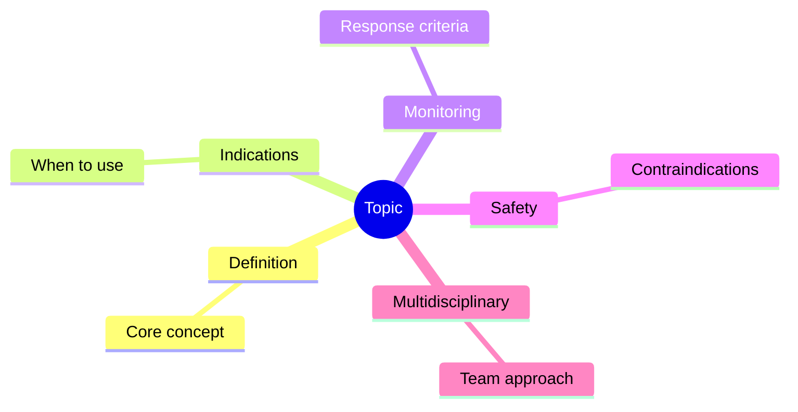
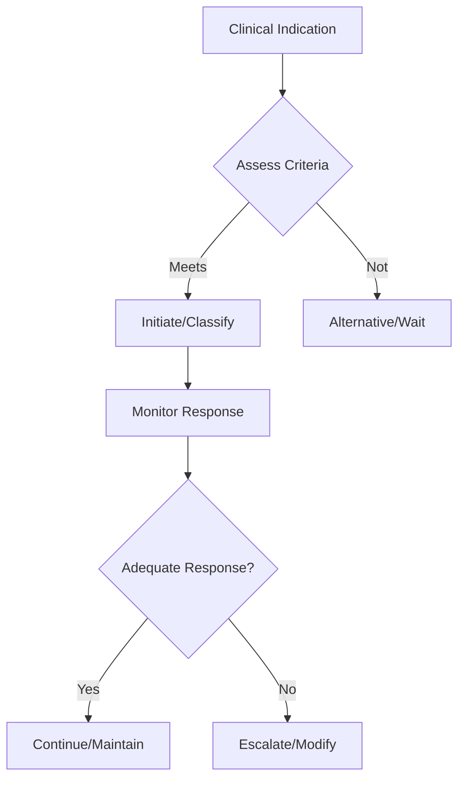

## Learning Objectives
- Identify the indication and place in therapy for this intervention/classification
- Recognize the key monitoring parameters and treatment response criteria
- Apply the step-up/step-down logic for therapy adjustment
- Understand the safety profile and contraindications
- Outline the multidisciplinary coordination required# Initial approach to lower GI bleeding

## Definition
Lower GI bleeding usually presents as haematochezia or maroon stool from a source distal to the ligament of Treitz, though brisk upper GI bleeding can mimic it.

## First priorities
- ABC assessment and haemodynamic status
- IV access, blood tests, group and save
- Decide if bleed is major ongoing or limited self-terminating
- Consider upper GI source if unstable or melena/raised urea clues exist

## Common causes
- Diverticular bleeding
- Angiodysplasia
- Colitis
- Haemorrhoids/fissure
- Colorectal cancer/polyps

## Investigation strategy
- FBC, coagulation, renal function
- Digital rectal exam when appropriate
- Colonoscopy after stabilization in many patients
- CT angiography if active major ongoing bleed

## Red flags
- Shock
- Ongoing large-volume bleeding
- Anticoagulation/coagulopathy
- Significant comorbidity

## One-page summary
Lower GI bleeding assessment starts with **resuscitation and severity stratification**, then source-directed investigation. Always keep **brisk upper GI bleed** in mind as a mimic.

## MCQs (10)
1. Typical stool color? **Fresh red or maroon**.
2. First step? **ABC**.
3. Major mimic if unstable? **Brisk upper GI bleed**.
4. Active ongoing major bleed may need? **CT angiography**.
5. Common cause? **Diverticular bleed**.
6. Digital rectal exam can help? **Yes**.
7. Colonoscopy is done when? **After stabilization in many cases**.
8. Haemodynamic status determines? **Urgency and pathway**.
9. Anticoagulation matters because? **It worsens bleed severity**.
10. Main early task? **Resuscitate and stratify**.

## SBA Questions (10)
1. Elderly patient with large-volume rectal bleeding and tachycardia: first step? **Resuscitation**.
2. Massive haematochezia with shock may still arise from? **Upper GI source**.
3. Best imaging in active brisk LGIB? **CT angiography**.
4. Stable patient after initial workup often proceeds to? **Colonic evaluation/colonoscopy**.
5. Main purpose of group and save? **Prepare transfusion support**.
6. Why not assume haemorrhoids in all bright red bleeding? **Major pathology may coexist**.
7. Best exam-safe phrase? **Severity assessment comes before source labeling**.
8. Ongoing anticoagulation should trigger? **Closer risk assessment and reversal planning if needed**.
9. Important common cause in older adults? **Diverticular disease**.
10. First principle in all GI bleeding? **Assess circulation and shock**.

## Flashcards
- Q: First priority in LGIB?  
  A: ABC and haemodynamic assessment.
- Q: Important mimic of LGIB?  
  A: Brisk upper GI bleeding.
- Q: Common imaging for active severe bleeding?  
  A: CT angiography.
- Q: Common cause in elderly?  
  A: Diverticular bleeding.
- Q: Main early goal?  
  A: Stabilize then localize.

## Mind Map

## Flowchart

## Must Know / Should Know / Nice to Know
### Must Know
- Key indications and contraindications
- Dosing/monitoring parameters
- Step-up/step-down decision logic
- Safety monitoring requirements

### Should Know
- Special populations
- Drug interactions
- Refractory management
- Cost considerations

### Nice to Know
- Pharmacogenomics
- Emerging agents/techniques
- Long-term outcomes

## Self-Test Scorecard
- Can I state the key indications? /10
- Can I list monitoring parameters? /10
- Can I explain the step-up logic? /10
- Can I identify contraindications? /10

**Interpretation:**
- **<35/40** = weak topic
- **35-36/40** = acceptable but insecure
- **37+/40** = exam-ready

## Revision Prompts
- What are the key indications for this intervention?
- How is response monitored?
- What are the safety concerns?

## Answer Key with Explanations
### MCQs
- 1. **A** — [explanation]
- 2. **B** — [explanation]
...

### SBAs
- 1. **A** — [explanation]
...

