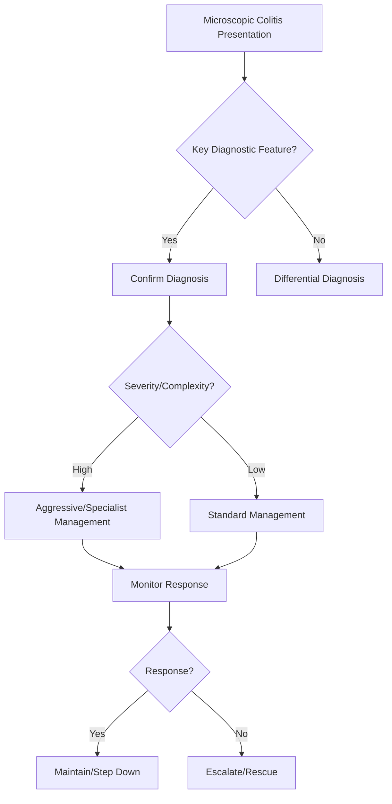

## Learning Objectives
- Define microscopic colitis: chronic watery diarrhoea with normal colonoscopy but characteristic histology - lymphocytic or collagenous colitis.
- Recognize the demographic: middle-aged/older women, often on medications (PPI, NSAIDs, SSRIs, beta-blockers, statins).
- Distinguish subtypes: lymphocytic colitis (>20 IELs/100 epithelial cells) vs collagenous colitis (subepithelial collagen band >10μm).
- Apply diagnosis: random colonic biopsies essential (macroscopically normal); exclude infections, coeliac, bile acid diarrhoea.
- Outline management: budesonide 9mg daily (induction), then taper; stop offending drugs; cholestyramine if bile acid component; anti-TNF for refractory.# Microscopic colitis

## Definition
Microscopic colitis is chronic inflammatory diarrhoea with macroscopically normal colonoscopy but diagnostic histology, classically collagenous or lymphocytic colitis.

## Clinical clues
- Chronic watery non-bloody diarrhoea
- Older women commonly affected
- Normal-looking colonoscopy
- Drug associations: NSAIDs, PPIs, SSRIs in some cases

## Diagnosis
Requires colonic biopsies despite normal mucosal appearance.

## Differential diagnosis
- IBS-D
- Bile acid diarrhoea
- Infectious diarrhoea
- Coeliac-associated diarrhoea

## Management
- Review triggering drugs
- Antidiarrhoeal support
- Budesonide commonly effective
- Treat associated bile acid or coeliac overlap if present

## One-page summary
Microscopic colitis should be suspected in **chronic watery non-bloody diarrhoea with normal colonoscopy**. The diagnosis is **histological**, and budesonide is often effective.

## MCQs (10)
1. Colonoscopy appearance may be? **Normal**.
2. Diagnosis requires? **Biopsy**.
3. Stool pattern? **Watery non-bloody**.
4. Common treatment? **Budesonide**.
5. One subtype? **Collagenous colitis**.
6. One drug association? **PPI/NSAID/SSRI**.
7. Common differential? **IBS-D**.
8. Macroscopic inflammation always obvious? **No**.
9. Older women are commonly affected? **Yes**.
10. Histology is central? **Yes**.

## SBA Questions (10)
1. Chronic watery diarrhoea with normal colonoscopy but positive biopsy: diagnosis? **Microscopic colitis**.
2. Best treatment principle in many cases? **Budesonide**.
3. Why take biopsies despite normal scope? **Disease is microscopic**.
4. Bloody diarrhoea is typical? **No**.
5. Main symptom mimic? **IBS-D**.
6. Medication review matters because? **Some drugs are associated**.
7. Best exam-safe phrase? **Normal endoscopy does not exclude inflammatory diarrhoea**.
8. Which subtype is classic? **Collagenous or lymphocytic colitis**.
9. Age group often affected? **Older adults, often women**.
10. Histology provides? **Definitive diagnosis**.

## Flashcards
- Q: Microscopic colitis stool pattern?  
  A: Chronic watery non-bloody diarrhoea.
- Q: Colonoscopy may appear?  
  A: Normal.
- Q: Essential diagnostic step?  
  A: Colonic biopsies.
- Q: Common effective treatment?  
  A: Budesonide.
- Q: Major mimic?  
  A: IBS-D.


## Mind Map
```mermaid
mindmap
  root((Microscopic Colitis))
    Definition
      Microscopic colitis = chronic watery diarrhoea + n...
    Key Features
      Lymphocytic: >20 IELs/100 enterocytes; Collagenous...
    Diagnosis
      Women >50, PPI/NSAID/SSRI use...
    Management
      Biopsy essential (random, pan-colonic)...
    Complications
      Budesonide 9mg = induction; taper; cholestyramine ...
```

## Flowchart


## Must Know / Should Know / Nice to Know
### Must Know
- Microscopic colitis = chronic watery diarrhoea + normal colonoscopy + histology
- Lymphocytic: >20 IELs/100 enterocytes; Collagenous: >10μm subepithelial collagen band
- Women >50, PPI/NSAID/SSRI use
- Biopsy essential (random, pan-colonic)
- Budesonide 9mg = induction; taper; cholestyramine for BAD overlap

### Should Know
- Association with coeliac, thyroid autoimmunity, RA
- Relapse common after budesonide taper
- Anti-TNF for refractory

### Nice to Know
- Serological markers (anti-Tropomyosin)
- Microbiome alterations

## Self-Test Scorecard
- Can I define Microscopic Colitis correctly? /10
- Can I list 4 key features? /10
- Can I explain the diagnostic approach? /10
- Can I outline the management? /10

**Interpretation:**
- **<35/40** = weak topic
- **35-36/40** = acceptable but insecure
- **37+/40** = exam-ready

## Revision Prompts
- What is Microscopic Colitis?
- What are the key diagnostic features?
- What is the management approach?

## Answer Key with Explanations


