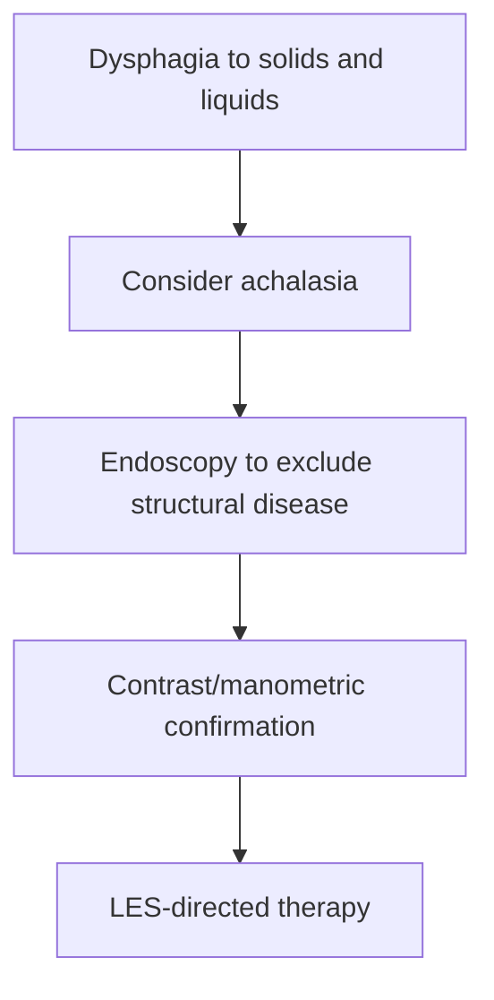

# Achalasia

Related: [[../Gastroenterology MOC|Gastroenterology MOC]] · [[../Oesophageal Disorders|Oesophageal Disorders]] · [[Diffuse oesophageal spasm and motility disorders]]

> [!important]
> Achalasia causes **dysphagia to both solids and liquids** because it is a motility disorder, not a simple structural narrowing.

## Learning Objectives
- Define achalasia.
- Recognize the classic dysphagia pattern.
- Understand key investigations.
- Outline treatment principles.

## Definition
Achalasia is an oesophageal motility disorder characterized by impaired lower oesophageal sphincter relaxation and absent/disordered peristalsis.

## Pathophysiology
- failure of LES relaxation
- loss of coordinated peristalsis
- functional obstruction at the gastro-oesophageal junction
- progressive oesophageal dilatation if longstanding

## Clinical Features
- dysphagia to solids and liquids
- regurgitation of retained food
- nocturnal cough/aspiration in some cases
- weight loss and chest discomfort

## Differential Points
| Feature | Achalasia | Mechanical stricture/cancer |
|---|---|---|
| Solids + liquids | Early | Usually solids first |
| Regurgitation | Common | Less typical early |
| Motility basis | Yes | No |

## Investigations
- endoscopy to exclude pseudoachalasia/structural lesions
- contrast swallow showing classic functional obstruction pattern
- manometric confirmation in specialist pathways

## Management
- pneumatic/endoscopic/surgical LES-directed therapy depending on setting
- symptom relief and aspiration prevention
- nutritional support if advanced disease

## Red Flags
- rapid weight loss/older age → exclude pseudoachalasia from cancer
- recurrent aspiration
- severe inability to swallow

## FCPS/MRCP High-Yield Points
- Dysphagia to liquids and solids from the start suggests motility disorder.
- Endoscopy is still needed to exclude malignant pseudoachalasia.
- Achalasia is a classic viva differential for progressive dysphagia.

## Common Viva Traps
- Calling all dysphagia mechanical.
- Forgetting the need to exclude malignancy.
- Ignoring aspiration symptoms.

## One-Page Summary
- Achalasia = failed LES relaxation + aperistalsis.
- Solids and liquids both affected.
- Diagnose with endoscopy + contrast/manometric pathway.
- Treat by relieving LES obstruction.

## Mind Map
- Achalasia
  - LES fails to relax
  - solids + liquids
  - regurgitation
  - aspiration
  - endoscopy exclusion
  - intervention

## Flowchart

## MCQs (10)
1. A classic clue to achalasia is:
   - A. Dysphagia to solids and liquids
   - B. Hematuria
   - C. Wheeze only
   - D. Polyuria
   - **Answer: A**
2. Achalasia is primarily a:
   - A. Motility disorder
   - B. Skin disease
   - C. Colon infection
   - D. Liver abscess
   - **Answer: A**
3. The lower oesophageal sphincter in achalasia:
   - A. Fails to relax properly
   - B. Is always absent
   - C. Is normal and unrelated
   - D. Opens too widely all the time
   - **Answer: A**
4. Regurgitation in achalasia often consists of:
   - A. Retained food
   - B. Blood only always
   - C. Bile only always
   - D. Urine
   - **Answer: A**
5. Which test is needed to exclude pseudoachalasia?
   - A. Endoscopy
   - B. Spirometry
   - C. Audiogram
   - D. EEG
   - **Answer: A**
6. Which symptom may occur from retained food aspiration?
   - A. Nocturnal cough
   - B. Otalgia
   - C. Dysuria
   - D. Photophobia
   - **Answer: A**
7. A common trap is:
   - A. Missing malignant pseudoachalasia
   - B. Asking about liquid dysphagia
   - C. Considering aspiration
   - D. Using endoscopy
   - **Answer: A**
8. A contrast swallow in achalasia can be:
   - A. Characteristic for functional obstruction
   - B. Useless always
   - C. A lung function test
   - D. A renal scan
   - **Answer: A**
9. Treatment principle is:
   - A. Reduce LES obstruction
   - B. Increase gastric acid only
   - C. Use bronchodilators only
   - D. Avoid all intervention
   - **Answer: A**
10. Best summary?
   - A. Achalasia is a motility disorder causing solids-and-liquids dysphagia and requiring exclusion of pseudoachalasia
   - B. Achalasia is a peptic ulcer
   - C. Achalasia never causes regurgitation
   - D. Endoscopy is unnecessary
   - **Answer: A**

## SBA Questions (10)
1. A 35-year-old has progressive dysphagia to both solids and liquids with nocturnal regurgitation. Most likely diagnosis?
   - A. Achalasia
   - B. Schatzki ring
   - C. Oesophageal web
   - D. Hemorrhoids
   - **Answer: A**
2. Why is endoscopy still important in suspected achalasia?
   - A. To exclude pseudoachalasia from malignancy
   - B. To diagnose asthma
   - C. To measure calprotectin
   - D. To treat coeliac disease
   - **Answer: A**
3. Which is a dangerous error?
   - A. Ignoring cancer in an older patient with rapid weight loss and achalasia-like symptoms
   - B. Asking about liquid swallowing
   - C. Reviewing regurgitation
   - D. Considering aspiration
   - **Answer: A**
4. Which feature best separates achalasia from simple stricture?
   - A. Liquids affected early as well as solids
   - B. Solids only forever
   - C. Pure odynophagia only
   - D. Rectal bleeding
   - **Answer: A**
5. What underlies achalasia?
   - A. Failure of LES relaxation and absent peristalsis
   - B. Diffuse gastric ulceration
   - C. Colonic obstruction
   - D. Portal hypertension
   - **Answer: A**
6. Which symptom may suggest aspiration?
   - A. Nocturnal cough
   - B. Photophobia
   - C. Dysuria
   - D. Hematuria
   - **Answer: A**
7. Best treatment principle?
   - A. LES-directed therapy
   - B. Antibiotics only for all
   - C. Pure reassurance
   - D. High-fibre diet only
   - **Answer: A**
8. Best exam pearl?
   - A. Solids-and-liquids dysphagia from the start suggests a motility disorder
   - B. Liquids are never affected in achalasia
   - C. Endoscopy confirms nothing useful
   - D. Regurgitation excludes achalasia
   - **Answer: A**
9. Which patient most needs cancer exclusion despite achalasia-like symptoms?
   - A. Older patient with rapid weight loss
   - B. Stable young patient with long history
   - C. Mild rhinitis patient
   - D. Dry scalp patient
   - **Answer: A**
10. Best summary?
   - A. Achalasia is a motility-based dysphagia syndrome, but pseudoachalasia must be excluded
   - B. Achalasia is always benign and requires no evaluation
   - C. It causes diarrhea
   - D. It is a form of reflux only
   - **Answer: A**

## Flashcards
- Q: What dysphagia pattern is classic for achalasia?
  A: Dysphagia to solids and liquids.
- Q: What 2 physiological problems define achalasia?
  A: Failed LES relaxation and absent/disordered peristalsis.
- Q: Why is endoscopy needed?
  A: To exclude structural disease or pseudoachalasia.
- Q: What respiratory clue can occur?
  A: Nocturnal cough from aspiration.
- Q: What is the treatment principle?
  A: Relieve LES obstruction.

## Must Know / Should Know / Nice to Know
### Must Know
- Achalasia = failed LES relaxation + absent peristalsis
- Dysphagia to BOTH solids and liquids
- Bird-beak appearance on barium swallow
- Manometry is gold standard
- Pneumatic dilation or Heller myotomy = treatment

### Should Know
- Types: classic vs vigorous vs sigmoid
- Pseudoachalasia = cancer mimic
- Botulinum toxin for poor surgical candidates
- Post-treatment reflux risk

### Nice to Know
- POEM (peroral endoscopic myotomy)
- Epidemiology: 1/100,000
- Associated with Chagas disease

## Self-Test Scorecard
- Can I name the 3 classic manometric findings? /10
- Can I explain why dysphagia is to both solids and liquids? /10
- Can I list 2 treatment options? /10
- Can I distinguish achalasia from distal stricture? /10

**Interpretation:**
- **<35/40** = weak topic
- **35-36/40** = acceptable but insecure
- **37+/40** = exam-ready

## Revision Prompts
What is the gold standard investigation for achalasia?
Why does achalasia cause dysphagia to both solids and liquids?
What are the treatment options and their success rates?

## Answer Key with Explanations

