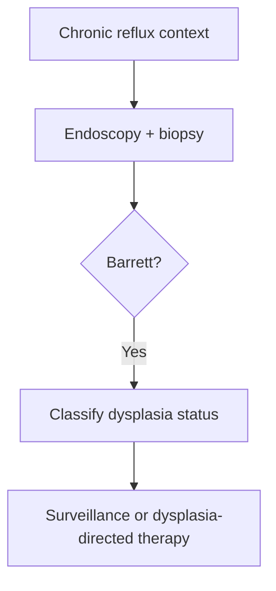

# Barrett oesophagus and dysplasia

Related: [[../Gastroenterology MOC|Gastroenterology MOC]] · [[../Oesophageal Disorders|Oesophageal Disorders]] · [[Gastro-oesophageal reflux disease]] · [[Oesophageal cancer]]

> [!important]
> Barrett oesophagus is **metaplastic change due to chronic reflux** and matters because of progression risk to dysplasia and adenocarcinoma.

## Learning Objectives
- Define Barrett oesophagus.
- Understand reflux-metaplasia-dysplasia progression.
- Recognize surveillance significance.
- Outline management principles.

## Definition
Barrett oesophagus is replacement of normal distal oesophageal squamous mucosa by specialized columnar metaplastic epithelium, usually due to chronic gastro-oesophageal reflux.

## Pathophysiology
- chronic acid/bile exposure
- metaplastic adaptation of distal mucosa
- progression risk: no dysplasia → low/high-grade dysplasia → adenocarcinoma

## Clinical Context
- long-standing reflux
- male sex/obesity and chronic GERD pattern are classic epidemiologic associations
- may be asymptomatic apart from reflux history

## Why Dysplasia Matters
Dysplasia is the key premalignant step. The more advanced the dysplasia, the greater the concern for cancer progression and the more intensive the specialist management pathway.

## Diagnosis
- endoscopy with biopsy protocol
- diagnosis is histologic, not symptom-based alone

## Management Principles
- reflux control
- endoscopic surveillance according to dysplasia status
- endoscopic eradication/definitive specialist therapy for significant dysplasia pathways

## Red Flags
- progressive dysphagia
- weight loss
- GI bleeding/anemia
- worsening alarm symptoms suggesting carcinoma rather than uncomplicated Barrett change

## FCPS/MRCP High-Yield Points
- Barrett = reflux-related metaplasia.
- Dysplasia is the marker of malignant progression risk.
- Diagnosis requires endoscopy plus histology.

## Common Viva Traps
- Confusing Barrett with simple reflux symptoms only.
- Forgetting biopsy confirmation.
- Underestimating dysplasia significance.

## One-Page Summary
- Chronic GERD can lead to Barrett oesophagus.
- Barrett is premalignant because it can progress to dysplasia and adenocarcinoma.
- Surveillance and dysplasia-directed therapy are central.

## Mind Map
- Barrett
  - chronic reflux
  - metaplasia
  - dysplasia
  - adenocarcinoma risk
  - endoscopy biopsy

## Flowchart

## MCQs (10)
1. Barrett oesophagus is:
   - A. Reflux-related metaplasia of distal oesophageal mucosa
   - B. Acute colitis
   - C. Pancreatic necrosis
   - D. Biliary obstruction
   - **Answer: A**
2. The main predisposing condition is:
   - A. Chronic GERD
   - B. UTI
   - C. Migraine
   - D. Asthma
   - **Answer: A**
3. Why is Barrett important?
   - A. Risk of dysplasia and adenocarcinoma
   - B. It always perforates
   - C. It causes nephrosis
   - D. It always causes hematochezia
   - **Answer: A**
4. Diagnosis requires:
   - A. Endoscopy with biopsy
   - B. Symptoms alone
   - C. Spirometry
   - D. Audiogram
   - **Answer: A**
5. Which is the key premalignant step?
   - A. Dysplasia
   - B. Ring formation only
   - C. Ulcer perforation only
   - D. Thrush
   - **Answer: A**
6. A common trap is:
   - A. Calling chronic reflux symptoms “Barrett” without biopsy proof
   - B. Considering reflux history
   - C. Using histology
   - D. Assessing alarm symptoms
   - **Answer: A**
7. Which red flag suggests possible progression beyond uncomplicated Barrett?
   - A. Progressive dysphagia
   - B. Mild burping only
   - C. Rhinitis
   - D. Dry scalp
   - **Answer: A**
8. Management of dysplastic Barrett may require:
   - A. Specialist endoscopic therapy
   - B. Dialysis
   - C. Bronchodilator only
   - D. Ear drops
   - **Answer: A**
9. Barrett most commonly affects which oesophageal region?
   - A. Distal oesophagus
   - B. Cervical oesophagus only
   - C. Rectum
   - D. Jejunum
   - **Answer: A**
10. Best summary?
   - A. Barrett is reflux-related metaplasia with dysplasia-driven cancer risk
   - B. Barrett is harmless reflux only
   - C. Dysplasia is irrelevant
   - D. Endoscopy is unnecessary
   - **Answer: A**

## SBA Questions (10)
1. A patient with long-standing reflux is found on biopsy to have Barrett oesophagus. Why is follow-up important?
   - A. Because of progression risk to dysplasia/cancer
   - B. Because Barrett causes asthma
   - C. Because it always perforates
   - D. Because it always causes obstruction immediately
   - **Answer: A**
2. Which is a dangerous error?
   - A. Ignoring progressive dysphagia in known Barrett oesophagus
   - B. Controlling reflux
   - C. Using biopsy confirmation
   - D. Classifying dysplasia status
   - **Answer: A**
3. Best test principle?
   - A. Endoscopy with histology
   - B. Diagnose by symptoms alone
   - C. ECG only
   - D. Stool culture only
   - **Answer: A**
4. Which pathway best describes disease evolution?
   - A. Reflux → metaplasia → dysplasia → adenocarcinoma risk
   - B. Reflux → colitis → cirrhosis
   - C. Web → asthma → stroke
   - D. Candida → nephrosis
   - **Answer: A**
5. What does dysplasia signify?
   - A. Higher malignant progression risk
   - B. Guaranteed benignity
   - C. Pure motility disease
   - D. Infective oesophagitis
   - **Answer: A**
6. Which symptom may be absent despite Barrett?
   - A. New symptoms beyond prior reflux
   - B. Reflux history may be the main clue
   - C. Histology always absent
   - D. Endoscopic abnormality impossible
   - **Answer: A**
7. Main treatment backbone in uncomplicated Barrett includes:
   - A. Reflux control and surveillance
   - B. Antibiotics for all
   - C. Diuretics only
   - D. No follow-up
   - **Answer: A**
8. Best exam pearl?
   - A. Barrett is a histologic diagnosis with premalignant importance
   - B. Barrett is diagnosed from heartburn alone
   - C. Dysplasia has no significance
   - D. Barrett is unrelated to reflux
   - **Answer: A**
9. Which cancer type is linked most closely?
   - A. Adenocarcinoma
   - B. Small-cell lung carcinoma
   - C. Hepatocellular carcinoma
   - D. Renal cell carcinoma
   - **Answer: A**
10. Best summary?
   - A. Identify, biopsy, classify dysplasia, and follow appropriately
   - B. Reassure all without biopsy
   - C. Never surveil Barrett
   - D. Treat only symptoms and ignore histology
   - **Answer: A**

## Flashcards
- Q: What is Barrett oesophagus?
  A: Reflux-related distal oesophageal columnar metaplasia.
- Q: What makes Barrett clinically important?
  A: Risk of dysplasia and adenocarcinoma.
- Q: How is Barrett diagnosed?
  A: Endoscopy with biopsy.
- Q: What key histologic step increases cancer concern?
  A: Dysplasia.
- Q: What major red flag in Barrett requires urgent reassessment?
  A: Progressive dysphagia or weight loss.

## Must Know / Should Know / Nice to Know
### Must Know
- Barrett = intestinal metaplasia of distal oesophagus due to chronic GERD
- Screening: endoscopy in chronic GERD patients with risk factors
- Surveillance intervals by dysplasia grade
- High-grade dysplasia = endoscopic therapy (RFA, EMR) or surgery
- Goblet cells on biopsy confirm intestinal metaplasia

### Should Know
- Prague C&M criteria for endoscopic extent
- Risk factors: male, >50, central obesity, smoking, long-segment
- Low-grade dysplasia: repeat endoscopy 6-12 months
- Indefinite for dysplasia: optimize PPI and repeat

### Nice to Know
- Radiofrequency ablation vs cryotherapy vs EMR
- Molecular markers (p53, DNA content)
- Cost-effectiveness of screening programs

## Self-Test Scorecard
- Can I define Barrett oesophagus? /10
- Can I state the surveillance interval for non-dysplastic Barrett? /10
- Can I name the endoscopic therapies for HGD? /10
- Can I explain the Prague classification? /10

**Interpretation:**
- **<35/40** = weak topic
- **35-36/40** = acceptable but insecure
- **37+/40** = exam-ready

## Revision Prompts
How is Barrett oesophagus diagnosed?
What determines surveillance interval?
What are the treatment options for high-grade dysplasia?

## Answer Key with Explanations

