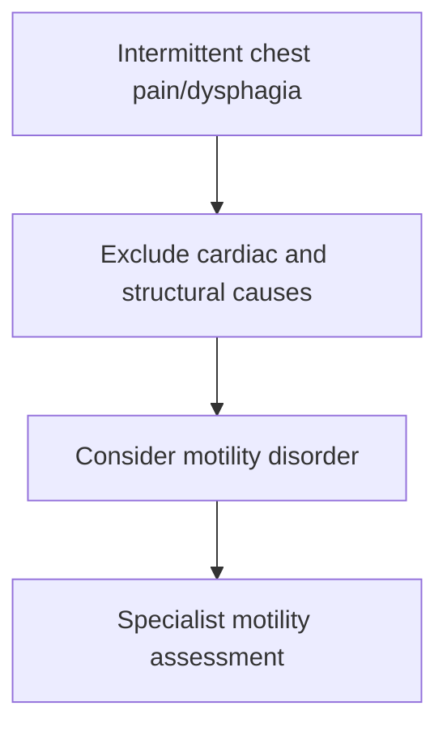

# Diffuse oesophageal spasm and motility disorders

Related: [[../Gastroenterology MOC|Gastroenterology MOC]] · [[../Oesophageal Disorders|Oesophageal Disorders]] · [[Achalasia]]

> [!important]
> These disorders can mimic cardiac chest pain and intermittent dysphagia, but diagnosis should not be made casually without excluding more important causes.

## Learning Objectives
- Define diffuse oesophageal spasm within oesophageal motility disorders.
- Recognize presentation.
- Understand differential diagnosis with cardiac pain and achalasia.
- Outline management principles.

## Definition
Diffuse oesophageal spasm is a motility disorder with abnormal, uncoordinated oesophageal contractions causing chest pain and/or dysphagia.

## Clinical Features
- intermittent chest pain
- intermittent dysphagia
- symptoms may be provoked by swallowing
- overlap with reflux and functional chest pain may occur

## Differential Diagnosis
- ischemic cardiac chest pain
- achalasia
- reflux disease
- structural oesophageal narrowing

## Investigations
- cardiac causes must be excluded where clinically relevant
- endoscopy to exclude structural disease
- manometric assessment in specialist pathways

## Management
- reassure only after serious causes excluded
- reflux treatment if overlap exists
- symptom-directed therapy for motility disorder
- dietary/trigger modification in some patients

## Red Flags
- persistent progressive dysphagia
- weight loss
- anemia/bleeding
- exertional/ischemic chest pain pattern

## FCPS/MRCP High-Yield Points
- Oesophageal spasm is a chest-pain mimic.
- Intermittent dysphagia can occur.
- Always exclude structural and cardiac disease first.

## Common Viva Traps
- Diagnosing spasm before excluding ischemia.
- Forgetting endoscopy in dysphagic patients.
- Confusing achalasia with all motility disorders.

## One-Page Summary
- Diffuse oesophageal spasm causes intermittent chest pain and dysphagia.
- Rule out heart disease and structural oesophageal lesions.
- Motility testing supports diagnosis in specialist settings.

## Mind Map
- Oesophageal spasm
  - chest pain mimic
  - intermittent dysphagia
  - exclude cardiac
  - exclude structural
  - manometry

## Flowchart

## MCQs (10)
1. Diffuse oesophageal spasm commonly causes:
   - A. Intermittent chest pain and dysphagia
   - B. Hematuria
   - C. Polyuria
   - D. Jaundice only
   - **Answer: A**
2. A major differential is:
   - A. Cardiac ischemia
   - B. Cataract
   - C. Nephrolithiasis only
   - D. Otitis externa
   - **Answer: A**
3. Which investigation may support diagnosis in specialist care?
   - A. Manometry
   - B. ECG alone only
   - C. Spirometry
   - D. Audiogram
   - **Answer: A**
4. Which is true?
   - A. Oesophageal spasm can mimic angina
   - B. It never causes chest pain
   - C. It is always visible as cancer at endoscopy
   - D. Dysphagia is impossible
   - **Answer: A**
5. Before diagnosing it, one must exclude:
   - A. Structural disease and cardiac causes
   - B. Only skin disease
   - C. Only kidney disease
   - D. Nothing else
   - **Answer: A**
6. A common trap is:
   - A. Labeling chest pain as oesophageal without excluding ischemia
   - B. Reviewing weight loss
   - C. Considering endoscopy
   - D. Asking about dysphagia
   - **Answer: A**
7. Which symptom pattern fits motility disorder better than fixed stricture?
   - A. Intermittent symptoms
   - B. Purely progressive solids-only dysphagia
   - C. Constant vomiting blood only
   - D. Pure diarrhea only
   - **Answer: A**
8. Red flags requiring broader workup include:
   - A. Weight loss and progressive dysphagia
   - B. Mild transient burping only
   - C. Dry scalp
   - D. Rhinitis
   - **Answer: A**
9. Endoscopy in this setting is useful to:
   - A. Exclude structural lesions
   - B. Diagnose COPD
   - C. Treat nephrosis
   - D. Confirm stroke
   - **Answer: A**
10. Best summary?
   - A. Diffuse oesophageal spasm is a diagnosis considered after excluding more dangerous causes of chest pain and dysphagia
   - B. It is diagnosed from one symptom alone
   - C. It never overlaps with reflux
   - D. It is always malignant
   - **Answer: A**

## SBA Questions (10)
1. A 42-year-old has intermittent chest pain during swallowing and episodic dysphagia. Key first principle?
   - A. Exclude cardiac and structural oesophageal disease
   - B. Assume spasm immediately
   - C. Ignore symptoms
   - D. Diagnose IBS
   - **Answer: A**
2. Which specialist test best supports oesophageal spasm diagnosis?
   - A. Oesophageal manometry
   - B. Audiometry
   - C. Spirometry
   - D. EEG
   - **Answer: A**
3. Which is a dangerous error?
   - A. Missing angina by prematurely labeling the pain oesophageal
   - B. Asking about swallowing triggers
   - C. Considering endoscopy
   - D. Reviewing progression
   - **Answer: A**
4. Which symptom pattern is typical?
   - A. Intermittent chest pain and dysphagia
   - B. Progressive jaundice
   - C. Polyuria and polydipsia
   - D. Chronic hematochezia only
   - **Answer: A**
5. Why is endoscopy useful?
   - A. To exclude mechanical causes
   - B. To confirm pneumonia
   - C. To measure potassium
   - D. To assess kidneys
   - **Answer: A**
6. Which feature raises concern away from benign spasm?
   - A. Weight loss with progressive dysphagia
   - B. Long intermittent symptoms only
   - C. Brief episodes after cold drinks only
   - D. Mild belching only
   - **Answer: A**
7. Which condition overlaps symptomatically?
   - A. GERD
   - B. Glaucoma
   - C. UTI
   - D. Otitis media
   - **Answer: A**
8. Best exam pearl?
   - A. Oesophageal spasm is a chest-pain mimic, not a diagnosis of convenience
   - B. Cardiac causes never matter
   - C. Endoscopy is unnecessary
   - D. Dysphagia excludes motility disease
   - **Answer: A**
9. Which symptom pattern is less typical for simple spasm?
   - A. Relentlessly progressive solids-first dysphagia with cachexia
   - B. Intermittent chest discomfort on swallowing
   - C. Episodic dysphagia
   - D. Symptom fluctuation
   - **Answer: A**
10. Best summary?
   - A. Diagnose only after ruling out cardiac and structural pathology
   - B. Diagnose before any exclusion workup
   - C. Treat all as asthma
   - D. It is the same as achalasia
   - **Answer: A**

## Flashcards
- Q: What 2 symptoms classically suggest diffuse oesophageal spasm?
  A: Intermittent chest pain and dysphagia.
- Q: What major non-GI differential must be excluded?
  A: Cardiac ischemia.
- Q: What specialist test helps confirm motility disorders?
  A: Oesophageal manometry.
- Q: What common trap should be avoided?
  A: Calling chest pain oesophageal before excluding cardiac causes.
- Q: Why is endoscopy still useful?
  A: To exclude structural lesions.

## Must Know / Should Know / Nice to Know
### Must Know
- DES: uncoordinated, high-amplitude contractions causing chest pain/dysphagia
- Manometry: simultaneous contractions in >20% swallows
- Chest pain may mimic cardiac - exclude ACS first
- Nutritional support if severe

### Should Know
- Jackhammer oesophagus: DCI >8000 mmHg·s·cm
- Scleroderma oesophagus: low amplitude, failed peristalsis
- CCK/prostaglandin role in pathophysiology

### Nice to Know
- POEM for spastic disorders
- Botulinum toxin injection

## Self-Test Scorecard
- Can I name the manometric criteria for DES? /10
- Can I distinguish DES from jackhammer oesophagus? /10
- Can I list differential for non-cardiac chest pain? /10

**Interpretation:**
- **<35/40** = weak topic
- **35-36/40** = acceptable but insecure
- **37+/40** = exam-ready

## Revision Prompts
What are the manometric findings in diffuse oesophageal spasm?
How is DES distinguished from achalasia?

## Answer Key with Explanations

