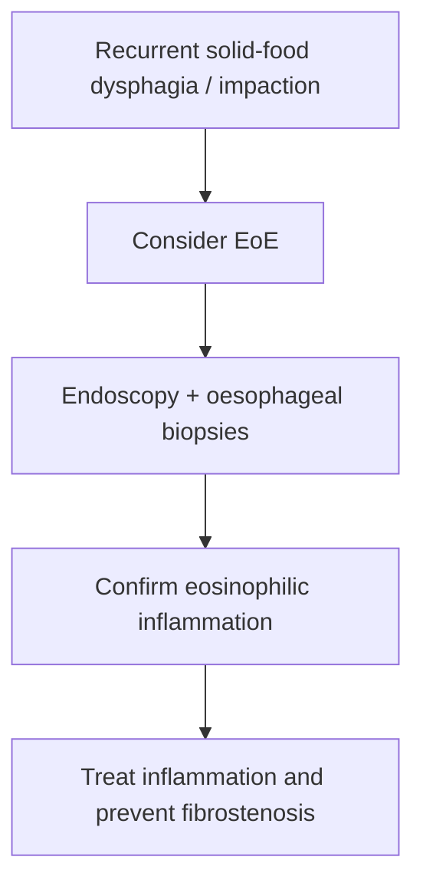

# Eosinophilic oesophagitis

Related: [[../Gastroenterology MOC|Gastroenterology MOC]] · [[../Oesophageal Disorders|Oesophageal Disorders]] · [[Food bolus obstruction and acute impaction]] · [[Oesophageal stricture]]

> [!important]
> Eosinophilic oesophagitis is a chronic immune-mediated oesophageal inflammatory disorder that often presents with **intermittent dysphagia and food bolus impaction**, especially in younger patients.

## Learning Objectives
- Define eosinophilic oesophagitis.
- Recognize the classic presentation.
- Understand its relationship to food impaction and remodelling/stricture.
- Outline diagnostic and treatment principles.

## Definition
Eosinophilic oesophagitis (EoE) is a chronic antigen/immune-mediated inflammatory disorder of the oesophagus characterized clinically by dysphagia/food impaction and pathologically by eosinophil-rich oesophageal inflammation.

## Pathophysiology
- immune-mediated oesophageal inflammation
- mucosal edema and inflammatory change
- chronic remodelling leading to rings, narrowing, or stricture in some patients

## Clinical Features
- intermittent solid-food dysphagia
- food bolus impaction
- chest discomfort or reflux-like symptoms in some patients
- recurrent symptoms over time

## High-Yield Clues
- younger patient
- recurrent food impaction
- dysphagia out of proportion to typical reflux story
- possible atopic background in some cases

## Diagnosis
Diagnosis usually requires:
- clinical suspicion
- upper GI endoscopy
- oesophageal biopsies demonstrating eosinophilic inflammation

## Endoscopic / Structural Features
- rings/furrows/exudative changes may be seen
- stricture or narrow calibre oesophagus can occur in chronic disease

## Management Principles
- anti-inflammatory therapy strategy
- dietary/allergen-directed approach in selected pathways
- endoscopic dilation if significant fibrostenotic narrowing is present
- long-term control to reduce recurrent impaction and remodelling

## Red Flags / Emergencies
- acute food bolus obstruction
- significant dehydration from inability to swallow
- progressive narrowing/stricture symptoms

## FCPS/MRCP High-Yield Points
- Think EoE in recurrent food bolus impaction.
- Diagnosis needs biopsy-based confirmation.
- Chronic disease can lead to rings and stricture.

## Common Viva Traps
- Labeling every young dysphagic patient as simple reflux.
- Forgetting oesophageal biopsies.
- Missing the association with recurrent impaction.

## One-Page Summary
- EoE causes recurrent dysphagia and food impaction.
- Diagnosis is clinic + endoscopy + biopsy.
- Chronic untreated disease can produce fibrostenotic complications.

## Mind Map
- Eosinophilic oesophagitis
  - young dysphagia
  - food impaction
  - biopsy diagnosis
  - rings/stricture
  - chronic inflammation

## Flowchart

## Revision Prompts
- What presentation should make you think of EoE?
- Why are biopsies essential?
- What chronic complication can follow untreated disease?

## MCQs (10)
1. Eosinophilic oesophagitis commonly presents with:
   - A. Intermittent dysphagia and food impaction
   - B. Polyuria
   - C. Hematuria
   - D. Hemoptysis
   - **Answer: A**
2. The diagnosis usually requires:
   - A. Oesophageal biopsies
   - B. Colon biopsy only
   - C. Renal ultrasound only
   - D. ECG alone
   - **Answer: A**
3. Chronic EoE may lead to:
   - A. Rings and stricture
   - B. Appendicitis
   - C. Portal hypertension
   - D. Asthma remission
   - **Answer: A**
4. A high-yield clue is:
   - A. Recurrent food bolus impaction
   - B. Cataract
   - C. Tinnitus
   - D. Hemarthrosis
   - **Answer: A**
5. Which statement is correct?
   - A. EoE is a chronic immune-mediated oesophageal disorder
   - B. It is purely renal disease
   - C. Biopsies are irrelevant
   - D. It never causes narrowing
   - **Answer: A**
6. A common trap is:
   - A. Treating recurrent dysphagia as simple reflux without biopsy
   - B. Considering food impaction history
   - C. Looking for rings/stricture
   - D. Doing endoscopy when indicated
   - **Answer: A**
7. Which age pattern is classic?
   - A. Younger patient with recurrent dysphagia/impaction
   - B. Neonatal jaundice pattern only
   - C. Elderly cataract pathway only
   - D. Pure infant colic
   - **Answer: A**
8. Endoscopic dilation may be needed when:
   - A. Significant fibrostenotic narrowing exists
   - B. There is isolated diarrhea
   - C. There is liver failure
   - D. There is nephrotic syndrome
   - **Answer: A**
9. Which is an emergency presentation?
   - A. Acute food bolus obstruction
   - B. Mild occasional hiccup
   - C. Rhinitis
   - D. Dry skin
   - **Answer: A**
10. Best summary?
   - A. EoE should be suspected in recurrent dysphagia/impaction and confirmed with biopsy
   - B. EoE never needs endoscopy
   - C. EoE is just reflux
   - D. EoE never causes structural disease
   - **Answer: A**

## SBA Questions (10)
1. A 24-year-old man has recurrent solid-food dysphagia and previous food bolus impaction. Best diagnosis to consider?
   - A. Eosinophilic oesophagitis
   - B. Coeliac disease
   - C. Acute pancreatitis
   - D. Ulcerative colitis
   - **Answer: A**
2. What is the best diagnostic principle in suspected EoE?
   - A. Endoscopy with oesophageal biopsies
   - B. Diagnose clinically only forever
   - C. Colonoscopy first
   - D. Stool culture only
   - **Answer: A**
3. Which is a dangerous error?
   - A. Missing EoE in a young patient with recurrent food impaction
   - B. Taking impaction history seriously
   - C. Considering fibrostenosis
   - D. Using biopsies for confirmation
   - **Answer: A**
4. Which chronic consequence can develop?
   - A. Fibrostenotic narrowing/stricture
   - B. Portal vein thrombosis
   - C. Nephritic syndrome
   - D. Pleural fibrosis
   - **Answer: A**
5. Which symptom pattern is most classic?
   - A. Intermittent solid-food dysphagia
   - B. Polyuria and polydipsia
   - C. Productive cough
   - D. Hematemesis only always
   - **Answer: A**
6. Why are biopsies needed?
   - A. To confirm eosinophilic inflammation
   - B. To diagnose gallstones
   - C. To stage pancreatitis
   - D. To measure calprotectin
   - **Answer: A**
7. Which endoscopic feature may be seen?
   - A. Rings/furrows
   - B. Esophageal varices only always
   - C. Colonic pseudopolyps
   - D. Duodenal ulcer crater only
   - **Answer: A**
8. Best management principle?
   - A. Control inflammation and address narrowing if present
   - B. Ignore recurrent impaction
   - C. Treat as functional disease only
   - D. Give antibiotics to all
   - **Answer: A**
9. Which clue may coexist?
   - A. Atopic background in some patients
   - B. Nephrolithiasis always
   - C. Cirrhosis always
   - D. Pulmonary embolism always
   - **Answer: A**
10. Best exam phrase?
   - A. Recurrent food impaction in a young patient should immediately raise the possibility of eosinophilic oesophagitis
   - B. Food impaction rules EoE out
   - C. Biopsies are unnecessary
   - D. EoE has no structural consequences
   - **Answer: A**

## Flashcards
- Q: What classic presentation suggests EoE?
  A: Recurrent solid-food dysphagia and food bolus impaction.
- Q: How is EoE confirmed?
  A: Endoscopy with oesophageal biopsies.
- Q: Name 2 chronic structural consequences.
  A: Rings and stricture/narrow calibre oesophagus.
- Q: What common trap must be avoided?
  A: Dismissing recurrent young-patient dysphagia as simple reflux.
- Q: What emergency can EoE cause?
  A: Acute food bolus obstruction.

## Must Know / Should Know / Nice to Know
### Must Know
- EoE = eosinophil-predominant oesophageal inflammation (>15 eos/hpf)
- Dysphagia and food impaction in young atopic males
- Endoscopy: rings, furrows, exudates, strictures
- PPI trial first, then topical steroids if PPI fails
- Dilation for strictures (cautiously)

### Should Know
- Atopic comorbidities: asthma, eczema, food allergy
- Elimination diets (6-food, 4-food, 2-food)
- Dupilumab for refractory disease

### Nice to Know
- EoE genetic associations (CAPN14, TSLP)
- Endoscopic functional lumen imaging probe (EndoFLIP)

## Self-Test Scorecard
- Can I state the histologic diagnostic threshold? /10
- Can I list the endoscopic features? /10
- Can I outline the step-up treatment approach? /10

**Interpretation:**
- **<35/40** = weak topic
- **35-36/40** = acceptable but insecure
- **37+/40** = exam-ready

## Revision Prompts
What is the diagnostic criteria for EoE?
How does EoE differ from GERD?
What is the treatment algorithm?

## Answer Key with Explanations

