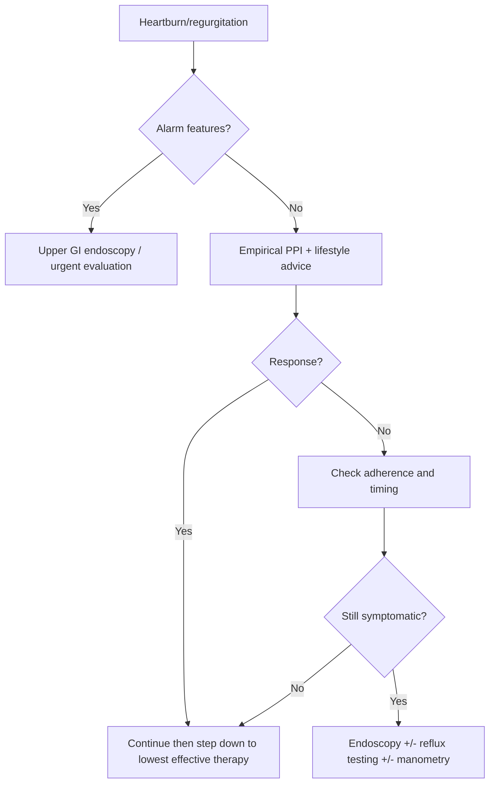

# Gastro-oesophageal reflux disease

Related: [[../Gastroenterology MOC|Gastroenterology MOC]] · [[../Oesophageal Disorders|Oesophageal Disorders]] · [[Reflux and oesophagitis disorders|Reflux and oesophagitis disorders]] · [[Erosive reflux oesophagitis]] · [[Barrett oesophagus and dysplasia]] · [[Oesophageal stricture]] · [[Dysphagia alarm features and urgent endoscopy]]

> [!info]
> Strictly kept within **Davidson Chapter 23: Gastroenterology**. Focus is luminal GI disease; do **not** widen into Hepatology.

## Learning Objectives
- Define GERD and distinguish it from simple physiological reflux.
- Understand the anti-reflux anatomy and physiology of the gastro-oesophageal junction.
- Recognize typical symptoms, atypical features, and alarm features.
- Use a rational investigation strategy: empirical therapy vs endoscopy vs reflux testing.
- Diagnose and manage GERD, including refractory disease.
- Recognize complications such as erosive oesophagitis, peptic stricture, and Barrett oesophagus.

## Definition
**Gastro-oesophageal reflux disease (GERD)** is a condition in which reflux of gastric contents into the oesophagus causes **troublesome symptoms and/or complications**.

### Practical exam definition
- **Reflux** may be physiological.
- It becomes **GERD** when it causes:
  - troublesome heartburn/regurgitation
  - mucosal injury
  - complications such as stricture or Barrett oesophagus

## Anatomy
### Relevant anatomy
- **Lower oesophageal sphincter (LOS/LES)**: physiologic high-pressure zone at distal oesophagus.
- **Crural diaphragm**: external sphincteric support during inspiration.
- **Angle of His**: flap-valve effect at the cardia.
- **Intra-abdominal oesophagus**: positive abdominal pressure helps maintain closure.
- **Gastro-oesophageal junction (GOJ)**: anatomic and functional anti-reflux barrier.

### Applied anatomy pearls
- A **hiatus hernia** weakens the barrier between LES and diaphragmatic pinch.
- Poor clearance in the oesophagus prolongs mucosal acid exposure.
- Proximal extension of reflux increases laryngeal and extra-oesophageal symptoms.

## Physiology
### Normal anti-reflux physiology
- Tonic LES pressure prevents backflow.
- Swallowing causes transient LES relaxation to permit bolus passage.
- Primary and secondary peristalsis clear refluxed material.
- Saliva neutralizes acid.
- Gastric emptying influences post-prandial reflux burden.

### Key physiological mechanism in GERD
The most important mechanism is **transient LES relaxations (TLESRs)**, especially after meals.

Other contributors:
- hypotensive LES
- hiatus hernia
- impaired oesophageal clearance
- delayed gastric emptying
- increased intra-abdominal pressure
- excess acid burden

## Classification
### By symptom pattern
1. **Typical GERD**
   - heartburn
   - acid regurgitation
2. **Atypical / extra-oesophageal presentations**
   - chronic cough
   - hoarseness
   - laryngitis-like symptoms
   - chest pain
   - asthma worsening
3. **Complicated GERD**
   - erosive oesophagitis
   - peptic stricture
   - Barrett oesophagus
   - ulcer/bleeding (less common)

### By endoscopic phenotype
- **Non-erosive reflux disease (NERD)**
- **Erosive reflux disease**
- **Barrett-associated reflux disease**

## Etiology / Risk Factors
- obesity
- pregnancy
- hiatus hernia
- large/fatty meals
- recumbency soon after meals
- smoking
- alcohol excess
- increased abdominal pressure
- delayed gastric emptying
- connective tissue disease with oesophageal dysmotility

### Drug-related contributors
- nitrates
- calcium channel blockers
- anticholinergics
- theophylline
- benzodiazepines
- progesterone
- bisphosphonates may worsen oesophageal symptoms but are more classically linked to pill oesophagitis

## Pathophysiology
GERD develops when aggressive luminal factors overcome oesophageal defense.

### Aggressive factors
- acid
- pepsin
- bile reflux in some patients
- gastric distension after meals

### Defensive failures
- weak anti-reflux barrier
- impaired peristaltic clearance
- reduced salivary neutralization
- impaired mucosal resistance

### Sequence
1. TLESRs or low LES pressure allow reflux.
2. Refluxate contacts oesophageal squamous mucosa.
3. Repeated exposure causes symptoms, inflammation, and eventually complications.
4. Chronic injury may lead to metaplasia (**Barrett oesophagus**).

## Clinical Features
### Typical symptoms
- **heartburn**: retrosternal burning, often post-prandial
- **acid regurgitation**: sour/bitter fluid into mouth or throat
- water brash
- symptom worsening on bending, lying flat, straining, or after meals

### Associated symptoms
- dyspepsia overlap
- non-cardiac chest pain
- epigastric burning
- sleep disturbance due to nocturnal reflux

### Extra-oesophageal / atypical clues
- chronic cough
- hoarseness
- recurrent throat clearing
- globus sensation
- nocturnal asthma aggravation
- dental enamel erosion

> [!warning]
> Atypical symptoms alone are **not specific** for GERD. Avoid over-diagnosing GERD in chronic cough or chest pain without supportive context.

## Alarm Features / Red Flags
These should trigger urgent or early endoscopic evaluation rather than simple empirical treatment alone:
- **dysphagia**
- **odynophagia**
- GI bleeding or melaena
- iron-deficiency anaemia
- unintentional weight loss
- persistent vomiting
- age with new persistent symptoms plus cancer concern
- recurrent aspiration
- palpable mass / supraclavicular nodes

### Viva trap
- **Progressive dysphagia** is malignancy until proven otherwise.
- Do **not** label dysphagia as simple reflux without structural evaluation.

## Investigations
## Stepwise investigation logic
### 1. Typical uncomplicated GERD
In a younger patient with classic heartburn/regurgitation and no alarm features:
- diagnosis is often **clinical/probable GERD**
- give **empirical PPI trial**

### 2. When to perform upper GI endoscopy
- alarm features present
- refractory symptoms despite appropriate PPI use
- recurrent symptoms with complications suspected
- dysphagia
- bleeding/anaemia
- recurrent vomiting
- Barrett surveillance consideration

### 3. When to consider reflux testing
- symptoms persist despite adequate therapy
- diagnosis uncertain
- before anti-reflux surgery in selected patients
- atypical symptoms without clear endoscopic evidence

## Investigation details
### Upper GI endoscopy
May show:
- normal mucosa in NERD
- erosive oesophagitis
- ulceration
- peptic stricture
- Barrett mucosa
- alternative diagnoses such as malignancy or eosinophilic oesophagitis clues

### Ambulatory pH or impedance-pH monitoring
Useful to correlate symptoms with reflux episodes.

### Oesophageal manometry
Not a primary test for GERD diagnosis, but useful when:
- motility disorder is suspected
- pre-operative evaluation is needed

### Barium swallow
Not routine for uncomplicated GERD; may help if structural lesion or dysphagia pattern is being assessed.

## Interpretation Frameworks
### Approach to heartburn / reflux-like symptoms
1. Confirm symptom pattern: heartburn ± regurgitation.
2. Look for alarm features.
3. If no alarm features and symptoms are typical → empirical PPI.
4. If poor response, check adherence and timing.
5. If still symptomatic → endoscopy ± reflux testing.
6. Exclude mimics: cardiac pain, dyspepsia/PUD, biliary pain, eosinophilic oesophagitis, achalasia, pill injury.

### PPI non-response logic
Before calling it refractory GERD, ask:
- Is the patient taking the PPI **30-60 minutes before meals**?
- Is the dose adequate and adherence good?
- Is the symptom truly heartburn/regurgitation?
- Could this be functional heartburn, eosinophilic oesophagitis, motility disorder, cardiac pain, or peptic ulcer disease?

## Diagnosis
GERD is diagnosed by a combination of:
- typical symptom pattern
- response to empirical acid suppression
- objective evidence on endoscopy or reflux monitoring when needed

### Practical diagnostic categories
- **Probable GERD**: typical symptoms, no alarms, responds to therapy
- **Objective GERD**: erosive oesophagitis, Barrett, stricture, or abnormal reflux testing
- **Refractory / uncertain diagnosis**: persistent symptoms needing further work-up

## Differential Diagnosis
- [[Functional dyspepsia]]
- peptic ulcer disease
- biliary colic
- acute coronary syndrome / ischaemic chest pain
- oesophageal spasm
- achalasia
- eosinophilic oesophagitis
- pill-induced oesophagitis
- oesophageal cancer
- gastric cancer
- functional heartburn

## Management
## General principles
Goals:
- relieve symptoms
- heal oesophagitis if present
- prevent relapse/complications
- identify those needing endoscopy or long-term strategy

### Lifestyle and non-drug measures
- weight reduction if overweight
- avoid late large meals
- avoid lying down for 2-3 hours after meals
- elevate head end of bed for nocturnal symptoms
- reduce trigger foods if individually reproducible
- smoking cessation
- moderate alcohol

> [!important]
> Lifestyle advice alone is usually insufficient for established symptomatic GERD, but it improves control and reduces relapse risk.

### Drug treatment
#### 1. Proton pump inhibitors (PPIs)
First-line for frequent or troublesome symptoms.

Examples:
- omeprazole
- esomeprazole
- pantoprazole
- rabeprazole

Key usage pearl:
- take before meals, usually before breakfast

#### 2. H2-receptor antagonists
- may help milder disease
- can be used when symptoms are intermittent or as step-down therapy

#### 3. Antacids / alginates
- useful for rapid symptom relief
- adjunctive rather than definitive therapy in persistent GERD

### Step-up / step-down concept
- mild intermittent symptoms → antacid/alginates or H2 blocker in selected patients
- frequent troublesome symptoms → PPI trial
- once controlled → step down to lowest effective regimen if possible

### Refractory GERD approach
- confirm adherence and timing
- optimize PPI use
- consider twice-daily dosing in selected cases
- investigate for alternative diagnoses
- endoscopy ± pH testing ± manometry if needed

### Endoscopic or surgical management
Consider in selected patients with:
- proven reflux and persistent symptoms despite medical therapy
- large hiatus hernia with suitable anatomy
- patient preference to avoid long-term medication
- regurgitation-predominant disease with objective evidence

Options:
- laparoscopic fundoplication
- selected endoscopic anti-reflux procedures in specialist settings

## Drug Interactions / Contraindications / Cautions
### PPI cautions
- long-term use should have a clear indication
- may reduce absorption of some drugs/nutrients over time
- interaction concern with clopidogrel is mainly discussed with omeprazole/esomeprazole; clinical significance depends on context
- prolonged therapy may be associated with hypomagnesaemia, B12 deficiency, enteric infections, and fracture concern in at-risk patients

### Clinical caution
Do not keep escalating acid suppression forever in a patient with:
- weight loss
- progressive dysphagia
- recurrent vomiting
- GI bleeding
- anaemia
because this may delay cancer diagnosis.

## Complications
- erosive oesophagitis
- oesophageal ulceration
- peptic stricture
- Barrett oesophagus
- aspiration-related respiratory symptoms
- reduced quality of life / sleep disturbance

## Red Flags / Emergencies
GERD itself is rarely an emergency, but these presentations need urgent reconsideration:
- haematemesis or melaena
- food bolus obstruction
- inability to swallow saliva
- severe chest pain where cardiac cause not excluded
- perforation suspicion after vomiting/instrumentation
- progressive dysphagia with weight loss

## One-Page Summary
### GERD in one page
- **Definition:** reflux causing troublesome symptoms or complications.
- **Typical symptoms:** heartburn + regurgitation.
- **Key mechanism:** transient LES relaxations.
- **Major risk factors:** obesity, hiatus hernia, pregnancy, large meals, recumbency, smoking.
- **Alarm features:** dysphagia, weight loss, anaemia, bleeding, vomiting, odynophagia.
- **First step in classic uncomplicated disease:** empirical **PPI trial**.
- **When to scope:** alarm features, dysphagia, refractory symptoms, bleeding, suspected complications.
- **Important complications:** erosive oesophagitis, peptic stricture, Barrett oesophagus.
- **Refractory symptom trap:** poor PPI timing/adherence and wrong diagnosis are common.
- **Common differentials:** ACS, dyspepsia/PUD, eosinophilic oesophagitis, achalasia, cancer.

## FCPS/MRCP High-Yield Points
- Heartburn and regurgitation strongly suggest GERD.
- Dysphagia is an alarm feature, not a routine reflux symptom to ignore.
- Endoscopy may be normal in symptomatic GERD: this is **NERD**.
- Barrett oesophagus is an intestinal metaplasia complication of chronic reflux.
- PPI timing before meals is a frequent exam pearl.
- Refractory GERD does not always mean more acid; reconsider diagnosis.

## Common Viva Questions
- What is the most important mechanism in GERD?
- What are the alarm features in reflux symptoms?
- When would you do upper GI endoscopy?
- What are the complications of long-standing GERD?
- How do you manage a patient not responding to PPI?
- Differentiate GERD from achalasia and cardiac chest pain.

## Common Exam Traps
- Treating progressive dysphagia as simple reflux.
- Assuming all chest burning is GERD without excluding ACS when appropriate.
- Forgetting that endoscopy can be normal in NERD.
- Forgetting Barrett oesophagus as a complication.
- Calling a patient refractory without checking PPI timing and compliance.

## Mind Map
- GERD
  - Mechanism
    - transient LES relaxations
    - low LES tone
    - hiatus hernia
    - poor clearance
  - Symptoms
    - heartburn
    - regurgitation
    - chest pain
    - cough/hoarseness
  - Alarms
    - dysphagia
    - weight loss
    - anaemia
    - bleeding
  - Tests
    - clinical trial of PPI
    - endoscopy
    - pH monitoring
    - manometry when needed
  - Complications
    - oesophagitis
    - stricture
    - Barrett

## Flowchart

## Suggested Visuals / Image Notes
- Diagram of anti-reflux barrier: LES + crural diaphragm + angle of His.
- Flowchart of empirical PPI trial vs endoscopy.
- Comparison table: GERD vs achalasia vs eosinophilic oesophagitis vs cardiac chest pain.

## One-Minute Revision Prompts
- Define GERD in one sentence.
- Name 4 alarm features.
- What is the commonest mechanism of reflux?
- When is endoscopy indicated?
- What are the main complications?
- How do you approach PPI failure?

## Revision Prompts
### 24-hour recall
- Write the anti-reflux mechanisms from memory.
- State the investigation strategy for typical vs alarm-feature GERD.
- List 5 complications of chronic reflux.

### 7-day / 15-day / 30-day tracker
- Day 1: Read full note + one-page summary
- Day 7: Attempt MCQs/SBAs without notes
- Day 15: Reproduce flowchart and alarm features from memory
- Day 30: Explain GERD, complications, and refractory approach in 3 minutes

## Must Know / Should Know / Nice to Know
### Must Know
- definition
- heartburn/regurgitation pattern
- alarm features
- PPI trial logic
- endoscopy indications
- complications

### Should Know
- NERD vs erosive disease
- refractory GERD approach
- Barrett link
- role of pH testing and manometry

### Nice to Know
- specialist procedural options
- nuanced extra-oesophageal reflux controversies

## Self-Test Scorecard
- Can I define GERD correctly? /10
- Can I list alarm features from memory? /10
- Can I explain when to scope? /10
- Can I list complications? /10
- Can I approach refractory symptoms logically? /10

Interpretation:
- **<35/50** = weak topic
- **35-44/50** = acceptable but insecure
- **45+/50** = exam-ready

## MCQs (10)
1. The most important physiological mechanism in most patients with GERD is:
   A. Complete LES absence
   B. Transient lower oesophageal sphincter relaxations
   C. Achalasia
   D. Hypertensive LES

2. The most typical symptom pair of GERD is:
   A. Dysphagia and weight loss
   B. Heartburn and regurgitation
   C. Haematemesis and melaena
   D. Steatorrhoea and bloating

3. Which one is an alarm feature in suspected GERD?
   A. Intermittent post-prandial heartburn
   B. Sour taste after heavy meal
   C. Progressive dysphagia
   D. Relief with antacid

4. In a patient with typical reflux symptoms and no alarm features, the best initial approach is usually:
   A. Immediate surgery
   B. Empirical PPI trial
   C. Emergency CT scan
   D. Colonoscopy

5. Endoscopy may be normal in:
   A. NERD
   B. Peptic stricture
   C. Barrett oesophagus
   D. Oesophageal cancer

6. A major long-term complication of GERD is:
   A. Coeliac disease
   B. Barrett oesophagus
   C. Ulcerative colitis
   D. Pancreatic insufficiency

7. Which factor commonly worsens reflux?
   A. Weight loss
   B. Head-end elevation
   C. Obesity
   D. Fasting

8. A common reason for apparent PPI failure is:
   A. Taking it correctly before meals
   B. Good adherence
   C. Wrong timing or poor compliance
   D. Immediate malignant transformation

9. Which test is most appropriate before anti-reflux surgery in selected patients?
   A. Bone marrow biopsy
   B. Oesophageal manometry with objective reflux assessment
   C. CT brain
   D. ERCP

10. Which statement is correct?
   A. Dysphagia excludes oesophageal disease
   B. GERD always causes visible oesophagitis on endoscopy
   C. Barrett oesophagus can complicate chronic GERD
   D. Antacids are superior to PPIs for healing oesophagitis

## SBA Questions (10)
1. A 32-year-old man has 4 months of post-prandial burning retrosternal discomfort and sour regurgitation, worse on lying down, with no weight loss or dysphagia. Best next step?
   A. Urgent endoscopy
   B. Empirical PPI and lifestyle advice
   C. Colonoscopy
   D. Immediate manometry

2. A 58-year-old woman with long-standing heartburn now reports progressive dysphagia to solids and 5 kg weight loss. Most appropriate action?
   A. Double antacid dose and review later
   B. Reassure that GERD commonly causes this
   C. Urgent upper GI endoscopy
   D. Stool microscopy

3. A patient says omeprazole has not helped. He takes it only when pain becomes severe, usually after dinner. Best interpretation?
   A. Proven refractory GERD
   B. Likely poor administration/timing
   C. Definite oesophageal cancer
   D. Drug allergy

4. A 40-year-old obese woman has nocturnal regurgitation despite occasional antacid use. Best lifestyle measure with strongest practical relevance?
   A. Lie down immediately after dinner
   B. Gain weight
   C. Elevate head end of bed and avoid late meals
   D. Drink less water permanently

5. Endoscopy in a reflux patient shows circumferential distal oesophageal erosions. This indicates:
   A. NERD
   B. Erosive reflux disease
   C. IBS
   D. Achalasia

6. A man with chronic reflux develops intestinal metaplasia in distal oesophagus. This is:
   A. Peptic ulcer disease
   B. Barrett oesophagus
   C. Crohn disease
   D. Coeliac disease

7. A 45-year-old patient has burning chest pain, but also exertional symptoms and vascular risk factors. Best exam principle?
   A. Diagnose GERD immediately
   B. Exclude cardiac disease appropriately before assuming reflux
   C. Start lifelong PPI without assessment
   D. Ignore chest pain if antacid helps once

8. Which patient most needs reflux monitoring or further objective testing?
   A. Typical symptoms with good PPI response
   B. Persistent symptoms despite optimized therapy and unclear diagnosis
   C. Brief mild symptoms once monthly
   D. Isolated constipation

9. The anti-reflux barrier includes all except:
   A. LES
   B. Crural diaphragm
   C. Angle of His
   D. Ileocecal valve

10. A chronic reflux patient develops intermittent food sticking and progressive solid-food dysphagia. Likely reflux complication?
   A. Peptic stricture
   B. Tropical sprue
   C. Pancreatic pseudocyst
   D. Toxic megacolon

## Flashcards
- Q: What symptom pair is most typical of GERD?
  A: Heartburn and acid regurgitation.
- Q: What is the commonest mechanism of GERD?
  A: Transient lower oesophageal sphincter relaxations.
- Q: What is the first-line treatment in typical uncomplicated GERD?
  A: Empirical PPI plus lifestyle advice.
- Q: Name 3 alarm features in suspected GERD.
  A: Dysphagia, weight loss, GI bleeding/anaemia.
- Q: What major premalignant complication may occur in chronic GERD?
  A: Barrett oesophagus.
- Q: Can endoscopy be normal in symptomatic GERD?
  A: Yes, in non-erosive reflux disease.
- Q: What bedside history feature often worsens GERD symptoms?
  A: Lying down after meals.
- Q: What should be checked first in an apparent PPI failure?
  A: Adherence and correct timing before meals.
- Q: Which structural abnormality commonly predisposes to GERD?
  A: Hiatus hernia.
- Q: What investigation is indicated in progressive dysphagia?
  A: Urgent upper GI endoscopy.

## Answer Key with Explanations
### MCQs
1. **B** - TLESRs are the main mechanism in most GERD patients.
2. **B** - Heartburn with regurgitation is the classic symptom complex.
3. **C** - Progressive dysphagia is an alarm feature requiring evaluation.
4. **B** - Typical symptoms without alarms are usually managed first with empirical PPI.
5. **A** - NERD can have normal endoscopy despite symptoms.
6. **B** - Barrett oesophagus is a classic long-term complication.
7. **C** - Obesity increases intra-abdominal pressure and reflux burden.
8. **C** - Incorrect timing or non-adherence is a common reason for treatment failure.
9. **B** - Manometry helps assess motility and is used in pre-operative work-up with objective reflux confirmation.
10. **C** - Chronic GERD can lead to Barrett metaplasia.

### SBAs
1. **B** - Classic uncomplicated GERD should usually start with PPI plus lifestyle advice.
2. **C** - Progressive dysphagia with weight loss requires urgent endoscopic assessment.
3. **B** - Intermittent after-symptom use suggests poor PPI technique, not true refractoriness.
4. **C** - Avoiding late meals and elevating the bed head are especially useful for nocturnal reflux.
5. **B** - Visible erosions indicate erosive reflux disease.
6. **B** - Intestinal metaplasia of distal oesophagus in chronic reflux is Barrett oesophagus.
7. **B** - Chest pain with vascular risk factors must not be presumed to be reflux until cardiac causes are considered.
8. **B** - Persistent symptoms despite optimized therapy and uncertain diagnosis warrant objective testing.
9. **D** - The ileocecal valve is unrelated to the anti-reflux barrier.
10. **A** - Progressive solid-food dysphagia in chronic reflux suggests peptic stricture.
