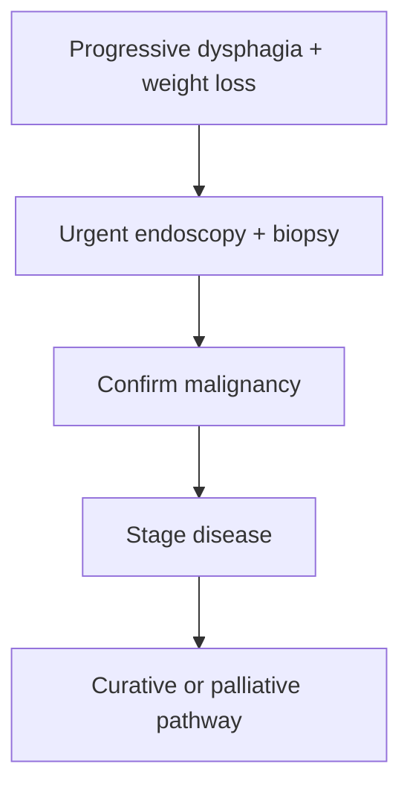

# Oesophageal cancer

Related: [[../Gastroenterology MOC|Gastroenterology MOC]] · [[../Oesophageal Disorders|Oesophageal Disorders]] · [[Barrett oesophagus and dysplasia]] · [[Oesophageal stricture]]

> [!warning]
> Progressive dysphagia with weight loss is **oesophageal cancer until proved otherwise**.

## Learning Objectives
- Recognize the classic presentation.
- Understand major risk backgrounds.
- Outline diagnostic and staging principles.
- Recognize palliative versus curative intent issues.

## Definition
Oesophageal cancer is malignant neoplasia of the oesophagus, mainly squamous-cell carcinoma and adenocarcinoma.

## Risk Background
- long-standing Barrett/GERD for adenocarcinoma pathway
- smoking/alcohol classically for squamous pathway
- chronic structural or inflammatory injury may contribute in some cases

## Clinical Features
- progressive dysphagia, usually solids first then liquids
- weight loss
- odynophagia or retrosternal discomfort
- regurgitation/aspiration in advanced disease
- anemia or bleeding sometimes

## Diagnosis
- urgent upper GI endoscopy with biopsy
- staging by imaging/endoscopic staging pathways after tissue diagnosis

## Red Flags
- rapidly progressive dysphagia
- major weight loss
- older age/new symptoms
- anemia/bleeding
- hoarseness, aspiration, cachexia in advanced disease

## Management Principles
- MDT care
- assess resectability/stage
- curative pathway if localized and fit
- palliative stenting/nutrition/supportive therapy when advanced or unresectable

## FCPS/MRCP High-Yield Points
- Progressive dysphagia + weight loss is the core clinical clue.
- Tissue diagnosis is mandatory.
- Distinguish adenocarcinoma/Barrett pathway from squamous risk factors.

## Common Viva Traps
- Delaying endoscopy.
- Confusing cancer with benign stricture.
- Forgetting nutrition/aspiration issues in advanced disease.

## One-Page Summary
- Oesophageal cancer typically presents with progressive dysphagia and weight loss.
- Diagnose by endoscopic biopsy.
- Stage carefully and decide curative versus palliative intent.

## Mind Map
- Oesophageal cancer
  - progressive solids then liquids
  - weight loss
  - biopsy
  - staging
  - curative vs palliative

## Flowchart

## MCQs (10)
1. The classic presentation of oesophageal cancer is:
   - A. Progressive dysphagia with weight loss
   - B. Polyuria with rash
   - C. Acute diarrhoea only
   - D. Painless jaundice only
   - **Answer: A**
2. The key diagnostic test is:
   - A. Endoscopy with biopsy
   - B. Spirometry
   - C. Audiogram
   - D. Stool antigen
   - **Answer: A**
3. A risk background for adenocarcinoma is:
   - A. Barrett oesophagus/GERD
   - B. Rhinitis
   - C. Otitis media
   - D. Migraine
   - **Answer: A**
4. A risk background for squamous carcinoma classically includes:
   - A. Smoking/alcohol
   - B. Seasonal allergy only
   - C. Hay fever only
   - D. IBS only
   - **Answer: A**
5. Which symptom progression is typical?
   - A. Solids first, then liquids
   - B. Liquids only forever
   - C. Pure hematochezia first
   - D. Polyphagia first
   - **Answer: A**
6. A common trap is:
   - A. Delaying biopsy in progressive dysphagia
   - B. Taking weight loss seriously
   - C. Doing urgent endoscopy
   - D. Considering staging
   - **Answer: A**
7. Advanced disease may cause:
   - A. Aspiration and cachexia
   - B. Cataract only
   - C. Nephritic syndrome only
   - D. Otitis externa only
   - **Answer: A**
8. Which principle is true?
   - A. Stage determines curative versus palliative intent
   - B. Biopsy is optional
   - C. Weight loss is irrelevant
   - D. Endoscopy has no role
   - **Answer: A**
9. A red flag requiring urgent workup is:
   - A. New progressive dysphagia in an older adult
   - B. One mild burp only
   - C. Dry scalp
   - D. Sneezing
   - **Answer: A**
10. Best summary?
   - A. Oesophageal cancer should be presumed in progressive dysphagia with weight loss until excluded by biopsy
   - B. Progressive dysphagia is usually benign
   - C. Cancer never causes anemia
   - D. Biopsy is unnecessary
   - **Answer: A**

## SBA Questions (10)
1. A 68-year-old with 3 months of worsening solid-food dysphagia and 8-kg weight loss most needs:
   - A. Urgent endoscopy with biopsy
   - B. Reassurance and review in 6 months
   - C. Fibre supplements only
   - D. Stool culture
   - **Answer: A**
2. Why is Barrett relevant to oesophageal cancer?
   - A. It predisposes to adenocarcinoma
   - B. It causes squamous skin cancer only
   - C. It excludes malignancy
   - D. It is unrelated to reflux
   - **Answer: A**
3. Which is a dangerous error?
   - A. Calling progressive dysphagia a benign stricture without biopsy
   - B. Asking about weight loss
   - C. Reviewing aspiration symptoms
   - D. Staging after diagnosis
   - **Answer: A**
4. Which management issue is important in advanced disease?
   - A. Nutritional support and palliation
   - B. Ignore swallowing status
   - C. Avoid MDT discussion
   - D. Never consider stenting
   - **Answer: A**
5. Which patient profile most fits squamous risk?
   - A. Heavy smoking and alcohol history
   - B. Stable IBS history
   - C. Coeliac disease only
   - D. Eosinophilic oesophagitis only
   - **Answer: A**
6. What confirms diagnosis?
   - A. Tissue biopsy
   - B. Symptoms alone
   - C. ECG alone
   - D. Chest auscultation only
   - **Answer: A**
7. Why is staging essential?
   - A. It guides curative versus palliative treatment
   - B. It treats reflux
   - C. It prevents biopsy
   - D. It diagnoses anemia only
   - **Answer: A**
8. Which red flag suggests advanced disease?
   - A. Hoarseness and aspiration with weight loss
   - B. Seasonal allergy
   - C. Dry scalp
   - D. Mild hiccups
   - **Answer: A**
9. Best exam pearl?
   - A. Progressive dysphagia with weight loss is cancer until excluded
   - B. Weight loss argues against cancer
   - C. Endoscopy is optional in red-flag dysphagia
   - D. Cancer affects liquids first always
   - **Answer: A**
10. Best summary?
   - A. Diagnose fast, biopsy, stage, then decide intent of care
   - B. Delay workup for symptom evolution
   - C. Use symptoms alone forever
   - D. Treat all as reflux first
   - **Answer: A**

## Flashcards
- Q: What is the classic presentation of oesophageal cancer?
  A: Progressive dysphagia with weight loss.
- Q: What test confirms diagnosis?
  A: Endoscopy with biopsy.
- Q: What reflux-related precursor is linked to adenocarcinoma?
  A: Barrett oesophagus.
- Q: What classic exposures raise squamous risk?
  A: Smoking and alcohol.
- Q: What key decision follows staging?
  A: Curative versus palliative pathway.

## Must Know / Should Know / Nice to Know
### Must Know
- Squamous cell carcinoma (SCC) vs adenocarcinoma
- SCC: upper/mid, smoking/alcohol, hot beverages, achalasia
- Adenocarcinoma: distal, Barrett, obesity, GERD
- Dysphagia + weight loss = classic presentation
- Staging CT + EUS + PET-CT; resectable vs unresectable

### Should Know
- Neoadjuvant chemoradiotherapy for locally advanced
- Palliative stenting/brachytherapy/chemoradiation
- Nutritional support critical

### Nice to Know
- Immunotherapy (checkpoint inhibitors) in advanced
- Minimally invasive oesophagectomy
- Lymph node dissection extent debates

## Self-Test Scorecard
- Can I distinguish SCC from adenocarcinoma by location/risk factors? /10
- Can I name the TNM staging basics? /10
- Can I outline the treatment algorithm by stage? /10

**Interpretation:**
- **<35/40** = weak topic
- **35-36/40** = acceptable but insecure
- **37+/40** = exam-ready

## Revision Prompts
What are the two main histological types and their risk factors?
How is oesophageal cancer staged?
What is the role of neoadjuvant therapy?

## Answer Key with Explanations

