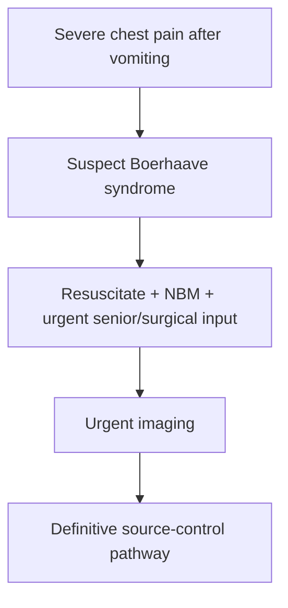

# Oesophageal perforation and Boerhaave syndrome

Related: [[../Gastroenterology MOC|Gastroenterology MOC]] · [[../Oesophageal Disorders|Oesophageal Disorders]] · [[Food bolus obstruction and acute impaction]]

> [!warning]
> This is a **life-threatening emergency**. Severe chest pain after forceful vomiting should immediately raise Boerhaave syndrome.

## Learning Objectives
- Define oesophageal perforation and Boerhaave syndrome.
- Recognize the emergency presentation.
- Understand diagnostic urgency.
- Outline management priorities.

## Definition
- **Oesophageal perforation**: full-thickness breach of the oesophageal wall.
- **Boerhaave syndrome**: spontaneous transmural perforation, classically after forceful vomiting/retching.

## Causes
- spontaneous rupture after vomiting
- iatrogenic perforation/endoscopic injury
- severe trauma/foreign body in some cases

## Clinical Features
- sudden severe chest or upper abdominal pain
- vomiting/retching history
- dysphagia/odynophagia
- dyspnoea, sepsis, shock as contamination evolves

## Why It Is Dangerous
Perforation allows mediastinal/pleural contamination, rapidly causing mediastinitis, sepsis, and death if missed.

## Investigations
- urgent imaging and surgical-team involvement
- contrast-based imaging/CT pathways depending on stability and local protocol
- do not delay escalation in an obvious emergency pattern

## Management Priorities
- resuscitation
- nil by mouth
- broad urgent specialist management
- antibiotics and source control pathway
- surgical/endoscopic decision by expert team

## Red Flags
- severe pain after vomiting
- sepsis or shock
- subcutaneous emphysema/mediastinal signs when present
- rapidly worsening chest distress

## FCPS/MRCP High-Yield Points
- Boerhaave syndrome = post-vomiting chest pain emergency.
- Delay kills.
- Do not confuse with simple reflux, gastritis, or benign vomiting-related pain.

## Common Viva Traps
- Missing the diagnosis in “chest pain after vomiting”.
- Waiting for perfect confirmation before resuscitation/escalation.
- Underestimating iatrogenic perforation risk after instrumentation.

## One-Page Summary
- Oesophageal perforation is a catastrophic emergency.
- Boerhaave syndrome follows forceful vomiting.
- Immediate resuscitation, imaging, antibiotics, and surgical input are essential.

## Mind Map
- Perforation
  - vomiting
  - severe chest pain
  - mediastinitis
  - sepsis
  - urgent imaging
  - surgery/endoscopic control

## Flowchart

## MCQs (10)
1. Boerhaave syndrome is:
   - A. Spontaneous oesophageal perforation after vomiting
   - B. Gastric ulcer only
   - C. IBS subtype
   - D. Coeliac complication
   - **Answer: A**
2. The classic presenting clue is:
   - A. Severe chest pain after forceful vomiting
   - B. Polyuria after exercise
   - C. Rash after seafood
   - D. Painless jaundice only
   - **Answer: A**
3. The major life-threatening consequence is:
   - A. Mediastinitis/sepsis
   - B. Cataract
   - C. Asthma
   - D. UTI
   - **Answer: A**
4. Initial management includes:
   - A. Resuscitation and urgent specialist escalation
   - B. Reassurance only
   - C. Oral feeding trial
   - D. Delayed review next week
   - **Answer: A**
5. Which statement is true?
   - A. Delay in diagnosis is dangerous
   - B. It is a harmless vomiting complication
   - C. Imaging is never required
   - D. Antibiotics have no role
   - **Answer: A**
6. A common cause besides spontaneous rupture is:
   - A. Iatrogenic instrumentation
   - B. Acne
   - C. Rhinitis
   - D. Cataract surgery only
   - **Answer: A**
7. A common trap is:
   - A. Mislabeling the pain as benign post-vomiting discomfort
   - B. Noting chest pain
   - C. Escalating early
   - D. Keeping the patient NBM
   - **Answer: A**
8. Which status should prompt urgent imaging?
   - A. Suspected perforation with severe pain and deterioration
   - B. Mild stable hiccup only
   - C. Seasonal rhinitis
   - D. Dry scalp
   - **Answer: A**
9. Which systemic features may appear?
   - A. Shock and sepsis
   - B. Polyphagia only
   - C. Hematuria only
   - D. Tremor only
   - **Answer: A**
10. Best summary?
   - A. Think Boerhaave syndrome in severe chest pain after vomiting and act urgently
   - B. Vomiting-related pain is always benign
   - C. Surgery is never considered
   - D. It is a chronic functional disorder
   - **Answer: A**

## SBA Questions (10)
1. A patient develops agonizing chest pain immediately after repeated retching. Most important diagnosis?
   - A. Boerhaave syndrome
   - B. Functional dyspepsia
   - C. Coeliac disease
   - D. Hemorrhoids
   - **Answer: A**
2. What is the best initial principle?
   - A. Resuscitate and get urgent specialist/surgical assessment
   - B. Send home with antacids
   - C. Encourage eating
   - D. Delay review until tomorrow
   - **Answer: A**
3. Which is a dangerous error?
   - A. Missing perforation in chest pain after vomiting
   - B. Keeping the patient nil by mouth
   - C. Escalating early
   - D. Arranging urgent imaging
   - **Answer: A**
4. Why is perforation so dangerous?
   - A. Mediastinal contamination causes sepsis rapidly
   - B. It only causes mild reflux
   - C. It is purely cosmetic
   - D. It never affects survival
   - **Answer: A**
5. Which non-spontaneous cause exists?
   - A. Endoscopic injury
   - B. Hay fever
   - C. Myopia
   - D. Migraine
   - **Answer: A**
6. Which symptom cluster is most typical?
   - A. Vomiting, severe chest pain, rapid deterioration
   - B. Longstanding constipation only
   - C. Painless jaundice only
   - D. Polyuria only
   - **Answer: A**
7. Why must oral intake be stopped?
   - A. Ongoing leak/contamination risk
   - B. To treat asthma
   - C. To lower blood sugar only
   - D. To improve hearing
   - **Answer: A**
8. Which investigation strategy is appropriate?
   - A. Urgent imaging guided by local protocol after immediate stabilization/escalation
   - B. No imaging ever
   - C. Spirometry first
   - D. Colonoscopy first
   - **Answer: A**
9. Best exam pearl?
   - A. Chest pain after forceful vomiting is Boerhaave syndrome until proved otherwise
   - B. Vomiting excludes oesophageal emergencies
   - C. Antibiotics are never relevant
   - D. Perforation is chronic and indolent
   - **Answer: A**
10. Best summary?
   - A. Recognize fast, resuscitate fast, escalate fast
   - B. Wait for all labs before acting
   - C. Treat as simple gastritis first
   - D. It is never surgical
   - **Answer: A**

## Flashcards
- Q: What is Boerhaave syndrome?
  A: Spontaneous full-thickness oesophageal perforation after forceful vomiting.
- Q: What is the classic presenting clue?
  A: Severe chest pain after vomiting/retching.
- Q: What lethal complication develops rapidly?
  A: Mediastinitis and sepsis.
- Q: What are the first management priorities?
  A: Resuscitation, nil by mouth, urgent specialist input, antibiotics/source control pathway.
- Q: What dangerous mistake must be avoided?
  A: Dismissing post-vomiting chest pain as benign.

## Must Know / Should Know / Nice to Know
### Must Know
- Boerhaave = full-thickness perforation from vomiting (Mackler triad: vomiting, chest pain, subcutaneous emphysema)
- Iatrogenic = most common cause (endoscopy, dilation)
- Mediastinitis/sepsis = fatal if delayed
- Contrast study or CT for diagnosis
- Early surgery (<24h) = primary repair; late = drainage/diversion

### Should Know
- Cervical vs thoracic vs abdominal perforation management differs
- Stenting for contained leaks/small perforations
- Broad-spectrum antibiotics essential

### Nice to Know
- Endoscopic vacuum therapy (EVT)
- Mortality >20% even with treatment

## Self-Test Scorecard
- Can I name the causes of oesophageal perforation? /10
- Can I describe the Mackler triad? /10
- Can I outline the time-dependent management? /10

**Interpretation:**
- **<35/40** = weak topic
- **35-36/40** = acceptable but insecure
- **37+/40** = exam-ready

## Revision Prompts
What is Boerhaave syndrome?
How does management differ by time since perforation?

## Answer Key with Explanations

