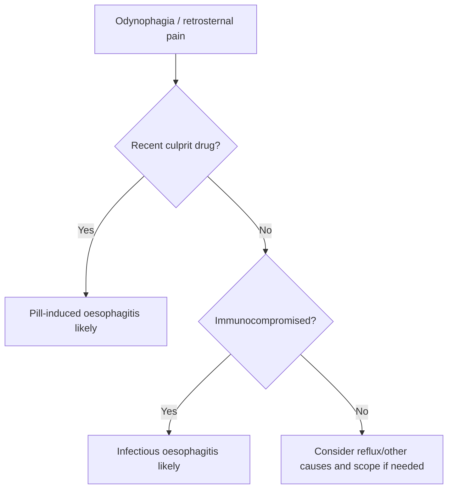

# Pill-induced and infectious oesophagitis

Related: [[../Gastroenterology MOC|Gastroenterology MOC]] · [[../Oesophageal Disorders|Oesophageal Disorders]] · [[Erosive reflux oesophagitis]] · [[Food bolus obstruction and acute impaction]]

> [!important]
> Think of this topic when **odynophagia is more prominent than heartburn**, especially after culprit drugs or in an immunocompromised patient.

## Learning Objectives
- Distinguish pill-induced from infectious oesophagitis.
- Recognize typical history clues.
- Understand when urgent endoscopy is needed.
- Outline treatment and prevention.

## Definition
- **Pill-induced oesophagitis**: direct mucosal injury from tablets/capsules lodging in the oesophagus.
- **Infectious oesophagitis**: mucosal infection, usually in immunocompromised states.

## Etiology
### Pill-induced
- tetracyclines/doxycycline
- bisphosphonates
- potassium chloride
- NSAIDs/iron and other irritant tablets

### Infectious
- Candida
- HSV
- CMV
- other opportunistic infection in severe immune compromise

## Clinical Features
- sudden odynophagia
- retrosternal pain
- dysphagia
- recent new medication history
- oral thrush/immunocompromise clues in infectious disease

## High-Yield Differentiation
| Feature | Pill-induced | Infectious |
|---|---|---|
| Trigger | Recent medication | Immune compromise |
| Onset | Often abrupt | Subacute or acute |
| Main symptom | Odynophagia/chest pain | Odynophagia + systemic context |
| Exam clues | Often history-led | Thrush, HIV, steroids, chemo |

## Investigations
- history is crucial
- upper GI endoscopy if severe, persistent, or diagnostic uncertainty
- consider HIV/immunosuppression context if infectious cause suspected

## Management
### Pill-induced
- stop offending drug if possible
- acid suppression/supportive therapy
- hydration and swallowing advice
- preventive counseling: take tablets with enough water and remain upright

### Infectious
- treat likely organism according to clinical context
- assess immune status and complications
- endoscopic confirmation when diagnosis is uncertain or severe

## Red Flags / Emergencies
- inability to swallow fluids
- hematemesis or significant bleeding
- severe chest pain suggesting deeper injury/perforation
- major immunocompromise with severe odynophagia

## FCPS/MRCP High-Yield Points
- Odynophagia after doxycycline or bisphosphonate is a classic clue.
- Infectious oesophagitis strongly suggests immunocompromise.
- Do not label prominent odynophagia as simple reflux without context.

## Common Viva Traps
- Forgetting medication history.
- Missing Candida/viral disease in immunosuppressed patients.
- Ignoring prevention advice for pill oesophagitis.

## One-Page Summary
- Pill-induced oesophagitis = drug-related mucosal burn from poor tablet transit.
- Infectious oesophagitis = immunocompromise + odynophagia.
- Endoscopy is needed when severe, prolonged, or unclear.

## Mind Map
- Oesophagitis not just reflux
  - pill-induced
    - doxycycline
    - bisphosphonate
    - KCl
  - infectious
    - candida
    - HSV
    - CMV
  - odynophagia
  - endoscopy if severe

## Flowchart

## MCQs (10)
1. The symptom most suggestive of pill-induced oesophagitis is:
   - A. Odynophagia
   - B. Polyuria
   - C. Wheeze
   - D. Hematuria
   - **Answer: A**
2. A classic culprit drug is:
   - A. Doxycycline
   - B. Metformin only
   - C. Salbutamol
   - D. Levothyroxine cream
   - **Answer: A**
3. Infectious oesophagitis is most associated with:
   - A. Immunocompromise
   - B. Athletic injury
   - C. Cataract
   - D. Migraine
   - **Answer: A**
4. Candida oesophagitis classically occurs in:
   - A. Immunosuppressed patients
   - B. Healthy trauma patients only
   - C. Pure IBS
   - D. Nephrotic syndrome only
   - **Answer: A**
5. Prevention of pill-induced injury includes:
   - A. Plenty of water and upright posture after swallowing tablets
   - B. Taking tablets dry before sleep
   - C. Lying down immediately
   - D. Avoiding all fluids
   - **Answer: A**
6. Which investigation is useful in severe persistent symptoms?
   - A. Upper GI endoscopy
   - B. Colonoscopy only
   - C. Spirometry
   - D. Audiogram
   - **Answer: A**
7. A common trap is:
   - A. Missing the medication history
   - B. Asking about swallowing pain
   - C. Considering thrush
   - D. Reviewing immune status
   - **Answer: A**
8. Which symptom pattern is most typical?
   - A. Retrosternal pain + odynophagia
   - B. Frothy sputum only
   - C. Ankle swelling only
   - D. Tremor only
   - **Answer: A**
9. Which organism is a classic infectious cause?
   - A. Candida
   - B. H pylori
   - C. Entamoeba only
   - D. Giardia only
   - **Answer: A**
10. Best summary?
   - A. Odynophagia after culprit pills or in immunocompromise should prompt consideration of non-reflux oesophagitis
   - B. All odynophagia is simple GERD
   - C. Endoscopy never helps
   - D. Drugs never injure the oesophagus
   - **Answer: A**

## SBA Questions (10)
1. A student develops severe odynophagia 2 days after starting doxycycline and taking it at bedtime. Most likely diagnosis?
   - A. Pill-induced oesophagitis
   - B. Achalasia
   - C. Coeliac disease
   - D. Pancreatitis
   - **Answer: A**
2. An HIV patient with oral thrush and painful swallowing most likely has:
   - A. Infectious oesophagitis
   - B. Functional dyspepsia
   - C. IBS
   - D. Hemorrhoids
   - **Answer: A**
3. Best preventive advice for pill oesophagitis?
   - A. Swallow tablets with water and stay upright
   - B. Take tablets dry lying flat
   - C. Crush every tablet routinely
   - D. Avoid water with medication
   - **Answer: A**
4. A dangerous error is:
   - A. Calling severe odynophagia simple reflux without drug/immunity review
   - B. Asking about tablets
   - C. Checking immune status
   - D. Considering endoscopy
   - **Answer: A**
5. Which clue favors infectious rather than pill-induced disease?
   - A. Marked immunosuppression
   - B. Recent bisphosphonate use only
   - C. No comorbidity at all
   - D. Upright swallowing history
   - **Answer: A**
6. Which symptom often dominates both forms?
   - A. Odynophagia
   - B. Orthopnoea
   - C. Hemoptysis
   - D. Polyphagia
   - **Answer: A**
7. Severe persistent symptoms warrant:
   - A. Endoscopic evaluation
   - B. Ear irrigation
   - C. Pure reassurance only
   - D. Bronchodilator trial
   - **Answer: A**
8. Which is true?
   - A. Pill-induced and infectious oesophagitis both require clinical context to separate from reflux
   - B. They are identical to IBS
   - C. They never cause chest pain
   - D. They occur only in children
   - **Answer: A**
9. Which drug history is especially important?
   - A. Doxycycline/bisphosphonate/potassium tablet use
   - B. Topical emollients only
   - C. Saline nasal spray only
   - D. Eye drops only
   - **Answer: A**
10. Best exam phrase?
   - A. Prominent odynophagia should trigger a search for pill injury or infection rather than automatic GERD labeling
   - B. Odynophagia excludes oesophageal disease
   - C. Infectious oesophagitis occurs only in healthy people
   - D. Pill injury cannot be prevented
   - **Answer: A**

## Flashcards
- Q: What symptom is especially typical of pill-induced/infectious oesophagitis?
  A: Odynophagia.
- Q: Name 3 common culprit drugs in pill-induced oesophagitis.
  A: Doxycycline, bisphosphonates, potassium chloride.
- Q: What major host factor suggests infectious oesophagitis?
  A: Immunocompromise.
- Q: What simple advice helps prevent pill oesophagitis?
  A: Take tablets with water and remain upright.
- Q: When is endoscopy especially useful?
  A: Severe, persistent, or unclear cases.

## Must Know / Should Know / Nice to Know
### Must Know
- Pill oesophagitis: doxycycline, bisphosphonates, NSAIDs, KCl - take with water upright!
- Infectious: candida (immunocompromised), HSV, CMV - odynophagia is key
- Endoscopy: kissing ulcers (pill), white plaques (candida), ulceration (HSV/CMV)
- Candida: treat with fluconazole; HSV: acyclovir; CMV: ganciclovir
- Pill: stop offending drug, PPI, sucralfate

### Should Know
- Risk factors for pill: poor water, supine, elderly, large pills
- Candida in diabetics, steroids, antibiotics
- CMV in AIDS/transplant

### Nice to Know
- Pill-Coated oesophagus
- Eosinophilic infiltration in drug-induced

## Self-Test Scorecard
- Can I list common drugs causing pill oesophagitis? /10
- Can I distinguish infectious oesophagitis by pathogen? /10
- Can I name the first-line treatment for each? /10

**Interpretation:**
- **<35/40** = weak topic
- **35-36/40** = acceptable but insecure
- **37+/40** = exam-ready

## Revision Prompts
Which drugs commonly cause pill-induced oesophagitis?
How is candida oesophagitis diagnosed and treated?

## Answer Key with Explanations

