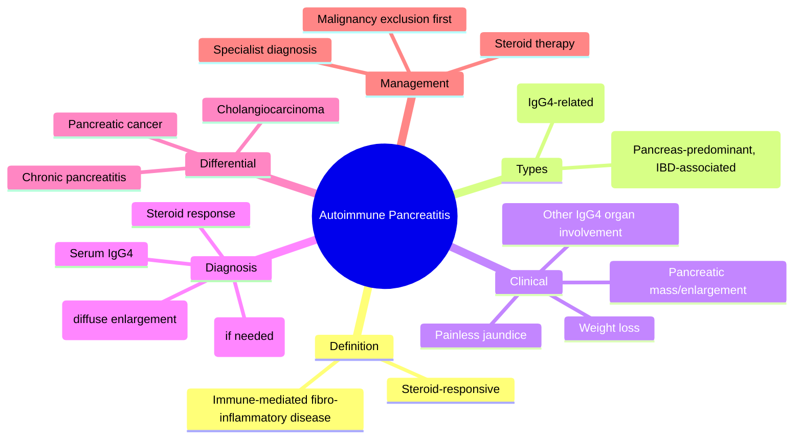
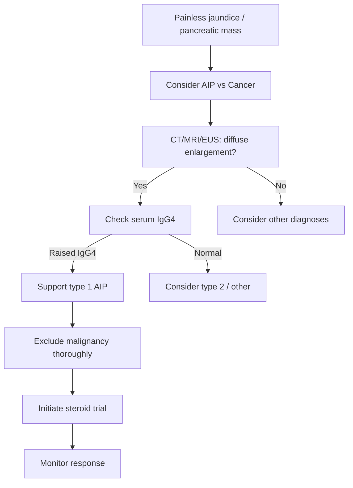

# Autoimmune pancreatitis

## Learning Objectives
- Define autoimmune pancreatitis and distinguish its two main subtypes.
- Recognize the clinical and radiological mimicry of pancreatic cancer.
- Understand the role of IgG4 in type 1 AIP diagnosis.
- Apply the strategy for excluding malignancy before steroid therapy.
- Outline the principles of steroid-responsive management and relapse monitoring.

Related: [[../Gastroenterology MOC|Gastroenterology MOC]] · [[../Pancreatic Disorders|Pancreatic Disorders]] · [[Chronic pancreatitis]]

> [!important]
> Autoimmune pancreatitis (AIP) is a **steroid-responsive inflammatory pancreatic disease** that can mimic pancreatic cancer. The exam danger is missing the distinction between **AIP and malignancy**.

## Definition
AIP is an immune-mediated fibro-inflammatory pancreatic disease, often associated with IgG4-related disease in one major subtype.

## Anatomy and Physiology
- Pancreas becomes diffusely or focally enlarged with inflammatory fibrosis.
- Ductal narrowing and biliary involvement may occur.

## Classification
- **Type 1 AIP**: IgG4-related systemic disease pattern
- **Type 2 AIP**: pancreas-predominant disease, often without raised IgG4 and sometimes associated with IBD

## Etiology / Associations
- Immune-mediated disease
- IgG4-related systemic disease (type 1)
- Association with IBD particularly in type 2 contexts

## Pathophysiology
- Lymphoplasmacytic inflammation and fibrosis distort pancreatic structure.
- This may present as obstructive jaundice, pancreatic mass-like swelling, or pancreatitis-like symptoms.

## Clinical Features
- Painless jaundice or cholestasis in some cases
- Pancreatic enlargement/mass-like lesion
- Abdominal pain less dominant than ordinary chronic pancreatitis in some patients
- Weight loss may occur
- Other IgG4 disease manifestations may coexist

## Red Flags
- Must exclude pancreatic cancer before assuming benign steroid-responsive disease
- Obstructive jaundice
- New pancreatic mass

## Investigations
- LFTs if cholestatic picture
- Serum IgG4 may be raised, especially type 1
- CT/MRI/EUS for pancreatic enlargement and ductal changes
- Tissue diagnosis may be required in cancer-mimic cases
- Assess extra-pancreatic IgG4 disease if relevant

## Interpretation Framework
### AIP vs pancreatic cancer logic
AIP clues:
- diffuse pancreatic enlargement
- raised IgG4
- other IgG4 manifestations
- steroid responsiveness

Cancer clues:
- hard focal mass with progressive malignant pattern
- constitutional decline
- metastatic or unequivocal malignant imaging/biopsy evidence

### Important principle
**Do not give steroids casually before reasonable malignancy exclusion**.

## Diagnosis
Diagnosis integrates imaging, serology, histology when needed, other organ involvement, and treatment response.

## Differential Diagnosis
- Pancreatic adenocarcinoma
- Chronic pancreatitis
- Cholangiocarcinoma if jaundice/biliary stricture dominates

## Management
- Specialist-led diagnosis
- Steroids are main treatment in confirmed/probable appropriate cases
- Treat relapses or maintenance issues individually
- Manage biliary obstruction if present

## Complications
- Relapse
- Biliary strictures/obstructive jaundice
- Misdiagnosis as cancer or vice versa

## Common Exam / Viva Traps
- Calling all pancreatic masses cancer without considering AIP
- Giving steroids before malignancy exclusion
- Forgetting IgG4-related systemic disease link

## One-Page Summary
- AIP is immune-mediated and often steroid-responsive.
- It can mimic **pancreatic cancer**.
- Type 1 is linked to **IgG4 disease**.
- Diagnosis uses imaging, IgG4, histology/other organ involvement when needed.
- Steroids help, but only after sensible cancer exclusion.

## Revision Prompts
- What are the two types of AIP?
- Why is AIP important in exam practice?
- Why must pancreatic cancer be excluded first?

## MCQs (10)
1. Autoimmune pancreatitis is best described as:
   - A. Immune-mediated pancreatic inflammation
   - B. Simple gallstone disease
   - C. IBS
   - D. Hemorrhoids
   - **Answer: A**
2. Type 1 AIP is commonly associated with:
   - A. IgG4-related disease
   - B. Migraine
   - C. Asthma only
   - D. Coeliac disease only
   - **Answer: A**
3. AIP may mimic:
   - A. Pancreatic adenocarcinoma
   - B. Anal fissure
   - C. Achalasia
   - D. GERD only
   - **Answer: A**
4. A serum clue may be:
   - A. Raised IgG4
   - B. High troponin only
   - C. High PSA only
   - D. Low CK only
   - **Answer: A**
5. Main treatment in confirmed cases is often:
   - A. Steroids
   - B. Laxatives only
   - C. Immediate colectomy
   - D. Appendectomy
   - **Answer: A**
6. An important management principle is:
   - A. Exclude malignancy before casual steroid trial
   - B. Assume all masses are AIP
   - C. Never image the pancreas
   - D. Ignore jaundice
   - **Answer: A**
7. Type 2 AIP may associate with:
   - A. IBD
   - B. COPD only
   - C. Psoriasis only
   - D. Glaucoma
   - **Answer: A**
8. AIP can present with:
   - A. Obstructive jaundice
   - B. Hemoptysis only
   - C. Dysuria only
   - D. Visual loss only
   - **Answer: A**
9. Major differential diagnosis is:
   - A. Pancreatic cancer
   - B. Hemorrhoids
   - C. Urticaria
   - D. Migraine
   - **Answer: A**
10. AIP belongs to which heading here?
   - A. Pancreatic Disorders
   - B. Hepatology
   - C. Oesophageal disorders
   - D. Cardiology
   - **Answer: A**

## SBA Questions (10)
1. A 60-year-old man has painless jaundice and diffuse pancreatic enlargement with raised IgG4. Most likely diagnosis?
   - A. Autoimmune pancreatitis
   - B. IBS-D
   - C. Hemorrhoids
   - D. Acute appendicitis
   - **Answer: A**
2. The most dangerous diagnostic confusion in AIP is with:
   - A. Pancreatic adenocarcinoma
   - B. GERD
   - C. Functional constipation
   - D. Anal fissure
   - **Answer: A**
3. What is the major treatment in an appropriately confirmed case?
   - A. Steroids
   - B. PPI only
   - C. Routine ERCP for all
   - D. Colectomy
   - **Answer: A**
4. Which lab may support type 1 AIP?
   - A. Raised IgG4
   - B. High CK only
   - C. Low ferritin only
   - D. High troponin only
   - **Answer: A**
5. Before a steroid trial, what must be considered carefully?
   - A. Excluding pancreatic malignancy
   - B. Ignoring imaging
   - C. Stopping all assessment
   - D. Diagnosing IBS
   - **Answer: A**
6. Type 2 AIP may coexist with which disease group?
   - A. Inflammatory bowel disease
   - B. COPD only
   - C. Glaucoma only
   - D. Migraine only
   - **Answer: A**
7. Which feature supports AIP over ordinary chronic pancreatitis alone?
   - A. Diffuse enlargement with IgG4-related clues
   - B. Simple isolated reflux
   - C. Hemorrhoids
   - D. Pure iron deficiency alone
   - **Answer: A**
8. Which symptom may occur in AIP?
   - A. Jaundice
   - B. Hemoptysis only
   - C. Dysuria only
   - D. Diplopia only
   - **Answer: A**
9. Which statement is correct?
   - A. AIP can be steroid-responsive
   - B. AIP never affects the bile duct
   - C. AIP never mimics cancer
   - D. IgG4 is irrelevant
   - **Answer: A**
10. Core exam message about AIP is:
   - A. Distinguish it from pancreatic cancer
   - B. Treat all pancreatic lesions as IBS
   - C. Never consider it
   - D. It is always surgical
   - **Answer: A**

## Flashcards
- Q: Type 1 AIP association?  
  A: IgG4-related disease.
- Q: Most dangerous differential?  
  A: Pancreatic adenocarcinoma.
- Q: Main treatment?  
  A: Steroids in appropriate confirmed/probable cases.
- Q: Key caution before steroids?  
  A: Exclude malignancy.
- Q: Type 2 AIP may associate with?  
  A: IBD.

## Answer Key Pearls
- In viva, the one-liner is: **“AIP is a steroid-responsive pancreatic cancer mimic, often linked to IgG4 disease.”**

## Mind Map

## Flowchart

## Must Know / Should Know / Nice to Know
### Must Know
- AIP mimics pancreatic cancer
- Type 1 = IgG4-related disease
- Serum IgG4 is supportive
- Steroids are treatment AFTER cancer exclusion
- Diffuse enlargement on imaging

### Should Know
- Type 2 AIP associated with IBD
- Relapse is common
- Histology may be needed for cancer exclusion
- Biliary strictures as complication

### Nice to Know
- HISORt criteria for AIP diagnosis
- Long-term maintenance steroid strategies
- Extra-pancreatic IgG4 disease manifestations

## Self-Test Scorecard
- Can I distinguish type 1 vs type 2 AIP? /10
- Can I list 3 features favoring AIP over cancer? /10
- Can I explain the malignancy-exclusion-before-steroid principle? /10
- Can I name 2 IgG4-related extra-pancreatic manifestations? /10

**Interpretation:**
- **<35/40** = weak topic
- **35-36/40** = acceptable but insecure
- **37+/40** = exam-ready
