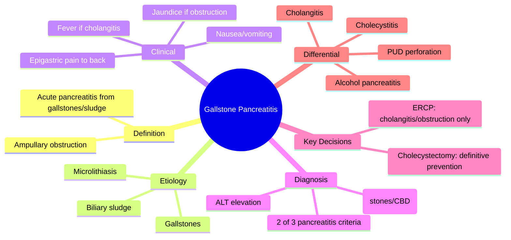
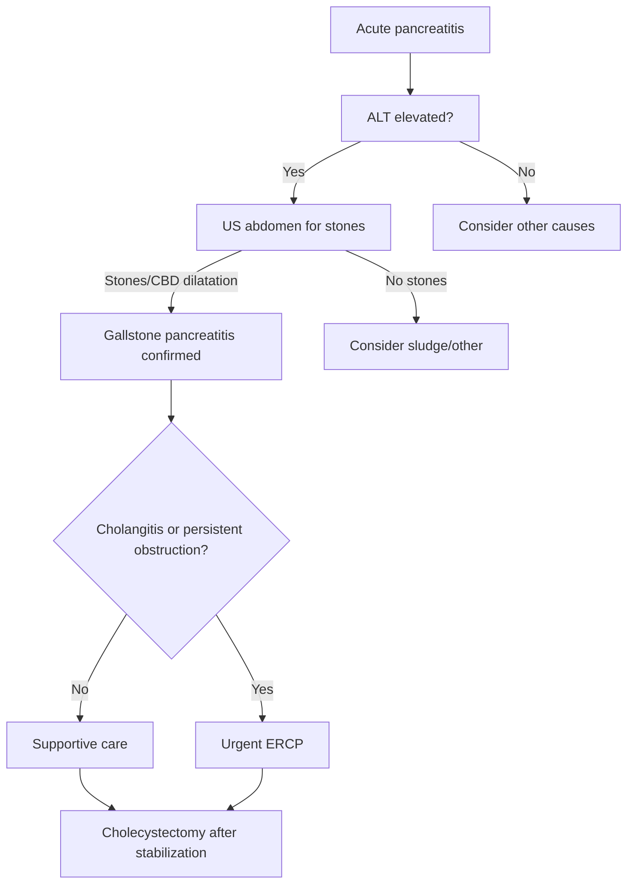

# Gallstone pancreatitis

## Learning Objectives
- Recognize gallstone pancreatitis as a distinct acute pancreatitis etiology.
- Identify biliary clues in acute pancreatitis (ALT elevation, ultrasound findings).
- Apply the selective ERCP decision logic (cholangitis/persistent obstruction only).
- Plan definitive cholecystectomy timing after acute episode resolves.
- Distinguish gallstone from alcoholic and other pancreatitis etiologies.

Related: [[../Gastroenterology MOC|Gastroenterology MOC]] · [[../Pancreatic Disorders|Pancreatic Disorders]] · [[Acute pancreatitis]]

> [!important]
> Gallstone pancreatitis is **acute pancreatitis caused by transient or persistent biliary obstruction**. In exams, the high-yield logic is: **diagnose pancreatitis, identify gallstone etiology, look for cholangitis or ongoing CBD obstruction, resuscitate early, and plan definitive gallbladder treatment**.

## Definition
Gallstone pancreatitis is acute pancreatitis triggered by gallstones or biliary sludge, usually by transient obstruction at the ampulla causing pancreatic enzyme activation and inflammation.

## Anatomy
- The pancreatic duct and common bile duct meet near the ampulla of Vater.
- A stone at the distal CBD/ampulla can obstruct biliary and pancreatic outflow.
- This explains the association with:
  - acute pancreatitis
  - jaundice
  - cholangitis in some patients

## Physiology
- Normal pancreatic enzymes are secreted in inactive form.
- Obstruction and ductal injury promote premature enzyme activation.
- This leads to local inflammation, edema, and sometimes necrosis.

## Classification
### Clinical framing
- Mild gallstone pancreatitis
- Moderately severe gallstone pancreatitis
- Severe gallstone pancreatitis with persistent organ failure

### Important associated states
- Gallstone pancreatitis **without** persistent obstruction
- Gallstone pancreatitis **with** cholestasis/CBD obstruction
- Gallstone pancreatitis **with cholangitis**

## Etiology / Risk Factors
- Gallstones
- Biliary sludge/microlithiasis
- Female sex, obesity, pregnancy, hemolysis, rapid weight loss increase gallstone risk

## Pathophysiology
- Stone migration into the distal bile duct or ampulla causes transient/persistent obstruction.
- Pancreatic duct pressure and acinar injury trigger pancreatitis.
- Ongoing obstruction may produce jaundice or cholangitis.

## Clinical Features
- Acute severe epigastric pain radiating to the back
- Nausea and vomiting
- Right upper quadrant/epigastric tenderness
- Fever may occur
- Jaundice suggests ongoing obstruction or cholangitis

## Red Flags / Emergencies
- Hypotension/shock
- Hypoxia, oliguria, confusion
- Fever with jaundice and sepsis → think **ascending cholangitis**
- Worsening bilirubin/ALP with dilated CBD
- Severe SIRS/organ failure

## Investigations
### To confirm pancreatitis
Need 2 of 3:
1. Typical pain
2. Amylase/lipase >3× ULN
3. Compatible imaging

### To identify gallstone etiology
- LFTs: ALT rise supports biliary cause
- Bilirubin/ALP may rise with obstruction
- **Ultrasound abdomen** for gallstones/CBD dilatation

### Severity assessment
- CBC, U&E, creatinine, calcium, CRP
- ABG/VBG and lactate if severe
- CT if diagnosis uncertain, deterioration, or complications suspected

## Interpretation Framework
### Gallstone etiology clues
Think gallstone pancreatitis when there is:
- biliary pain history
- ALT elevation
- gallstones/sludge on ultrasound
- jaundice or CBD dilatation

### ERCP decision logic
Urgent ERCP is for:
- **cholangitis**
- **persistent biliary obstruction**
Not for every patient with gallstone pancreatitis.

## Diagnosis
Diagnosis requires acute pancreatitis criteria plus evidence suggesting biliary stone disease as the precipitant.

## Differential Diagnosis
- Acute cholecystitis
- Ascending cholangitis without pancreatitis
- Peptic ulcer perforation
- Mesenteric ischemia
- Alcohol-related pancreatitis

## Management
## Immediate priorities
- Admit
- Early IV fluids
- Analgesia
- Oxygen and monitoring if needed
- Assess severity and organ failure repeatedly

## Cause-specific treatment
- Ultrasound to confirm gallstones/CBD clues
- **Urgent ERCP** if cholangitis or persistent obstruction is suspected
- Otherwise ERCP is not routine

## Definitive prevention of recurrence
- **Cholecystectomy** after recovery
- In mild cases, same-admission cholecystectomy is usually preferred where feasible
- Delay may be needed in severe pancreatitis or major local complications

## Complications
- Recurrent pancreatitis
- Cholangitis
- Persistent biliary obstruction
- Necrosis and severe pancreatitis complications

## Common Exam / Viva Traps
- Saying ERCP is indicated for all gallstone pancreatitis
- Forgetting cholecystectomy planning
- Missing cholangitis in jaundiced septic patient
- Not looking at LFTs/ultrasound for biliary clues

## One-Page Summary
- Gallstone pancreatitis = acute pancreatitis from gallstones/sludge.
- Diagnose pancreatitis first.
- Then identify biliary cause with **ALT/LFTs + ultrasound**.
- Urgent ERCP only if **cholangitis or ongoing obstruction**.
- Definitive prevention is **cholecystectomy** after stabilization.

## Revision Prompts
- How do you recognize gallstone etiology?
- When is urgent ERCP needed?
- Why is cholecystectomy important?
- How does gallstone pancreatitis differ from alcoholic pancreatitis?

## MCQs (10)
1. Gallstone pancreatitis is most commonly caused by:
   - A. Colonic obstruction
   - B. Ampullary obstruction by a stone/sludge
   - C. Viral hepatitis
   - D. IBS
   - **Answer: B**
2. A lab clue suggesting biliary pancreatitis is:
   - A. High TSH
   - B. Elevated ALT
   - C. Low CK
   - D. Low urate
   - **Answer: B**
3. First imaging to look for gallstones is:
   - A. Colonoscopy
   - B. Abdominal ultrasound
   - C. MRI brain
   - D. Echo
   - **Answer: B**
4. Urgent ERCP is indicated when gallstone pancreatitis is complicated by:
   - A. Mild nausea only
   - B. Cholangitis
   - C. Stable pain only
   - D. All cases
   - **Answer: B**
5. Definitive recurrence prevention usually requires:
   - A. PPI only
   - B. Cholecystectomy
   - C. Splenectomy
   - D. Colectomy
   - **Answer: B**
6. Pain classically radiates to the:
   - A. Knee
   - B. Back
   - C. Shoulder tip only always
   - D. Jaw only
   - **Answer: B**
7. Which feature suggests persistent biliary obstruction?
   - A. Rising bilirubin
   - B. Normal LFTs
   - C. Dysphagia
   - D. Hematuria
   - **Answer: A**
8. Gallstone pancreatitis is a subtype of:
   - A. Chronic diarrhoea
   - B. Acute pancreatitis
   - C. Portal hypertension
   - D. Gastric lymphoma
   - **Answer: B**
9. Same-admission cholecystectomy is especially considered in:
   - A. Mild gallstone pancreatitis after stabilization
   - B. Every unstable patient immediately on arrival
   - C. IBS
   - D. Esophageal perforation
   - **Answer: A**
10. Which is a dangerous associated diagnosis in a jaundiced febrile patient?
   - A. Cholangitis
   - B. Functional dyspepsia
   - C. Hemorrhoids
   - D. Coeliac disease
   - **Answer: A**

## SBA Questions (10)
1. A 52-year-old woman has acute pancreatitis, jaundice, fever, and hypotension. Best next biliary principle?
   - A. Delay all intervention
   - B. Urgent ERCP pathway for cholangitis/obstruction
   - C. Discharge same day
   - D. Diagnose IBS
   - **Answer: B**
2. A patient has pancreatitis with elevated ALT and gallstones on ultrasound. Most likely etiology?
   - A. Gallstone pancreatitis
   - B. Coeliac disease
   - C. Chronic appendicitis
   - D. UC flare
   - **Answer: A**
3. Which test best supports gallstone cause early?
   - A. Abdominal ultrasound
   - B. EEG
   - C. PSA
   - D. Spirometry
   - **Answer: A**
4. Which patient needs urgent ERCP most?
   - A. Stable pancreatitis with improving LFTs
   - B. Septic jaundiced patient with suspected biliary obstruction
   - C. Mild pain with normal bilirubin
   - D. IBS-C patient
   - **Answer: B**
5. Best definitive prevention after recovery?
   - A. Cholecystectomy
   - B. Long-term PPI only
   - C. Laxatives
   - D. Steroids
   - **Answer: A**
6. Which mechanism best explains gallstone pancreatitis?
   - A. Pancreatic autodigestion after ampullary obstruction
   - B. Autoimmune synovitis
   - C. Colonic volvulus
   - D. Gastric acid excess alone
   - **Answer: A**
7. Which finding favors cholangitis over isolated pancreatitis?
   - A. Fever with jaundice and sepsis
   - B. Back pain alone
   - C. Bloating only
   - D. Constipation only
   - **Answer: A**
8. Which statement is correct?
   - A. ERCP is mandatory in all gallstone pancreatitis
   - B. ERCP is selective, not routine
   - C. Ultrasound is useless
   - D. LFTs have no value
   - **Answer: B**
9. When is recurrence risk highest if no definitive action is taken?
   - A. After residual gallbladder stones remain untreated
   - B. After appendectomy
   - C. With normal gallbladder always
   - D. In all GERD cases
   - **Answer: A**
10. Gallstone pancreatitis belongs to which Davidson chapter here?
   - A. Hepatology
   - B. Gastroenterology
   - C. Cardiology
   - D. Endocrinology
   - **Answer: B**

## Flashcards
- Q: Common clue to biliary cause in pancreatitis?  
  A: ALT elevation and gallstones on ultrasound.
- Q: Urgent ERCP indication in gallstone pancreatitis?  
  A: Cholangitis or persistent biliary obstruction.
- Q: Definitive recurrence prevention?  
  A: Cholecystectomy.
- Q: Pathophysiologic trigger?  
  A: Ampullary obstruction causing pancreatic injury.
- Q: Common radiating pain pattern?  
  A: Epigastric pain to the back.

## Answer Key Pearls
- The best exam structure is: **confirm pancreatitis → prove biliary cause → decide if ERCP is urgent → plan cholecystectomy**.

## Mind Map

## Flowchart

## Must Know / Should Know / Nice to Know
### Must Know
- Gallstone pancreatitis = acute pancreatitis + gallstones
- ALT rise = biliary clue
- US abdomen = first-line imaging
- ERCP only for cholangitis/obstruction
- Cholecystectomy = definitive prevention
- Pain radiates to back

### Should Know
- Same-admission cholecystectomy in mild cases
- Dinning/sludge as causes
- Ranson/BISAP for severity
- Recurrent pancreatitis risk without cholecystectomy

### Nice to Know
- Endoscopic sphincterotomy vs cholecystectomy debates
- Pregnancy/ERCP considerations
- Early vs delayed cholecystectomy in severe disease

## Self-Test Scorecard
- Can I list the diagnostic criteria for gallstone pancreatitis? /10
- Can I explain when ERCP is and isn't indicated? /10
- Can I name 3 differentials for biliary-predominant pain? /10
- Can I describe the cholecystectomy timing rationale? /10

**Interpretation:**
- **<35/40** = weak topic
- **35-36/40** = acceptable but insecure
- **37+/40** = exam-ready
